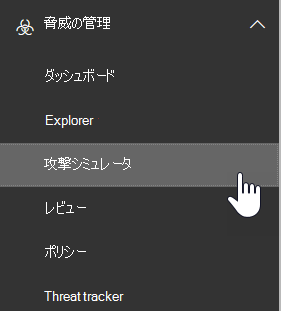

# Office 365 のアタックシミュレータAttack Simulator in Office 365 ATP

アタックシミュレータ in Office 365 Advanced Threat Protection プラン 2 (ATP Plan 2) を使用すると、組織内で現実的にシミュレートされたフィッシングおよびパスワード攻撃のキャンペーンを実行できます。Attack Simulator in Office 365 Advanced Threat Protection Plan 2 (ATP Plan 2) allows you to run realistic, but simulated phishing and password attack campaigns in your organization. キャンペーンの結果を使用して、脆弱性のあるユーザーを特定し、教育することができます。You can use the results of campaigns to identify and train vulnerable users.

## 始める前に把握しておくべき情報What do you need to know before you begin?

- Office 365 セキュリティ & コンプライアンスセンターを開くには、に<https://protection.office.com/>移動します。To open the Office 365 Security & Compliance Center, go to <https://protection.office.com/>. アタックシミュレータは、**脅威管理** \>の**アタックシミュレータ**で利用できます。Attack simulator is available at **Threat management** \> **Attack simulator**.

  

- 異なる Office 365 サブスクリプション間でのアタックシミュレータの可用性の詳細については、「 [office 365 Advanced Threat Protection サービスの説明](https://docs.microsoft.com/office365/servicedescriptions/office-365-advanced-threat-protection-service-description)」を参照してください。For more information about the availability of Attack Simulator across different Office 365 subscriptions, see [Office 365 Advanced Threat Protection service description](https://docs.microsoft.com/office365/servicedescriptions/office-365-advanced-threat-protection-service-description).

- **組織の管理**または**セキュリティ管理者**の役割グループのメンバーである必要があります。You need to be a member of the **Organization Management** or **Security Administrator** role groups. セキュリティ & コンプライアンスセンターの役割グループの詳細については、「 [Office 365 セキュリティ & コンプライアンスセンターのアクセス許可](permissions-in-the-security-and-compliance-center.md)」を参照してください。For more information about role groups in the Security & Compliance Center, see [Permissions in the Office 365 Security & Compliance Center](permissions-in-the-security-and-compliance-center.md).

- アタックシミュレータでキャンペーンを作成および管理するには、アカウントが多要素認証 (MFA) 用に構成されている必要があります。Your account needs to be configured for multi-factor authentication (MFA) to create and manage campaigns in Attack Simulator. 手順については、「[多要素認証をセットアップ](https://docs.microsoft.com/office365/admin/security-and-compliance/set-up-multi-factor-authentication)する」を参照してください。For instructions, see [Set up multi-factor authentication](https://docs.microsoft.com/office365/admin/security-and-compliance/set-up-multi-factor-authentication).

- Exchange Online のメールボックスを使用しているユーザーに対しては、フィッシングまたはパスワード攻撃のキャンペーンのみを実行できます。You can only run phishing or password attack campaigns on users with mailboxes in Exchange Online.

- フィッシングキャンペーンは、30日間、イベントを収集して処理します。Phishing campaigns will collect and process events for 30 days. キャンペーンを開始した後、過去90日間は過去のキャンペーンデータを利用できるようになります。Historical campaign data will be available for up to 90 days after you launch the campaign.

- アタックシミュレータに対応する PowerShell コマンドレットはありません。There are no corresponding PowerShell cmdlets for Attack Simulator.

## スピアーフィッシングキャンペーンSpear phishing campaigns

*フィッシング*とは、正規または信頼された送信者からのメッセージで機密情報を盗もうとする電子メール攻撃の一般的な用語です。*Phishing* is a generic term for email attacks that try to steal sensitive information in messages that appear to be from legitimate or trusted senders. *スピアーフィッシング*は、対象となる受信者に特化した、非常に集中的でカスタマイズされたコンテンツ (通常は、攻撃者による受信者の偵察後) を使用する、対象となるフィッシング攻撃です。*Spear phishing* is a targeted phishing attack that uses very focused and customized content that's specifically tailored to the targeted recipients (typically, after reconnaissance on the recipients by the attacker).

フィッシングとスピアーフィッシングの詳細については、「[フィッシング](https://docs.microsoft.com/windows/security/threat-protection/intelligence/phishing)」を参照してください。For more information about phishing and spear phishing, see [Phishing](https://docs.microsoft.com/windows/security/threat-protection/intelligence/phishing).

アタックシミュレータでは、2つの異なる種類のスピアーフィッシングキャンペーンを利用できます。In Attack Simulator, two different types of spear phishing campaigns are available:

- **スピアーフィッシング (資格情報のハーベスト)**: 攻撃により、受信者がメッセージ内の URL をクリックするように誘導しようとします。**Spear phishing (credentials harvest)**: The attack tries to convince the recipients to click a URL in the message. ユーザーがリンクをクリックすると、資格情報を入力するように求められます。If they click the link, users are asked to enter their credentials. その場合は、次のいずれかの場所に移動します。If they do, they're taken to one of the following locations:

  - これについて説明する既定のページはテストのみで、フィッシングメッセージを認識するためのヒントを示します。A default page that explains this was a just a test, and gives tips for recognizing phishing messages.

    

  - 指定するカスタムページ (URL)。A custom page (URL) that you specify.

- **スピアーフィッシング (添付ファイル)**: 攻撃により、受信者がメッセージ内の .docx または .pdf 添付ファイルを開くように誘導しようとします。**Spear phishing (attachment)**: The attack tries to convince the recipients to open a .docx or .pdf attachment in the message. 添付ファイルには、既定のフィッシングリンクと同じコンテンツが含まれていますが\<、最初\>の文の先頭には "表示名があります。このメッセージは、最近使用した電子メールメッセージとして表示されています..."。The attachment contains the same content from the default phishing link, but the first sentence starts with "\<Display Name\>, you are seeing this message as a recent email message you opened...".

> [!NOTE]
> 現時点では、アタックシミュレータのスピアーフィッシングキャンペーンは期限切れになりません。Currently, spear phishing campaigns in Attack Simulator don't expire.

### スピアーフィッシングキャンペーンを作成するCreate a spear phishing campaign

スピアーフィッシングキャンペーンの重要な部分は、対象の受信者に送信される電子メールメッセージのルックアンドフィールです。An important part of any spear phishing campaign is the look and feel of the email message that's sent to the targeted recipients. 電子メールメッセージを作成して構成するには、次のオプションがあります。To create and configure the email message, you have these options:

- **組み込みの電子メールテンプレートを使用**する: 2 つの組み込みテンプレートを利用できます: [**賞品 Giveaway** ] および [**給与の更新**]。**Use a built-in email template**: Two built-in templates are available: **Prize Giveaway** and **Payroll Update**. キャンペーンを作成および開始するときに、テンプレートから、電子メールのプロパティをいくつか、すべて、またはまったくカスタマイズすることができます。You can further customize some, all, or none of the email properties from the template when you create and launch the campaign.

- **再利用可能な電子メールテンプレートを作成**する: 電子メールテンプレートを作成して保存すると、今後のスピアーフィッシングキャンペーンで使用できるようになります。**Create a reusable email template**: After you create and save the email template, you can use it again in future spear phishing campaigns. キャンペーンを作成および開始するときに、テンプレートから、電子メールのプロパティをいくつか、すべて、またはまったくカスタマイズすることができます。You can further customize some, all, or none of the email properties from the template when you create and launch the campaign.

- **ウィザードで電子メールメッセージを作成**する: スピアーフィッシングキャンペーンを作成して起動すると、ウィザードで直接電子メールメッセージを作成できます。**Create the email message in the wizard**: You can create the email message directly in the wizard as you create and launch the spear phishing campaign.

#### 手順 1 (省略可能): カスタム電子メールテンプレートを作成するStep 1 (Optional): Create a custom email template

組み込みのテンプレートのいずれかを使用する場合、またはウィザードで直接電子メールメッセージを作成する場合は、この手順を省略できます。If you're going to use one of the built-in templates or create the email message directly in the wizard, you can skip this step.

1. セキュリティ & コンプライアンスセンターで、[**脅威管理** \> ] [**アタックシミュレータ**] に移動します。In the Security & Compliance Center, go to **Threat management** \> **Attack simulator**.

2. [**アタックのシミュレート**] ページの [**スピアーフィッシング (資格情報のハーベスト)** ] セクションまたは [**スピアーフィッシング (添付ファイル)** ] セクションで、[アタックの**詳細**] をクリックします。On the **Simulate attacks** page, in either the **Spear Phishing (Credentials Harvest)** or **Spear Phishing (Attachment)** sections, click **Attack Details**.

   テンプレートを作成する場所は重要ではありません。It doesn't matter where you create the template. テンプレートで使用可能なオプションは、どちらの種類のフィッシング攻撃でも同じです。The available options in the template are the same for both types of phishing attacks.

3. 開かれた [**アタックの詳細**] ページの [**フィッシングテンプレート**] セクションで、[**テンプレートの作成**] 領域の [**新しいテンプレート**] をクリックします。In the **Attack details** page that opens, in the **Phishing Templates** section, in the **Create Templates** area, click **New Template**.

4. 新しいポップアップで [**フィッシングテンプレートの構成**] ウィザードが起動します。The **Configure Phishing Template** wizard starts in a new flyout. [**開始**] ステップに、テンプレートの一意の表示名を入力し、[**次へ**] をクリックします。In the **Start** step, enter a unique display name for the template, and then click **Next**.

5. [**電子メールの詳細の構成**] ステップで、次の設定を構成します。In the **Configure email details** step, configure the following settings:

   - **From (名前)**: メッセージの送信者に使用する表示名を指定します。**From (Name)**: The display name that's used for the message sender.

   - **From (電子メール)**: 送信者の電子メールアドレス。**From (Email)**: The sender's email address.

   - [**フィッシングログインサーバーの URL**]: ドロップダウンをクリックし、一覧から使用可能な url のいずれかを選択します。**Phishing Login Server URL**: Click the drop down and select one of the available URLs from the list. これは、ユーザーがクリックしたくなる URL です。This is the URL that users will be tempted to click. 3 つの選択肢は次のものです。The choices are:

     - <http://portal.docdeliveryapp.com>
     - <http://portal.docdeliveryapp.net>
     - <http://portal.docstoreinternal.com>
     - <http://portal.docstoreinternal.net>
     - <http://portal.hardwarecheck.net>
     - <http://portal.hrsupportint.com>
     - <http://portal.payrolltooling.com>
     - <http://portal.payrolltooling.net>
     - <http://portal.prizegiveaway.net>
     - <http://portal.prizesforall.com>
     - <http://portal.salarytoolint.com>
     - <http://portal.salarytoolint.net>

     > [!NOTE]
     > <ul><li>すべての Url は、https ではなく、意図的に http になっています。All of the URLs are intentionally http, not https.</li><li>URL 評価サービスでは、これらの Url の1つ以上が安全でないと識別されることがあります。A URL reputation service might identify one or more of these URLs as unsafe. フィッシングキャンペーンで URL を使用する前に、サポートされている web ブラウザーで URL の可用性を確認してください。Check the availability of the URL in your supported web browsers before you use the URL in a phishing campaign.</li></ul>

   - **ユーザー設定のランディングページの URL**: ユーザーがフィッシングリンクをクリックして資格情報を入力した場合に実行される、オプションのランディングページを入力します。**Custom Landing Page URL**: Enter an optional landing page where users are taken if they click the phishing link and enter their credentials. このリンクにより、既定のランディングページが置き換えられます。This link replaces the default landing page. たとえば、社内の認識トレーニングがある場合は、その URL をここで指定できます。For example, if you have internal awareness training, you can specify that URL here.

   - **Category**: 現在、この設定は使用されていません (入力した内容はすべて無視されます)。**Category**: Currently, this setting isn't used (anything you enter is ignored).

   - **Subject**: 電子メールメッセージの**件名**フィールド。**Subject**: The **Subject** field of the email message.

   完了したら、**[次へ]** をクリックします。When you're finished, click **Next**.

6. [**電子メールの作成**] ステップで、電子メールメッセージの本文を作成します。In the **Compose email** step, create the message body of the email message. [**電子メール**] タブ (リッチ html エディター) または [**ソース**] タブ (生の html コード) を使用できます。You can use the **Email** tab (a rich HTML editor) or the **Source** tab (raw HTML code).

   必要に応じて、HTML 形式を単純にすることも複雑にすることもできます。The HTML formatting can be as simple or complex as you need it to be. 受信者の電子メールクライアントでのメッセージの believability を向上させるために、画像とテキストを挿入することができます。You can insert images and text to enhance the believability of the message in the recipient's email client.

   - `${username}`受信者の名前を挿入します。`${username}` inserts the recipient's name.

   - `${loginserverurl}`前の手順で検出された**フィッシングログインサーバーの URL**値を挿入します。`${loginserverurl}` inserts the **Phishing Login Server URL** value from the previous step.

   完了したら、**[次へ]** をクリックします。When you're finished, click **Next**.

7. [**確認**] ステップで、[**完了**] をクリックします。In the **Confirm** step, click **Finish**.

#### 手順 2: スピアーフィッシングキャンペーンを作成して起動するStep 2: Create and launch the spear phishing campaign

1. セキュリティ & コンプライアンスセンターで、[**脅威管理** \> ] [**アタックシミュレータ**] に移動します。In the Security & Compliance Center, go to **Threat management** \> **Attack simulator**.

2. [**アタックのシミュレート**] ページで、作成するキャンペーンの種類に応じて、次のいずれかの選択を行います。On the **Simulate attacks** page, make one of the following selections based on the type of campaign you want to create:

   - [**スピアーフィッシング (資格情報のハーベスト)** ] セクションで、[**アタックの起動**] をクリックするか、[**アタックの詳細** \>の**起動攻撃**] をクリックします。In the **Spear Phishing (Credentials Harvest)** section, click **Launch Attack** or click **Attack Details** \> **Launch Attack**.

   - [**スピアーフィッシング (添付ファイル)** ] セクションで、[**アタックの起動**] をクリックするか、[**アタックの詳細** \>を**起動**する] をクリックします。In the **Spear Phishing (Attachment)** section, click **Launch Attack** or click **Attack Details** \> **Launch Attack**.

3. 新しいポップアップで [**フィッシング攻撃の構成**] ウィザードが開始されます。The **Configure Phishing Attack** wizard starts in a new flyout. **開始**ステップで、次のいずれかの手順を実行します。In the **Start** step, do one of the following steps:

   - [**名前**] ボックスに、キャンペーンの一意の表示名を入力します。In the **Name** box, enter a unique display name for the campaign. 後でウィザードで電子メールメッセージを作成するので、[**テンプレートの使用**] をクリックしないでください。Don't click **Use Template**, because you'll create the email message later in the wizard.

   - [**テンプレートを使用する**] をクリックし、組み込みまたはカスタムの電子メールテンプレートを選択します。Click **Use Template** and select a built-in or custom email template. テンプレートを選択すると、テンプレートに基づいて [**名前**] ボックスに自動的に入力されますが、名前を変更することもできます。After you select the template, the **Name** box is automatically filled based on the template, but you can change the name.

   

   完了したら、**[次へ]** をクリックします。When you're finished, click **Next**.

4. [**ターゲット受信者**] ステップで、次のいずれかの手順を実行します。In the **Target recipients** step, do one of the following steps:

   - [**アドレス帳**] をクリックして、キャンペーンの受信者 (ユーザーまたはグループ) を選択します。Click **Address Book** to select the recipients (users or groups) for the campaign. 対象となる受信者ごとに、Exchange Online メールボックスが必要です。Each targeted recipient must have an Exchange Online mailbox. 検索条件を入力せずに [**フィルター**と**適用**] をクリックすると、すべての受信者が返されてキャンペーンに追加されます。If you click **Filter** and **Apply** without entering a search criteria, all recipients are returned and added to the campaign.

   - [**インポート**]、[**ファイルのインポート**] の順にクリックして、電子メールアドレスのコンマ区切り値 (CSV) または行区切りのファイルをインポートします。Click **Import** then **File Import** to import a comma-separated value (CSV) or line-separated file of email addresses. 各行には、受信者の電子メールアドレスが含まれている必要があります。Each line must contain the recipient's email address.

   完了したら、**[次へ]** をクリックします。When you're finished, click **Next**.

5. [**電子メールの詳細の構成**] ステップで、次の設定を構成します。In the **Configure email details** step, configure the following settings:

   **開始**ステップでテンプレートを選択した場合、これらの値のほとんどは既に構成されていますが、変更できます。If you selected a template in the **Start** step, most of these values are already configured, but you can change them.

   - **From (名前)**: メッセージの送信者に使用する表示名を指定します。**From (Name)**: The display name that's used for the message sender.

   - **From (電子メール)**: 送信者の電子メールアドレス。**From (Email)**: The sender's email address. 組織の電子メールドメインから本物または偽の電子メールアドレスを入力することも、本物または偽の外部電子メールアドレスを入力することもできます。You can enter a real or fake email address from your organization's email domain, or you can enter a real or fake external email address. 組織からの有効な送信者の電子メールアドレスは、受信者の電子メールクライアントで実際に解決されます。A valid sender email address from your organization will actually resolve in the recipient's email client.

   - [**フィッシングログインサーバーの URL**]: ドロップダウンをクリックし、一覧から使用可能な url のいずれかを選択します。**Phishing Login Server URL**: Click the drop down and select one of the available URLs from the list. これは、ユーザーがクリックしたくなる URL です。This is the URL that users will be tempted to click. 3 つの選択肢は次のものです。The choices are:

     - <http://portal.docdeliveryapp.com>
     - <http://portal.docdeliveryapp.net>
     - <http://portal.docstoreinternal.com>
     - <http://portal.docstoreinternal.net>
     - <http://portal.hardwarecheck.net>
     - <http://portal.hrsupportint.com>
     - <http://portal.payrolltooling.com>
     - <http://portal.payrolltooling.net>
     - <http://portal.prizegiveaway.net>
     - <http://portal.prizesforall.com>
     - <http://portal.salarytoolint.com>
     - <http://portal.salarytoolint.net>

     > [!NOTE]
     > <ul><li>すべての Url は、https ではなく、意図的に http になっています。All of the URLs are intentionally http, not https.</li><li>URL 評価サービスでは、これらの Url の1つ以上が安全でないと識別されることがあります。A URL reputation service might identify one or more of these URLs as unsafe. フィッシングキャンペーンで URL を使用する前に、サポートされている web ブラウザーで URL の可用性を確認してください。Check the availability of the URL in your supported web browsers before you use the URL in a phishing campaign.</li><li>URL を選択する必要があります。You are required to select a URL. **スピアーフィッシング (添付)** キャンペーンの場合は、次の手順でメッセージの本文からリンクを削除できます (それ以外の場合、メッセージにはリンク**と**添付ファイルの両方が含まれます)。For **Spear Phishing (Attachment)** campaigns, you can remove the link from the body of the message in the next step (otherwise, the message will contain both a link **and** an attachment).</li></ul>

   - **添付ファイルの種類**: この設定は、**スピアーフィッシング (添付ファイル)** キャンペーンでのみ使用できます。**Attachment Type**: This setting is only available in **Spear Phishing (Attachment)** campaigns. ドロップダウンをクリックし、[] を選択し**ます。.DOCX**また**は**リストから PDF を表示します。Click the drop down and select **.DOCX** or **.PDF** from the list.

   - [**添付ファイル名**]: この設定は、**スピアーフィッシング (添付ファイル)** キャンペーンでのみ使用できます。**Attachment Name**: This setting is only available in **Spear Phishing (Attachment)** campaigns. .Docx または .pdf 添付ファイルのファイル名を入力します。Enter a filename for the .docx or .pdf attachment.

   - **ユーザー設定のランディングページの URL**: ユーザーがフィッシングリンクをクリックして資格情報を入力した場合に実行される、オプションのランディングページを入力します。**Custom Landing Page URL**: Enter an optional landing page where users are taken if they click the phishing link and enter their credentials. このリンクにより、既定のランディングページが置き換えられます。This link replaces the default landing page. たとえば、社内の認識トレーニングがある場合は、その URL をここで指定できます。For example, if you have internal awareness training, you can specify that URL here.

   - **Subject**: 電子メールメッセージの**件名**フィールド。**Subject**: The **Subject** field of the email message.

   完了したら、**[次へ]** をクリックします。When you're finished, click **Next**.

6. [**電子メールの作成**] ステップで、電子メールメッセージの本文を作成します。In the **Compose email** step, create the message body of the email message. **開始**手順でテンプレートを選択した場合、メッセージ本文は既に構成されていますが、カスタマイズできます。If you selected a template in the **Start** step, the message body is already configured, but you can customize it. [**電子メール**] タブ (リッチ html エディター) または [**ソース**] タブ (生の html コード) を使用できます。You can use the **Email** tab (a rich HTML editor) or the **Source** tab (raw HTML code).

   必要に応じて、HTML 形式を単純にすることも複雑にすることもできます。The HTML formatting can be as simple or complex as you need it to be. 受信者の電子メールクライアントでのメッセージの believability を向上させるために、画像とテキストを挿入することができます。You can insert images and text to enhance the believability of the message in the recipient's email client.

   - `${username}`受信者の名前を挿入します。`${username}` inserts the recipient's name.

   - `${loginserverurl}`[**フィッシングログインサーバーの URL**の値を挿入します。`${loginserverurl}` inserts the **Phishing Login Server URL** value.

   **スピアーフィッシング (添付)** キャンペーンの場合は、メッセージの本文からリンクを削除する必要があります (それ以外の場合、メッセージにはリンク**と**添付ファイルの両方が含まれ、リンククリックは添付ファイルキャンペーンで追跡されません)。For **Spear Phishing (Attachment)** campaigns, you should remove the link from the body of the message (otherwise, the message will contain both a link **and** an attachment, and link clicks aren't tracked in an attachment campaign).

   

   完了したら、**[次へ]** をクリックします。When you're finished, click **Next**.

7. [**確認**] ステップで、[**完了**] をクリックしてキャンペーンを開始します。In the **Confirm** step, click **Finish** to launch the campaign. フィッシングメッセージは、対象の受信者に配信されます。The phishing message is delivered to the targeted recipients.

## パスワード攻撃キャンペーンPassword attack campaigns

*パスワード攻撃*は、組織内のユーザーアカウントのパスワードを推測しようと試みます。通常、攻撃者が1つ以上の有効なユーザーアカウントを識別した後。A *password attack* tries to guess passwords for user accounts in an organization, typically after the attacker has identified one or more valid user accounts.

アタックシミュレータでは、2つの異なる種類のパスワード攻撃キャンペーンを使用して、ユーザーのパスワードの複雑さをテストできます。In Attack Simulator, two different types of password attack campaigns are available for you to test the complexity of your users' passwords:

- **ブルートフォースパスワード (辞書攻撃)**:*ブルートフォース*\* または*辞書*攻撃では、ユーザーアカウントのパスワードの大規模な辞書ファイルが使用されます。これは、1つのアカウントに対して多数のパスワードを使用することを望みます。**Brute force password (dictionary attack)**: A *brute force*\* or *dictionary* attack uses a large dictionary file of passwords on a user account with the hope that one of them will work (many passwords against one account). パスワードのロックアウトが正しくないと、ブルートフォースパスワード攻撃を防ぐことができます。Incorrect password lock-outs help deter brute force password attacks.

  辞書攻撃の場合、1つまたは複数のパスワードを指定して (手動で入力またはアップロードされたファイルで)、1人または複数のユーザーを指定できます。For the dictionary attack, you can specify one or many passwords to try (manually entered or in an uploaded file), and you can specify one or many users.

- **パスワードのスプレー攻撃**:*パスワードのスプレー*攻撃では、ユーザーアカウントの一覧と同じように慎重にパスワードを使用します (1 つのパスワードを複数のアカウントに対して使用します)。**Password spray attack**: A *password spray* attack uses the same carefully considered password against a list of user accounts (one password against many accounts). パスワードのスプレー攻撃は、ブルートフォースパスワード攻撃よりも検知するのは困難です (攻撃者が、ユーザーの誤ったパスワードロックアウトを防ぐリスクなしに、1つまたは数百のアカウントに対して1つのパスワードを試行したときに成功する可能性が高くなります)。Password spray attacks are harder to detect than brute force password attacks (the probability of success increases when an attacker tries one password across dozens or hundreds of accounts without the risk of tripping the user's incorrect password lock-out).

  パスワードのスプレー攻撃では、1つのパスワードのみを指定して、1人または複数のユーザーを指定できます。For the password spray attack, you can only specify one password to try, and you can specify one or many users.

> [!NOTE]
> アタックシミュレータのパスワード攻撃は、エンドポイントにユーザー名とパスワードの基本的な認証要求を渡すので、他の認証方法 (AD FS、パスワードハッシュ同期、パススルー、Ping フェデレーションなど) でも動作します。The password attacks in Attack Simulator pass username and password Basic auth requests to an endpoint, so they also work with other authentication methods (AD FS, password hash sync, pass-through, PingFederate, etc.). MFA が有効になっているユーザーは、パスワード攻撃が実際のパスワードを試行しても、常にエラーとして登録されます (つまり、MFA ユーザーがキャンペーンの**成功試行**回数に表示されることはありません)。For users that have MFA enabled, even if the password attack tries their actual password, the attempt will always register as a failure (in other words, MFA users will never appear in the **Successful attempts** count of the campaign). これは予想される結果です。This is the expected result. MFA は、パスワード攻撃から保護するための主要な方法です。MFA is a primary method to help protect against password attacks.

### パスワード攻撃キャンペーンを作成および開始するCreate and launch a password attack campaign

1. セキュリティ & コンプライアンスセンターで、[**脅威管理** \> ] [**アタックシミュレータ**] に移動します。In the Security & Compliance Center, go to **Threat management** \> **Attack simulator**.

2. [**アタックのシミュレート**] ページで、作成するキャンペーンの種類に応じて、次のいずれかの選択を行います。On the **Simulate attacks** page, make one of the following selections based on the type of campaign you want to create:

   - [**ブルートフォースパスワード (辞書攻撃)** ] セクションで、 **[アタックの起動**] をクリックするか、[アタックの**詳細** \>を**起動**する] をクリックします。In the **Brute Force Password (Dictionary Attack)** section, click **Launch Attack** or click **Attack Details** \> **Launch Attack**.

   - [**パスワードのスプレーアタック**] セクションで、[**アタックの起動**] をクリックするか、[**アタックの詳細** \>の**起動攻撃**] をクリックします。in the **Password spray attack** section, click **Launch Attack** or click **Attack Details** \> **Launch Attack**.

3. **パスワード攻撃の構成**ウィザードが新しいポップアップで開始されます。The **Configure Password Attack** wizard starts in a new flyout. [**開始**] ステップで、キャンペーンの一意の表示名を入力し、[**次へ**] をクリックします。In the **Start** step, enter a unique display name for the campaign, and then click **Next**.

4. [**ターゲットユーザー** ] ステップで、次のいずれかの手順を実行します。In the **Target users** step, do one of the following steps:

   - [**アドレス帳**] をクリックして、キャンペーンの受信者 (ユーザーまたはグループ) を選択します。Click **Address Book** to select the recipients (users or groups) for the campaign. 対象となる受信者ごとに、Exchange Online メールボックスが必要です。Each targeted recipient must have an Exchange Online mailbox. 検索条件を入力せずに [**フィルター**と**適用**] をクリックすると、すべての受信者が返されてキャンペーンに追加されます。If you click **Filter** and **Apply** without entering a search criteria, all recipients are returned and added to the campaign.

   - [**インポート**]、[**ファイルのインポート**] の順にクリックして、電子メールアドレスのコンマ区切り値 (CSV) または行区切りのファイルをインポートします。Click **Import** then **File Import** to import a comma-separated value (CSV) or line-separated file of email addresses. 各行には、受信者の電子メールアドレスが含まれている必要があります。Each line must contain the recipient's email address.

   完了したら、**[次へ]** をクリックします。When you're finished, click **Next**.

5. [**アタック設定の選択**] ステップで、キャンペーンの種類に基づいて、次のいずれかを選択します。In the **Choose attack settings** step, choose what to do based on the campaign type:

   - **ブルートフォースパスワード (辞書攻撃)**: 次のいずれかの手順を実行します。**Brute Force Password (Dictionary Attack)**: Do either of the following steps:

     - **パスワードを手動で入力**します。 [enter**キーを押してパスワードを追加**します] ボックスにパスワードを入力し、enter キーを押します。**Enter passwords manually**: In the **Press enter to add a password** box, type a password and then press ENTER. 必要な回数だけこの手順を繰り返します。Repeat this step as many times as necessary.

     - **辞書ファイルからのパスワードのアップロード**: [**アップロード**] をクリックして、各行に1つのパスワードを含む既存のテキストファイルをインポートします。最後の行は空白にします。**Upload passwords from a dictionary file**: Click **Upload** to import an existing text file that contains one password on each line and a blank last line. テキストファイルのサイズは 10 MB 以下でなければなりません。また、3万を超えるパスワードを含めることはできません。The text file must be 10 MB or less in size, and can't contain more than 30000 passwords.

   - **パスワードのスプレーアタック**: [アタック] ボックスで**使用するパスワードには**、1つのパスワードを入力します。**Password spray attack**: In **The password(s) to use in the attack** box, enter one password.

   完了したら、**[次へ]** をクリックします。When you're finished, click **Next**.

6. [**確認**] ステップで、[**完了**] をクリックしてキャンペーンを開始します。In the **Confirm** step, click **Finish** to launch the campaign. 指定したパスワードは、指定したユーザーに対して試行されます。The passwords you specified are tried on users you specified.

## キャンペーン結果の表示View campaign results

キャンペーンを開始した後、メインの [**攻撃のシミュレート**] ページで進行状況と結果を確認できます。After you launch a campaign, you can check the progress and results on the main **Simulate attacks** page.

アクティブなキャンペーンには、ステータスバー、完成したパーセンテージの値、および (ユーザーの合計数) のカウントが表示されます。Active campaigns will show a status bar, a completed percentage value and "(completed users) of (total users)" count. [**更新**] ボタンをクリックすると、アクティブなキャンペーンの進行状況が更新されます。Clicking the **Refresh** button will update the progress of any active campaigns. [**終了**] をクリックして、アクティブなキャンペーンを停止することもできます。You can also click **Terminate** to stop an active campaign.

キャンペーンが完了すると、[**アタックが完了**] に変わります。When the campaign is finished, the status changes to **Attack completed**. 次のいずれかの操作を実行して、キャンペーンの結果を表示できます。You can view the results of the campaign by doing either of the following actions:

- [シミュレートされた**アタック**のメイン] ページで、キャンペーンの名前の下にある [**レポートの表示**] をクリックします。On the main **Simulate attacks** page, click **View Report** under the name of the campaign.

- [アタックの**シミュレーション**] ページで、攻撃の種類についてセクションの [**アタックの詳細**] をクリックします。On the main **Simulate attacks** page, click **Attack Details** in the section for the type of attack. 開かれた [**アタックの詳細**] ページで、[**アタックの履歴**] セクションでキャンペーンを選択します。On the **Attack details** page that opens, select the campaign in the **Attack History** section.

上記のいずれかの操作を行うと、[**アタックの詳細**] というページが表示されます。Either of the previous actions will take you to a page named **Attack details**. 各種類のキャンペーンでこのページで使用できる情報については、以下のセクションで説明します。The information that's available on this page for each type of campaign is described in the following sections.

### スピアーフィッシング (資格情報のハーベスト) キャンペーンの結果Spear Phishing (Credentials Harvest) campaign results

次の情報は、各キャンペーンの [**アタックの詳細**] ページで利用できます。The following information is available on the **Attack details** page for each campaign:

- キャンペーンの期間 (開始日時と終了日/時刻) を指定します。The duration (start date/time and end date/time) of the campaign.

- **対象ユーザーの合計数****Total users targeted**

- **成功**した試行: リンクをクリック**して**資格情報 (*任意*のユーザー名とパスワード値) を入力したユーザーの数。**Successful attempts**: The number of users who clicked the link **and** entered their credentials (*any* username and password value).

- **全体的な成功率**:**対象となるユーザーの合計\*\*\*\*試行回数** / で計算されたパーセンテージ。**Overall Success Rate**: A percentage that's calculated by **Successful attempts** / **Total users targeted**.

- **[最速] クリック**: キャンペーンの開始後、最初のユーザーがリンクをクリックするのにかかった時間。**Fastest Click**: How long it took the first user to click the link after you launched the campaign.

- **平均クリック**数: すべてのユーザーがリンクをクリックすると、リンクをクリックしたユーザーの数で割った時間の合計。**Average Click**: The sum of how long it took everyone to click the link divided by the number of users who clicked the link.

- **[成功率]**: 計算されたパーセンテージ (リンクをクリックしたユーザーの数)/**対象ユーザーの合計**数。**Click Success Rate**: A percentage that's calculated by (number of users who clicked the link) / **Total users targeted**.

- **最高の資格情報**: キャンペーンを開始した後、最初のユーザーが資格情報を入力するのにかかった時間。**Fastest Credentials**: How long it took the first user to enter their credentials after you launched the campaign.

- **平均資格情報**: ユーザーの資格情報を入力したユーザーの数で割った資格情報の入力にかかった時間の合計。**Average Credentials**: The sum of how long it took everyone to enter their credentials divided by the number of users who entered their credentials.

- **資格情報の成功率**: 計算の対象となるパーセンテージ (資格情報を入力したユーザー数)/**対象ユーザーの合計**数。**Credential Success Rate**: A percentage that's calculated by (number of users who entered their credentials) / **Total users targeted**.

- **リンクがクリック**された、1日あたりの**資格情報が入力**された番号を示す棒グラフ。A bar graph that shows the **Link clicked** and **Credential supplied** numbers per day.

- クリックされた**リンク**、指定された**資格情報**、およびキャンペーンの**None**パーセンテージを示す円グラフ。A circle graph that shows the **Link clicked**, **Credential supplied**, and **None** percentages for the campaign.

- [**侵害**されたユーザー] セクションに、リンクをクリックしたユーザーの詳細が一覧表示されます。The **Compromised Users** section lists the details of the users who clicked the link:

  - ユーザーの電子メール アドレスThe user's email address

  - リンクをクリックした日付/時刻。The date/time when they clicked the link.

  - クライアント IP アドレス。The client IP address.

  - ユーザーの Windows および web ブラウザーのバージョンに関する詳細。Details about the user's version of Windows and web browser.

  [**エクスポート**] をクリックすると、結果を CSV ファイルにエクスポートできます。You can click **Export** to export the results to a CSV file.

### スピアーフィッシング (添付ファイル) のキャンペーン結果Spear Phishing (Attachment) campaign results

次の情報は、各キャンペーンの [**アタックの詳細**] ページで利用できます。The following information is available on the **Attack details** page for each campaign:

- キャンペーンの期間 (開始日時と終了日/時刻) を指定します。The duration (start date/time and end date/time) of the campaign.

- **対象ユーザーの合計数****Total users targeted**

- **成功**した試行回数: 添付ファイルを開いた、またはダウンロードしてから開いたユーザーの数 (プレビューではカウントされません)。**Successful attempts**: The number of users who opened or downloaded and opened the attachment (preview doesn't count).

- **全体的な成功率**:**対象となるユーザーの合計\*\*\*\*試行回数** / で計算されたパーセンテージ。**Overall Success Rate**: A percentage that's calculated by **Successful attempts** / **Total users targeted**.

- **添付ファイルの最速開き時間**: キャンペーンの開始後、最初のユーザーが添付ファイルを開いたのにかかった時間。**Fastest attachment open time**: How long it took the first user to open the attachment after you launched the campaign.

- **添付ファイルの平均開かれる時間**: 添付ファイルを開いたユーザーの数によって除算された、すべてのユーザーが添付ファイルを開くのにかかった時間の合計。**Average attachment open time**: The sum of how long it took everyone to open the attachment divided by the number of users who opened the attachment.

- **添付ファイルオープン成功率**: 計算されるパーセンテージ (添付ファイルを開いたユーザーの数)/**対象ユーザー総数**。**Attachment open success rate**: A percentage that's calculated by (number of users who opened the attachment) / **Total users targeted**.

### ブルートフォースパスワード (辞書攻撃) キャンペーンの結果Brute Force Password (Dictionary Attack) campaign results

次の情報は、各キャンペーンの [**アタックの詳細**] ページで利用できます。The following information is available on the **Attack details** page for each campaign:

- キャンペーンの期間 (開始日時と終了日/時刻) を指定します。The duration (start date/time and end date/time) of the campaign.

- **対象ユーザーの合計数****Total users targeted**

- **成功**した試行: 指定されたパスワードの1つを使用していることが検出されたユーザーの数。**Successful attempts**: The number of users who were found to be using one of the specified passwords.

- **全体的な成功率**:**対象となるユーザーの合計\*\*\*\*試行回数** / で計算されたパーセンテージ。**Overall Success Rate**: A percentage that's calculated by **Successful attempts** / **Total users targeted**.

- [**侵害**されたユーザー] セクションに、影響を受けるユーザーの電子メールアドレスが一覧表示されます。The **Compromised Users** section lists the email addresses of the affected users. [**エクスポート**] をクリックすると、結果を CSV ファイルにエクスポートできます。You can click **Export** to export the results to a CSV file.

### パスワードスプレーアタックキャンペーンの結果Password spray attack campaign results

次の情報は、各キャンペーンの [**アタックの詳細**] ページで利用できます。The following information is available on the **Attack details** page for each campaign:

- キャンペーンの期間 (開始日時と終了日/時刻) を指定します。The duration (start date/time and end date/time) of the campaign.

- **対象ユーザーの合計数****Total users targeted**

- **成功**した試行: 指定されたパスワードを使用していることが検出されたユーザーの数。**Successful attempts**: The number of users who were found to be using the specified password.

- **全体的な成功率**:**対象となるユーザーの合計\*\*\*\*試行回数** / で計算されたパーセンテージ。**Overall Success Rate**: A percentage that's calculated by **Successful attempts** / **Total users targeted**.
