# Office 365 の自動調査と応答 (AIR)

自動調査と応答 (AIR) 機能を使用すると、現在存在している既知の脅威への対応として、自動化された調査プロセスを実行できます。 AIR を使用すると、セキュリティ運用チームがより効率的かつ効果的に運用を行えます。
- この記事では、AIR の仕組みの概要を説明します。
- AIR の使用を開始するには、「[Office 365 で脅威を自動的に調査し対応する](office-365-air.md)」を参照してください。

> [!TIP]
> Microsoft 365 E5 または Microsoft 365 E3 と ID および Threat Protection を併用していますか? [Microsoft Threat Protection](../mtp/microsoft-threat-protection.md) を試してみてください。

## AIR の全体的な流れ

AIR の流れは大まかには次のようになります。

|フェーズ  |内容  |
|---------|---------|
|1      |[通知](#alerts)は Office イベントによってトリガーされ、[セキュリティのプレイブック](#security-playbooks)は選択した通知の自動調査を開始します。   また、セキュリティアナリストは、[エクスプローラー](threat-explorer.md)から[手動で自動調査を開始](#example-a-security-administrator-triggers-an-investigation-from-threat-explorer)することもできます。        |
|2      |自動調査を実行すると、電子メールとその電子メールに関連するエンティティ (ファイル、Url、受信者) に関する追加データが収集されます。  新しい関連する警告がトリガーされると、調査のスコープが向上する可能性があります。         |
|3      |自動調査の実行中および実行後は、[詳細情報と結果](#investigation-graph)を表示することができます。 結果には、検出された脅威に対処し、修復を行うためにとることができる[推奨処理](#recommended-actions) が含まれます。 さらに、調査のすべてのアクティビティを追跡する[プレイブックログ](#playbook-log)も利用できます。  組織でカスタム レポート ソリューションまたはサード パーティのソリューションを使用している場合は、[Office 365 マネージメント アクティビティ API を使用して](office-365-air.md#use-the-office-365-management-activity-api-for-custom-or-third-party-reporting-solutions)自動調査と脅威に関する情報を表示することができます。         |
|4      |セキュリティ運用チームは、調査結果と推奨事項を確認し、修復アクションを承認します。 Office 365 では、修復処理は組織のセキュリティ チームが承認した場合にのみ実行されます。         |

以下のセクションでは、アラート、セキュリティ プレイブック、調査の詳細などの、AIR の詳細情報を詳しく説明します。 また、この記事では AIRの仕組みについて 2 つの例を紹介します。 AIR の使用を開始するには、「[Office 365 で脅威を自動的に調査し対応する](office-365-air.md)」を参照してください。

## アラート

[アラート](../../compliance/alert-policies.md#viewing-alerts)は、セキュリティ運用チームのインシデント対応ワークフローに対するトリガーを表します。 すべての脅威に対処しつつ、優先的に調査するアラートのセットを適切に特定することは簡単ではありません。 アラートへの調査を手動で実行する場合、セキュリティ運用チームは脅威からのリスクでエンティティ (コンテンツ、デバイス、ユーザーなど) をハントして関連付けなければなりません。 このようなタスクやワークフローは、非常に時間がかかる場合があり、複数のツールやシステムが関係しています。 AIR、Microsoft Office 365 のセキュリティイベントに関する調査と応答は、重要なセキュリティおよび脅威管理の警告を使用して自動的にトリガーされるので、自動化されています。 

現時点では、次の種類のアラートポリシーから生成されたアラートは、エアに対して自動的に調査されます。  

- 悪意のある可能性がある URL のクリックが検出されました
- ユーザーによりメールがフィッシングとして報告されました*
- マルウェアを含んだメール メッセージが配信後に削除されました*
- フィッシング URL を含んだメール メッセージが配信後に削除されました*
- 不審なメール送信パターンが検出されました#
- ユーザーに対してメールの送信が制限されました#

> [!NOTE]
> アスタリスク (*) が付いているアラートには、セキュリティ/コンプライアンス センター内の各アラート ポリシーで重要度*情報*が割り当てられ、メール通知が無効に設定されます。 メール通知は、[アラート ポリシーの構成](../../compliance/alert-policies.md#alert-policy-settings)で有効にすることができます。 ハッシュ (#) が付いているアラートは、パブリック プレビュー プレイブックに関連付けられている、一般公開のアラートです。

アラートを表示するには、セキュリティ/コンプライアンス センターで、[**アラート**]  >  [**アラートの表示**] の順に選択します。 詳細情報を表示するアラートを選択し、通知を選択して詳細を表示します。次に、[**調査を表示**] リンクを使用して当該[調査](#investigation-graph)に移動します。  

> [!NOTE]
> 情報通知は、既定では通知ビューに表示されません。 それらを表示するには、通知フィルターを変更して情報通知を含めます。

アラート管理システム、サービス管理システム、またはセキュリティ情報およびイベント管理 (SIEM) システムを使用してセキュリティの警告を管理する組織では、電子メール通知または[office 365 Management ACTIVITY API](https://docs.microsoft.com/office/office-365-management-api/office-365-management-activity-api-reference)を使用して、そのシステムに office 365 の通知を送信できます。 メールまたは API 経由の調査アラート通知には、セキュリティ/コンプライアンス センターでアラートにアクセスするためのリンクが含まれているので、割り当てられているセキュリティ管理者は簡単に調査に移動できます。

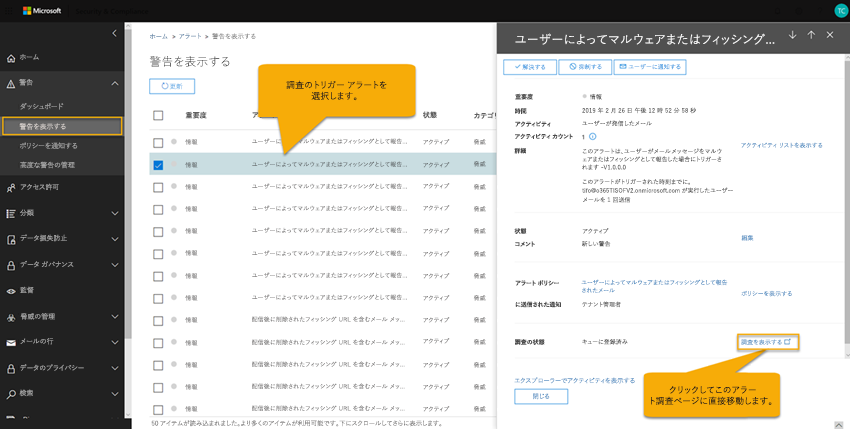 

## セキュリティ プレイブック

セキュリティプレイブックは、Office Advanced Threat Protection および Microsoft Threat Protection の自動化の中核となるバックエンドポリシーです。 AIR で提供されるセキュリティプレイブックは、現実の一般的なセキュリティシナリオに基づいており、セキュリティ運用チームからのフィードバックに基づいて開発されています。 組織内で特定のアラートがトリガーされると、セキュリティによるプレイブックが自動的に開始されます。 アラートがトリガーされると、関連付けられたプレイブックは自動調査および応答 (AIR) システムによって実行されます。 この調査では、特定のアラートのプレイブックに基づいてアラートを分析し、関連するすべてのメタデータ (電子メールメッセージ、ユーザー、件名、送信者などを含む) を確認します。 調査の調査結果に基づいて、組織のセキュリティチームが脅威を制御し、軽減するために実行できる一連の操作を航空で推奨します。 

空気で得られるセキュリティプレイブックは、組織が現在直面している電子メールの最も頻繁な脅威に取り組むように設計されています。 これらは、Microsoft とお客様の資産を保護する手助けをしているユーザーを含む、セキュリティ運用チームとインシデント対応チームからの入力に基づいています。

### セキュリティ プレイブックは段階的に展開されています

セキュリティ プレイブックは AIR の一環として段階的に展開されています。 フェーズ 1 は現在一般公開されており、セキュリティ管理者が確認して承認できる処理に関する推奨事項を提供する、いくつかのプレイブックが含まれています。
- ユーザーから報告されたフィッシング メッセージ
- URL クリック判定の変更
- 配信後のマルウェア検出 (マルウェア ZAP)
- 配信後のフィッシング検出 ZAP (フィッシング ZAP)

フェーズ1には、管理者によってトリガーされた電子メール調査のサポート ([脅威エクスプローラー](threat-explorer.md)を使用) も含まれています。

現在進行中のフェーズ 2 では、次のプレイブックが **パブリック プレビュー**中です。処理に関する推奨事項が提供され、セキュリティ管理者が問題を調査するのに役立っています。　
- ユーザーから報告された侵害の発生 (パブリック プレビュー)

追加のプレイブックは、出来上がり次第公開されます。 [Microsoft 365 ロードマップ](https://www.microsoft.com/microsoft-365/roadmap) にアクセスすると、準備中および近日公開予定のプレイブックを確認できます。

### プレイブックには調査と推奨事項が含まれます

AIR では、各セキュリティ プレイブックに含まれるものは次のとおりです。 
- 電子メールのエンティティ (ファイル、Url、受信者、IP アドレスなど) のルート調査
- 組織で受信した類似メールをさらに探す 
- 他の潜在的な脅威を特定し、相関関係を特定するための手順 
- 脅威に関する推奨修復処理

各高度な手順には、さまざまな手順が実行されており、脅威への深く、詳細で完全な応答が提供されます。

## 自動化された調査

[自動調査] ページでは、組織での調査とその現在の状態が表示されます。

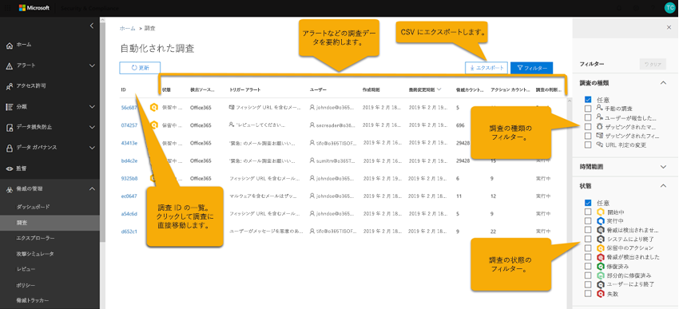 
  
以下のことを実行できます。
- 調査への直接の移動 ([**調査 ID**] を選択します)。
- フィルターの適用。 [**調査の種類**]、[**時間の範囲**]、[**状態**] から選択するか、これらの組み合わせを選択します。
- データの .CSV ファイルへのエクスポート。

調査の状態は、分析と処理の進捗状況を示します。 調査が実行されると、状態の表示が変わり、脅威が検出されたかどうかと、処理が承認されているかどうかが示されるようになります。 

|状態  |意味  |
|---------|---------|
|開始中 | すぐに開始するために、調査がキューに入れられる |
|実行中 | 調査が開始され、分析を実行しています |
|脅威は見つかりませんでした | 調査が完了しました。脅威は見つかりませんでした |
|システムによる終了 | 調査が閉じられず、7日後に期限切れになった |
|保留中のアクション | この調査では、推奨される処置によって脅威を検出しました。  最初の脅威と推奨されるアクションが検出された後も調査を続行します。そのため、アナライザーが進行中であるかどうかを確認するには、アクションを承認する前にログをチェックする必要があります。 |
|脅威が検出されました | 調査では脅威を検出しましたが、脅威には AIR 内で使用可能なアクションがありません。  これらは、方向の AIR アクションがまだないユーザー操作です。 |
|修復済み | 調査が完了し、完全に修復されました (すべてのアクションが承認されました) |
|一部修復済み | 調査が終了し、推奨されるアクションのいくつかが承認された |
|ユーザーにより終了 | 管理者が調査を終了した |
|失敗 | 調査中にエラーが発生し、脅威の結論に達しませんでした |
|調整によってキューに入れられる | 調査は、システム処理の制限 (サービスのパフォーマンスを保護するため) による分析を待機しています。 |
|調整による終了 | 調査のボリュームとシステム処理の制限により、十分な時間内に調査を完了できませんでした。 エクスプローラーで電子メールを選択し、[調査] アクションを選択することによって、調査を retrigger することができます。 |

### 調査グラフ

特定の調査を開くと、[調査用グラフ] ページが表示されます。 このページには、メール メッセージ、ユーザー (およびユーザーのアクティビティ)、トリガーされたアラートの一部として自動的に調査されたデバイスなど、さまざまなエンティティが表示されます。

![ARI の [調査グラフ] ページ](../media/air-investigationgraphpage.png)

以下のことを実行できます。
- 現在の調査の概要図の表示。
- 調査期間の概要の表示。
- 概要図内のノードを選択すると、そのノードの詳細が表示されます。
- 上部のタブを選択すると、選択したタブの詳細が表示されます。

### アラートの調査

調査の [**アラート**] タブでは、調査に関連するアラートが表示されます。 詳細には、調査に関連する、高リスクなサインイン、DLP ポリシー違反など、調査とその他の関連するアラートをトリガーしたアラートが含まれます。 このページでは、セキュリティ アナリストは、個々のアラートの詳細情報を表示することもできます。

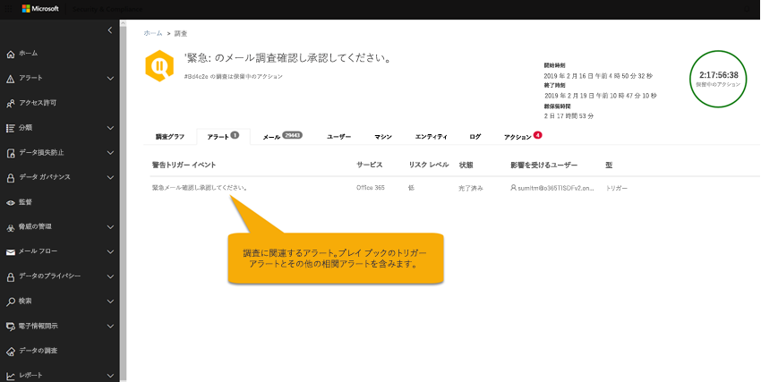

以下のことを実行できます。
- 現在トリガーされているアラートおよびすべての関連アラートの概要図の表示。
- 一覧でアラートを選択すると、アラートの完全な詳細情報を表示するフライアウト ページが開きます。

### メールの調査

調査の [**電子メール**] タブで、調査の一部として識別された、元の電子メールと類似した電子メールのクラスターが表示されます。 

組織内のユーザーによって送受信される大量の電子メールと、電子メールの通信や攻撃の複数ユーザーの性質に加えて、 
- メッセージヘッダー、本文、URL、および添付ファイルから類似した属性に基づいて電子メールメッセージをクラスター化する。 
- 適切なメールからの悪意のあるメールの分離 
- 悪質のあるメール メッセージに対する処理 

長時間かかる場合があります。 AIR ではこのプロセスが自動化されるため、組織のセキュリティ チームの時間と労力を節約できます。 

メール分析の手順では、類似性クラスターとインジケーター クラスターという、2 種類のメール クラスターが特定される場合があります。 
- 類似性クラスターとは、送信者およびコンテンツ属性が似ている電子メールを探すことで識別される電子メールメッセージのことです。 これらのクラスターは、元の検出結果に基づいて、悪意のあるコンテンツについて評価されます。 悪意のある電子メールを検出するのに十分な数の電子メールクラスターが悪意のあるものと見なされます。
- インジケータークラスターは、元の電子メールから同じインジケーターエンティティ (ファイルハッシュまたは URL) を探すことで識別される電子メールメッセージです。 元のファイルまたは URL のエンティティが悪意のあるものであると特定されると、AIR によりそのエンティティを含むメール メッセージのクラスター全体にインジケーター判定が適用されます。 マルウェアとして識別されたファイルは、そのファイルを含む電子メールメッセージのクラスターがマルウェアの電子メールメッセージとして扱われることを意味します。

クラスタリングの目的は、攻撃またはキャンペーンの一部として同じ送信者によって送信された他の関連する電子メールメッセージを探して検索することです。  場合によっては、正当な電子メールによって調査が発生することがあります (ユーザーがマーケティング電子メールを報告するなど)。  このようなシナリオでは、電子メールのクラスターが悪意のある電子メールクラスターではないことを特定する必要があります。適切な場合は、脅威を示しておらず、電子メールの削除もお勧めし**ません**。

[**メール**] タブには、ユーザーから報告されたメールの詳細、最初に報告されたメール、マルウェア/フィッシングとしてゼロアワー自動消去されたメール メッセージなど、調査に関連するメール アイテムも表示されます。

ある時点で [メール] タブで特定されるメール数は、[**メール**] タブに表示されるすべてのメール メッセージの合計を表します。メール メッセージは複数のクラスターに存在するため、特定される (および修復処理の影響を受ける) メール メッセージの実際の合計数は、すべてのクラスターと元の受信者のメール メッセージに含まれる一意のメール メッセージの数です。 

セキュリティ判定、処理、および配信場所は受信者ごとに異なるため、エクスプローラーと AIR ではともに、メール メッセージは受信者ごとにカウントされます。 したがって、3 人のユーザーに送信された 1 通の元のメールは、1 通のメールではなく、合計 3 通のメール メッセージとしてカウントされます。 メールに複数の処理が割り当てられている可能性があるため、メールは複数回カウントされる場合があり、すべての処理が実行されるとそのメールの複数のコピーが作られる場合がある点に留意してください。 たとえば、配信時に検出されたマルウェア電子メールは、ブロックされた (検疫された) 電子メールと、置き換えられた電子メール (脅威ファイルが警告ファイルに置き換えられて、ユーザーのメールボックスに配信される) の両方になることがあります。 システムに電子メールのコピーが文字どおり2つ存在するため、両方ともクラスター数でカウントされます。 

メール数は調査時に計算され、調査 flyouts を開くと (基になるクエリに基づいて) いくつかのカウントが再計算されます。 [電子メール] タブの電子メールクラスターに表示される電子メール数と、クラスターポップアップに表示される電子メールの数量の値は、調査時に計算され、変更されません。 メールクラスターポップアップの [電子メール] タブの下部に表示される電子メール数、および調査の最初の分析後に受信した電子メールメッセージがエクスプローラーに表示されるメールメッセージ数に反映されます。 したがって、元の10個の電子メールメッセージを表示する電子メールクラスターでは、調査分析フェーズと管理者が調査をレビューしたときに5件の電子メールメッセージが到着すると、電子メールリストの合計が15件表示されます。  同様に古い調査では、トライアル期間が7日後、有料ライセンスの場合は30日後に、ATP P2 がデータを期限切れにしているため、エクスプローラークエリよりも大きなカウントが開始されます。  カウント履歴と現在のカウントの両方を異なるビューで表示することによって、調査の時点での電子メールの影響、および修復が実行されるまでの現在の影響を示すことができます。

例として、次のシナリオを考えてみます。 3 通のメール メッセージからなる 1 番目のクラスターは、フィッシング クラスターであるとみなされました。 同じ IP と件名を持つ、似たようなメッセージからなるクラスターは、初期検出中に一部のメッセージがフィッシングと特定されたために悪意のあるクラスターであるとみなされました。 

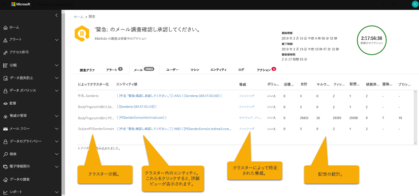

以下のことを実行できます。
- 現在のクラスター化の結果と検出された脅威の概要図の表示。
- クラスター エンティティまたは脅威リストをクリックすると、アラートのすべての詳細情報を表示するフライアウト ページが開きます。
- メール クラスターをさらに調査するには、[メール クラスターの詳細] タブの上部にある [エクスプローラーで開く] リンクをクリックします。

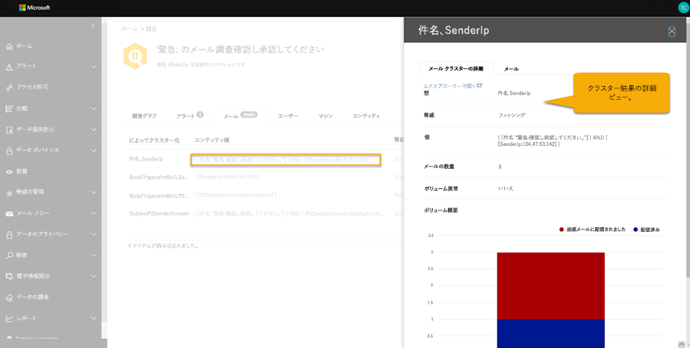

> [!NOTE]
> 電子メールのコンテキストでは、調査の一環としてボリュームの異常な脅威が表面化することがあります。 異常な量の発生は、以前のタイムフレームと比べて、調査イベントの時間の前後に似たようなメール メッセージのスパイクがあったことを示します。 似たような特徴 (件名や送信者ドメイン、本文の類似性や送信者の IP) を持つメール トラフィックのスパイクは、メール キャンペーンまたは攻撃の開始の典型です。 ただし、これらの特徴は多くの場合、バルク、スパム、および正当なメール キャンペーンでも同様にみられます。 異常な量で示されるのは潜在的な脅威であることから、ウイルス対策エンジン、デトネーション、または悪意の評価を使用して特定されたマルウェアやフィッシングの脅威ほどは重大でない可能性があります。

### ユーザーの調査

[**ユーザー**] タブには、調査対象として特定されたすべてのユーザーが表示されます。 ユーザー アカウントは、それらのユーザー アカウントが影響を受けたり侵害されたりした可能性があるイベントまたは兆候があった場合に調査に表示されます。

たとえば次の画像では、侵害および異常の兆候が、作成された新しい受信トレイ ルールに基づき AIR により特定されています。　 調査の追加の詳細 (証拠) は、このタブ内の詳細ビューで表示できます。侵害や異常の兆候は、危険および異常の指標に、[Microsoft Cloud App Security](https://docs.microsoft.com/cloud-app-security) による異常の検出が含まれることもあります。

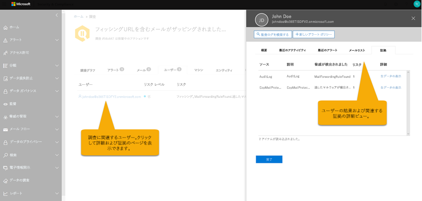

以下のことを実行できます。
- 特定されたユーザーの結果と検出されたリスクの概要図の表示。
- ユーザーを選択すると、アラートのすべての詳細情報を表示するフライアウト ページが開きます。

### コンピューターの調査

[**コンピューター**] タブには、調査対象として特定されたすべてのコンピューターが表示されます。 

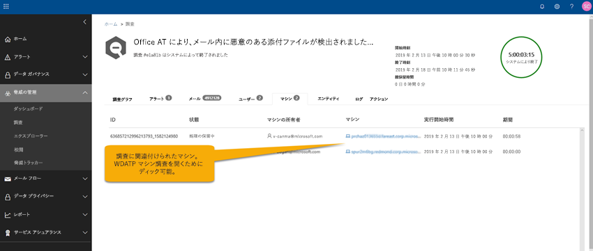

一部のプレイブックの一部として、エアは電子メールの脅威をデバイス (Zapped マルウェアなど) に関連付けます。 たとえば、悪意のあるファイル ハッシュは、診断のために調査から [Microsoft Defender ATP](https://docs.microsoft.com/windows/security/threat-protection/microsoft-defender-atp/microsoft-defender-advanced-threat-protection
) に渡されます。 これにより、ユーザーが関わるコンピューターを自動的に調査できるため、クラウドとエンドポイント全体の両方で脅威に対処で脅威に対処できるようになります。 

以下のことを実行できます。
- 現在のコンピューターと検出された脅威の概要図の表示。
- コンピューターを選択すると、関連する [Microsoft Defender ATP 調査](https://docs.microsoft.com/windows/security/threat-protection/microsoft-defender-atp/automated-investigations)を Microsoft Defender セキュリティ センターで確認できるビューが開きます。

### エンティティの調査

[**エンティティ**] タブには、調査の一環として識別され分析されたエンティティが表示されます。 

ここでは、調査済みのエンティティと、メール メッセージ、クラスター、IP アドレス、ユーザーといった、エンティティの種類に関する詳細情報を確認できます。 分析されたエンティティの数と、各エンティティに関連付けられた脅威も確認できます。 

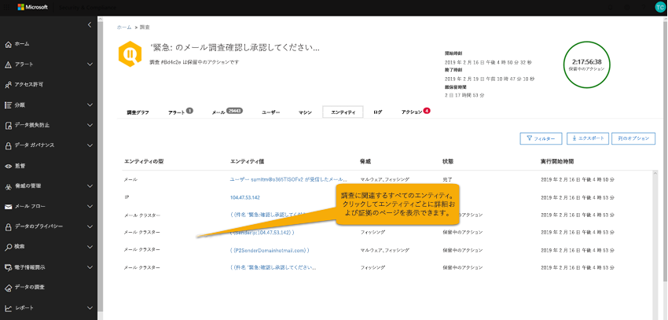

以下のことを実行できます。
- 調査エンティティと検出された脅威の概要図の表示。
- エンティティを選択すると、関連するエンティティの詳細情報を表示するフライアウト ページが開きます。

### プレイブック ログ

[**ログ**] タブには、調査中に実行されたすべてのプレイブック手順が表示されます。 このログは、Office 365 の自動調査機能によって実行されたすべてのアナライザーおよびアクションの完全なインベントリを AIR の一部としてキャプチャします。 ログでは、処理そのもの、説明、実際の処理での開始から終了までの所要時間など、実行されたすべてのステップを簡単に確認できます。 

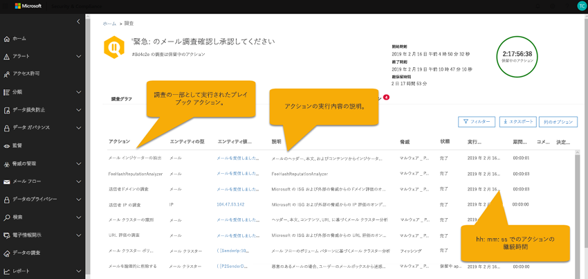

以下のことを実行できます。
- 実行されたプレイブック手順の概要図の表示。
- 結果の CSV ファイルへのエクスポート。
- ビューのフィルタリング。

|はまる | 説明 |
|-----|-----|
|DLP 違反の調査 |[Office 365 データ損失防止](../../compliance/data-loss-prevention-policies.md)(DLP) によって検出された違反を調査する |
|電子メールインジケーターの抽出 |調査のために電子メールメッセージのヘッダー、本文、およびコンテンツから指標を抽出する |
|ファイルハッシュの評価 |組織内のユーザーとコンピューターのファイルハッシュに基づいて異常を検出する |
|メールクラスターの識別 |ヘッダー、本文、コンテンツ、および Url に基づく電子メールクラスターの分析 |
|メールクラスターボリュームの分析 |送信メールフローボリュームパターンに基づく電子メールクラスターの分析 |
|メール委任の調査 |この調査に関連するユーザーメールボックスのメールの委任アクセスを調査します。 |
|メール転送ルールの調査 |この調査に関連するユーザーメールボックスのメール転送ルールを調査します。 |
|検出されたマルウェアの検出 |組織内のユーザーのメールボックスに配信されなかったマルウェアを検出する |
|オンデマンド分析 |オンデマンドで、電子メールメッセージ、添付ファイル、および Url に対してトリガーされる分析 |
|送信メールの異常調査 |組織内のユーザーの履歴メールフロー送信パターンに基づいて異常を検出する |
|送信マルウェアおよびスパムの異常調査 |組織内のユーザーから送信された、組織内のマルウェア、フィッシング、またはスパムを検出する |
|送信者ドメインの調査 |[Microsoft のインテリジェントセキュリティグラフ](https://www.microsoft.com/security/operations/intelligence)および外部の脅威インテリジェンスソースからのドメイン評価のオンデマンドチェック |
|送信者の IP 調査 | [Microsoft のインテリジェントセキュリティグラフ](https://www.microsoft.com/security/operations/intelligence)および外部の脅威インテリジェンスソースからの IP 評価のオンデマンドチェック |
|URL クリックの調査 | [Office 365](atp-safe-links.md)で保護されたユーザーからのクリックを調査する組織内の ATP の安全なリンク |
|URL 評価の調査 |[Microsoft のインテリジェントセキュリティグラフ](https://www.microsoft.com/security/operations/intelligence)および外部の脅威インテリジェンスソースからの URL 評価のオンデマンドチェック |
|ユーザーアクティビティの調査 |[Microsoft Cloud App Security](https://docs.microsoft.com/cloud-app-security/what-is-cloud-app-security)でのユーザーアクティビティの異常を分析する |
|ユーザーによって報告された電子メール指標の抽出 |[ユーザーが報告した電子メール](enable-the-report-message-add-in.md)のヘッダー、本文、およびコンテンツから、調査のために指標を抽出する |

### 推奨処理

[**処理**] タブには、調査完了後に修復することが推奨されるすべてのプレイブック処理が表示されます。 

処置調査の最後に、Microsoft が推奨する手順をキャプチャします。 ここでは、1 つまたは複数のアクションを選択して、修復処理を実行できます。 [**承認**] をクリックすると、修復を開始できます。 (適切なアクセス許可が必要です。エクスプローラーおよび AIR から処理を実行するには、"検索と消去" の役割が必要です。) たとえば、セキュリティ閲覧者は処理を表示することはできますが、承認することはできません。 注: すべてのアクションを承認する必要はありません。 推奨されるアクションと一致しない場合、または組織で特定の種類のアクションが選択されていない場合は、アクションを**拒否**するか、または単に無視してアクションを実行しないことを選択できます。 すべてのアクションを承認または拒否することで、調査が完全に終了 (状態は修復可能) されます。一部のアクションは不完全な状態になり、調査の状態が部分的に修復された状態に変化します。

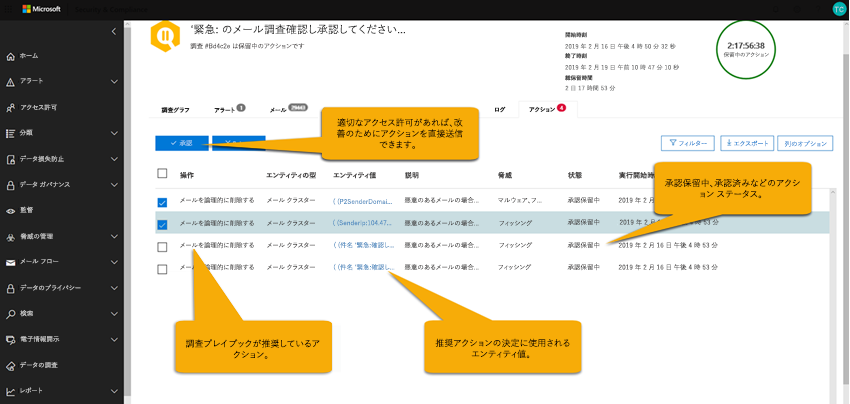

以下のことを実行できます。
- プレイブック推奨の処理の概要図の表示。
- 1 つまたは複数の処理の選択。
- 推奨処理の承認または拒否とコメント付け。
- 結果の CSV ファイルへのエクスポート。
- ビューのフィルタリング。

## 修復アクション

自動調査が実行されている、または完了している場合は、通常、1つ以上の修復アクションが表示されます。 次の表に、Office 365 AIR の修復アクションの一覧を示します。

|アクション | 説明 |
|-----|-----|
|URL のブロック (クリック時) |悪意のある Url を含む電子メールやドキュメントを保護します。 これにより、ユーザーが既存の Office ファイルまたは古い電子メールメッセージ内のリンクをクリックしたときに、悪意のあるリンクや関連する web ページが[安全なリンク](atp-safe-links.md)でブロックされるようになります。 |
|電子メールの削除 (ソフト)  |ユーザーのメールボックスから特定の電子メールメッセージを削除する|
|削除済みメールクラスターの回復  |すべてのユーザーのメールボックスからのクエリに一致する悪意のある電子メールメッセージを削除します。|
|外部メール転送の無効化 |特定のエンドユーザーのメールボックスから転送ルールを削除します。|

## 例: ユーザーから報告されたフィッシング メッセージによる調査プレイブックの起動

組織内のユーザーが電子メールメッセージを送信し、 [outlook または Outlook Web App 用のレポートメッセージアドイン](enable-the-report-message-add-in.md)を使用して Microsoft に報告すると、レポートはシステムにも送信され、ユーザーがレポートビューでエクスプローラーに表示されます。 ユーザーから報告されたこのメッセージによりシステム ベースの情報アラートがトリガーされ、これにより調査プレイブックが自動的に起動します。

ルート調査フィーズでは、メールのさまざまな側面が評価されます。 これらには以下が含まれます。
- 可能性のある脅威の種類の特定
- 誰が送信したか
- メールはどこから送信されたか (送信元のインフラストラクチャ)
- メールの他のインスタンスは、配信されたのか、それともブロックされたのか
- Microsoft のアナリストによる評価
- メールが既知のキャンペーンと関連するものかどうか
- その他

ルート調査が完了すると、元のメールとそれに関連付けられているエンティティに対する推奨処理の一覧がプレイブックにより提供されます。
  
次に、脅威の調査と捜索のための手順がいくつか実行されます。

- 同様の電子メールメッセージは、電子メールクラスター検索によって識別されます。
- シグナルが [Microsoft Defender ATP](https://docs.microsoft.com/windows/security/threat-protection/microsoft-defender-atp/microsoft-defender-advanced-threat-protection) などの他のプラットフォームと共有されます。
- 不審なメール メッセージ内の悪意のあるリンクをユーザーがクリックしたかどうかが判断されます。
- ユーザーから報告されている類似したメッセージが他にもあるかどうかが、Microsoft Office 365 Exchange Online Protection ([EOP](exchange-online-protection-eop.md)) および Office 365 Advanced Threat Protection ([ATP](office-365-atp.md)) 全体がチェックされます。
- ユーザーに対する侵害があったかどうかがチェックされます。 このチェックは、Office 365、 [Microsoft Cloud App Security](https://docs.microsoft.com/cloud-app-security)、および[Azure Active Directory](https://docs.microsoft.com/azure/active-directory)の間の信号を活用して、関連するすべてのユーザーアクティビティの異常を関連付けます。 

捜索フェーズでは、リスクと脅威がさまざまな捜索手順に割り当てられます。 

修復は、プレイブックの最後のフェーズです。 このフェーズでは、調査および捜索フェーズに基づいて、修復手順が実行されます。 

## 例: セキュリティ管理者が脅威エクスプローラーから調査を開始する

アラートによりトリガーされる自動調査に加え、組織のセキュリティ オペレーション チームは[脅威エクスプローラー](threat-explorer.md)内のビューから自動調査をトリガーすることができます。

たとえば、ユーザーから報告されたメッセージに関するデータをエクスプローラーで確認しているとします。 結果のリストで項目を選択してから、[操作] メニューから [**調査**] をクリックします (適切な修復権限がある場合を想定しています)。

![エクスプローラーでのユーザーから報告されたメッセージと [調査] ボタン](../media/Explorer-UserReported-Investigate.png)

別の例として、マルウェアが含まれているとして検出されたメール メッセージに関するデータを確認しているとします。マルウェアが含まれているとして、複数のメール メッセージが検出されています。 [**メール**] タブを選択し、1 つまたは複数のメール メッセージを選択し、[**処理**] メニューで [**調査**] を選択します。 

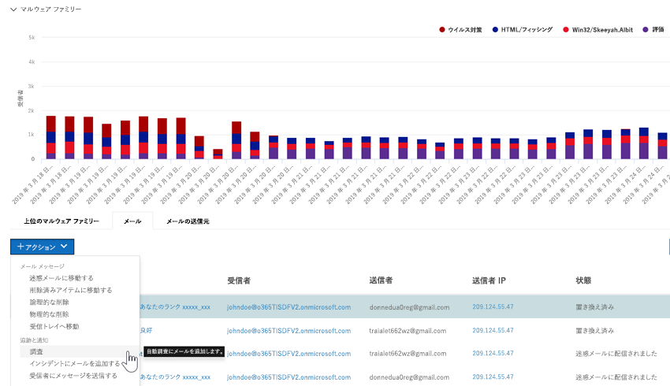

アラートによってトリガーされるプレイブックと同様、エクスプローラーのビューからトリガーされる自動調査には、ルート調査、脅威を特定して相関関連を特定するための手順、これらの脅威を軽減するための推奨処置が含まれます。

## AIR の入手方法

Office 365 AIR は次のサブスクリプションに含まれています。

- Microsoft 365 E5
- Office 365 E5
- Microsoft Threat Protection
- Office 365 Advanced Threat Protection プラン 2

これらのサブスクリプションのいずれも持っていない場合は、[無料の試用版を開始](https://go.microsoft.com/fwlink/p/?LinkID=698279&culture=en-US&country=US)してください。

利用可能な機能の詳細については、「[Advanced Threat Protection (ATP) の各プランで利用できる機能](https://docs.microsoft.com/office365/servicedescriptions/office-365-advanced-threat-protection-service-description#feature-availability-across-advanced-threat-protection-atp-plans)」を参照してください。

## 空気機能を使用するために必要なアクセス許可

アクセス許可は、次の表に記載されているような特定の役割によって付与されます。 

|タスク |必要な役割 |
|--|--|
|エア機能を設定するには |次のいずれかの役割:  - **グローバル管理者** - **セキュリティ管理者**  これらの役割は、 [Azure Active Directory](https://docs.microsoft.com/azure/active-directory/users-groups-roles/directory-assign-admin-roles)または[Office 365 セキュリティ & コンプライアンスセンター](https://docs.microsoft.com/microsoft-365/security/office-365-security/permissions-in-the-security-and-compliance-center)で割り当てることができます。 |
|推奨されるアクションを承認または拒否するには|[Azure Active Directory](https://docs.microsoft.com/azure/active-directory/users-groups-roles/directory-assign-admin-roles)または[Office 365 セキュリティ & コンプライアンスセンター](https://docs.microsoft.com/microsoft-365/security/office-365-security/permissions-in-the-security-and-compliance-center)で割り当てられている次のいずれかの役割。 - **グローバル管理者**  - **セキュリティ管理者** - **セキュリティリーダ**  --- さらに --- - **検索と削除**(この役割は、 [Office 365 セキュリティ & コンプライアンスセンター](https://docs.microsoft.com/microsoft-365/security/office-365-security/permissions-in-the-security-and-compliance-center)でのみ割り当てられます。 そこで新しい役割グループを作成し、その新しい役割グループに検索役割と削除役割を追加する必要がある場合があります。

## 次の手順

- [Office 365 で AIR の使用を開始する](office-365-air.md)
- [Microsoft Defender ATP の AIR についての詳細情報](https://docs.microsoft.com/windows/security/threat-protection/microsoft-defender-atp/automated-investigations) 
- [Microsoft 365 ロードマップにアクセスして、近日公開予定の機能を確認する](https://www.microsoft.com/microsoft-365/roadmap?filters=)

## 関連項目

- [Microsoft Threat Protection](../mtp/microsoft-threat-protection.md)
- [Microsoft の脅威保護での自動化された調査と修復 (AIR)](../mtp/mtp-autoir.md)
