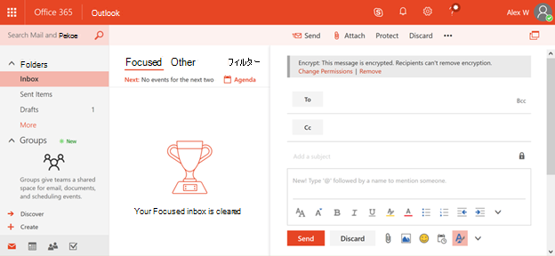

# <a name="protection-features-in-azure-information-protection-rolling-out-to-existing-tenants"></a>Azure Information Protection の保護機能が既存のテナントに展開される

[!INCLUDE [Microsoft 365 Defender rebranding](../includes/microsoft-defender-for-office.md)]

**適用対象**
- [Microsoft Defender for Office 365 プラン 2](defender-for-office-365.md)
- [Microsoft 365 Defender](../defender/microsoft-365-defender.md)

2018 年 7 月から、Azure Information Protection の対象テナントすべてが Azure Information Protection の保護機能を既定で有効にします。 Azure Information Protection の保護機能は、以前は 365 Office Rights Management または Azure RMS として知られています。 組織に E3 サービス プランOffice高いサービス プランがある場合は、これらの機能を展開するときに Azure Information Protection を通じて情報の保護を開始します。

## <a name="changes-beginning-july-1-2018"></a>2018 年 7 月 1 日から変更

2018 年 7 月 1 日より、Microsoft は Azure Information Protection の保護機能をすべての組織で有効にし、次のいずれかのサブスクリプション プランを使用します。

- Office 365 メッセージ暗号化は、Office 365 E3 および E5、Microsoft E3 と E5、Office 365 A1、A3、および A5、および Office 365 G3 および G5 の一部として提供されます。 Azure Information Protection を利用した新しい保護機能を受け取る場合は、追加のライセンスは不要です。

- Azure Information Protection Plan 1 を次のプランに追加して、新しい Office 365 メッセージ暗号化機能 (Exchange Online プラン 1、Exchange Online プラン 2、Office 365 F1、Microsoft 365 Business Basic、Microsoft 365 Business Standard、または Office 365 Enterprise E1) を受信できます。

- 365 Message Encryption Officeを利用する各ユーザーは、この機能の対象となるライセンスを取得する必要があります。

- 完全な一覧については [、「Exchange Online サービス](/office365/servicedescriptions/exchange-online-service-description/exchange-online-service-description) の説明」を参照Office 365 Message Encryption です。

テナント管理者は、365 管理者ポータルの Office状態を確認できます。


## <a name="why-are-we-making-this-change"></a>この変更を行う理由

Office 365 メッセージ暗号化は、Azure Information Protection の保護機能を活用します。 Office 365 Message Encryption に対する最近の改善と、Microsoft 365 の情報保護への広範な投資の中心で、組織が保護機能を有効にし、使用しやすくなっています。これまで、暗号化テクノロジのセットアップは困難でした。 Azure Information Protection の保護機能を既定で有効にすることで、機密データの保護をすばやく開始できます。

## <a name="does-this-impact-me"></a>これは私に影響を与えますか?

組織が 365 ライセンスの対象Office購入した場合、テナントはこの変更の影響を受け取る可能性があります。

> [!IMPORTANT]
> オンプレミス環境で Active Directory Rights Management サービス (AD RMS) を使用している場合は、この変更を今後 30 日以内に展開する前に、直ちにこの変更をオプトアウトするか、Azure Information Protection に移行する必要があります。 オプトアウトの方法の詳細については、「RMS を使用ADオプトアウトする方法」を参照してください。 」で説明する手順に従ってローカライズされたファイルをインストールします。 移行する場合は、「RMS から Azure Information Protection への移行 [AD」を参照してください](/azure/information-protection/plan-design/migrate-from-ad-rms-to-azure-rms)。

## <a name="can-i-use-azure-information-protection-with-active-directory-rights-management-services-ad-rms"></a>Azure Information Protection を (RMS) Active Directory Rights Management サービス使用ADできますか?

いいえ。 これは、サポートされている展開シナリオではありません。 追加のオプトアウト手順を実行しない場合、一部のコンピューターは Azure Rights Management サービスの使用を自動的に開始し、RMS クラスターにAD可能性があります。 このシナリオはサポートされていないので、結果が不当なので、これらの新機能を展開する前に、今後 30 日以内にこの変更をオプトアウトすることが重要です。 オプトアウトの方法の詳細については、「RMS を使用ADオプトアウトする方法」を参照してください。 」で説明する手順に従ってローカライズされたファイルをインストールします。 移行する場合は、「RMS から Azure Information Protection への移行 [AD」を参照してください。](/azure/information-protection/plan-design/migrate-from-ad-rms-to-azure-rms)

## <a name="how-do-i-know-if-im-using-ad-rms"></a>RMS を使用している場合のAD方法

ACTIVE DIRECTORY RIGHTS MANAGEMENT サービス [(AD RMS)](/azure/information-protection/deploy-use/prepare-environment-adrms) を持っている場合は、「Azure Rights Management の環境を準備する」の手順を使用して、RMS をADしてください。

1. オプションですが、ほとんどの RMS 展開ADサービス接続ポイント (SCP) を Active Directory に発行して、ドメイン コンピューターが RMS クラスターを検出ADします。

   ADSI Edit を使用して、Active Directory で公開されている SCP を持っているかどうかを確認します。CN=Configuration [server name]、CN=Services、CN=RightsManagementServices、CN=SCP

2. SCP を使用していない場合、AD RMS クラスターに接続する Windows コンピューターは、Windows レジストリを使用してクライアント側のサービス検出またはライセンスリダイレクト用に構成する必要があります。 `HKEY_LOCAL_MACHINE\SOFTWARE\Microsoft\MSIPC\ServiceLocation or HKEY_LOCAL_MACHINE\SOFTWARE\Wow6432Node\Microsoft\MSIPC\ServiceLocation`

これらのレジストリ構成の詳細については [、「Windows](/azure/information-protection/rms-client/client-deployment-notes#enabling-client-side-service-discovery-by-using-the-windows-registry) レジストリを使用したクライアント側サービス検出の有効化」および「ライセンス サーバー トラフィックのリダイレクト」 [を参照してください](/azure/information-protection/rms-client/client-deployment-notes#redirecting-licensing-server-traffic)。

## <a name="i-use-ad-rms-how-do-i-opt-out"></a>RMS をAD、オプトアウトする方法は?

今後の変更をオプトアウトするには、次の手順を実行します。

1. 組織でグローバル管理者のアクセス許可を持つ仕事または学校のアカウントを使用して、Windows PowerShellセッションを開始し、Exchange Online に接続します。 手順については、「[Exchange Online PowerShell に接続する](/powershell/exchange/connect-to-exchange-online-powershell)」を参照してください。

2. 次の構文Set-IRMConfigurationを使用して、このコマンドレットを実行します。

  ```powershell
  Set-IRMConfiguration -AutomaticServiceUpdateEnabled $false
  ```

## <a name="what-can-i-expect-after-this-change-has-been-made"></a>この変更が行われた後、何を期待できますか?

これを有効にした後、オプトアウトしていない場合は [、Microsoft Ignite 2017](https://techcommunity.microsoft.com/t5/Security-Privacy-and-Compliance/Email-Encryption-and-Rights-Protection/ba-p/110801) で発表された新しいバージョンの Office 365 Message Encryption の使用を開始し、Azure Information Protection の暗号化と保護機能を活用できます。



新しい拡張機能の詳細については [、「365 message Encryption Officeを参照してください](../../compliance/ome.md)。