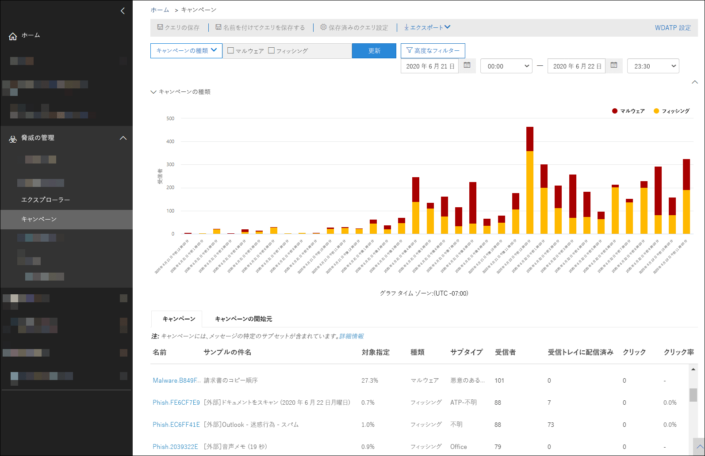
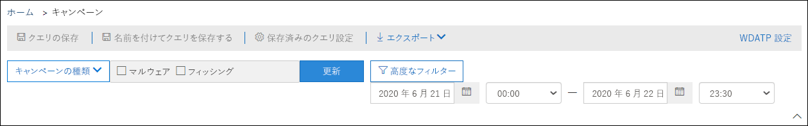
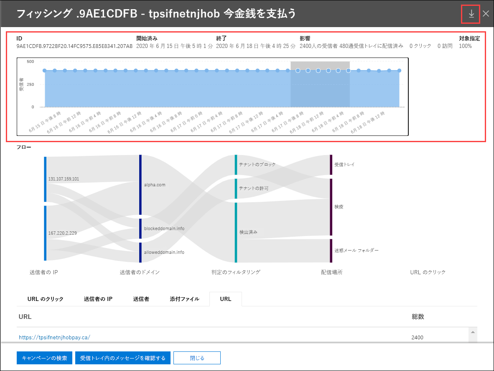
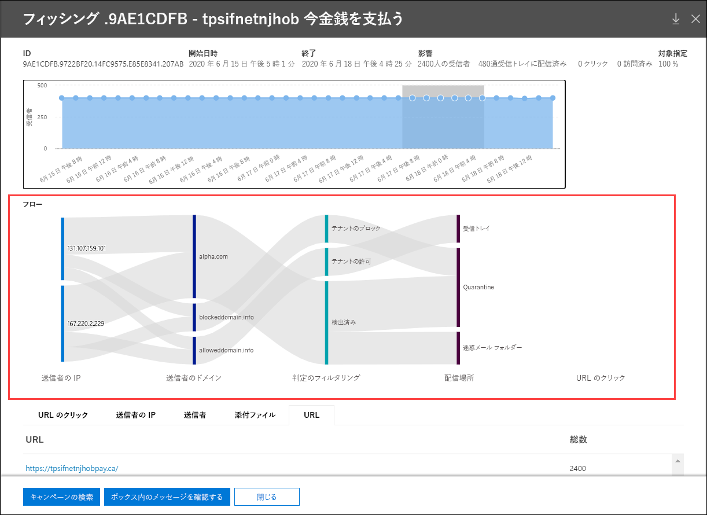

# Microsoft Defender for Office 365 のキャンペーン ビュー

[!INCLUDE [Microsoft 365 Defender rebranding](../includes/microsoft-defender-for-office.md)]

キャンペーン ビューは、Office 365 プラン 2 用の Microsoft Defender の機能です (たとえば、Microsoft 365 E5、または Office 365 プラン 2 アドオンの Defender を持つ組織)。 セキュリティ/コンプライアンス センターの&ビューは、サービス内のフィッシング攻撃を識別して分類します。 キャンペーン ビューは、次の目的に使用できます。

- フィッシング攻撃を効率的に調査し、対処する。
- 攻撃対象を正確に理解する。
- 意思決定者に価値を示す。

キャンペーン ビューを使用すると、人間には真似できない速さと完全さで攻撃の全体像を把握できます。

## キャンペーンとは

キャンペーンとは、1 つまたは複数の組織に対する組織的なメール攻撃のことです。 資格情報と会社のデータを盗む電子メール攻撃は、大規模で収益性の高い業界です。 攻撃を止める取り組みのテクノロジが増えるに応じて、攻撃者は継続的な成功を保証するために方法を変更します。

Microsoft は、サービス全体にわたって膨大な量のフィッシング対策、スパム対策、マルウェア対策データを活用して、キャンペーンを特定します。 攻撃情報を分析し、いくつかの要因に従って分類します。 次に例を示します。

- **攻撃元**: 送信元 IP アドレスと送信者の電子メール ドメイン。
- **メッセージの** プロパティ : メッセージのコンテンツ、スタイル、およびトーン。
- **メッセージ受信者**: 受信者の関連付け。 たとえば、受信者ドメイン、受信者の仕事の機能 (管理者、役員など)、会社の種類 (大規模、小規模、パブリック、プライベートなど)、業界などです。
- **攻撃ペイロード**: メッセージ内の悪意のあるリンク、添付ファイル、または他のペイロード。

キャンペーンの期間が短い場合や、アクティブ期間と非アクティブ期間がある数日、数週間、または月に及んでいる場合があります。 特定の組織に対してキャンペーンが開始される場合や、組織が複数の企業で大規模なキャンペーンの一部である場合があります。

## セキュリティ/コンプライアンス センター&ビュー

キャンペーン ビューは、セキュリティ/コンプライアンス [センターの&](https://protection.office.com)**管理キャンペーンで**、または直接 \> 利用できます <https://protection.office.com/campaigns> 。

次の場所からキャンペーン ビューにアクセスできます。

- **脅威の管理** \>**エクスプローラー** \>**表示** \>**キャンペーン**
- **脅威の管理** \>**エクスプローラー** \>**表示** \>**すべてのメール** \>**[キャンペーン]** タブ
- **脅威の管理** \>**エクスプローラー** \>**表示** \>**フィッシング** \>**[キャンペーン]** タブ
- **脅威の管理** \>**エクスプローラー** \>**表示** \>**マルウェア** \>**[キャンペーン]** タブ

キャンペーン ビューにアクセスするには、セキュリティ/コンプライアンス センターの組織の管理、セキュリティ管理者、またはセキュリティ閲覧者の役割グループの&必要があります。  詳細については、「[セキュリティ/コンプライアンス センターのアクセス許可](permissions-in-the-security-and-compliance-center.md)」を参照してください。

## キャンペーンの概要

概要ページには、すべてのキャンペーンに関する情報が表示されます。

既定の [ **キャンペーン]** タブの [ **キャンペーンの種類** ] 領域には、1 日あたりの受信者数を示す棒グラフが表示されます。 既定では、グラフにはフィッシングデータと **マルウェア データの両方****が表示** されます。

> [!TIP]
> キャンペーン データが表示しない場合は、日付範囲またはフィルターを変更 [してみてください](#filters-and-settings)。

概要ページの残りの部分では、[キャンペーン] タブに次の情報 **が表示** されます。

- [**Name (名前)**]

- [**Sample subject (件名のサンプル)**]: キャンペーンのいずれかのメッセージの件名行。 キャンペーン内のすべてのメッセージの件名が同じとは限りません。

- **対象**: (組織内のキャンペーン受信者の数) / (サービス内のすべての組織のキャンペーン内の受信者の総数) で計算された割合。 この値は、キャンペーンが組織に対してどの程度向けられるか (より高い値) か、サービス内の他の組織 (より低い値) に向けられているかを示します。

- **型**: この値は **、Phish** または **Malware です**。

- **サブ** タイプ : この値には、キャンペーンに関する詳細が含まれる。 次に例を示します。
  - **フィッシング**: 利用可能な場合、このキャンペーンによってフィッシングされているブランド。 たとえば、, `Microsoft` `365` , , , or `Unknown` `Outlook` `DocuSign` .
  - **マルウェア**: たとえば `HTML/PHISH` 、または `HTML/<MalwareFamilyName>` .

  利用可能な場合、このキャンペーンによってフィッシングされているブランド。 検出が Defender によって Office 365 テクノロジに対して実行される場合、プレフィックス **ATP が** サブタイプ値に追加されます。

- [**Recipients (受信者)**]: このキャンペーンの攻撃対象となったユーザーの数。

- **受信トレイ**: 受信トレイでこのキャンペーンからメッセージを受信したユーザーの数 (迷惑メール フォルダーには配信されません)。

- **Clicked**: URL をクリックしたユーザー数、またはフィッシング メッセージで添付ファイルを開いたユーザーの数。

- **クリックレート**: [受信トレイのクリック数]**で計算された**  /  **パーセンテージ。** この値は、キャンペーンの効果を示す指標です。 つまり、受信者がメッセージをフィッシングとして識別できた場合、および受信者がペイロード URL をクリックしなかった場合。

  クリック率 **は** マルウェア キャンペーンでは使用されません。

- **アクセス:** 実際にペイロード Web サイトにアクセスしたユーザーの数。 クリックされた値 **がある** が、安全なリンクが Web サイトへのアクセスをブロックしている場合、この値はゼロになります。

[ **キャンペーンの発生** 元] タブには、世界の地図にメッセージ ソースが表示されます。

### フィルターと設定

[キャンペーン ビュー] ページの上部には、特定のキャンペーンを見つけて切り離すのに役立つフィルターとクエリの設定がいくつかあります。

最も基本的なフィルター処理は、開始日時と終了日時です。

ビューをさらにフィルター処理するには、[キャンペーンの種類] ボタンをクリックして選択し、[更新]をクリックして、複数の値をフィルター処理する単一のプロパティを **実行できます**。

[キャンペーンの種類] ボタンで利用できるフィルター処理可能な **キャンペーン** のプロパティについて、次の一覧で説明します。

- **基本**:
  - **キャンペーンの種類**: [ **マルウェアまたはフィッシング]** を **選択します**。 選択をクリアすると、両方を選択した場合と同じ結果になります。
  - **キャンペーン名**
  - **キャンペーンのサブタイプ**
  - **送信者**
  - **受信者**
  - **送信元ドメイン**
  - **[件名]**
  - **添付ファイルの名前**
  - **マルウェア ファミリ**
  - **タグ**: 指定したユーザー タグが適用されているユーザーまたはグループ (優先度アカウントを含む)。 ユーザー タグの詳細については、「ユーザー タグ」 [を参照してください](user-tags.md)。
  - **システム オーバーライド**
  - **配信アクション**
  - **追加アクション**
  - **方向性**
  - **検出テクノロジ**
  - **元の配信場所**
  - **最新の配信場所**
  - **システム オーバーライド**

- **詳細設定**:
  - **インターネット メッセージ ID**: メッセージ ヘッダーの **Message-ID** ヘッダー フィールドで使用できます。 値の例を `<08f1e0f6806a47b4ac103961109ae6ef@server.domain>` 次に示します (角かっこに注意してください)。
  - **ネットワーク メッセージ ID**: メッセージ ヘッダーの **X-MS-Exchange-Organization-Network-Message-Id** ヘッダー フィールドで使用できる GUID 値。
  - [**Sender IP (送信者の IP)**]
  - **添付ファイル SHA256**: Windows でファイルの SHA256 ハッシュ値を検索するには、コマンド プロンプトで次のコマンドを実行します `certutil.exe -hashfile "<Path>\<Filename>" SHA256` 。
  - **クラスター ID**
  - **アラート ポリシー ID**
  - **ZAP URL シグナル**

- **URL**:
  - **URL ドメイン**
  - **URL ドメインとパス**
  - **URL**
  - **URL パス**
  - **[Verdict] をクリックする**

複数のプロパティによるフィルター処理など、より高度なフィルター処理を行う場合は、[詳細フィルター] ボタンをクリックしてクエリを作成できます。 同じキャンペーン プロパティを使用できますが、次の拡張機能が追加されています。

- [条件の追加 **] をクリックすると、** 複数の条件を選択できます。
- 条件の間で **And** 演算子 **または Or 演算子** を選択できます。
- 条件リストの下部 **にある条件グループ** 項目を選択すると、複雑な複合条件を形成できます。

完了したら、[クエリ] ボタンを **クリック** します。

基本フィルターまたは高度なフィルターを作成した後は、[クエリの保存] または [名前を付けて保存] を **使用して保存できます**。 後で、キャンペーン ビューに戻る際に、[保存済み] クエリ設定をクリックして、保存済み **フィルターを読み込みます**。

グラフまたはキャンペーンの一覧をエクスポートするには、[エクスポート]をクリックし、[グラフ データのエクスポート] または [キャンペーン 一覧のエクスポート]**を選択します**。

Microsoft Defender for Endpoint サブスクリプションをお持ちのお客様は **、MDE** 設定をクリックして、Microsoft Defender for Endpoint にキャンペーン情報を接続または切断できます。 詳しくは、「Microsoft [Defender for Office 365](integrate-office-365-ti-with-wdatp.md)と Microsoft Defender for Endpoint の統合」をご覧ください。

## キャンペーンの詳細

キャンペーンの名前をクリックすると、キャンペーンの詳細がフライアウトに表示されます。

### キャンペーン情報

キャンペーンの詳細ビューの上部に、次のキャンペーン情報が表示されます。

- **ID**: 一意のキャンペーン識別子。

- **開始** および **終了**: キャンペーンの開始日と終了日。 これらの日付は、概要ページで選択したフィルター日付よりも延長される場合があります。

- **影響**: このセクションには、選択した日付範囲フィルター (またはタイムラインで選択した) に関する次のデータが含まれます。
  - 受信者の総数。
  - "受信トレイ" (迷惑メール フォルダーではなく受信トレイに配信された) メッセージの数。
  - フィッシング メッセージの URL ペイロードをクリックしたユーザーの数。
  - URL にアクセスしたユーザーの数。

- **対象**: (組織内のキャンペーン受信者の数) / (サービス内のすべての組織のキャンペーン内の受信者の総数) で計算された割合。 この値はキャンペーンの有効期間全体で計算され、日付フィルターに基づいて変化しない点に注意してください。

- キャンペーン アクティビティの対話型のタイムライン: タイムラインには、キャンペーンの全期間のアクティビティが表示されます。 既定では、網掛け領域には、概要で選択した日付範囲フィルターが含まれます。 クリックしてドラッグすると、特定の開始ポイントと終了ポイントを選択できます。この場合、次のセクションで説明するように、影響領域とページの残りの部分に表示されるデータが<u>変更</u>されます。

タイトル バー ![ で、[キャンペーンの書き込みダウンロード] ボタン [キャンペーンの書き込みダウンロード] アイコンをクリックして、キャンペーンの詳細を Word ドキュメント (既定では CampaignReport.docx) にダウンロードできます ](../../media/download-campaign-write-up-button.png) 。 ダウンロードには、キャンペーンの有効期間全体に関する詳細が含まれています (選択したフィルター日付も含め)。

### キャンペーン フロー

キャンペーンの詳細ビューの中央に、キャンペーンに関する重要な詳細が、水平方向のフロー図 (サンキー図と呼ばれる) の [フロー] セクション _に表示_ されます。 これらの詳細情報は、キャンペーンの要素および組織に与えている可能性のある影響を理解する上で役立ちます。

> [!TIP]
> フロー図に表示される情報は、前のセクションで説明したように、タイムラインの日付範囲の網掛けによって制御されます。

図内の横方向の帯にマウスのポインターを合わせると、関連するさまざまなメッセージが表示されます (特定のソース IP からのメッセージ、指定した送信者ドメインを使用した、特定のソース IP からのメッセージなど)。

図には、次の情報が含まれます。

- [**Sender IPs (送信者の IP)**]
- [**Sender domains (送信者のドメイン)**]
- **フィルターの条件**: Verdict の値は、「スパム対策メッセージ ヘッダー」で説明されている利用可能なフィッシングおよびスパム フィルターの条件 [に関連しています](anti-spam-message-headers.md)。 使用可能な値を次の表に示します。

  ****

  |値|スパム フィルターの確認|説明|
  |---|---|---|
  |**可**|`SFV:SKN` 
 `SFV:SKI`|スパム フィルターによって評価される前に、メッセージがスパムではないとマークされ、フィルター処理がスキップされました。 たとえば、メッセージはメール フロー ルール (トランスポート ルールとも呼ばれる) によってスパムではないとマークされました。 
 メッセージは、その他の理由でスパム フィルター処理をスキップしました。 たとえば、送信者と受信者は同じ組織内に表示されます。|
  |**ブロック済み**|`SFV:SKS`|スパム フィルターによって評価される前に、メッセージがスパムとしてマークされました。 たとえば、メール フロー ルールで指定します。|
  |[**Detected (検出済み)**]|`SFV:SPM`|スパム フィルタリングによって、メッセージがスパムとしてマークされました。|
  |**検出されない**|`SFV:NSPM`|スパム フィルタリングによって、メッセージはスパムではないとマークされています。|
  |**リリース済み**|`SFV:SKQ`|メッセージは検疫から解放されたため、スパム フィルター処理をスキップしました。|
  |**テナントの許可**\*|`SFV:SKA`|スパム対策ポリシーの設定のために、メッセージはスパム フィルター処理をスキップしました。 たとえば、送信者が許可された送信者の一覧または許可されたドメインの一覧に含っていたとします。|
  |**テナントブロック**\*\*|`SFV:SKA`|スパム対策ポリシーの設定により、メッセージはスパム フィルターによってブロックされました。 たとえば、送信者が許可された送信者の一覧または許可されたドメインの一覧に含っていたとします。|
  |**ユーザー許可**\*|`SFV:SFE`|送信者がユーザーの差出人セーフ リストに含っていたため、メッセージはスパム フィルター処理をスキップしました。|
  |**ユーザー ブロック**\*\*|`SFV:BLK`|送信者がユーザーの受信拒否リストに含っていたため、メッセージはスパム フィルターによってブロックされました。|
  |**ZAP**|該当なし|[ゼロアワー自動消去 (ZAP)](zero-hour-auto-purge.md) は、配信されたメッセージを [迷惑メール] フォルダーまたは検疫に移動しました。 アクションはスパム対策ポリシーで構成します。|
  |

  \* 許可されたメッセージがサービスによってブロックされている可能性が高いので、スパム対策ポリシーを確認します。

  \*\* スパム対策ポリシーを確認します。これらのメッセージは検疫され、配信されない必要があります。

- **配信場所**: ユーザーがメッセージのペイロード URL をクリックしなかった場合でも、受信者 (受信トレイまたは迷惑メール フォルダー) に配信されたメッセージを調査する必要があります。 検疫済みメッセージを検疫から削除することもできます。 詳細については [、「EOP での検疫済み電子メール メッセージ」を参照してください](quarantine-email-messages.md)。
  - **フォルダーの削除**
  - **破棄**
  - **外部**: 受信者は、ハイブリッド環境のオンプレミスの電子メール組織にあります。
  - **Failed**
  - **Forwarded**
  - [**Inbox (受信トレイ)**]
  - [**Junk folder (迷惑メール フォルダー)**]
  - [**Quarantine (検疫)**]
  - **不明**

- **URL クリック**: これらの値については、次のセクションで説明します。

> [!NOTE]
> 10 を超えるアイテムを含むすべてのレイヤーでは、上位 10 項目が表示され、残りは [その他] にまとめて **表示されます**。

#### URL のクリック

フィッシング メッセージが受信者の受信トレイまたは迷惑メール フォルダーに配信される場合、ユーザーがペイロード URL をクリックする可能性は常にあります。 URL をクリックしないのは成功の小さな測定方法ですが、フィッシング メッセージがメールボックスに配信された理由を特定する必要があります。

ユーザーがフィッシング メッセージ内のペイロード URL をクリックすると、アクションがキャンペーンの詳細ビューの図の **URL** クリック領域に表示されます。

- **可**
- **BlockPage**: 受信者がペイロード URL をクリックしましたが、悪意のある Web サイトへのアクセスが 組織内の安全なリンク ポリシーによってブロックされました。
- **BlockPageOverride**: 受信者がメッセージ内のペイロード URL をクリックし、安全なリンクでブロックを停止しようとしたが、ブロックを上書きする許可が与えらた。 安全な [リンクポリシーを](set-up-atp-safe-links-policies.md) 調して、ユーザーが安全なリンクの評価を上書きして悪意のある Web サイトに進む理由を確認します。
- **PendingDetonationPage**: Office 365 用の Microsoft Defender の安全な添付ファイルは、仮想コンピューター環境でペイロード URL を開いて調査中です。
- **PendingDetonationPageOverride**: 受信者はペイロード分析プロセスを上書きし、結果を待たずに URL を開く許可を受け取りました。

### タブ

キャンペーンの詳細ビューのタブを使用すると、キャンペーンをさらに調査できます。

> [!TIP]
> タブに表示される情報は、「キャンペーン情報」セクションの説明に従って、タイムラインの日付範囲の網掛け [によって制御](#campaign-information) されます。

- **URL クリック**: ユーザーがメッセージ内のペイロード URL をクリックしなかった場合、このセクションは空白になります。 ユーザーが URL をクリックできた場合は、次の値が設定されます。
  - [**User**\*]
  - [**URL**\*]
  - **クリック時間**
  - **[Verdict] をクリックする**

- [**Sender IPs (送信者の IP)**]
  - [**Sender IP (送信者の IP)**\*]
  - **合計カウント**
  - **受信トレイ**
  - **受信トレイではない**
  - **SPF 渡** し : 送信者は [Sender Policy Framework (SPF) によって認証されました](how-office-365-uses-spf-to-prevent-spoofing.md)。 SPF 検証に合格しない送信者は、認証されていない送信者を示します。または、メッセージが正当な送信者をスプーフィングしています。

- [**Senders (送信者)**]
  - **Sender**: これは SMTP MAIL FROM コマンドの実際の送信者アドレスで、ユーザーが電子メール クライアントに表示する From: 電子メール アドレスとは限りません。
  - **合計カウント**
  - **受信トレイ**
  - **受信トレイではない**
  - **DKIM passed**: The sender was authenticated by [Domain Keys Identified Mail (DKIM)](support-for-validation-of-dkim-signed-messages.md). DKIM 検証に合格しない送信者は、認証されていない送信者を示します。または、メッセージが正当な送信者をスプーフィングしています。
  - **DMARC 渡** し : 送信者は、ドメイン ベースのメッセージ認証、レポート、 [および適合 (DMARC) によって認証されました](use-dmarc-to-validate-email.md)。 DMARC 検証に合格しない送信者は、認証されていない送信者を示します。または、メッセージが正当な送信者をスプーフィングしています。

- **添付ファイル**
  - **Filename**
  - **SHA256**
  - **マルウェア ファミリ**
  - **合計カウント**

- **URL**
  - [**URL**\*]
  - [**Total Count (総数)**]

\* この値をクリックすると、指定したアイテム (ユーザー、URL など) についての詳細情報を含む新しいポップアップがキャンペーンの詳細ビューの上に開きます。 キャンペーンの詳細ビューに戻るには、表示されたフライアウトで [**Done (完了)**] をクリックします。

### ボタン

キャンペーンの詳細ビューのボタンを使用すると、脅威エクスプローラーを使用してキャンペーンを詳しく調査できます。

- [**Explore campaign (キャンペーンの調査)**]: **Campaign ID (キャンペーンの ID)** 値を検索フィルターとして使用する新しい脅威エクスプローラーの検索タブが開かれます。
- **受信トレイメッセージの確認**: キャンペーン **ID** と配信場所: 受信トレイを検索フィルターとして使用して、新しい脅威エクスプローラーの **検索タブを** 開きます。
