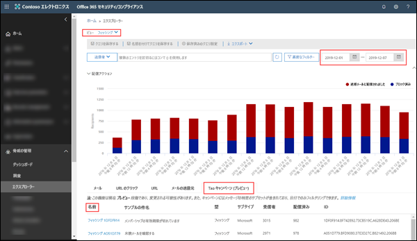
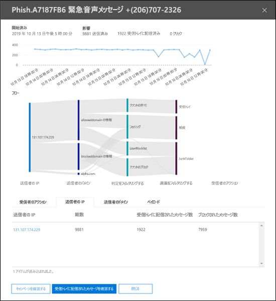
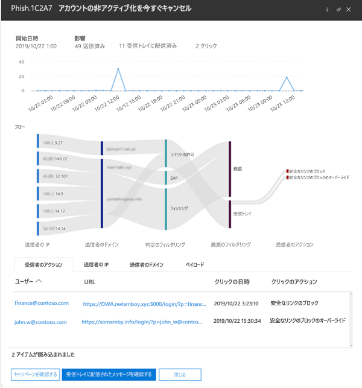

# Office 365 ATP のキャンペーン ビュー

> [!NOTE]
> このトピックで説明する機能は現在プレビュー中であるため、変更される可能性があります。

キャンペーン ビューは、サービスにおけるフィッシング攻撃を特定して分類する、Office 365 セキュリティ/コンプライアンス センターの Advanced Threat Protection (ATP) の機能です。 キャンペーン ビューは、次の目的に使用できます。

- フィッシング攻撃を効率的に調査し、対処する。

- 攻撃対象を正確に理解する。

- 意思決定者に価値を示す。

キャンペーン ビューを使用すると、人間には真似できない速さと完全さで攻撃の全体像を把握できます。

## キャンペーンとは

キャンペーンとは、1 つまたは複数の組織に対する組織的なメール攻撃のことです。 今日、資格情報と企業データを盗み出すメールの攻撃は、収益性の高い大規模なビジネスとなりました。 攻撃を阻止するための技術が向上すると、攻撃をする者は、効果的な攻撃を継続するために、攻撃方法を巧妙に変化させてきます。

Microsoft では、世界中の Office 365 サービス全体におけるフィッシング詐欺対策、スパム対策、マルウェア対策に関する膨大な量のデータと経験を活かして、キャンペーンを特定します。 攻撃の情報は、いくつかの要素に基づいて分析、分類されます。 次に例を示します。

- **攻撃ソース**: ソース IP アドレスと送信者のメール ドメイン。

- **攻撃メッセージのプロパティ**: 攻撃メッセージのコンテンツ、スタイル、語調。

- **攻撃の受信者**: 受信者のドメイン、受信者の職務 (管理者、役員など)、会社の種類 (大企業、中小企業、公的組織、民間組織など)、業界。

- **攻撃ペイロード**: 悪意のあるリンク、添付ファイル、その他のペイロード。

## Office 365 セキュリティ/コンプライアンス センターのキャンペーン ビュー

キャンペーン ビューは[セキュリティ/コンプライアンスセンター](https://docs.microsoft.com/microsoft-365/compliance/go-to-the-securitycompliance-center)から利用でき、次の場所にあります。

- [**脅威の管理**] \> [**エクスプローラー**] \> [**表示**] \> [**フィッシング**] \> [**Top Campaign (Preview) (上位のキャンペーン (プレビュー)**]

- [**脅威の管理**] \> [**エクスプローラー**] \> [**表示**] \> [**すべてのメール**] \> [**Top Campaign (Preview) (上位のキャンペーン (プレビュー)**]

> [!TIP]
> 現在、利用可能なフィルター処理は、日付範囲のみです。 キャンペーンのデータが何も表示されない場合は、日付範囲を変更してみてください。

概要ページには、次のキャンペーンの情報が表示されます。

- [**Name (名前)**]

- [**Sample subject (件名のサンプル)**]: キャンペーンのいずれかのメッセージの件名行。 キャンペーン内の_すべて_のメッセージの件名がこの件名と同じとは限りません。

- [**Type (タイプ)**]: 現在、この値は [**Phish (フィッシング)**] に固定されています。

- [**Subtype (サブタイプ)**]: 提供される場合、このキャンペーンによるフィッシングの攻撃を受けているブランド。 ATP テクノロジによる検出の場合、プレフィックス "**ATP-**" が subtype 値に追加されます。

- [**Recipients (受信者)**]: このキャンペーンの攻撃対象となったユーザーの数。

- [**Delivered (配信済み)**]: このキャンペーンからのメッセージを受信トレイで受信したユーザーの数。

- [**ID**]: キャンペーンの一意の識別子。

キャンペーンの名前をクリックすると、キャンペーンの詳細がポップアップに表示されます。

## キャンペーンの詳細

キャンペーンの詳細ビューでは、次のような、キャンペーンに関する多くの情報が表示されます。

- キャンペーン情報:

  - [**ID**]: 概要画面にあるものと同じ、キャンペーンの一意の識別子。

  - [**Started (開始日)**] と [**Ended (終了日)]**: 選択した日付範囲のフィルター。

  - [**Impact (影響)**]: 選択した日付範囲内に送信されたメッセージの数、受信トレイに配信されたメッセージ数、およびフィッシング メッセージの URL ペイロードをクリックしたユーザーの数。

  - キャンペーン活動のタイムライン: キャンペーンの開始日と終了日、および時間の経過に伴うメッセージの数量。

### キャンペーン フロー

キャンペーンについての重要な説明は、[**Flow**] セクションの水平方向のフロー図 (_Sankey_ ダイアグラムと呼ばれます) に表示されます。 これらの詳細情報は、キャンペーンの要素および組織に与えている可能性のある影響を理解する上で役立ちます。

図内の横方向の帯にマウスのポインターを合わせると、関連するさまざまなメッセージが表示されます (特定のソース IP からのメッセージ、指定した送信者ドメインを使用した、特定のソース IP からのメッセージなど)。

図には、次の情報が含まれます。

- [**Sender IPs (送信者の IP)**]

- [**Sender domains (送信者のドメイン)**]

- [**Filter verdicts (フィルターの判定)**]: [スパム対策メッセージ ヘッダー](anti-spam-message-headers.md)に記載される使用可能なフィッシング詐欺対策とスパム対策フィルターの判定に関連する値。 [**Tenant Allow (テナントによる許可)**] の値に注目します。組織での構成設定により配信が許可されたメッセージのうち、本来はサービスによりブロックされたはずのメッセージのことを指します(例: [Allowed Senders (許可された送信者)] リストに含まれるドメイン)。

  - [**Tenant Block (テナントによるブロック)**]: この値は、組織の設定 (例: [[Blocked Senders list (受信拒否リスト)](create-block-sender-lists-in-office-365.md)] に含まれるドメイン エントリ) によりメッセージの検出と配信された場所の特定の両方が実行されたことを示します。 検疫されなかったメッセージについては、受信拒否の設定を確認し、メッセージが配信された理由を特定します。

  - [**Detected (検出済み)**]

  - [**Tenant Allow (テナントによる許可)**]

- [**Delivery locations (配信場所)**]: 実際に受信者に (受信トレイまたは迷惑メールフォルダーに) 配信されたメッセージについては、メッセージに含まれるペイロード URL をユーザーがクリックしなかった場合でも調査することをお勧めします。 また、検疫されたメッセージは、[Office 365 で検疫されたメッセージ](quarantine-email-messages.md)から削除することもできます。

  - [**Junk folder (迷惑メール フォルダー)**]

  - [**Quarantine (検疫)**]

  - [**Inbox (受信トレイ)**]

#### URL のクリック

受信者の受信トレイまたは迷惑メールフォルダーに送信されたメッセージをユーザーが操作してしまう (つまり、メッセージ内の悪意のある URL をユーザーがクリックしてしまう) 危険はいつでもあります。 ユーザーがクリックしなかった場合はもちろん喜ばしいことですが、有害なメッセージがメールボックスに配信されたそもそもの理由を特定する必要があります。

悪意のある URL をユーザーがクリックした場合、その操作は図の [**URL clicks (URL のクリック)**] 領域に表示されます。

- [**Safe Links Block (安全なリンクによるブロック)**]: この値は、メッセージ内のペイロード URL を受信者がクリックしたものの、組織の [ATP の安全なリンク](atp-safe-links.md) ポリシーにより操作がブロックされたことを示します。

- **Safe Links Block Override (安全なリンクによるブロックの無視)**: この値もまた、メッセージ内のペイロード URL を受信者がクリックし、ATP の安全なリンクにより操作の中止が試行されたことを示しますが、操作がブロックを無視することができたことを示します。 [安全なリンクのポリシー](set-up-atp-safe-links-policies.md) を調査し、ユーザーが安全なリンクの判定を無視して悪意のある URL をクリックすることができた理由を突き止める必要があります。

### タブ

キャンペーンの詳細ビューには複数のタブがあり、キャンペーンを詳しく調査するためにこれらのタブを使用できます。

- [**URL Clicks**]: フィッシング メッセージのペイロード URL がクリックされなかった場合、このセクションは空白になります。 ユーザーが URL をクリックできた場合は、次の情報が表示されます。

  - [**User**\*]

  - [**URL**\*]

  - [**Click Time (クリックの日時)**]

  - [**Click Action (クリックの操作)**]

- [**Sender IPs (送信者の IP)**]

  - [**Sender IP (送信者の IP)**\*]

  - [**Total Count (総数)**]

  - [**Inboxed Count (受信トレイに配信されたメッセージ数)**]

  - [**Blocked Count (ブロックされたメッセージ数)**]

  - [**SPF Passed (SPF 合格)**]

- [**Senders (送信者)**]

  - [**Sender (送信者)**]

  - [**Total Count (総数)**]

  - [**Inboxed Count (受信トレイに配信されたメッセージ数)**]

  - [**Blocked Count (ブロックされたメッセージ数)**]

  - [**DKIM Passed (DKIM 合格)**]

  - [**DMARC Passed (DMARC 合格)**]

- [**Payloads (ペイロード)**]

  - [**URL**\*]

  - [**Total Count (総数)**]

\* この値をクリックすると、指定したアイテム (ユーザー、URL など) についての詳細情報を含む新しいポップアップがキャンペーンの詳細ビューの上に開きます。 キャンペーンの詳細ビューに戻るには、表示されたフライアウトで [**Done (完了)**] をクリックします。

### ボタン

キャンペーンの詳細ビューのボタンを使用すると、脅威エクスプローラーを使用してキャンペーンを詳しく調査できます。

- [**Explore campaign (キャンペーンの調査)**]: **Campaign ID (キャンペーンの ID)** 値を検索フィルターとして使用する新しい脅威エクスプローラーの検索タブが開かれます。

- [**Explore Inbox messages (受信トレイのメッセージを調査)**]: **Campaign ID (キャンペーンの ID)** および **Delivery location: Inbox (配信場所: 受信トレイ)** を検索フィルターとして使用する新しい脅威エクスプローラーの検索タブが開かれます。
