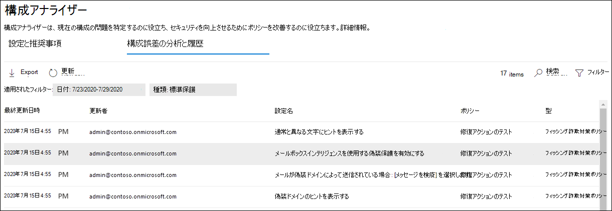

# EOP および Microsoft Defender の保護ポリシー用の構成Office 365

[!INCLUDE [Microsoft 365 Defender rebranding](../includes/microsoft-defender-for-office.md)]

**適用対象**
- [Exchange Online Protection](exchange-online-protection-overview.md)
- [Microsoft Defender for Office 365 プラン 1 およびプラン 2](defender-for-office-365.md)
- [Microsoft 365 Defender](../defender/microsoft-365-defender.md)

Microsoft 365 Defender ポータルの構成アナライザーは、設定が事前設定されたセキュリティ ポリシーの標準保護および厳密な保護プロファイル設定の下にあるセキュリティ ポリシーを見つけて修正するための中心的な場所を[提供します](preset-security-policies.md)。

次の種類のポリシーは、構成アナライザーによって分析されます。

- **Exchange Online Protection (EOP)** ポリシー : これには、Microsoft 365メールボックスを持Exchange Onlineスタンドアロンの EOP 組織が含Exchange Onlineされます。
  - [スパム対策ポリシー](configure-your-spam-filter-policies.md)。
  - [マルウェア対策ポリシー](configure-anti-malware-policies.md)。
  - [EOP フィッシング対策ポリシー](set-up-anti-phishing-policies.md#spoof-settings)。

- **Microsoft Defender for Office 365 ポリシー**: これには、アドオン サブスクリプションの Microsoft 365 E5または Defender をOffice 365組織が含まれます。
  - Microsoft Defender のフィッシング対策ポリシーは、次Office 365含まれます。
    - EOP [フィッシング対策](set-up-anti-phishing-policies.md#spoof-settings) ポリシーで使用できるスプーフィング設定と同じです。
    - [偽装設定](set-up-anti-phishing-policies.md#impersonation-settings-in-anti-phishing-policies-in-microsoft-defender-for-office-365)
    - [高度なフィッシングのしきい値](set-up-anti-phishing-policies.md#advanced-phishing-thresholds-in-anti-phishing-policies-in-microsoft-defender-for-office-365)
  - [安全なリンク ポリシー](set-up-safe-links-policies.md)。
  - [安全な添付ファイル ポリシー](set-up-safe-attachments-policies.md)。

基準として使用される Standard および Strict ポリシー設定の値については、「EOP および Microsoft Defender for [Office 365」を参照してください](recommended-settings-for-eop-and-office365.md)。

## はじめに把握しておくべき情報

- <https://security.microsoft.com> で Microsoft 365 Defender ポータルを開きます。 [構成アナライザー] ページに直接 **移動するには、** を使用します <https://security.microsoft.com/configurationAnalyzer> 。

- Exchange Online PowerShell へ接続するには、「[Exchange Online PowerShell に接続する](/powershell/exchange/connect-to-exchange-online-powershell)」を参照してください。

- この記事の手順を実行するには、Microsoft 365 Defenderポータルでアクセス許可を割り当てる必要があります。
  - 構成アナライザーを使用してセキュリティ ポリシーを更新するには、組織の管理役割グループまたはセキュリティ管理者役割グループの **メンバーである** 必要があります。
  - 構成アナライザーへの読み取り専用アクセスを行うには、**グローバル リーダー** または **セキュリティ リーダー** の役割グループのメンバーである必要があります。

  詳細については、「[Microsoft 365 Defender ポータルのアクセス許可](permissions-microsoft-365-security-center.md)」を参照してください。

  > [!NOTE]
  >
  > - ユーザーを対応する Azure Active Directory ロールに追加すると、ユーザーは Microsoft 365 Defender ポータルで必要なアクセス許可と、Microsoft 365 の他の機能に対するアクセス許可を与Microsoft 365。 詳細については、「[管理者の役割について](../../admin/add-users/about-admin-roles.md)」を参照してください。
  > - [Exchange Online](/Exchange/permissions-exo/permissions-exo#role-groups) の **閲覧専用の組織管理** の役割グループが この機能への読み取り専用アクセス権も付与します。

## ポータルで構成アナライザーをMicrosoft 365 Defenderする

このポータルMicrosoft 365 Defender、[テンプレート ポリシー]セクション&の [&ルール脅威ポリシー構成アナライザー] に \>  \>  \> **移動** します。

[ **構成アナライザー] ページ** には、次の 3 つの主なタブがあります。

- **標準の推奨事項**: 既存のセキュリティ ポリシーと標準の推奨事項を比較します。 設定値を調整して、標準と同じレベルに設定できます。
- **厳密な推奨事項**: 既存のセキュリティ ポリシーと厳密な推奨事項を比較します。 設定値を調整して、Strict と同じレベルに設定できます。
- **構成ドリフト分析と履歴**: ポリシーの変更を時間の流れと監査と追跡。

### 構成アナライザーの [標準の推奨事項] タブと [厳密な推奨事項] タブ

既定では、[標準の推奨事項] タブで **構成アナライザーが開** きます。[厳密な推奨事項] **タブに切り替** えます。設定、レイアウト、およびアクションは、両方のタブで同じです。

![設定アナライザーの [推奨事項] ビューを使用します。](../../media/configuration-analyzer-settings-and-recommendations-view.png)

タブの最初のセクションには、Standard または Strict Protection と比較して、改善が必要なポリシーの種類ごとに設定の数が表示されます。 ポリシーの種類は次のとおりです。

- **スパム対策**
- **フィッシング対策**
- **マルウェア対策**
- **セーフ添付ファイル**(サブスクリプションに Microsoft Defender for Office 365)
- **セーフ リンク**(サブスクリプションに Microsoft Defender for Office 365)

ポリシーの種類と番号が表示されていない場合は、その種類のすべてのポリシーが Standard または Strict Protection の推奨設定を満たします。

タブの残りの部分は、標準または厳密な保護レベルに設定する必要がある設定の表です。 表には、次の列が含まれています。

- **推奨事項**: 標準または厳格な保護プロファイルの設定の値。
- **ポリシー**: 設定を含む影響を受けるポリシーの名前。
- **ポリシー グループ/設定名**: 注意が必要な設定の名前。
- **ポリシーの種類**: スパム対策、フィッシング対策、マルウェア対策、セーフリンク、または添付ファイルセーフします。
- **現在の構成**: 設定の現在の値。
- **最終更新日**: ポリシーが最後に変更された日付。
- **状態**: 通常、この値は **開始ではありません**。

### ポリシー設定を推奨値に変更する

構成アナライザー **の [標準保護]** **タブまたは** [厳密な保護] タブで、表の行を選択します。 次のボタンが表示されます。

- **おすすめを適用する**
- **ポリシーの表示**
- **更新**:

行を選択して [おすすめ **の適用**] をクリックすると、確認ダイアログが表示されます (ダイアログを再び表示しないオプションが表示されます)。 **[OK] をクリックすると**、次のことが発生します。

- この設定は、推奨される値に更新されます。
- [ **推奨事項の適用]** および **[表示] ポリシー** が表示されなくなります ([ **更新]** ボタンだけが残ります)。
- 行 **の Status** 値が [完了] に **変わります**。

行を選択し、[ポリシーの表示] をクリックすると、Microsoft 365 Defender ポータルの影響を受けるポリシーの詳細が表示され、手動で設定を更新できます。

設定を自動的または手動で更新した後、[更新] をクリックして、推奨事項の数を減らして、更新された行を結果から削除します。

### 構成アナライザーの構成ドリフト分析と履歴タブ

このタブでは、セキュリティ ポリシーに加えた変更と、それらの変更が標準設定または厳密な設定と比較される方法を追跡できます。 既定では、次の情報が表示されます。

- **最終更新日時**
- **変更者**
- **設定名**
- **ポリシー**: 影響を受けるポリシーの名前。
- **種類**: スパム対策、フィッシング対策、マルウェア対策、セーフリンク、または添付ファイルセーフします。
- **構成の** 変更 : 設定の古い値と新しい値
- **構成ドリフト**: 推奨される **標準** 設定または **厳密** な設定と比較して、設定のセキュリティの増加または低下を示す値の増減。

結果をフィルター処理するには、**[フィルター]** をクリックします。 表示される **[フィルター]** ポップアップで、次のフィルターから選択できます。

- **開始時刻****と終了時刻**(日付): 今日から 90 日間まで戻って行く場合があります。
- **標準保護または****厳密な保護**

完了したら、**[適用]** をクリックします。

結果をファイルにエクスポートするには、[エクスポート] .csvクリック **します**。

特定の [変更者] **、[** 名前の設定]、または **[種類**] の値で結果をフィルター処理するには、[検索] ボックス **を使用** します。 

