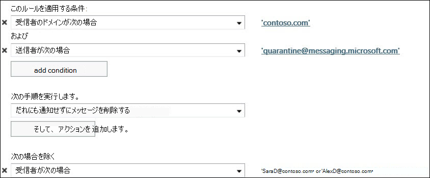

# Exchange Online エンドユーザースパム通知の構成

> [!IMPORTANT]
> このトピックはクラウドでホストされたメールボックスを保護している Exchange Online のお客様を対象としています。 オンプレミスのメールボックスを保護している Exchange Online Protection (EOP) スタンドアロンのお客様は、代わりに次のトピックを参照してください。 [EOP でエンドユーザーのスパム通知を構成](configure-end-user-spam-notifications-in-eop.md)します。 
  
既定の企業全体のスパムフィルターポリシーまたはカスタムスパムフィルターポリシーのエンドユーザースパム通知を構成できます。 エンドユーザーのスパム通知メッセージを有効にすると、ユーザーは各自の検疫済みスパム、バルクメッセージ、およびフィッシングメッセージを管理できます。   
  
エンド ユーザー向けスパム通知は、構成した期間 (1 ～ 15 日の間で指定可能) に、エンド ユーザーが受信したすべてのスパム検疫済みメッセージのリストを含みます。通知メッセージを記述する言語を構成することもできます。
  
通知メッセージを受信すると、エンドユーザーは次のオプションから選択できます。

[**送信者をブロック**する] Office 365 で、受信拒否リストに送信者を追加する場合。

メッセージがスパムではなく、Office 365 がメールボックスにメッセージを送信する場合は、**リリースを解放**します。

プレビューやリリースなどの他のアクションを実行する場合は、セキュリティ & コンプライアンスセンター内の検疫ポータルに移動するように**確認**します。
  
## 始める前に把握しておくべき情報

予想所要時間:2 分
  
「この手順を実行する際には、あらかじめアクセス許可を割り当てる必要があります。 必要なアクセス許可を確認するには、「 [Exchange Online の機能のアクセス許可](https://docs.microsoft.com/exchange/permissions-exo/feature-permissions)」トピックの「スパム対策」のエントリを参照してください。 
  
このトピックの手順に適用されるキーボードショートカットについては、「exchange [Online の exchange 管理センターのキーボードショートカット](https://docs.microsoft.com/Exchange/accessibility/keyboard-shortcuts-in-admin-center)」を参照してください。
  
## EAC を使って、エンド ユーザー向けスパム通知を構成する

1. Exchange 管理センター (EAC) で、 **[保護]** \> **[スパム フィルター]** に移動します。
    
2. エンドユーザーのスパム通知を有効にするスパムフィルターポリシーを選択します (既定では無効になっています)。
    
3. 右側のウィンドウにポリシーに関する概要情報が表示されるので、**[エンド ユーザーのスパム通知の構成]** リンクをクリックします。 
    
4. 以降のダイアログ ボックスで、次のオプションを構成できます。
    
   - **[エンド ユーザーのスパム通知を有効にする]** このポリシーでエンド ユーザーのスパム通知を有効にするには、このチェック ボックスをオンにします。(反対にこのポリシーを有効にすると、このチェック ボックスをオフにすることで、ポリシー用のエンド ユーザーのスパム通知を無効にすることができます。) 
    
   - **エンド ユーザーのスパム通知を～日ごとに送信** エンド ユーザーのスパム通知を送信する頻度を指定します。既定値は 3 日です。1 ～ 15 日の間で指定できます。たとえば 7 日間を指定した場合の通知には、直前の 7 日間のユーザー宛のメッセージのうち、スパム検疫に転送されたすべてのメッセージのリストが含まれます。 
    
   - **通知の言語** ドロップダウン リストを使用して、このポリシーにエンドユーザーのスパム通知の作成に使用する言語を選択します。 
    
   - **[保存]** をクリックします。 エンドユーザーのスパム通知の設定を含む、スパムフィルターポリシー設定の概要が右側のウィンドウに表示されます。
    
> [!NOTE]
>  エンドユーザーのスパム通知は、有効になっているスパムフィルターポリシーに対してのみ機能します。 >  エンド ユーザーの迷惑メールの通知は、1 日 1 回だけ送信されます。 特定のカスタマーについて通知の配信時間を保証することは不可能であり、設定もできません。 
  
 **ヒント:** エンドユーザーのスパム通知を完全に実装する前に限定された一連のユーザーに送信してテストする場合は、ユーザーが存在するドメインに対してエンドユーザーのスパム通知を有効にするカスタムスパムフィルターポリシーを作成します。 次に、EAC の [**メールフロー \>ルール**] で、メールフロールール (トランスポートルールとも呼ばれます) を作成して、通知を受信するユーザーの例外を除き、quarantine@messaging.microsoft.com (通知を送信する電子メールアドレス) からのメッセージをブロックします。 下の図は、Contoso.com ドメインからの 2 人のユーザー (SaraD と AlexD) に対する例外を作成する例です。 
  

  
## SCC を使用してエンドユーザーのスパム通知を構成する

セキュリティ/コンプライアンスセンター (SCC) を使用して、エンドユーザーのスパム通知を構成することもできます。 次の手順を実行します。

1. セキュリティ/コンプライアンスセンターを開き、[**脅威管理** \> **ポリシー** \>のスパム**対策**] に移動するか、 https://protection.office.com/antispam直接リンクを使用します。

2. エンドユーザーのスパム通知を有効にするスパムフィルターポリシーの横にある下矢印をクリックします。

3. [**エンドユーザーのスパム通知の構成**] リンクをクリックします。

4. 以降のダイアログ ボックスで、次のオプションを構成できます。
    
   - **[エンド ユーザーのスパム通知を有効にする]** このポリシーでエンド ユーザーのスパム通知を有効にするには、このチェック ボックスをオンにします。(反対にこのポリシーを有効にすると、このチェック ボックスをオフにすることで、ポリシー用のエンド ユーザーのスパム通知を無効にすることができます。) 
    
   - **エンド ユーザーのスパム通知を～日ごとに送信** エンド ユーザーのスパム通知を送信する頻度を指定します。既定値は 3 日です。1 ～ 15 日の間で指定できます。たとえば 7 日間を指定した場合の通知には、直前の 7 日間のユーザー宛のメッセージのうち、スパム検疫に転送されたすべてのメッセージのリストが含まれます。 
    
   - **通知の言語** ドロップダウン リストを使用して、このポリシーにエンドユーザーのスパム通知の作成に使用する言語を選択します。 
    
   - **[保存]** をクリックします。 エンドユーザーのスパム通知の設定を含む、スパムフィルターポリシー設定の概要がウィンドウに表示されます。

## 詳細情報

[スパム フィルター ポリシーの構成](configure-your-spam-filter-policies.md)
  
