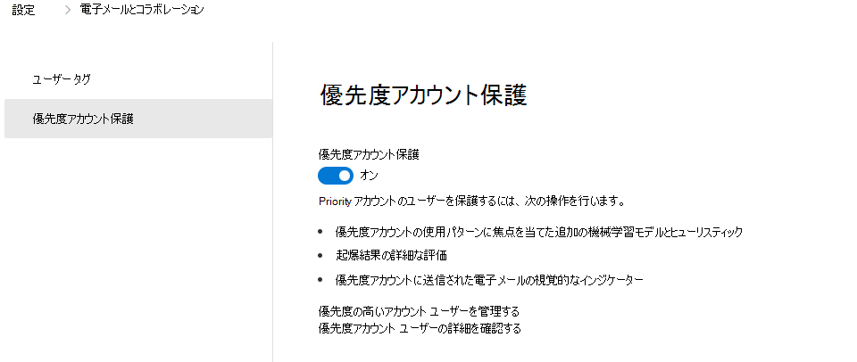
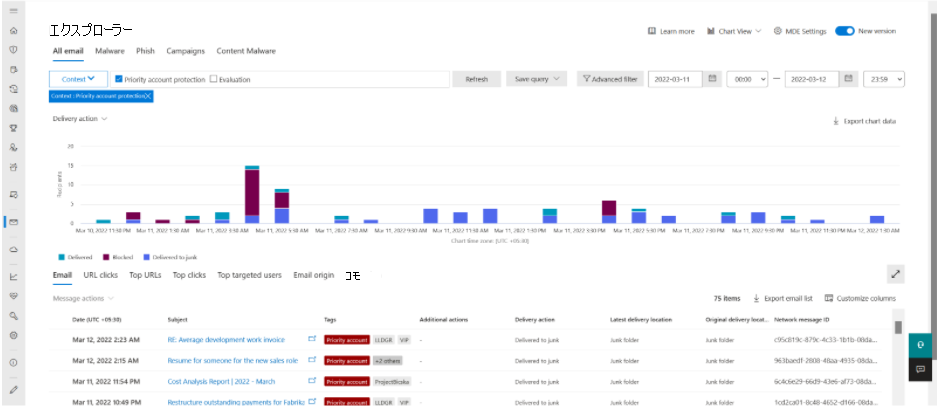

# <a name="configure-and-review-priority-accounts-in-microsoft-defender-for-office-365"></a>Microsoft Defender for Office 365で優先度アカウントを構成して確認する

[!INCLUDE [MDO Trial banner](../includes/mdo-trial-banner.md)]

**適用対象**
- [Microsoft Defender for Office 365 プラン 1 およびプラン 2](defender-for-office-365.md)
- [Microsoft 365 Defender](../defender/microsoft-365-defender.md)

どの組織でも、重要な人物 (エグゼクティブ、リーダー、マネージャー、その他のユーザーなど) が、機密性の高い、独自の、または優先度の高い情報にアクセスできます。 Microsoft Defender for Office 365内でこれらのユーザーに優先度アカウントとしてタグを付けることができます。これにより、セキュリティ チームはこれらの重要な個人に重点を置くことができます。 優先度アカウントの区別された保護により、優先度アカウントとしてタグ付けされたユーザーは、脅威に対するより高いレベルの保護を受けます。

優先度の高いアカウントは、攻撃者の対象となる頻度が高く、一般に、より高度な手法で攻撃されます。 優先度アカウントの差別化された保護は、この特定のユーザー セットに焦点を当て、強化された機械学習モデルを使用してより高いレベルの保護を提供します。 学習とメッセージ処理におけるこの区別は、これらのアカウントに対して最高レベルの保護を提供し、偽陽性率が高いほど、これらのユーザーに悪影響を及ぼす可能性があるため、低い偽陽性率を維持するのに役立ちます。

## <a name="configure-priority-account-protection"></a>優先度アカウント保護を構成する

優先度アカウント保護は、事前に特定された重要なユーザーに対して既定で有効になっています。 ただし、組織のセキュリティ管理者は、次の手順に従って、優先度の高いアカウント保護を有効にすることもできます。

1. Microsoft 365 Defender ポータルの <https://security.microsoft.com>**[設定** \> **メール] &コラボレーション** \> **の優先度アカウント保護** に移動します。 **[優先度アカウント保護**] ページに直接移動するには、 <https://security.microsoft.com/securitysettings/priorityAccountProtection>.

2. [ **優先度アカウント保護** ] ページで、[ **優先度アカウント保護** ( ):::image type="icon" source="../../media/scc-toggle-on.png" border="false"::: を有効にします。

    > [!div class="mx-imgBorder"]
    > 

> [!NOTE]
> 優先度の高いアカウント保護を無効または無効にすることはお勧めしません。

PowerShell Exchange Onlineを使用して優先度アカウント保護を有効にする場合は、次の手順に従います。

1. [Exchange Online PowerShell に接続](/powershell/exchange/connect-to-exchange-online-powershell)し、次のコマンドを実行します。

   ```powershell
   Set-EmailTenantSettings -EnablePriorityAccountProtection $true
   ```

2. 優先度アカウント保護が有効になっていることを確認するには、次のコマンドを実行して EnablePriorityAccountProtection プロパティの値を確認します。

   ```powershell
   Get-EmailTenantSettings | Format-List Identity,EnablePriorityAccountProtection
   ```

   値 True は、優先度アカウント保護が有効になっていることを意味します。 False の値は、優先度アカウント保護がオフになっていることを意味します。

### <a name="assign-the-priority-account-tag-to-users"></a>優先度アカウント タグをユーザーに割り当てる

Microsoft Defender for Office 365は、アラート、レポート、インシデントなどのフィルターとして使用できるタグとして優先度アカウントをサポートしています。

詳細については、「[Microsoft Defender for Office 365 のユーザー タグ](user-tags.md)」を参照してください。

## <a name="review-differentiated-protection-from-priority-account-protection"></a>優先度の高いアカウント保護から区別された保護を確認する

優先度アカウント保護の影響は、次の機能に表示されます。

- [アラート](alerts.md)
- [カスタム アラート ポリシー](../../compliance/alert-policies.md#viewing-alerts)
- [脅威エクスプローラーとリアルタイム検出](threat-explorer.md)
- [侵害されたユーザー レポート](view-email-security-reports.md#compromised-users-report)
- [[メール エンティティ] ページ](mdo-email-entity-page.md#other-innovations)
- [脅威保護の状態レポート](view-email-security-reports.md#threat-protection-status-report)
- [上位の送信者と受信者のレポート](view-email-security-reports.md#top-senders-and-recipients-report)
- [攻撃シミュレーション](attack-simulation-training.md#target-users)
- [キャンペーン ビュー](campaigns.md)
- [管理とユーザーの申請](admin-submission.md)
- [検疫](quarantine.md)

### <a name="threat-protection-status-report"></a>脅威保護の状態レポート

**脅威の保護状態** レポートは、悪意のあるコンテンツと、Microsoft Defender for Office 365によって検出およびブロックされた悪意のある電子メールに関する情報をまとめた 1 つのビューです。

レポートを表示するには、次の手順に従います。

1. Microsoft 365 Defender ポータルの <https://security.microsoft.com>[**レポート** \> **メール] &コラボレーションメール&コラボレーション** \> **レポート**\>に移動し、[**脅威の保護の状態**] を見つけて、[**詳細の表示**] をクリックします。 レポートに直接移動するには、 <https://security.microsoft.com/reports/TPSAggregateReportATP>.

2. 既定のビューは、[ **概要別のデータの表示] です**。 この値をクリックして、次のいずれかの値を選択してビューを変更します。
   - **メール \> フィッシングでデータを表示する**
   - **電子メール \> マルウェアでデータを表示する**
   - **電子メール \> スパムでデータを表示する**

3. [フィルター] アイコンをクリック  **フィルター。**

4. 開いた **[フィルター** ] ポップアップの [ **優先度アカウント** ] セクションで、[ **はい**]、[ **いいえ** ]、または両方の値を選択します。

   

### <a name="threat-explorer"></a>脅威エクスプローラー

脅威エクスプローラー内のコンテキスト フィルターは、優先度アカウント保護がメッセージの検出に関与していた電子メールを検索するのに役立ちます。 これにより、セキュリティ運用チームは、この保護によって提供される値を確認できます。 引き続き、優先度アカウント タグでメッセージをフィルター処理して、特定のユーザー セットのすべてのメッセージを検索できます。

脅威エクスプローラーで追加の保護を表示するには、次の手順に従います。

1. Microsoft 365 Defender ポータルの <https://security.microsoft.com>[**電子メール & コラボレーション** \> エクスプローラー] に移動 **します**。 **脅威エクスプローラー** ページに直接移動するには、<https://security.microsoft.com/threatexplorer>.

2. ドロップダウンから **[コンテキスト** ] を選択し、[ **優先度アカウント保護**] の横にあるチェック ボックスをオンにします。

> [!div class="mx-imgBorder"]
> 

### <a name="email-entity-page"></a>[メール エンティティ] ページ

電子メール エンティティ ページは **、脅威エクスプローラー** で使用できます。 調査するメールの件名を選択します。 そのメールの電子メール ポップアップの上部にゴールド バーが表示されます。 選択すると、新しいページが表示されます。

エンティティ ページの上部にあるタブを使用すると、電子メールを効率的に調査できます。 [ **分析** ] タブをクリックします。[脅威 **の検出の詳細**] に[優先度のアカウント保護]が表示されるようになりました。

## <a name="more-information"></a>詳細情報

- [Microsoft Defender for Office 365のユーザー タグ](user-tags.md)
- [優先アカウントを管理および監視する](../../admin/setup/priority-accounts.md)
