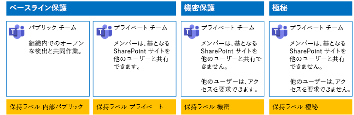
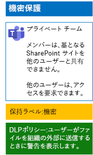
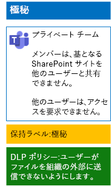

# 保持ラベルと DLP を使用してチーム内のファイルを保護するProtect files in teams with retention labels and DLP

 
ベースライン、機密、および高機密チームと、その基となる SharePoint サイトに対する保持ラベルとデータ損失防止 (DLP) ポリシーを設計し、展開するには、この記事の手順を実行してください。Use the steps in this article to design and deploy retention labels and data loss prevention (DLP) policies for baseline, sensitive, and highly confidential teams and their underlying SharePoint sites. この 3 層の保護の詳細については、「[Microsoft Teams のファイルを保護する](secure-files-in-teams.md)」を参照してください。For more information about these three tiers of protection, see [Secure files in Microsoft Teams](secure-files-in-teams.md).
  
## そのしくみHow this works

1. 目的の保持ラベルを作成して、そのラベルを発行します。Create the desired retention labels and publish these. 発行されるまでに最大 12 時間かかることがあります。It can take up to 12 hours for these to be published.
2. 目的の基となる SharePoint サイトで、ドキュメント ライブラリの設定を編集して、そのライブラリ内のアイテムに目的の保持ラベルを適用します。For the desired underlying SharePoint sites, edit the document library settings to apply the desired retention labels to items in the library.
3. 保持ラベルに基づいてアクションを実行する DLP ポリシーを作成します。Create DLP policies to take action based on the retention labels.

ユーザーが、チームの基となる SharePoint サイトのライブラリにドキュメントを追加すると、そのドキュメントには割り当てられた保持ラベルが既定で付けられます。When users add a document to the underlying SharePoint site library for the team, the document will receive the assigned retention label by default. ユーザーは、このラベルを必要に応じて変更できます。Users can change the label, if needed. ユーザーが組織の外部とドキュメントを共有するときには、DLP によってラベルが割り当てられているかどうかが確認され、そのラベルと DLP ポリシーが一致するとアクションが実行されます。When a user shares a document outside the organization, DLP will check to see if a label is assigned and take action if a DLP policy matches the label. DLP では、クレジット カード番号が含まれているファイルなど、その他のポリシーの一致も確認されます (この種のポリシーが構成されている場合)。DLP will look for other policy matches as well, such as protecting files with credit card numbers if this type of policy is configured. 

## 基となる SharePoint サイトの保持ラベルRetention labels for your underlying SharePoint sites

保持ラベルを作成して、基となる SharePoint サイトに割り当てるためのフェーズは 3 つあります。There are three phases to creating and then assigning retention labels to underlying SharePoint sites.
  
### ステップ 1: 保持ラベルの名前を決定するStep 1: Determine the retention label names

このフェーズでは、基となる SharePoint サイトに適用される情報保護の 4 つのレベルに応じた保持ラベルの名前を決定します。In this phase, you determine the names of your retention labels for the four levels of information protection applied to underlying SharePoint sites. 次の表は、各レベルに推奨される名前の一覧です。The following table lists the recommended names for each level.
  
|**基となる SharePoint サイトの保護レベル****underlying SharePoint sites protection level**|**ラベル名****Label name**|
|:-----|:-----|
|ベースライン - パブリックBaseline-Public    |内部パブリックInternal public    |
|ベースライン - プライベートBaseline-Private    |プライベートPrivate    |
|機密Sensitive    |機密Sensitive    |
|非常に機密性の高い社外秘Highly Confidential    |極秘Highly Confidential    |
   
### ステップ 2: 保持ラベルを作成するStep 2: Create the retention labels

このフェーズでは、情報保護の各レベルに応じて決定したラベルを作成して発行します。In this phase, you create and then publish your determined labels for the different levels of information protection.
  
1. セキュリティ管理者または会社の管理者のロールが付与されたアカウントで [Microsoft 365 コンプライアンス ポータル](https://compliance.microsoft.com)にサインインします。Sign in to the [Microsoft 365 compliance portal](https://compliance.microsoft.com) with an account that has the Security Administrator or Company Administrator role.
    
2. ブラウザーの **[ホーム - Microsoft 365 コンプライアンス]** タブで、**[分類] > [ラベル]** をクリックします。From the **Home - Microsoft 365 compliance** tab of your browser, click **Classifications > Labels**.
    
3. **[保持ラベル] > [ラベルの作成]** をクリックします。Click **Retention labels > Create a label**.
    
4. **[ラベルの名前の設定]** ウィンドウで、ラベルの名前と、管理者およびユーザーの説明を入力して、**[次へ]** をクリックします。On the **Name your label** pane, type the name of the label and a description for admins and users, and then click **Next**.

5. **[ファイル計画の記述子]** ウィンドウで、必要事項を入力してから **[次へ]** をクリックします。On the **File plan descriptors** pane, fill in as needed, and then click **Next**.
    
6. **[ラベルの設定]** ウィンドウで、**[保持]** を **[オン]** にして保持設定を構成します (必要な場合)。On the **Label settings** pane, if needed, set **Retention** to **On** and configure retention settings. **[次へ]** をクリックします。Click **Next**.
    
7. **[設定の確認]** ウィンドウで、**[ラベルを作成する]** をクリックします。On the **Review your settings** pane, click **Create the label**.
    
8. 追加のラベルごとに、**[ラベルの作成]** をクリックして、必要に応じてこの手順のステップ 3 から 7 を繰り返します。For your additional labels, click **Create a label**, and then repeat steps 3-7 in this procedure as needed.
    

### 新しいラベルを発行するPublish your new labels

次は、新しい保持ラベルを発行するために、次に示す手順を使用します。Next, use these steps to publish the new retention labels.
  
1. **[ラベル]** ウィンドウで、**[保持ラベル]** タブをクリックして、**[ラベルの発行]** をクリックします。From the **Labels** pane, click the **Retention labels** tab, and then click **Publish labels**.
    
2. **[発行するラベルの選択]** ウィンドウで、**[発行するラベルの選択]** をクリックします。On the **Choose labels to publish** pane, click **Choose labels to publish**.
    
3. **[ラベルの選択]** ウィンドウで **[追加]** をクリックして、4 つのラベルをすべて選択してから **[追加]** をクリックします。On the **Choose labels** pane, click **Add**, select all four labels, click **Add**.
    
4. [ **完了**] をクリックします。Click **Done**.
    
5. **[発行するラベルを選択]** ウィンドウで、 **[次へ]** をクリックします。On the **Choose labels to publish** pane, click **Next**.
    
6. **[場所の選択]** ウィンドウで、**[次へ]** をクリックします。On the **Choose locations** pane, click **Next**.
    
7. **[ポリシーに名前をつける]** ウィンドウで、**[名前]** にラベルのセットの名前を入力し、**[次へ]** をクリックします。On the **Name your policy** pane, type a name for your set of labels in **Name**, and then click **Next**.
    
8. **[設定の確認]** ウィンドウで、 **[ラベルの発行]** をクリックしてから **[閉じる]** をクリックします。On the **Review your settings** pane, click **Publish labels**, and then click **Close**.

    
### ステップ 3: 基となる SharePoint サイトに保持ラベルを適用するStep 3: Apply the retention labels to your underlying SharePoint sites

次の手順を使用して、基となる SharePoint サイトのドキュメント フォルダーに保持ラベルを適用します。Use these steps to apply the retention labels to the documents folders of your underlying SharePoint sites.
  
1.  チームから **[ファイル]** をクリックし、**[SharePoint で開く]** をクリックします。From the team, click **Files**, and then click **Open in SharePoint**.

2. ブラウザーの新しい SharePoint サイト タブで、**[ドキュメント]** をクリックします。In the new SharePoint site tab of your browser, click **Documents**.
    
3. 設定アイコンをクリックし、**[ライブラリの設定]** をクリックします。Click the settings icon, and then click **Library settings**.
    
4. **[権限と管理]** をクリックして、 **[このライブラリ内の項目にラベルを適用]** をクリックします。Under **Permissions and Management**, click **Apply label to items in this library**.
    
5. **[設定 - ラベルの適用]** で、適切なラベルを選択してから **[保存]** をクリックします。In **Settings-Apply Label**, select the appropriate retention label, and then click **Save**.
    
6. SharePoint サイトのタブを閉じます。Close the tab for the SharePoint site.
    
7. ステップ 1 から 6 を繰り返して、追加の基となる SharePoint サイトに保持ラベルを割り当てます。Repeat steps 1-6 to assign retention labels to your additional underlying SharePoint sites.
    
最終的な構成をここに示します。Here is your resulting configuration.
  

  
## 基となる SharePoint サイトの DLP ポリシーDLP policies for your underlying SharePoint sites

以下の手順で、基となる SharePoint サイト上のドキュメントを組織外と共有するときにユーザーに通知する DLP ポリシーを構成します。Use these steps to configure a DLP policy that notifies users when they share a document on an underlying SharePoint site outside the organization.

1. セキュリティ管理者または社内管理者のロールが付与されたアカウントで [Microsoft 365 コンプライアンス ポータル](https://compliance.microsoft.com/)にサインインします。Sign in to the [Microsoft 365 compliance portal](https://compliance.microsoft.com/) with an account that has the Security Administrator or Company Administrator role.
    
2. ブラウザーの新しい **[Microsoft 365 コンプライアンス]** タブで、**[ポリシー] > [データ損失防止]** をクリックします。On the new **Microsoft 365 compliance** tab in your browser, click **Policies > Data loss prevention**.
    
3. **[ホーム] > [データ損失防止]** ウィンドウで、**[ポリシーの作成]** をクリックします。In the **Home > Data loss prevention** pane, click **Create a policy**.
    
4. **[テンプレートを利用するか、カスタム ポリシーを作成します]** ウィンドウで、**[カスタム]** をクリックしてから **[次へ]** をクリックします。In the **Start with a template or create a custom policy** pane, click **Custom**, and then click **Next**.
    
5. **[ポリシーに名前をつける]** ウィンドウの **[名前]** に機密レベル DLP ポリシーの名前を入力して、**[次へ]** をクリックします。In the **Name your policy** pane, type the name for the sensitive level DLP policy in **Name**, and then click **Next**.
    
6. **[場所の選択]** ウィンドウで、**[特定の場所を選択]** をクリックしてから **[次へ]** をクリックします。In the **Choose locations** pane, click **Let me choose specific locations**, and then click **Next**.
    
7. 場所の一覧で、**[Exchange メール]**、**[OneDrive アカウント]**、および **[Teams のチャットとチャネルのメッセージ]** の場所を無効にして、**[次へ]** をクリックします。In the list of locations, disable the **Exchange email**, **OneDrive accounts**, and **Teams chat and channel messages** locations, and then click **Next**.
    
8. **[保護するコンテンツの種類をカスタマイズする]** ウィンドウで、**[編集]** をクリックします。In the **Customize the type of content you want to protect** pane, click **Edit**.
    
9. **[保護するコンテンツの種類を選ぶ]** ウィンドウのドロップダウン ボックスで **[追加]** をクリックしてから、**[保持ラベル]** をクリックします。In the **Choose the types of content to protect** pane, click **Add** in the drop-down box, and then click **Retention labels**.
    
10. **[保持ラベル]** ウィンドウで、**[追加]** をクリックして **[機密]** ラベルを選択し、**[追加]** をクリックしてから **[完了]** をクリックします。In the **Retention labels** pane, click **Add**, select the **Sensitive** label, click **Add**, and then click **Done**.
    
11. **[保護するコンテンツの種類を選択する]** ウィンドウで、 **[保存]** をクリックします。In the **Choose the types of content to protect** pane, click **Save**.
    
12. **保護するコンテンツの種類をカスタマイズする** ウィンドウで、**[次へ]** をクリックします。In the **Customize the type of content you want to protect** pane, click **Next**.

13. **機密性の高い情報が検出された場合に実行する操作** ウィンドウで、**ヒントと電子メールをカスタマイズする** をクリックします。In the **What do you want to do if we detect sensitive info?** pane, click **Customize the tip and email**.
    
14. **ポリシー ヒントと電子メール通知のカスタマイズ** ウィンドウで、**ポリシー ヒントのテキストをカスタマイズする** をクリックします。In the **Customize policy tips and email notifications** pane, click **Customize the policy tip text**.
    
15. 次のいずれかのヒントをテキスト ボックスに入力するか、貼り付けます。In the text box, type or paste in one of the following tips:
    
  - 組織外のユーザーと共有するには、ファイルをダウンロードしてから開きます。[ファイル]、[文書の保護]、[パスワードを使用して暗号化] の順にクリックし、強力なパスワードを指定します。別の電子メールまたはその他の通信手段でパスワードを送信します。To share with a user outside the organization, download the file and then open it. Click File, then Protect Document, and then Encrypt with Password, and then specify a strong password. Send the password in a separate email or other means of communication.
  - 機密性の高いファイルは、暗号化によって保護されます。IT 部門によってこれらのファイルへのアクセス許可が与えられている外部ユーザーのみが、それらを読み取ることができます。Highly confidential files are protected with encryption. Only external users who are granted permissions to these files by your IT department can read them.
    
    あるいは、ファイルを共有する方法について組織外のユーザーに指示する独自のポリシー ヒントを入力するか、貼り付けます。Alternately, type or paste in your own policy tip that instructs users on how to share a file outside your organization.
    
16. **[OK]** をクリックします。Click **OK**.
    
17. **[機密性の高い情報が検出された場合に実行する操作]** ウィンドウで、**[次へ]** をクリックします。In the **What do you want to do if we detect sensitive info?** pane, click **Next**.
    
18. **[ポリシーを有効にしますか、または最初にテストしますか?]** ウィンドウで、 **[すぐ有効にします]** をクリックし、 **[次へ]** をクリックします。In the **Do you want to turn on the policy or test things out first?** pane, click **Yes, turn it on right away**, and then click **Next**.
    
19. **[設定の確認]** ウィンドウで、**[作成]** をクリックして、**[閉じる]** をクリックします。In the **Review your settings** pane, click **Create**, and then click **Close**.
    
機密チームの最終的な構成をここに示します。Here is your resulting configuration for sensitive teams.
  

  
次に、以下の手順で、基となる SharePoint サイト上のドキュメントを組織外と共有するときにユーザーをブロックする DLP ポリシーを構成します。Next, use these steps to configure a DLP policy that blocks users when they share a document on an underlying SharePoint site outside the organization.
  
1. ブラウザーの新しい **[Microsoft 365 コンプライアンス]** タブで、**[ポリシー] > [データ損失防止]** をクリックします。On the new **Microsoft 365 compliance** tab in your browser, click **Policies > Data loss prevention**.
    
2. **[データ損失防止]** ウィンドウで、**[ポリシーの作成]** をクリックします。In the **Data loss prevention** pane, click **Create a policy**.
    
3. **[テンプレートを使って開始するか、カスタム ポリシーを作成する]** ウィンドウで、 **[カスタム]** をクリックしてから、 **[次へ]** をクリックします。In the **Start with a template or create a custom policy** pane, click **Custom**, and then click **Next**.
    
4. **[ポリシーに名前をつける]** ウィンドウの **[名前]** に高機密レベル DLP ポリシーの名前を入力して、**[次へ]** をクリックします。In the **Name your policy** pane, type the name for the highly sensitive level DLP policy in **Name**, and then click **Next**.
    
5. **[場所の選択]** ウィンドウで、 **[自分で特定の場所を選択する]** をクリックしてから、 **[次へ]** をクリックします。In the **Choose locations** pane, click **Let me choose specific locations**, and then click **Next**.
    
6. 場所の一覧で、**[Exchange メール]**、**[OneDrive アカウント]**、および **[Teams のチャットとチャネルのメッセージ]** の場所を無効にして、**[次へ]** をクリックします。In the list of locations, disable the **Exchange email**, **OneDrive accounts**, and **Teams chat and channel messages** locations, and then click **Next**.
    
7. **[保護する機密情報の種類をカスタマイズする]** ウィンドウで、**[編集]** をクリックします。In the **Customize the types of sensitive info you want to protect** pane, click **Edit**.
    
8. **[保護するコンテンツの種類を選ぶ]** ウィンドウのドロップダウン ボックスで **[追加]** をクリックしてから、**[保持ラベル]** をクリックします。In the **Choose the types of content to protect** pane, click **Add** in the drop-down box, and then click **Retention labels**.
    
9. **[保持ラベル]** ウィンドウで、**[追加]** をクリックして **[高機密]** ラベルを選択し、**[追加]** をクリックしてから **[完了]** をクリックします。In the **Retention labels** pane, click **Add**, select the **Highly Confidential** label, click **Add**, and then click **Done**.
    
10. **[保護するコンテンツの種類を選択する]** ウィンドウで、 **[保存]** をクリックします。In the **Choose the types of content to protect** pane, click **Save**.
    
12. **保護する機密情報の種類のカスタマイズ** ウィンドウで、**[次へ]** をクリックします。In the **Customize the types of sensitive info you want to protect** pane, click **Next**.
    
13. **機密情報が検出された場合の処理** ウィンドウで、**ヒントと電子メールをカスタマイズする** をクリックします。In the **What do you want to do if we detect sensitive info?** pane, click **Customize the tip and email**.
    
14. **ポリシー ヒントと電子メール通知のカスタマイズ** ウィンドウで、**ポリシー ヒントのテキストをカスタマイズする** をクリックします。In the **Customize policy tips and email notifications** pane, click **Customize the policy tip text**.
    
15. 次の内容をテキスト ボックスに入力するか、貼り付けます。In the text box, type or paste in the following:
    
  - 組織外のユーザーと共有するには、ファイルをダウンロードしてから開きます。[ファイル]、[文書の保護]、[パスワードを使用して暗号化] の順にクリックし、強力なパスワードを指定します。別の電子メールまたはその他の通信手段でパスワードを送信します。To share with a user outside the organization, download the file and then open it. Click File, then Protect Document, and then Encrypt with Password, and then specify a strong password. Send the password in a separate email or other means of communication.
    
    あるいは、ファイルを共有する方法について組織外のユーザーに指示する独自のポリシー ヒントを入力するか、貼り付けます。Alternately, type or paste in your own policy tip that instructs users on how to share a file outside your organization.
    
16. **[OK]** をクリックします。Click **OK**.
    
17. **[機密性の高い情報が検出された場合に実行する操作]** ウィンドウで、**[特定の量の機密情報が同時に共有されている場合に検出する]** の下で **[アクセスを制限する、またはコンテンツを暗号化する]** をクリックしてから **[次へ]** をクリックします。In the **What do you want to do if we detect sensitive info?** pane, under **Detect when a specific amount of sensitive info is being shared at one time**, click **Restrict access or encrypt the content**, and then click **Next**.
    
18. **[ポリシーを有効にしますか、または最初にテストしますか?]** ウィンドウで、 **[すぐ有効にします]** をクリックし、 **[次へ]** をクリックします。In the **Do you want to turn on the policy or test things out first?** pane, click **Yes, turn it on right away**, and then click **Next**.
    
19. **[設定の確認]** ウィンドウで、**[作成]** をクリックして、**[閉じる]** をクリックします。In the **Review your settings** pane, click **Create**, and then click **Close**.
    
機密性の高いチームの最終的な構成をここに示します。Here is your resulting configuration for high confidentiality team.
  

  
## 次の手順Next step

[秘密度ラベルを使用してチーム内のファイルを保護するProtect files in teams with sensitivity labels](deploy-teams-sensitivity-labels.md)
    
## 関連項目See Also

[Microsoft Teams のファイルを保護するSecure files in Microsoft Teams](secure-files-in-teams.md)
  
[クラウド導入およびハイブリッド ソリューションCloud adoption and hybrid solutions](https://docs.microsoft.com/office365/enterprise/cloud-adoption-and-hybrid-solutions)

