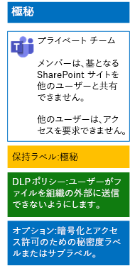

# 機密ラベルを使用してチーム内のファイルを保護するProtect files in teams with sensitivity labels

すべてのユーザーが任意のファイルに適用できる、厳しく規制されたデータの機密ラベルとは異なり、機密性の高いチームでは独自のラベルまたはサブラベルが必要です。それらが割り当てられたファイルは次のようになります。Unlike a sensitivity label for highly regulated data that anyone can apply to any file, a secure team needs its own label or sublabel so that assigned files:

- 個別に暗号化される。Are individually encrypted.
- チームのメンバーのみがファイルを開けるように、カスタムのアクセス許可が含まれる。Contain custom permissions so that only members of the Team Group can open it.

チームの基礎となる SharePoint サイトに保存されているファイルに対してこの追加レベルのセキュリティ保護を行うには、サイト独自のラベル、または厳しく規制されたデータの一般的なラベルのサブラベルのいずれかである、カスタマイズされた機密ラベルを構成する必要があります。To accomplish this additional level of security for files stored in the Team Site, you must configure a new sensitivity label that is either its own label a sublabel of the general label for highly regulated files. ラベルのリストにあるカスタマイズされたラベルまたはサブラベルは、チーム メンバーにのみ表示されます。Only team members will see the customized label or sublabel in their list of labels.

全体での使用と個別のプライベート チームの両方に対して少ない数のラベルが必要な場合は、機密ラベルを使用します。Use a sensitivity label when you need a small number of labels for both global use and individual private teams. 

ラベルを多数使用している場合、または機密性の高いチーム用のラベルを厳しく規制されたラベルの下でまとめる場合は、機密サブラベルを使用します。Use a sensitivity sublabel when you have a large number of labels or want to organize labels for private teams under the highly regulated label.

[こちらの手順](https://docs.microsoft.com/microsoft-365/compliance/encryption-sensitivity-labels)を使用して、別のラベルまたはサブラベルを次の設定で構成します。[Use these instructions](https://docs.microsoft.com/microsoft-365/compliance/encryption-sensitivity-labels) to configure a separate label or a sublabel with the following settings:

- ラベルまたはサブラベルの名前に、チームの名前が含まれているThe name of the label contains the name of the team
- 暗号化が有効になっているEncryption is enabled
- チームの Office 365 グループに、共同作成者のアクセス許可が与えられているThe Office 365 group for the team has Co-Author permissions

作成した後、ユーザーのために新しいラベルまたはサブラベルを発行します。ユーザーは、それらをローカルでチームにアップロードする前、またはチームに保存された後にファイルに適用できます。After creating, publish the new label or sublabel for your users, who can then apply them to files either locally before uploading them to the team or later once the file is stored in the team.

ファイルの暗号化とアクセス許可に機密ラベルを使用する機密性の高いチームの構成は、次のとおりです。Here is the configuration of the highly confidential team that uses sensitivity labels for file encryption and permissions.

## 関連項目See Also

[Microsoft Teams のファイルを保護するSecure files in Microsoft Teams](secure-files-in-teams.md)
  
[クラウド導入およびハイブリッド ソリューションCloud adoption and hybrid solutions](https://docs.microsoft.com/office365/enterprise/cloud-adoption-and-hybrid-solutions)
