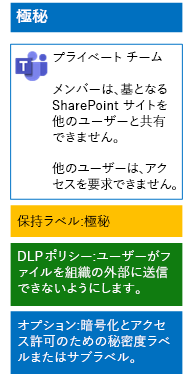

# 機密ラベルを使用してチーム内のファイルを保護する

すべてのユーザーが任意のファイルに適用できる、厳しく規制されたデータの機密ラベルとは異なり、機密性の高いチームでは独自のラベルまたはサブラベルが必要です。それらが割り当てられたファイルは次のようになります。

- 個別に暗号化される。
- チームのメンバーのみがファイルを開けるように、カスタムのアクセス許可が含まれる。

チームの基礎となる SharePoint サイトに保存されているファイルに対してこの追加レベルのセキュリティ保護を行うには、サイト独自のラベル、または厳しく規制されたデータの一般的なラベルのサブラベルのいずれかである、カスタマイズされた機密ラベルを構成する必要があります。 ラベルのリストにあるカスタマイズされたラベルまたはサブラベルは、チーム メンバーにのみ表示されます。

全体での使用と個別のプライベート チームの両方に対して少ない数のラベルが必要な場合は、機密ラベルを使用します。 

ラベルを多数使用している場合、または機密性の高いチーム用のラベルを厳しく規制されたラベルの下でまとめる場合は、機密サブラベルを使用します。

[こちらの手順](https://docs.microsoft.com/microsoft-365/compliance/encryption-sensitivity-labels)を使用して、別のラベルまたはサブラベルを次の設定で構成します。

- ラベルまたはサブラベルの名前に、チームの名前が含まれている
- 暗号化が有効になっている
- チームの Microsoft 365 グループに、共同作成者のアクセス許可が与えられている

作成した後、ユーザーのために新しいラベルまたはサブラベルを発行します。ユーザーは、それらをローカルでチームにアップロードする前、またはチームに保存された後にファイルに適用できます。

ファイルの暗号化とアクセス許可に機密ラベルを使用する機密性の高いチームの構成は、次のとおりです。

## 関連項目

[Microsoft Teams のファイルを保護する](secure-files-in-teams.md)
  
[クラウド導入およびハイブリッド ソリューション](https://docs.microsoft.com/office365/enterprise/cloud-adoption-and-hybrid-solutions)
