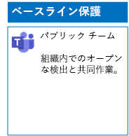
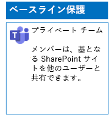
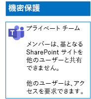
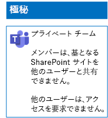

# ファイルの 3 層の保護用にチームを展開する

この記事にある手順を使用して、ベースライン、機密、高機密のチームを設計し、展開します。 この 3 層の保護の詳細については、「[Microsoft Teams のファイルを保護する](secure-files-in-teams.md)」を参照してください。
  
## ベースライン チーム

ベースライン保護には、パブリックとプライベートの両方のチームが含まれます。 パブリック チームは、組織内のだれでも検出およびアクセスできます。 プライベート サイトは、チームと関連付けられた Office 365 グループのメンバーのみが検出とアクセスを行うことができます。 これらのどちらの種類のチームでも、メンバーは他のユーザーとサイトを共有できます。
  
### パブリック

[この記事](https://support.office.com/article/create-a-team-from-scratch-174adf5f-846b-4780-b765-de1a0a737e2b)の手順を実行して、パブリック アクセスとアクセス許可を使用するベースライン チームを作成します。

結果の構成は次のようになります。
  

  
### プライベート

[この記事](https://support.office.com/article/create-a-team-from-scratch-174adf5f-846b-4780-b765-de1a0a737e2b)の手順を実行して、プライベート アクセスとアクセス許可を使用するベースライン チームを作成します。

結果の構成は次のようになります。

  
## 機密性の高いチーム

機密性の高いチームの場合は、まず、[プライベート チームを作成](https://support.office.com//article/create-a-team-from-scratch-174adf5f-846b-4780-b765-de1a0a737e2b)します。

次に、基となる SharePoint サイトを構成して、チーム メンバーによる共有を防ぎます。

1.  チームのツール バーで、**[ファイル]** をクリックします。
2.  省略記号をクリックし、**[SharePoint で開く]** をクリックします。
3.  基となる SharePoint サイトのツールバーで、設定アイコンをクリックしてから、**[サイトの権限]** をクリックします。
4.  **[サイトの権限]** ウィンドウで、**[共有の設定]** の **[共有設定を変更します]** をクリックします。
5.  **[共有アクセス許可]** で、**[サイト所有者のみが、ファイル、フォルダー、およびサイトを共有できます]** を選択して、**[保存]** をクリックします。

結果の構成は次のようになります。
  

 

## 非常に機密性の高いチーム。

非常に機密性の高いチームの場合は、まず、[プライベート チームを作成](https://support.office.com//article/create-a-team-from-scratch-174adf5f-846b-4780-b765-de1a0a737e2b)します。

次に、基となる SharePoint サイトを構成して、チーム メンバーによる共有とチーム メンバー以外からのアクセス要求を防ぎます。

1.  チームのツール バーで、**[ファイル]** をクリックします。
2.  省略記号をクリックし、**[SharePoint で開く]** をクリックします。
3.  基となる SharePoint サイトのツールバーで、設定アイコンをクリックしてから、**[サイトの権限]** をクリックします。
4.  [**サイトの権限**] ウィンドウで、[**共有の設定**] の [**共有設定を変更します**] をクリックします。
5.  [**共有アクセス許可**] で、[**ファイル、フォルダー、およびサイトを共有できるのはサイトの所有者だけです**] を選択します。
6.  [**アクセス要求の許可**] をオフにし、[**保存**] をクリックします。

結果の構成は次のようになります。
  
  
  
## 次の手順

[保持ラベルと DLP を使用してチーム内のファイルを保護する](deploy-teams-retention-DLP.md)

## 関連項目

[Microsoft Teams のファイルを保護する](secure-files-in-teams.md)
  
[クラウド導入およびハイブリッド ソリューション](https://docs.microsoft.com/office365/enterprise/cloud-adoption-and-hybrid-solutions)
