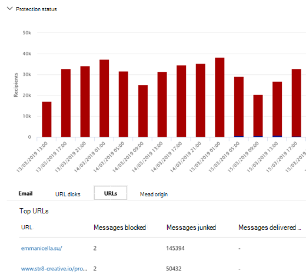

# Microsoft Defender の脅威エクスプローラーを使用した電子メール Office 365

この記事の内容:

- [メールで検出されたマルウェアを表示する](#view-malware-detected-in-email)
- [フィッシング URL を表示し、[評決データ] をクリックする](#view-phishing-url-and-click-verdict-data)
- [自動調査と対応を開始する](#start-automated-investigation-and-response)

> [!NOTE]
> これは、Threat **Explorer (Explorer)** 、電子メール セキュリティ、**エクスプローラー** とリアルタイムの検出 (ツールの違い、操作に必要なアクセス許可など) に関する **3** 記事シリーズの一部です。 このシリーズの他の 2 つの記事は、Threat Explorer と [Threat Explorer](threat-hunting-in-threat-explorer.md) での脅威の検出とリアルタイム [検出です](real-time-detections.md)。

この記事では、セキュリティ機能によって電子メールで検出されたマルウェアやフィッシングの試みを表示および調査するMicrosoft 365説明します。

**適用対象:**

- [Microsoft Defender for Office 365 プラン 1 およびプラン 2](defender-for-office-365.md)
- [Microsoft 365 Defender](../defender/microsoft-365-defender.md)

## メールで検出されたマルウェアを表示する

電子メールで検出されたマルウェアを Microsoft 365 テクノロジで並べ替えた状態 [**で \>**](threat-explorer-views.md#email--malware)表示するには、エクスプローラーの [電子メール マルウェア] ビュー (またはリアルタイム検出) を使用します。 マルウェアは既定のビューなので、エクスプローラーを開いたとすぐに選択される可能性があります。

1. [メール Microsoft 365 Defender] ポータルで、[メール の編集&] に移動し、[エクスプローラー] または [リアルタイム検出] <https://security.microsoft.com> **を選択します**。   ページに直接移動するには、または <https://security.microsoft.com/threatexplorer> を使用します <https://security.microsoft.com/realtimereports> 。

   この例では **、エクスプローラーを使用します**。

   ここから、ビューから開始し、調査する特定のフレーム (必要な場合) を選択し、エクスプローラーのウォークスルーに応じてフィルターを [フォーカスします](threat-hunting-in-threat-explorer.md#threat-explorer-walk-through)。

2. [表示 **] ドロップダウン** リストで、[メール マルウェア] \> **が選択されている** のを確認します。

3. [ **送信者] を** クリックし **、ドロップダウン** リストで \> **[** 基本検出テクノロジ] を選択します。

   :::image type="content" source="../../media/exploreremailmalwaredetectiontech-newimg.png" alt-text="マルウェア検出テクノロジ。":::

   検出テクノロジは、レポートのフィルターとして利用できます。

4. オプションを選択し、[更新] **をクリック** してフィルターを適用します (ブラウザー ウィンドウを更新しない)。

   :::image type="content" source="../../media/exploreremailmalwaredetectiontech2-new.png" alt-text="選択した検出テクノロジ。":::

   レポートが更新され、選択したテクノロジ オプションを使用して、電子メールでマルウェアが検出された結果が表示されます。 ここから、さらに分析を実行できます。

### エクスプローラーでメッセージをクリーンとして報告する

エクスプローラーの [クリーン **レポート]** オプションを使用すると、誤検知としてメッセージを報告できます。 

1. [メール Microsoft 365 Defender] に移動し、& エクスプローラーに移動し、[表示] ドロップダウン リストで[フィッシング] が \> 選択 **されているのを** 確認します。 

2. [メール] タブが表示されているのを確認し、報告されたメッセージの一覧から、クリーンとして報告するメッセージを選択します。 

3. [アクション **] を** クリックしてオプションの一覧を展開します。

4. [新しい申請の開始] セクションに移動するオプションの一覧を下にスクロールし、[クリーンレポート]**を選択します**。 ポップアップが表示されます。

   > [!div class="mx-imgBorder"]
   > ![エクスプローラーで [クリーン レポート] オプションを選択します。](../../media/report-clean-option-explorer.png) 

5. スライダーを On に切り **替えます**。 ドロップダウン リストから、メッセージを削除する日数を指定し、必要に応じてメモを追加し、[送信] を選択 **します**。 

## フィッシング URL を表示し、[評決データ] をクリックする

許可、ブロック、および上書きされた URL の一覧を含む、メール内の URL を介してフィッシング詐欺の試みを表示できます。 クリックされた URL を識別するには、セーフ[リンクを](safe-links.md)構成する必要があります。 [リンク] でクリック[セーフの](set-up-safe-links-policies.md)保護とログ記録を行う場合は、必ずリンク ポリシーをセーフしてください。

1. [メール Microsoft 365 Defender] ポータルで、[メール の編集&] に移動し、[エクスプローラー] または [リアルタイム検出] <https://security.microsoft.com> **を選択します**。   ページに直接移動するには、または <https://security.microsoft.com/threatexplorer> を使用します <https://security.microsoft.com/realtimereports> 。

   この例では **、エクスプローラーを使用します**。

2. [表示] **ドロップダウン リスト** で、[メール フィッシング] **を** \> **選択します**。

   > [!div class="mx-imgBorder"]
   > ![フィッシング コンテキストでエクスプローラーの [表示] メニューを表示します。](../../media/ExplorerViewEmailPhishMenu.png)

3. [**送信者]** をクリックし **、[URL]** ドロップダウン リストで [評 \> 決をクリックする] を選択します。

4. 表示されるオプションで、[ブロック] や [上書きブロック]などの 1 つ以上のオプションを選択し、[更新] **(ブラウザー** ウィンドウを更新しない) をクリックします。

    :::image type="content" source="../../media/threatexploreremailphishclickverdict-new.png" alt-text="URL をクリックし、[評決] をクリックします。":::

   レポートが更新され、レポートの下の [URL] タブに **2** つの異なる URL テーブルが表示されます。

   - **上位 URL は** 、フィルター処理したメッセージ内の URL であり、メール配信アクションは URL ごとにカウントされます。 [フィッシング メール] ビューでは、通常、この一覧には正当な URL が含まれる。 攻撃者は、メッセージに良い URL と悪い URL を組み合わせ、配信を試みているが、悪意のあるリンクをより面白く見せている。 URL のテーブルはメールの総数で並べ替えされますが、この列は非表示に設定され、ビューが簡略化されます。

   - **トップ クリックは**、クリックセーフクリック数で並べ替えたリンクでラップされた URL の一覧です。 ビューを簡略化するために、この列も表示されません。 列別の合計カウントは、クリックセーフ URL の [リンク] クリックの評決カウントを示します。 [フィッシング メール] ビューでは、通常、疑わしい URL または悪意のある URL です。 ただし、このビューには、脅威ではないがフィッシング メッセージに含まれる URL が含まれる可能性があります。 ラップされていないリンクの URL クリックはここに表示されません。

   2 つの URL テーブルには、配信アクションと場所別のフィッシングメール メッセージの上位 URL が表示されます。 この表には、警告にもかかわらずブロックまたはアクセスされた URL クリックが表示されます。そのため、ユーザーに表示された潜在的な不良リンクと、ユーザーがクリックした可能性のあるリンクを確認できます。 ここから、さらに分析を実行できます。 たとえば、グラフの下には、組織の環境でブロックされた電子メール メッセージの上位 URL が表示されます。

   > [!div class="mx-imgBorder"]
   > 

   URL を選択して、詳細な情報を表示します。

   > [!NOTE]
   > [URL の飛び出し] ダイアログ ボックスで、電子メール メッセージのフィルター処理が削除され、環境内での URL の露出の完全なビューが表示されます。 これにより、エクスプローラーで懸念される電子メール メッセージをフィルター処理し、潜在的な脅威である特定の URL を見つけ、エクスプローラー ビュー自体に URL フィルターを追加することなく、([URL の詳細] ダイアログ ボックスを使用して) 環境内の URL 露出に関する理解を広げます。

### クリックの評決の解釈

メールまたは URL のフライアウト、トップ クリック、およびフィルター 処理では、さまざまなクリックの評決値が表示されます。

- **なし:** URL の評決をキャプチャできません。 ユーザーが URL をクリックした可能性があります。
- **許可:** ユーザーは URL への移動を許可されました。
- **ブロック:** ユーザーが URL への移動をブロックされました。
- **保留中の評決:** ユーザーに、削除保留中のページが表示されました。
- **ブロックされたオーバーライド:** ユーザーが URL への直接移動をブロックされました。 ただし、ユーザーはブロックをオーバーロードして URL に移動します。
- **保留中の評決はバイパスされます。** ユーザーには、削除ページが表示されました。 ただし、ユーザーはメッセージをオーバーロードして URL にアクセスします。
- **エラー:** ユーザーにエラー ページが表示されたか、または評決のキャプチャでエラーが発生しました。
- **失敗:** 評決のキャプチャ中に不明な例外が発生しました。 ユーザーが URL をクリックした可能性があります。

## 自動調査と対応を開始する

> [!NOTE]
> 自動調査と対応機能は *、Microsoft Defender* でプラン 2 および Office 365で *Office 365 E5。*

[自動調査と対応により](automated-investigation-response-office.md) 、セキュリティ運用チームがサイバー攻撃の調査と軽減に費やした時間と労力を節約できます。 セキュリティ プレイブックをトリガーできるアラートの構成に加えて、エクスプローラーのビューから自動調査と応答プロセスを開始できます。 詳細については、「例 [: セキュリティ管理者がエクスプローラーから調査をトリガーする」を参照してください](automated-investigation-response-office.md#example-a-security-administrator-triggers-an-investigation-from-threat-explorer)。

## その他の記事

[[電子メール エンティティ] ページでメールを調査する](mdo-email-entity-page.md)
