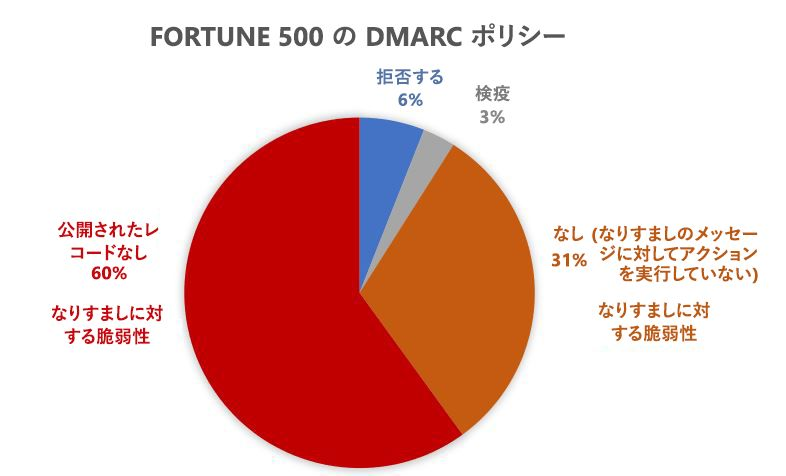

# <a name="email-authentication-in-eop"></a>EOP のメール認証

[!INCLUDE [Microsoft 365 Defender rebranding](../includes/microsoft-defender-for-office.md)]

**適用対象**
- [Exchange Online Protection](exchange-online-protection-overview.md)
- [Microsoft Defender for Office 365 プラン 1 およびプラン 2](defender-for-office-365.md)
- [Microsoft 365 Defender](../defender/microsoft-365-defender.md)

メール認証 (メール検証とも呼ばれます) は、スプーフィング (偽造された差出人からのメール メッセージ) を阻止しようとする標準のグループです。 すべての Microsoft 365 組織では、EOP は次の基準を使用して受信メールを検証します。

- [SPF](set-up-spf-in-office-365-to-help-prevent-spoofing.md)
- [DKIM](use-dkim-to-validate-outbound-email.md)
- [DMARC](use-dmarc-to-validate-email.md)

メール認証では、差出人 (laura@contoso.com など) からのメール メッセージが正当であり、そのメール ドメイン (contoso.com など) の期待される送信元からのものであることを確認します。

この記事の残りの部分では、これらのテクノロジのしくみ、EOP がこれらのテクノロジを使用して受信メールをチェックする方法について説明します。

## <a name="use-email-authentication-to-help-prevent-spoofing"></a>メール認証を使用してスプーフィングを防止する

DMARC では、メッセージの **差出人** アドレスを調べることでスプーフィングを防ぎます。 **差出人** アドレスは、ユーザーが自分のメール クライアントに表示する送信者のメール アドレスです。 また、送信先のメール組織は、メール ドメインが SPF または DKIM をパスしたことを確認できます。 つまり、ドメインは認証されており、送信者のメール アドレスはスプーフィングされていません。

ただし、SPF、DKIM、および DMARC ("電子メール認証ポリシー" とも呼ばれます) の DNS レコードは省略可能です。 microsoft.com や skype.com のような強力なメール認証ポリシーを持つドメインは、スプーフィングから保護されます。 しかし、メール認証ポリシーが脆弱なドメイン、またはまったくポリシーがないドメインは、スプーフィングの主要な標的となります。

2018 年 3 月の時点で、Fortune 500 の企業のうち強力なメール認証ポリシーを公開しているドメインは 9% のみです。 残りの 91% の企業は、攻撃者により、スプーフィングされている可能性があります。 他のメール フィルタリング メカニズムが組み込まれていない場合、これらのドメインの成りすましの装差出人からのメールがユーザーに配信される可能性があります。



中小規模の企業で強力なメール認証ポリシーを公開している割合はさらに少なくなり、北米と西ヨーロッパ以外のメール ドメインでは、その数はさらに少なくなります。

強力なメール認証ポリシーがないことは、大きな問題です。 組織はメール認証のしくみについて理解していない場合がありますが、攻撃者は完全に理解していて、それを利用します。 フィッシングは大きな問題でありながら、強力なメール認証ポリシーの導入は限られているため、Microsoft は受信メールをチェックするために *暗黙的なメール認証* を使用しています。

暗黙的なメール認証は、通常のメール認証ポリシーの拡張機能です。 これらの拡張機能には、送信者評価、送信者の履歴、受信者の履歴、行動分析、他の高度な手法が含まれます。 これらの拡張機能からの他のシグナルが存在しない場合、メール認証ポリシーを使用していないドメインから送信されたメッセージは、スプーフィングとしてマークされます。

Microsoft の一般発表については、「[大量のフィッシング詐欺: 第 2 部 - 強化された Microsoft 365 のスプーフィング対策](https://techcommunity.microsoft.com/t5/Security-Privacy-and-Compliance/Schooling-A-Sea-of-Phish-Part-2-Enhanced-Anti-spoofing/ba-p/176209)」を参照してください。

## <a name="composite-authentication"></a>複合認証

ドメインに従来の SPF、DKIM、および DMARC レコードが含まれていない場合、これらのレコード チェックでは、認証状態に関する情報が十分に伝達されません。 そのため、Microsoft では、暗黙的なメール認証のアルゴリズムを開発しました。 このアルゴリズムは、複数のシグナルを結合して、_複合認証_ (略称: `compauth`) という単一の値にします。 この `compauth` の値は、メッセージ ヘッダーの **Authentication-Results** にスタンプされます。

```text
Authentication-Results:
   compauth=<fail | pass | softpass | none> reason=<yyy>
```

これらの値については、「[Authentication-results メッセージ ヘッダー](anti-spam-message-headers.md#authentication-results-message-header)」で説明しています。

メッセージ ヘッダーを調べることによって、管理者またはエンド ユーザーは、Microsoft 365 が送信者がなりすましであることを判断する方法を確認できます。

## <a name="why-email-authentication-is-not-always-enough-to-stop-spoofing"></a>メール認証がスプーフィングの阻止には不十分なことがある理由

受信メッセージがなりすましであるかどうかを判断するためにメール認証のみに依存すると、次の制限が発生します。

- 送信側ドメインに必要な DNS レコードがないか、レコードが正しく構成されていない可能性があります。

- 送信元ドメインに正しく構成された DNS レコードがありますが、そのドメインが差出人アドレスのドメインと一致しません。 SPF と DKIM には、差出人アドレスで使用するドメインは必要はありません。 攻撃者や合法的サービスは、ドメインを登録したり、ドメインの SPF および DKIM を構成したり、差出人アドレスに完全に異なるドメインを使用したりすることができます。 このドメインの送信者からのメッセージは、SPF および DKIM にパスします。

複合認証は、メール認証チェックに失敗するメッセージをパスさせることで、これらの制限に対処できます。

説明を簡単にするために、次の例では、メール認証の結果に焦点を置いています。他のバックエンド インテリジェンス要因は、メール認証にパスするメッセージをなりすましとして識別したり、メール認証に失敗したメッセージを正当として識別したりする可能性があります。

たとえば、fabrikam.com ドメインには、SPF、DKIM、または DMARC レコードがありません。 fabrikam.com ドメインの送信者からのメッセージは、複合認証に失敗する可能性があります (`compauth` の値と理由に注意してください)。

```text
Authentication-Results: spf=none (sender IP is 10.2.3.4)
  smtp.mailfrom=fabrikam.com; contoso.com; dkim=none
  (message not signed) header.d=none; contoso.com; dmarc=none
  action=none header.from=fabrikam.com; compauth=fail reason=001
From: chris@fabrikam.com
To: michelle@contoso.com
```

fabrikam.com が DKIM レコードなしで SPF を構成する場合、SPF チェックをパスしたドメインは差出人アドレスのドメインと一致しているため、メッセージは複合認証にパスできます。

```text
Authentication-Results: spf=pass (sender IP is 10.2.3.4)
  smtp.mailfrom=fabrikam.com; contoso.com; dkim=none
  (message not signed) header.d=none; contoso.com; dmarc=bestguesspass
  action=none header.from=fabrikam.com; compauth=pass reason=109
From: chris@fabrikam.com
To: michelle@contoso.com
```

fabrikam.com が SPF レコードなしで DKIM レコードを構成する場合、メッセージは複合認証にパスできます。DKIM 署名のドメインは差出人アドレスのドメインと一致しています。

```text
Authentication-Results: spf=none (sender IP is 10.2.3.4)
  smtp.mailfrom=fabrikam.com; contoso.com; dkim=pass
  (signature was verified) header.d=outbound.fabrikam.com;
  contoso.com; dmarc=bestguesspass action=none
  header.from=fabrikam.com; compauth=pass reason=109
From: chris@fabrikam.com
To: michelle@contoso.com
```

SPF または DKIM 署名のドメインが差出人アドレスのドメインと一致しない場合、メッセージは複合認証に失敗する可能性があります。

```text
Authentication-Results: spf=none (sender IP is 192.168.1.8)
  smtp.mailfrom=maliciousdomain.com; contoso.com; dkim=pass
  (signature was verified) header.d=maliciousdomain.com;
  contoso.com; dmarc=none action=none header.from=contoso.com;
  compauth=fail reason=001
From: chris@contoso.com
To: michelle@fabrikam.com
```

## <a name="solutions-for-legitimate-senders-who-are-sending-unauthenticated-email"></a>認証されていないメールを送信している正当な送信者のためのソリューション

Microsoft 365 は、認証されていないメールを組織に送信している送信者を追跡しています。 その送信者がサービスによって正当ではないと判断されると、この送信者からのメッセージは複合認証失敗のマークが付けられます。 この判定を回避するには、このセクションの推奨事項を使用できます。

### <a name="configure-email-authentication-for-domains-you-own"></a>所有しているドメインのメール認証を構成する

この方法は、組織内スプーフィングの解決に使用できます。また、複数のテナントを所有している場合や複数のテナントとやり取りする場合のクロスドメイン スプーフィングの解決にも使用できます。 さらに、Microsoft 365 内の別のユーザー、または別のプロバイダーによりホストされているサード パーティに送信する場合のクロスドメイン スプーフィングを解決する際にも役立ちます。

- ドメインの [SPF レコードを構成します](set-up-spf-in-office-365-to-help-prevent-spoofing.md)。
- プライマリ ドメインの [DKIM レコードを構成します](use-dkim-to-validate-outbound-email.md)。
- 正当な送信者を判断するために、ドメインに [DMARC レコードを設定することを検討します](use-dmarc-to-validate-email.md)。

Microsoft は、SPF、DKIM、および DMARC レコードの詳細な実装ガイドラインを提供しません。 ただし、オンラインで利用できる大量の情報があります。 また、組織がメール認証レコードを設定する際の支援を専門とするサード パーティ企業もあります。

#### <a name="you-dont-know-all-sources-for-your-email"></a>メールのすべての送信元がわからない

多くのドメインは、ドメイン内のメッセージのすべてのメール送信元を認識していないため、SPF レコードを公開しません。 自分が知っているすべてのメール送信元を含む SPF レコード (特に会社のトラフィックがある場所にある) を公開することから始めて、次のニュートラル SPF ポリシー (`?all`) を公開します。 以下に例を示します。

```text
fabrikam.com IN TXT "v=spf1 include:spf.fabrikam.com ?all"
```

この例では、会社のインフラストラクチャからのメールはメール認証にパスしますが、不明な送信元からのメールはニュートラルに戻ります。

Microsoft 365 は、会社のインフラストラクチャからの受信メールを認証済みとして扱います。 不明な送信元からのメールは、暗黙的な認証が失敗した場合は、スプーフィングとしてマークされる可能性があります。 ただし、これは Microsoft 365 によってすべてのメールにスプーフィングのマークが付けられることからの改善に過ぎません。

`?all` の SPF フォールバック ポリシーの使用を開始したら、メッセージのメール送信元を徐々に見つけて含めることができ、より厳しいポリシーを使用して SPF レコードを更新できます。

### <a name="configure-permitted-senders-of-unauthenticated-email"></a>認証されていないメールが許可された送信者を構成する

また、[スプーフィング インテリジェンス](learn-about-spoof-intelligence.md)や[テナントの許可/ブロック リスト](tenant-allow-block-list.md)を使用して、送信者が認証されていないメッセージを組織に送信することを許可することもできます。

外部ドメインの場合、スプーフィングされたユーザーは差出人アドレスのドメインですが、送信側インフラストラクチャは、送信元 IP アドレス (最大 /24 CIDR 範囲に分割)、または逆引き DNS (PTR) レコードの組織ドメインのいずれかになります。

### <a name="create-an-allow-entry-for-the-senderrecipient-pair"></a>送信者/受信者ペアの許可エントリを作成する

スパム フィルタリングをバイパスし、フィッシング フィルタリングの一部をバイパスし、特定の送信者のマルウェア フィルタリングをバイパスしない場合は、「[Microsoft 365 で安全な送信者の一覧を作成する](create-safe-sender-lists-in-office-365.md)」をご覧ください。

### <a name="ask-the-sender-to-configure-email-authentication-for-domains-you-dont-own"></a>所有していないドメインのメール認証を構成するように送信者に依頼する

スパムとフィッシングの問題があるため、Microsoft は、すべてのメール組織にメール認証をお勧めします。 組織の手動オーバーライドを構成する代わりに、送信側ドメインの管理者にメール認証レコードを構成するように依頼できます。

- 過去にメール認証レコードを公開する必要がなかった場合でも、Microsoft にメールを送信する場合は公開する必要があります。

- SPF を設定してドメインの送信側 IP アドレスを公開します。DKIM (使用可能な場合) を設定してメッセージにデジタル署名します。また、DMARC レコードの設定も検討する必要があります。

- 一括送信者を使用してメールを送信する場合は、(アドレスが属する場合) 差出人アドレスのドメインが、SPF または DMARC にパスするドメインに一致していることを確認します。

- 次の場所 (使用している場合) が SPF レコードに含まれていることを確認します。

  - オンプレミスのメールサーバー。
  - SaaS (サービスとしてのソフトウェア) プロバイダーから送信されたメール。
  - クラウドホスティング サービス (Microsoft Azure、GoDaddy、Rackspace、Amazon Web Services など) から送信されたメール。

- ISP によってホストされている小規模なドメインについては、ISP の指示に従って SPF レコードを構成します。

送信側ドメインで認証することは最初は難しい場合もありますが、そのドメインからの電子メールを迷惑メールとして処理したり拒否したりする電子メール フィルターが時間の経過と共に増え続け、適切に配信されるようにするために適切なレコードを設定することになります。 また、それらを参加させることにより、フィッシング対策を行うことができます。また、メールの送信先の組織や組織内のフィッシング詐欺の可能性を減らすことができます。

#### <a name="information-for-infrastructure-providers-isps-esps-or-cloud-hosting-services"></a>インフラストラクチャプ ロバイダー (ISP、ESP、クラウド ホスティング サービス) の情報

ドメインのメールをホストする場合、またはメールを送信できるホスティング インフラストラクチャを提供する場合は、次の手順を実行する必要があります。

- 顧客が SPF レコードを構成する方法について説明するドキュメントを顧客が持っていることを確認する

- 顧客が明示的に設定していない場合でも、送信メールの DKIM 署名に署名することを検討します (既定のドメインで署名)。 DKIM 署名では電子メールに二重署名することもできます (顧客のドメインで設定されている場合に 1 つ目の署名、会社の DKIM 署名で 2 つ目の署名)。

プラットフォームから送信されたメールを認証していても Microsoft への配信が可能であることが保証されるわけではありませんが、少なくとも、認証されていないという理由で Microsoft がそのメールを迷惑メールとして処理することはなくなります。

## <a name="related-links"></a>関連リンク

サービス プロバイダーのベスト プラクティスについては、「[サービス プロバイダー向けの M3AAWG モバイル メッセージングのベスト プラクティス](https://www.m3aawg.org/sites/default/files/m3aawg-mobile-messaging-best-practices-service-providers-2015-08_0.pdf)」を参照してください。

Office 365 が SPF を使用し、DKIM 検証をサポートする方法について説明します。

- [SPF の詳細](how-office-365-uses-spf-to-prevent-spoofing.md)

- [DKIM の詳細](support-for-validation-of-dkim-signed-messages.md)
