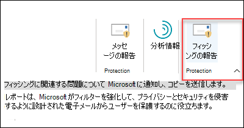
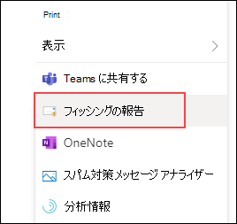

# メッセージのレポートまたはフィッシング アドインのレポートを有効にする

[!INCLUDE [Microsoft 365 Defender rebranding](../includes/microsoft-defender-for-office.md)]

**適用対象**
- [Exchange Online Protection](exchange-online-protection-overview.md)
- [Microsoft Defender for Office 365 プラン 1 およびプラン 2](defender-for-office-365.md)
- [Microsoft 365 Defender](../defender/microsoft-365-defender.md)

> [!NOTE]
> Exchange Onlineメールボックスを持つMicrosoft 365組織の管理者の場合は、Microsoft 365 Defender ポータルの **[申請]** ページを使用することをお勧めします。 詳細については、「 [管理者申請を使用して、疑わしいスパム、フィッシング、URL、およびファイルを Microsoft に送信する」を参照してください](admin-submission.md)。

OutlookおよびOutlook on the web (旧称 Outlook Web App) 用のレポート メッセージおよびレポート フィッシング アドインを使用すると、誤検知 (不適切とマークされた良好なメール) または偽陰性 (不適切なメールが許可されている) を Microsoft とその系列会社に簡単に報告して分析できます。

Microsoft はこれらの提出を使用して、電子メール保護テクノロジの有効性を向上させます。 たとえば、フィッシングレポート アドインを使用して、ユーザーが多数のメッセージを報告しているとします。 この情報は、セキュリティ ダッシュボードとその他のレポートに表示されます。 組織のセキュリティ チームは、フィッシング対策ポリシーを更新する必要があることを示すために、この情報を使用できます。

レポート メッセージまたはレポート フィッシング アドインのいずれかをインストールできます。 ユーザーにスパム メッセージとフィッシング メッセージの両方を報告させる場合は、組織にレポート メッセージ アドインを展開します。

レポート メッセージ アドインには、スパム メッセージとフィッシング メッセージの両方を報告するオプションが用意されています。 管理者は、組織のレポート メッセージ アドインを有効にし、個々のユーザーが自分でインストールできます。

レポート フィッシング アドインには、フィッシング メッセージのみを報告するオプションが用意されています。 管理者は、組織のレポート フィッシング アドインを有効にし、個々のユーザーが自分でインストールできます。

個々のユーザーの場合は、両方のアドインを自分で有効にできます。

グローバル管理者またはExchange Online管理者であり、OAuth 認証を使用するようにExchangeが構成されている場合は、組織のレポート メッセージ アドインとレポート フィッシング アドインを有効にすることができます。 両方のアドインは、 [一元展開](../../admin/manage/centralized-deployment-of-add-ins.md)を通じて利用できるようになりました。

## はじめに把握しておくべき情報

- レポート メッセージ アドインとレポート フィッシング アドインの両方が、ほとんどのMicrosoft 365 サブスクリプションと次の製品で機能します。
  - Outlook on the web
  - Outlook 2013 SP1 以降
  - Outlook 2016 for Mac
  - Enterprise用のMicrosoft 365 アプリに含まれるOutlook
  - iOS と Android 用のOutlook アプリ

- 両方のアドインは、共有メールボックスでは使用できません。

- どちらのアドインも、オンプレミスのExchangeメールボックスでは使用できません。 

- 既存の Web ブラウザーは、レポート メッセージ アドインとレポート フィッシング アドインの両方で動作する必要があります。ただし、アドインが使用できない、または期待どおりに動作していない場合は、別のブラウザーを試してください。

- 組織のインストールでは、OAuth 認証を使用するように組織を構成する必要があります。 詳細については、「アドイン [の一元展開が組織で機能するかどうかを確認する」を参照してください](../../admin/manage/centralized-deployment-of-add-ins.md)。

- 管理者は、グローバル管理者ロール グループのメンバーである必要があります。 詳細については、「[Microsoft 365 Defender ポータルのアクセス許可](permissions-microsoft-365-security-center.md)」を参照してください。

- レポート メッセージ機能を使用してメッセージを報告する方法の詳細については、「[Outlookで誤検知と誤検知を報告する](report-false-positives-and-false-negatives.md)」を参照してください。

- URL フィルター処理やセキュリティ ソリューション (プロキシやファイアウォールなど) が整っている組織では、HTTPS プロトコルでアクセスできる ipagave.azurewebsites.net と outlook.office.com エンドポイントが必要です。

## レポート メッセージ アドインを取得する

### レポート メッセージ アドインを自分で取得する

1. Microsoft AppSource <https://appsource.microsoft.com/marketplace/apps> に移動し、レポート メッセージ アドインを検索します。 レポート メッセージ アドインに直接移動 <https://appsource.microsoft.com/product/office/wa104381180>するには、 .

2. [ **今すぐ入手]** をクリックします。

   :::image type="content" source="../../media/ReportMessageGETITNOW.png" alt-text="Get It Now レポート メッセージ" lightbox="../../media/ReportMessageGETITNOW.png":::

3. 表示されるダイアログで、使用条件とプライバシー ポリシーを確認し、[ **続行**] をクリックします。

4. 職場または学校のアカウント (業務用) または Microsoft アカウント (個人用) を使用してサインインします。

アドインをインストールして有効にすると、次のアイコンが表示されます。

- Outlookでは、アイコンは次のようになります。

    > [!div class="mx-imgBorder"]
    > :::image type="content" source="../../media/OutlookReportMessageIcon.png" alt-text="Outlookのレポート メッセージ アドイン アイコン" lightbox="../../media/OutlookReportMessageIcon.png":::

- Outlook on the webでは、アイコンは次のようになります。

    > [!div class="mx-imgBorder"]
    > 

### 組織のレポート メッセージ アドインを取得する

> [!NOTE]
> アドインが組織内に表示されるまでに最大で 12 時間かかる場合があります。

1. [Microsoft 365 管理センター](https://admin.microsoft.com/AdminPortal/Home?#/homepage)で、**統合アプリ****の設定**\>に移動します。 [ **アプリの取得**] をクリックします。

    > [!div class="mx-imgBorder"]
    > :::image type="content" source="../../media/microsoft-365-admin-center-integrated-apps.png" alt-text="Microsoft 365 管理センター統合アプリ" lightbox="../../media/microsoft-365-admin-center-integrated-apps.png":::

2. 表示 **された [Microsoft 365 Apps**] ページで、[**検索**] ボックスをクリックし、「**レポート メッセージ」** と入力して、[**検索**![] アイコンをクリックします](../../media/search-icon.png)。 結果の一覧で、 **レポート メッセージ** を見つけて選択します。 

3. アプリの詳細ページが開きます。 [ **今すぐ取得]** を選択します。 

    > [!div class="mx-imgBorder"]
    > :::image type="content" source="../../media/microsoft-365-admin-center-report-message.png" alt-text="レポート メッセージ アドイン" lightbox="../../media/microsoft-365-admin-center-report-message.png":::

4. 基本的なプロファイル情報を入力し、[ **続行**] をクリックします。 

    > [!div class="mx-imgBorder"]
    > :::image type="content" source="../../media/microsoft-365-admin-center-profile-info.png" alt-text="レポート メッセージ アドイン プロファイルの設定" lightbox="../../media/microsoft-365-admin-center-profile-info.png":::

5. **[新しいアプリのデプロイ]** ポップアップが開きます。 次の設定を構成します。 [ **次へ** ] をクリックして次のページに移動し、セットアップを完了します。 

   - **ユーザーを追加** する: 次のいずれかの値を選択します。
     - **私だけです**
     - **組織全体**
     - **特定のユーザー/グループ**

   - **デプロイ**:
     - **アクセス許可要求を受け入れる**: 次のページに進む前に、アプリのアクセス許可と機能を注意深く読み取ります。

        > [!div class="mx-imgBorder"]
        > :::image type="content" source="../../media/microsoft-365-admin-center-deploy-new-app.png" alt-text="[アクセス許可要求の承諾] ページ" lightbox="../../media/microsoft-365-admin-center-deploy-new-app.png":::

     - **デプロイを完了する**: アドインのデプロイを確認して完了します。 
     - **デプロイが完了しました**: [ **完了]** を選択してセットアップを完了します。 

        > [!div class="mx-imgBorder"]
        > :::image type="content" source="../../media/microsoft-365-admin-center-deployment-complete.png" alt-text="デプロイが完了したという通知メッセージ" lightbox="../../media/microsoft-365-admin-center-deployment-complete.png":::

## レポート メッセージ アドインの設定を編集する

1. Microsoft 365 管理センターで、**統合アプリ****の設定**\>に移動します \. 次に、 **レポート メッセージ** アドインを見つけて選択します。

2. 表示されるポップアップで、[ **ユーザーの編集]** を選択してユーザー設定を編集します。

    > [!div class="mx-imgBorder"]
    > :::image type="content" source="../../media/microsoft-365-admin-center-report-message-edit.png" alt-text="レポート メッセージポップアップ" lightbox="../../media/microsoft-365-admin-center-report-message-edit.png":::

3. アドインを削除するには、同じポップアップの **[アクション]** で [**アプリの削除**] を選択します。 

## レポート フィッシング アドインを取得する

### レポート フィッシング アドインを自分で入手する

1. Microsoft AppSource に <https://appsource.microsoft.com/marketplace/apps> 移動し、レポート フィッシング アドインを検索します。

2. [ **今すぐ入手]** をクリックします。

3. 表示されるダイアログで、使用条件とプライバシー ポリシーを確認し、[ **続行**] をクリックします。

4. 職場または学校のアカウント (業務用) または Microsoft アカウント (個人用) を使用してサインインします。

アドインをインストールして有効にすると、次のアイコンが表示されます。

- Outlookでは、アイコンは次のようになります。

  

- Outlook on the webでは、アイコンは次のようになります。

    > [!div class="mx-imgBorder"]
    > 

### 組織のレポート フィッシング アドインを取得する

> [!NOTE]
> アドインが組織内に表示されるまでに最大で 12 時間かかる場合があります。

1. [Microsoft 365 管理センター](https://admin.microsoft.com/AdminPortal/Home?#/homepage)で、**統合アプリ****の設定**\>に移動します。 [ **アプリの取得**] をクリックします。

    > [!div class="mx-imgBorder"]
    > :::image type="content" source="../../media/microsoft-365-admin-center-integrated-apps.png" alt-text="Microsoft 365 管理センター統合アプリ" lightbox="../../media/microsoft-365-admin-center-integrated-apps.png":::

2. 表示された **[Microsoft 365 Apps**] ページで、[**検索**] ボックスをクリックし、「**フィッシング詐欺の報告」** と入力して、[**検索]** 。 結果の一覧で、 **フィッシングの報告** を見つけて選択します。 
 
3. アプリの詳細ページが開きます。 [ **今すぐ取得]** を選択します。

4. 基本的なプロファイル情報を入力し、[ **続行**] をクリックします。

5. **[新しいアプリのデプロイ]** ポップアップが開きます。 セットアップを完了するには、 [上記](enable-the-report-message-add-in.md#get-the-report-message-add-in-for-your-organization) の手順に従います。 

## レポート フィッシング アドインの設定を編集する

1. Microsoft 365 管理センターで、**統合アプリ****の設定**\>に移動します \. 次に、 **フィッシング報告アドインを** 見つけて選択します。

2. 表示されるポップアップで、[ **ユーザーの編集]** を選択してユーザー設定を編集します。

    > [!div class="mx-imgBorder"]
    > :::image type="content" source="../../media/microsoft-365-admin-center-report-phishing-edit.png" alt-text="レポート フィッシングのポップアップ" lightbox="../../media/microsoft-365-admin-center-report-phishing-edit.png":::

3. アドインを削除するには、同じポップアップの **[アクション]** で [**アプリの削除**] を選択します。 
