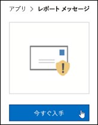
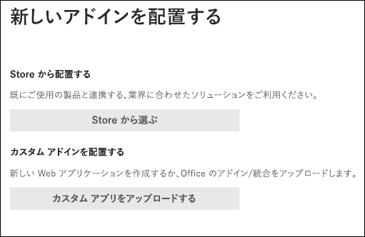
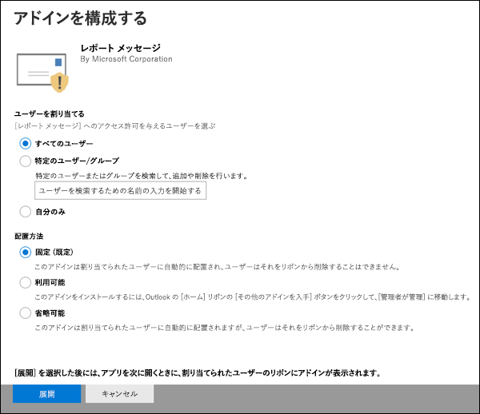
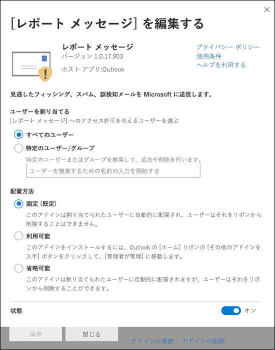

# レポート メッセージまたはレポートフィッシング アドインを有効にする

[!INCLUDE [Microsoft 365 Defender rebranding](../includes/microsoft-defender-for-office.md)]

**適用対象**
- [Exchange Online Protection](exchange-online-protection-overview.md)
- [Microsoft Defender for Office 365 プラン 1 およびプラン 2](defender-for-office-365.md)
- [Microsoft 365 Defender](../defender/microsoft-365-defender.md)

> [!NOTE]
> 組織の管理者が Microsoft 365 メールボックスExchange Onlineしている場合は、Microsoft 365 Defender ポータルの [申請] ページを使用することをお勧めします。 詳細については、「管理申請を [使用して疑わしいスパム、フィッシング、URL、](admin-submission.md)ファイルを Microsoft に提出する」を参照してください。

Outlook および Outlook on the web (以前は Outlook Web App と呼ばれる) のレポート メッセージとレポートフィッシング アドインを使用すると、ユーザーは誤検知 (悪いマークが付いた良いメール) または誤検知 (悪いメールが許可されている) を Microsoft とその関連会社に簡単に報告して分析できます。

Microsoft では、これらの申請を使用して、電子メール保護テクノロジの有効性を向上します。 たとえば、ユーザーがレポート フィッシング アドインを使用して多くのメッセージを報告するとします。 この情報は、セキュリティ ダッシュボードや他のレポートに表示されます。 組織のセキュリティ チームは、この情報をフィッシング対策ポリシーを更新する必要がある可能性を示す指標として使用できます。

[レポート メッセージ] アドインまたは [レポート フィッシング] アドインをインストールできます。 ユーザーがスパム メッセージとフィッシング メッセージの両方を報告する場合は、組織にレポート メッセージ アドインを展開します。 詳細については、「レポート メッセージ アドインを有効にする」を参照してください。

レポート メッセージ アドインには、スパム メッセージとフィッシング メッセージの両方を報告するオプションがあります。 管理者は、組織のレポート メッセージ アドインを有効にし、個々のユーザーが自分でインストールできます。

[フィッシングの報告] アドインには、フィッシング メッセージのみを報告するオプションがあります。 管理者は組織のレポート フィッシング アドインを有効にし、個々のユーザーが自分でインストールできます。

個々のユーザーの場合は、両方のアドインを自分で有効にできます。

グローバル管理者または Exchange Online 管理者で、Exchange が OAuth 認証を使用するように構成されている場合は、組織のレポート メッセージ アドインとレポート フィッシング アドインを有効にできます。 どちらのアドインも、集中展開を [通じて利用できます](../../admin/manage/centralized-deployment-of-add-ins.md)。

## はじめに把握しておくべき情報

- レポート メッセージ アドインとレポート フィッシング アドインの両方が、ほとんどのサブスクリプションおよびMicrosoft 365製品で動作します。
  - Outlook on the web
  - Outlook 2013 SP1 以降
  - Outlook 2016 for Mac
  - OutlookアプリにMicrosoft 365含まれているEnterprise
  - Outlook iOS と Android 用のアプリ

- 両方のアドインは、オンプレミスおよび組織の共有メールボックスまたはメールボックスExchangeできません。

- 既存の Web ブラウザーは、レポート メッセージ アドインとレポート フィッシング アドインの両方で動作する必要があります。ただし、アドインが使用できないか、期待通り動作していない場合は、別のブラウザーを試してください。

- 組織のインストールでは、OAuth 認証を使用するように組織を構成する必要があります。 詳細については、「アドインの集中展開が組織で機能するかどうかを判断する」 [を参照してください](../../admin/manage/centralized-deployment-of-add-ins.md)。

- 管理者は、グローバル管理者役割グループのメンバーである必要があります。 詳細については、「[Microsoft 365 Defender ポータルのアクセス許可](permissions-microsoft-365-security-center.md)」を参照してください。

- レポート メッセージ機能を使用してメッセージを報告する方法の詳細については、「レポートで誤検知と誤検知を報告する」[を参照](report-false-positives-and-false-negatives.md)Outlook。

- URL フィルターまたはセキュリティ ソリューション (Proxy や FireWall など) が実装されている組織では、HTTPS プロトコルで ipagave.azurewebsites.net エンドポイントと outlook.office.com エンドポイントにアクセスできる必要があります。

> [!IMPORTANT]
> ユーザー申請ポリシーを使用できないので、Outlookの組み込みレポート エクスペリエンス[はお勧めしません](./user-submission.md)。 代わりに、レポート メッセージ アドインまたはレポート フィッシング アドインを使用することをお勧めします。

## レポート メッセージ アドインの取得

### 自分でレポート メッセージ アドインを取得する

1. [Microsoft AppSource] に移動し <https://appsource.microsoft.com/marketplace/apps> 、レポート メッセージ アドインを検索します。 レポート メッセージ アドインに直接移動するには、に移動します <https://appsource.microsoft.com/product/office/wa104381180> 。

2. [今 **すぐ取得] をクリックします**。

   

3. 表示されるダイアログで、使用条件とプライバシー ポリシーを確認し、[続行] を **クリックします**。

4. 仕事用または学校用のアカウント (ビジネス用) または Microsoft アカウント (個人用) を使用してサインインします。

アドインをインストールして有効にすると、次のアイコンが表示されます。

- このOutlookアイコンは次のように表示されます。

  > [!div class="mx-imgBorder"]
  > ![[レポート メッセージ] アドインのアイコン (Outlook)。](../../media/OutlookReportMessageIcon.png)

- このOutlook on the webアイコンは次のように表示されます。

  > [!div class="mx-imgBorder"]
  > ![Outlook on the web[レポート メッセージ] アドイン アイコン。](../../media/owa-report-message-icon.png)

### 組織のレポート メッセージ アドインを取得する

> [!NOTE]
> アドインが組織に表示するには、最大で 12 時間かかる場合があります。

1. [アドインMicrosoft 365 管理センター] の \> **[設定] ページに移動** します <https://admin.microsoft.com/AdminPortal/Home#/Settings/AddIns> 。 アドイン ページが表示しない場合は、[統合アプリ] ページの上部にある [設定 統合アプリ アドイン] リンク \>  \> **に移動** します。

2. ページ **の上部にある [アドインの** 展開] を選択し、[次へ] を **選択します**。

   ![[サービスとアドイン] ページは、Microsoft 365 管理センター。](../../media/ServicesAddInsPageNewM365AdminCenter.png)

3. 表示される **[新しいアドインの展開]** フライアウトで、情報を確認し、[次へ] を **クリックします**。

4. 次のページで、[ストアから **選択] をクリックします**。

   

5. 表示される **[アドインの選択**] ページで、[検索]ボックスをクリックし、[レポート メッセージ] と入力し、[検索検索] アイコン **を**  。 結果の一覧で、[レポート メッセージ] **を探し、[** 追加] を **クリックします**。

   ![[アドインの検索結果] を選択します。](../../media/NewAddInScreen3.png)

6. 表示されるダイアログで、ライセンスとプライバシー情報を確認し、[続行] を **クリックします**。

7. 表示される **[アドインの構成]** ページで、次の設定を構成します。

   - **割り当てられたユーザー**: 次のいずれかの値を選択します。
     - **すべてのユーザー** (既定)
     - **特定のユーザー/グループ**
     - **私だけです**

   - **展開方法**: 次のいずれかの値を選択します。
     - **固定 (既定)**: 指定したユーザーにアドインが自動的に展開され、削除できない。
     - **利用可能**: ユーザーは、ホーム アドイン \> **の取得** 管理でアドイン \> **をインストールできます**。
     - **オプション**: アドインは指定したユーザーに自動的に展開されますが、削除を選択できます。

   

   完了したら、[展開] を **クリックします**。

8. 表示される **[レポート メッセージの展開** ] ページに、進行状況レポートが表示され、その後にアドインが展開されたという確認が表示されます。 情報を読んだら、[次へ] を **クリックします**。

   ![[レポート メッセージの展開] ページ。](../../media/deploy-report-message-page.png)

9. 表示される **[アドインのアナウンス] ページ** で、情報を確認し、[閉じる] を **クリックします**。

   ![[アドインのアナウンス] ページ。](../../media/announce-add-in-page.png)

## レポート メッセージ アドインの設定を確認または編集する

1. [Microsoft 365 管理センター] で、[アドイン] ページの \> **[設定] に移動** します <https://admin.microsoft.com/AdminPortal/Home#/Settings/AddIns> 。 アドイン ページが表示しない場合は、[統合アプリ] ページの上部にある [設定 統合アプリ アドイン] リンク \>  \> **に移動** します。

   ![新しいAdd-Insセンターの [サービスとMicrosoft 365 管理] ページ。](../../media/ServicesAddInsPageNewM365AdminCenter.png)

2. レポート メッセージ アドインを **検索して** 選択します。

3. 表示される **[レポート メッセージの編集** ] フライアウトで、組織に合った設定を確認および編集します。 完了したら、**[保存]** をクリックします。

   

## レポートフィッシング アドインを取得する

### 自分でレポートフィッシング アドインを取得する

1. [Microsoft AppSource] に移動し、レポートフィッシング <https://appsource.microsoft.com/marketplace/apps> アドインを検索します。

2. [今 **すぐ取得] をクリックします**。

3. 表示されるダイアログで、使用条件とプライバシー ポリシーを確認し、[続行] を **クリックします**。

4. 仕事用または学校用のアカウント (ビジネス用) または Microsoft アカウント (個人用) を使用してサインインします。

アドインをインストールして有効にすると、次のアイコンが表示されます。

- このOutlookアイコンは次のように表示されます。

  ![[フィッシング アドインのレポート] アイコン (Outlook)。](../../media/Outlook-ReportPhishing.png)

- このOutlook on the webアイコンは次のように表示されます。

  > [!div class="mx-imgBorder"]
  > ![Outlook on the web[フィッシング アドインのレポート] アイコン。](../../media/OWA-ReportPhishing.png)

### 組織のレポート フィッシング アドインを取得する

> [!NOTE]
> アドインが組織に表示するには、最大で 12 時間かかる場合があります。

1. [Microsoft 365 管理センター] で、[アドイン] ページの \> **[設定] に移動** します <https://admin.microsoft.com/AdminPortal/Home#/Settings/AddIns> 。 アドイン ページが表示しない場合は、[統合アプリ] ページの上部にある [設定 統合アプリ アドイン] リンク \>  \> **に移動** します。

2. ページ **の上部にある [アドインの** 展開] を選択し、[次へ] を **選択します**。

   ![[サービスとアドイン] ページは、Microsoft 365 管理センター。](../../media/ServicesAddInsPageNewM365AdminCenter.png)

3. 表示される **[新しいアドインの展開]** フライアウトで、情報を確認し、[次へ] を **クリックします**。

4. 次のページで、[ストアから **選択] をクリックします**。

   

5. 表示される **[アドインの選択**] ページで、[検索]ボックスをクリックし、[レポートフィッシング] と入力し、[検索検索] アイコン **を**  。 結果の一覧で[レポートフィッシング] **を探し、[** 追加] を **クリックします**。

6. 表示されるダイアログで、ライセンスとプライバシー情報を確認し、[続行] を **クリックします**。

7. 表示される **[アドインの構成]** ページで、次の設定を構成します。

   - **割り当てられたユーザー**: 次のいずれかの値を選択します。
     - **すべてのユーザー** (既定)
     - **特定のユーザー/グループ**
     - **私だけです**

   - **展開方法**: 次のいずれかの値を選択します。
     - **固定 (既定)**: 指定したユーザーにアドインが自動的に展開され、削除できない。
     - **利用可能**: ユーザーは、ホーム アドイン \> **の取得** 管理でアドイン \> **をインストールできます**。
     - **オプション**: アドインは指定したユーザーに自動的に展開されますが、削除を選択できます。

   完了したら、[展開] を **クリックします**。

8. 表示される **[レポートフィッシングの** 展開] ページに、進行状況レポートが表示され、その後にアドインが展開されたという確認が表示されます。 情報を読んだら、[次へ] を **クリックします**。

9. 表示される **[アドインのアナウンス] ページ** で、情報を確認し、[閉じる] を **クリックします**。

## レポートフィッシング アドインの設定を確認または編集する

1. [Microsoft 365 管理センター] で、[アドイン] ページの \> **[設定] に移動** します <https://admin.microsoft.com/AdminPortal/Home#/Settings/AddIns> 。 アドイン ページが表示しない場合は、[統合アプリ] ページの上部にある [設定 統合アプリ アドイン] リンク \>  \> **に移動** します。

2. [フィッシング のレポート] **アドインを検索して** 選択します。

3. 組織に **合った設定を** 表示、確認、および編集する [レポートのフィッシングの編集] フライアウトで行います。 完了したら、 **[保存]** をクリックします。
