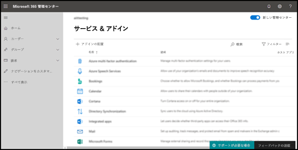

# レポート メッセージ アドインを有効にするEnable the Report Message add-in

[!INCLUDE [Microsoft 365 Defender rebranding](../includes/microsoft-defender-for-office.md)]

> [!NOTE]
> Microsoft 365 組織の Exchange Online メールボックスを使用している管理者の場合は、セキュリティ & コンプライアンスセンターで送信ポータルを使用することをお勧めします。If you're an admin in a Microsoft 365 organization with Exchange Online mailboxes, we recommend that you use the Submissions portal in the Security & Compliance Center. 詳細については、「 [管理者による送信を使用して疑わしいスパム、フィッシング、url、およびファイルを Microsoft に送信する](admin-submission.md)」を参照してください。For more information, see [Use Admin Submission to submit suspected spam, phish, URLs, and files to Microsoft](admin-submission.md).

Outlook 用のレポートメッセージアドインと web 上の Outlook (旧称 Outlook Web App) を使用すると、ユーザーは、誤検知 (不良としてマークされた良好な電子メール) や誤検知 (無効な電子メールが許可されている) を Microsoft および分析のための関連会社に簡単に報告できます。The Report Message add-in for Outlook and Outlook on the web (formerly known as Outlook Web App) enables people to easily report false positives (good email marked as bad) or false negatives (bad email allowed) to Microsoft and its affiliates for analysis. Microsoft では、これらの送信を使用して、電子メール保護テクノロジの有効性を向上させています。Microsoft uses these submissions to improve the effectiveness of email protection technologies.

たとえば、ユーザーが大量のメッセージをフィッシングとして報告しているとします。For example, suppose that people are reporting a lot of messages as phishing. この情報は、 [セキュリティダッシュボード](security-dashboard.md) やその他のレポートに表示されます。This information surfaces in the [Security Dashboard](security-dashboard.md) and other reports. 組織のセキュリティチームは、この情報を、フィッシング対策ポリシーの更新が必要になる可能性があることを示すものとして使用できます。Your organization's security team can use this information as an indication that anti-phishing policies might need to be updated. または、レポートメッセージアドインを使用して迷惑メールではないというフラグが付いたメッセージを多数報告している場合は、組織のセキュリティチームが [スパム対策ポリシー](configure-your-spam-filter-policies.md)を調整する必要があります。Or, if people are reporting a lot of messages that were flagged as junk mail as Not Junk by using the Report Message add-in, your organization's security team might need to adjust [anti-spam policies](configure-your-spam-filter-policies.md).

さらに、組織で [Microsoft Defender For Office 365 プラン 1](office-365-atp.md) または [plan 2](office-365-ti.md)を使用している場合は、レポートメッセージアドインにより、組織のセキュリティチームに対して、セキュリティポリシーの確認と更新に使用できる有用な情報が提供されます。In addition, if your organization is using [Microsoft Defender for Office 365 Plan 1](office-365-atp.md) or [Plan 2](office-365-ti.md), the Report Message add-in provides your organization's security team with useful information they can use to review and update security policies.

管理者は、組織に対してレポートメッセージアドインを有効にすることができます。また、個々のユーザーが自分でこのアドインをインストールすることもできます。Admins can enable the Report Message add-in for the organization, and individual users can install it for themselves.

個人ユーザーの場合は、 [レポートメッセージアドインを自分自身に対して有効に](#get-the-report-message-add-in-for-yourself)することができます。If you're an individual user, you can [enable the Report Message add-in for yourself](#get-the-report-message-add-in-for-yourself).

グローバル管理者または Exchange Online 管理者であり、Exchange が OAuth 認証を使用するように構成されている場合は、 [組織に対してレポートメッセージアドインを有効](#get-and-enable-the-report-message-add-in-for-your-organization)にすることができます。If you're a global administrator or an Exchange Online administrator, and Exchange is configured to use OAuth authentication, you can [enable the Report Message add-in for your organization](#get-and-enable-the-report-message-add-in-for-your-organization). レポートメッセージ Add-In は、 [一元展開](https://docs.microsoft.com/microsoft-365/admin/manage/centralized-deployment-of-add-ins)によって使用できるようになりました。The Report Message Add-In is now available through [Centralized Deployment](https://docs.microsoft.com/microsoft-365/admin/manage/centralized-deployment-of-add-ins).

## はじめに把握しておくべき情報What do you need to know before you begin?

- レポートメッセージアドインは、ほとんどの Microsoft 365 サブスクリプションと、次の製品で機能します。The Report Message add-in works with most Microsoft 365 subscriptions and the following products:

  - Outlook on the webOutlook on the web
  - Outlook 2013 SP1 以降Outlook 2013 SP1 or later
  - Outlook 2016 for MacOutlook 2016 for Mac
  - Outlook は、Microsoft 365 apps for Enterprise に含まれています。Outlook included with Microsoft 365 apps for Enterprise

- このレポートメッセージアドインは、オンプレミスの Exchange 組織のメールボックスでは使用できません。The Report Message add-in is not available for mailboxes in on-premises Exchange organizations.

- 指定したメールボックスに、レポートされたメッセージをコピーまたはリダイレクトするように構成できます。You can configure reported messages to be copied or redirected to a mailbox that you specify. 詳細については、「 [ユーザーの送信ポリシー](user-submission.md)」を参照してください。For more information, see [User submissions policies](user-submission.md).

- 既存の web ブラウザーは、レポートメッセージアドインと共に動作する必要があります。Your existing web browser should work with the Report Message add-in. しかし、アドインが使用できない、または正常に動作しないことが判明した場合は、別のブラウザーを試してみてください。But, if you notice the add-in is not available or not working as expected, try a different browser.

- 組織をインストールするには、OAuth 認証を使用するように組織を構成する必要があります。For organizational installs, the organization needs to be configured to use OAuth authentication. 詳細については、「 [組織でアドインの一元展開が機能するかどうかを判断](../../admin/manage/centralized-deployment-of-add-ins.md)する」を参照してください。For more information, see [Determine if Centralized Deployment of add-ins works for your organization](../../admin/manage/centralized-deployment-of-add-ins.md).

- 管理者は、グローバル管理者役割グループのメンバーである必要があります。Admins need to be a member of the Global admins role group. 詳細については、「[セキュリティ/コンプライアンス センターのアクセス許可](permissions-in-the-security-and-compliance-center.md)」を参照してください。For more information, see [Permissions in the Security & Compliance Center](permissions-in-the-security-and-compliance-center.md).

## 自分用のレポートメッセージアドインを取得するGet the Report Message add-in for yourself

1. Microsoft AppSource に移動し、 <https://appsource.microsoft.com/marketplace/apps> レポートメッセージアドインを検索します。Go to the Microsoft AppSource at <https://appsource.microsoft.com/marketplace/apps> and search for the Report Message add-in. レポートメッセージアドインに直接移動するには、に移動し <https://appsource.microsoft.com/product/office/wa104381180> ます。To go directly to the Report Message add-in, go to <https://appsource.microsoft.com/product/office/wa104381180>.

2. [ **今すぐダウンロード** ] をクリックします。Click **GET IT NOW**.

   

3. 表示されるダイアログで、使用条件とプライバシーポリシーを確認し、[ **続行** ] をクリックします。In the dialog that appears, review the terms of use and privacy policy, and then click **Continue**.

4. 職場または学校アカウントを使用してサインインします (一般法人向け)。または Microsoft アカウント (個人使用)。Sign in using your work or school account (for business use) or your Microsoft account (for personal use).

アドインがインストールされて有効になると、次のアイコンが表示されます。After the add-in is installed and enabled, you'll see the following icons:

- Outlook のアイコンは、次のように表示されます。In Outlook, the icon looks like this:

  

- Web 上の Outlook では、アイコンは次のようになります。In Outlook on the web, the icon looks like this:

  

アドインの使用方法については、「 [レポートメッセージアドインを使用](https://support.microsoft.com/office/b5caa9f1-cdf3-4443-af8c-ff724ea719d2)する」を参照してください。To learn how to use the add-in, see [Use the Report Message add-in](https://support.microsoft.com/office/b5caa9f1-cdf3-4443-af8c-ff724ea719d2).

## 組織のレポートメッセージアドインを取得して有効にするGet and enable the Report Message add-in for your organization

> [!NOTE]
> 組織にアドインが表示されるまで、最大で12時間かかる場合があります。It could take up to 12 hours for the add-in to appear in your organization.

1. Microsoft 365 管理センターで、[ **設定]、[統合アプリ & アドイン** ] ページに移動し、 <https://admin.microsoft.com/AdminPortal/Home#/Settings/AddIns> [アドインの **展開** ] をクリックします。In the Microsoft 365 admin center, go to the **Settings, integrated Apps & Add-ins** page at <https://admin.microsoft.com/AdminPortal/Home#/Settings/AddIns>, and then click **Deploy Add-In**.

   ![Microsoft 365 管理センターの [サービスとアドイン] ページ](../../media/ServicesAddInsPageNewM365AdminCenter.png)

2. [ **新しいアドインの展開** ] ポップアップが表示されたら、情報を確認して、[ **次へ** ] をクリックします。In the **Deploy a new add-in** flyout that appears, review the information, and then click **Next**.

3. 次のページで、[ **ストアから選択** ] をクリックします。On the next page, click **Choose from the Store**.

   

4. [ **アドインの選択** ] ページが表示されたら、 **検索** ボックスをクリックして、[ **レポートメッセージ** ] と入力し、[ **検索** ![ 検索] アイコンをクリックし ](../../media/search-icon.png) ます。In the **Select add-in** page that appears, click in the **Search** box, enter **Report Message** , and then click **Search** . 結果の一覧で、[ **レポート] メッセージ** を見つけ、[ **追加** ] をクリックします。In the list of results, find **Report Message** and then click **Add**.

   

5. 表示されるダイアログで、ライセンスとプライバシーの情報を確認し、[ **続行** ] をクリックします。In the dialog that appears, review the licensing and privacy information, and then click **Continue**.

6. [ **アドインの構成** ] ページが表示されたら、次の設定を構成します。In the **Configure add-in** page that appears, configure the following settings:

   - [ **割り当て済みのユーザー** ]: 次のいずれかの値を選択します。**Assigned users** : Select one of the following values:

     - **Everyone** (既定)**Everyone** (default)
     - **特定のユーザー/グループ****Specific users / groups**
     - **私だけです****Just me**

   - **展開方法** : 次のいずれかの値を選択します。**Deployment method** : Select one of the following values:

     - **Fixed (既定)** : アドインは、指定されたユーザーに自動的に展開され、削除することはできません。**Fixed (Default)** : The add-in is automatically deployed to the specified users and they can't remove it.
     - **利用可能** : ユーザーは、 **自宅** でアドインをインストールできます \> **Get add-ins** \> 。 **管理者が管理** するアドイン**Available** : Users can install the add-in at **Home** \> **Get add-ins** \> **Admin-managed**.
     - **省略可能** : アドインは指定されたユーザーに自動的に展開されますが、削除することもできます。**Optional** : The add-in is automatically deployed to the specified users, but they can choose to remove it.

   

   完了したら、[ **配置** ] をクリックします。When you're finished, click **Deploy**.

7. [ **レポートメッセージの展開** ] ページに、進行状況レポートの後に、アドインが展開されたことを示す確認が表示されます。In the **Deploy Report Message** page that appears, you'll see a progress report followed by a confirmation that the add-in was deployed. 情報を読み終えたら、[ **次へ** ] をクリックします。After you read the information, click **Next**.

   

8. 表示される [ **アドインのアナウンス** ] ページで情報を確認し、[ **閉じる** ] をクリックします。On the **Announce add-in** page that appears, review the information, and then click **Close**.

   

## レポートメッセージアドインの使用方法について説明します。Learn how to use the Report Message add-in

アドインに割り当てられているユーザーには、次のアイコンが表示されます。People who have the add-in assigned to them will see the following icons:

- Outlook のアイコンは、次のように表示されます。In Outlook, the icon looks like this:

  

- Web 上の Outlook では、アイコンは次のようになります。In Outlook on the web, the icon looks like this:

  

レポートメッセージアドインについてユーザーに通知する場合は、 [レポートメッセージアドインを使用](https://support.microsoft.com/office/b5caa9f1-cdf3-4443-af8c-ff724ea719d2)するためのリンクを含めます。When you notify users about the Report Message add-in, include a link to [Use the Report Message add-in](https://support.microsoft.com/office/b5caa9f1-cdf3-4443-af8c-ff724ea719d2).

## レポートメッセージアドインの設定を確認または編集するReview or edit settings for the Report Message add-in

1. Microsoft 365 管理センターで、[ **Services & アドイン** ] ページに移動 <https://admin.microsoft.com/AdminPortal/Home#/Settings/ServicesAndAddIns> します。In the Microsoft 365 admin center, go to the **Services & add-ins** page at <https://admin.microsoft.com/AdminPortal/Home#/Settings/ServicesAndAddIns>.

   

2. **レポートメッセージ** アドインを検索して選択します。Find and select the **Report Message** add-in.

3. 表示される [ **レポートメッセージの編集** ] ポップアップで、組織に合わせて設定を確認して編集します。In the **Edit Report Message** flyout that appears, review and edit settings as appropriate for your organization. 完了したら、 **[保存]** をクリックします。When you're finished, click **Save**.

   

## レポートされたメッセージの表示と確認View and review reported messages

ユーザーが Microsoft に報告するメッセージを確認するには、次のオプションがあります。To review messages that users report to Microsoft, you have these options:

- 管理者提出ポータルを使用します。Use the Admin Submissions portal. 詳細については、「 [Microsoft へのユーザー送信の表示](admin-submission.md#view-user-submissions-to-microsoft)」を参照してください。For more information, see [View user submissions to Microsoft](admin-submission.md#view-user-submissions-to-microsoft).

- メールフロールール (トランスポートルールとも呼ばれる) を作成して、報告されたメッセージのコピーを送信します。Create a mail flow rule (also known as a transport rule) to send copies of reported messages. 手順については、「 [メールフロールールを使用して、ユーザーが Microsoft に報告する内容を確認する」を](use-mail-flow-rules-to-see-what-your-users-are-reporting-to-microsoft.md)参照してください。For instructions, see [Use mail flow rules to see what your users are reporting to Microsoft](use-mail-flow-rules-to-see-what-your-users-are-reporting-to-microsoft.md).
