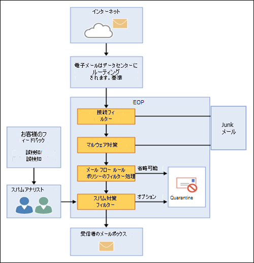

# Exchange Online Protection の概要Exchange Online Protection overview

Exchange Online Protection (EOP) は、組織をスパムやマルウェアから保護するために役立つクラウドベースのフィルタリングサービスです。Exchange Online Protection (EOP) is the cloud-based filtering service that helps protect your organization against spam and malware. EOP は、Exchange Online メールボックスを使用するすべての Microsoft 365 組織に含まれています。EOP is included in all Microsoft 365 organizations with Exchange Online mailboxes.

ただし、EOP は、次のオンプレミスのシナリオでも使用できます。But, EOP is also available in the following on-premises scenarios:

- **スタンドアロンのシナリオで**は、EOP は、オンプレミスの Exchange 組織またはその他の社内 SMTP 電子メールソリューションに対して、クラウドベースの電子メール保護を提供します。**In a standalone scenario**: EOP provides cloud-based email protection for your on-premises Exchange organization or for any other on-premises SMTP email solution.

- **ハイブリッド展開で**は、社内メールボックスとクラウドメールボックスが混在している場合に、電子メール環境を保護し、メールルーティングを制御するように EOP を構成できます。**In a hybrid deployment**: EOP can be configured to protect your email environment and control mail routing when you have a mix of on-premises and cloud mailboxes.

このようなシナリオでは、EOP を使用してメール環境の管理を簡素化し、社内のハードウェアおよびソフトウェアの維持に伴う負荷の多くを軽減することができます。In these scenarios, EOP can simplify the management of your email environment and alleviate many of the burdens that come with maintaining on-premises hardware and software.

このトピックの残りの部分では、スタンドアロン環境とハイブリッド環境で EOP がどのように機能するかについて説明します。The rest of this topic explains how EOP works in standalone and hybrid environments.

## EOP の仕組みHow EOP works

EOP の仕組みを理解すると、受信メールの処理方法がわかりやすくなります。To understand how EOP works, it helps to see how it processes incoming email:

- 受信メッセージは、最初は、送信者の評価をチェックし、マルウェアのメッセージを検査することによって、接続フィルターによって渡されます。An incoming message initially passes through connection filtering, which checks the sender's reputation and inspects the message for malware. スパムの大部分は、この時点で停止し、EOP によって削除されます。The majority of spam is stopped at this point and deleted by EOP. 詳細については、「[接続フィルターを構成する](configure-the-connection-filter-policy.md)」を参照してください。For more information, see [Configure connection filtering](configure-the-connection-filter-policy.md).

- メッセージはポリシーのフィルター処理によって続行されます。これにより、テンプレートから作成または適用するカスタムメールフロールール (トランスポートルールとも呼ばれる) に対してメッセージが評価されます。Messages continue through policy filtering, where messages are evaluated against custom mail flow rules (also known as transport rules) that you create or enforce from a template. たとえば、特定の送信者からのメールが到着すると、管理者に通知を送信するルールを作成できます。For example, you can have a rule that sends a notification to a manager when mail arrives from a specific sender. データ損失防止 (DLP) チェックも、この時点で発生します (Exchange Enterprise CAL with Services)。Data loss prevention (DLP) checks also occur at this point (Exchange Enterprise CAL with Services).

- 次に、メッセージはスパム対策フィルター処理 (コンテンツフィルターとも呼ばれます) を通過します。Next, messages pass through anti-spam filtering (also known as content filtering). スパムと判断されたメッセージは、他のオプションの中から、ユーザーの迷惑メールフォルダーまたは検疫に送信できます。A message that's determined to be spam can be sent to a user's Junk Email folder or to the quarantine, among other options. 詳細については、「[スパム対策ポリシーの構成](configure-your-spam-filter-policies.md)」を参照してください。For more information, see [Configure anti-spam policies](configure-your-spam-filter-policies.md).

- このような保護層をすべて正常に通過すると、メッセージは受信者に配信されます。After a message passes all of these protection layers successfully, it's delivered to the recipient.

詳細については、「[メール保護の順序と優先順位](how-policies-and-protections-are-combined.md)」を参照してください。For more information, see [Order and precedence of email protection](how-policies-and-protections-are-combined.md).

### EOP データセンターEOP datacenters

EOP は、最良の可用性を提供するために設計された複数のデータセンターから成る世界規模のネットワーク上で稼働します。EOP runs on a worldwide network of datacenters that are designed to provide the best availability. たとえば、あるデータセンターが使用できなくなった場合、電子メール メッセージはサービスの中断なく、自動的に別のデータセンターにルーティングされます。For example, if a datacenter becomes unavailable, email messages are automatically routed to another datacenter without any interruption in service. 各データセンターのサーバーは、ユーザーの代わりにメッセージを受け付け、組織とインターネットの間に分離された層を提供して、サーバーの負荷を軽減します。Servers in each datacenter accept messages on your behalf, providing a layer of separation between your organization and the internet, thereby reducing load on your servers. この高可用性のネットワークによって、Microsoft は適切なタイミングで組織に電子メールが配信されることを保証できます。Through this highly available network, Microsoft can ensure that email reaches your organization in a timely manner.

EOP はデータセンター間の負荷分散を実行しますが、1 つの地域内でのみ行います。1 つの地域でサービスが提供されている場合は、すべてのメッセージがその地域のメール ルーティングを使用して処理されます。EOP データセンターの地域メール ルーティングの動作を以下に示します。EOP performs load balancing between datacenters but only within a region. If you're provisioned in one region all your messages will be processed using the mail routing for that region. The following list shows the how regional mail routing works for the EOP datacenters:

- ヨーロッパ、中東、およびアフリカ (EMEA) では、すべての Exchange Online メールボックスが EMEA データセンターに配置され、すべてのメッセージが EOP フィルター処理のために EMEA データセンター経由でルーティングされます。In Europe, the Middle East, and Africa (EMEA), all Exchange Online mailboxes are located in EMEA datacenters, and all messages are routed through EMEA datacenters for EOP filtering.

- アジア太平洋 (APAC) では、すべての Exchange Online メールボックスが APAC データセンターに配置されており、現在、メッセージは EOP フィルター処理のために APAC データセンター経由でルーティングされます。In Asia-Pacific (APAC), all Exchange Online mailboxes are located in APAC datacenters, and messages are currently routed through APAC datacenters for EOP filtering.

- 南北アメリカでは、サービスは次の場所に配布されます。In the Americas, services are distributed in the following locations:

  - 南アメリカ: Exchange Online メールボックスは、ブラジルおよびチリのデータセンターにあります。South America: Exchange Online mailboxes are located in datacenters in Brazil and Chile. すべてのメッセージは、EOP フィルター処理のためにローカルデータセンターを経由してルーティングされます。All messages are routed through local datacenters for EOP filtering. 検疫済みメッセージは、テナントが配置されているデータセンターに格納されます。Quarantined messages are stored in the datacenter where the tenant is located.

  - カナダ: Exchange Online メールボックスは、カナダのデータセンターに配置されています。Canada: Exchange Online mailboxes are located in datacenters in Canada. すべてのメッセージは、EOP フィルター処理のためにローカルデータセンターを経由してルーティングされます。All messages are routed through local datacenters for EOP filtering. 検疫済みメッセージは、テナントが配置されているデータセンターに格納されます。Quarantined messages are stored in the datacenter where the tenant is located.

  - 米国: Exchange Online メールボックスは、米国データセンターに配置されています。United States: Exchange Online mailboxes are located in U.S. datacenters. すべてのメッセージは、EOP フィルター処理のためにローカルデータセンターを経由してルーティングされます。All messages are routed through local datacenters for EOP filtering. 検疫済みメッセージは、テナントが配置されているデータセンターに格納されます。Quarantined messages are stored in the datacenter where the tenant is located.

- Government Community Cloud (GCC) では、すべての Exchange Online メールボックスが米国データセンターに配置され、すべてのメッセージが EOP フィルター処理のために米国データセンター経由でルーティングされます。For the Government Community Cloud (GCC), all Exchange Online mailboxes are located in U.S. datacenters and all messages are routed through U.S. datacenters for EOP filtering.

## オンプレミスの電子メール組織の EOP プランと機能EOP plans and features for on-premises email organizations

利用可能な EOP サブスクリプションプランは次のとおりです。The available EOP subscription plans are:

- **EOP スタンドアロン**: 社内の電子メール組織を保護するために EOP に登録します。**EOP standalone**: You enroll in EOP to protect your on-premises email organization.

- **Exchange online の EOP 機能**: exchange online (スタンドアロンまたは Microsoft 365 の一部) を含むサブスクリプションは、EOP を使用して exchange online メールボックスを保護します。**EOP features in Exchange Online**: Any subscription that includes Exchange Online (standalone or as part of Microsoft 365) uses EOP to protect your Exchange Online mailboxes.

- **Exchange ENTERPRISE cal With services**: 追加の EXCHANGE enterprise Cal をサービスライセンスと共に購入したオンプレミスの exchange 組織がある場合、EOP は含まれているサービスの一部です。**Exchange Enterprise CAL with Services**: If you have an on-premises Exchange organization where you've purchased additional Exchange Enterprise CAL with Services licenses, EOP is part of the included services.

すべての EOP サブスクリプションプランでの要件、重要な制限、および機能の可用性の詳細については、「 [Exchange Online Protection サービスの説明](https://docs.microsoft.com/office365/servicedescriptions/exchange-online-protection-service-description/exchange-online-protection-service-description)」を参照してください。For information about requirements, important limits, and feature availability across all EOP subscription plans, see the [Exchange Online Protection service description](https://docs.microsoft.com/office365/servicedescriptions/exchange-online-protection-service-description/exchange-online-protection-service-description).

## オンプレミスの電子メール組織の EOP のセットアップSetting up EOP for on-premises email organizations

EOP のセットアップは、特にコンプライアンス ルールが少ない小規模な組織の場合に、シンプルにすることができます。ただし、複数ドメイン、カスタム コンプライアンス ルール、またはハイブリッド メール フローが存在する大規模な組織の場合は、セットアップにより多くの計画や時間が必要となることがあります。Setting up EOP can be simple, especially in the case of a small organization with a handful of compliance rules. However, if you have a large organization with multiple domains, custom compliance rules, or hybrid mail flow, set up can take more planning and time.

すでに EOP を購入している場合は、「[EOP サービスを設定する](set-up-your-eop-service.md)」を参照して、メッセージング環境を保護するように EOP を構成するために必要なすべての手順が完了していることを確認してください。If you've already purchased EOP, see [Set up your EOP service](set-up-your-eop-service.md) to ensure that you complete all the steps necessary to configure EOP to protect your messaging environment.

## 管理者向けの EOP ヘルプEOP Help for admins

EOP 管理者向けのヘルプ コンテンツは、次の最上位カテゴリで構成されます。The Help content for EOP administrators consists of the following top-level categories:

- [Exchange Online Protection の概要](exchange-online-protection-overview.md): EOP のしくみについて説明し、追加情報へのリンクを提供します。[Exchange Online Protection overview](exchange-online-protection-overview.md): Introduces how EOP works and provides links to additional information.

- [EOP features](eop-features.md): EOP で使用できる機能の一覧を示します。[EOP features](eop-features.md): Provides a list of features that are available in EOP.

- [EOP サービス](set-up-your-eop-service.md)をセットアップする: EOP サービスをセットアップする手順、および追加情報へのリンクを提供します。[Set up your EOP service](set-up-your-eop-service.md): Provides steps for setting up your EOP service, and links to additional information.

- [EOP に Google Postini、Barracuda Spam And Virus Firewall、または Cisco IronPort を切り替え](switch-to-eop-from-google-postini-the-barracuda-spam-and-virus-firewall-or-cisco.md)ます。別の電子メール保護製品から EOP に切り替えるプロセスについて説明します。[Switch to EOP from Google Postini, the Barracuda Spam and Virus Firewall, or Cisco IronPort](switch-to-eop-from-google-postini-the-barracuda-spam-and-virus-firewall-or-cisco.md): Describes the process for switching to EOP from another email protection product.

- [[スタンドアロンでの受信者の管理 EOP](manage-recipients-in-eop.md): EOP でメールユーザーとグループを管理する方法について説明します。[Manage recipients in standalone EOP](manage-recipients-in-eop.md): Describes how to manage mail users and groups in EOP.

- [EOP のメールフロー](mail-flow-in-eop.md): コネクタを使用してカスタムメールフローシナリオを構成する方法、サービスに関連付けられたドメインを管理する方法、およびディレクトリベースのエッジブロック (DBEB) 機能を有効にする方法について説明します。[Mail flow in EOP](mail-flow-in-eop.md): Describes how to configure custom mail flow scenarios using connectors, how to manage domains associated with the service, and how to enable the Directory Based Edge Blocking (DBEB) feature.

- [EOP を構成するためのベストプラクティス](best-practices-for-configuring-eop.md): サービスをセットアップしてプロビジョニングした後の推奨される構成設定および考慮事項について説明します。[Best practices for configuring EOP](best-practices-for-configuring-eop.md): Describes recommended configuration settings and considerations for after you set up and provision your service.

- [スタンドアロン EOP の監査レポート](auditing-reports-in-eop.md): 監査レポートを使用して、サービスに対する構成の変更を追跡する方法について説明します。[Auditing reports in standalone EOP](auditing-reports-in-eop.md): Describes how to use auditing reports to track configuration changes to the service.

- [EOP のスパム対策およびマルウェア対策保護](anti-spam-and-anti-malware-protection.md): スパムフィルター処理とマルウェアフィルター処理について説明し、組織のニーズに合わせてカスタマイズする方法を示します。[Anti-spam and anti-malware protection in EOP](anti-spam-and-anti-malware-protection.md): Describes spam filtering and malware filtering and shows how to customize them to best meet the needs of your organization. また、管理者とエンド ユーザーが検疫済みメッセージに対して実行可能なタスクについても説明しています。Also describes tasks that administrators and end users can perform on quarantined messages.

- [Exchange Online Protection でのレポート作成とメッセージ追跡](reporting-and-message-trace-in-exchange-online-protection.md): 使用可能なレポートとトラブルシューティングツールについて説明します。[Reporting and message trace in Exchange Online Protection](reporting-and-message-trace-in-exchange-online-protection.md): Describes the reports and troubleshooting tools that are available.

- [スタンドアロン EOP の exchange 管理センター](exchange-admin-center-in-exchange-online-protection-eop.md): EOP サービスを管理するために、exchange 管理センター (EAC) 管理インターフェイスを使用してアクセスおよびナビゲートする方法について説明します。[Exchange admin center in standalone EOP](exchange-admin-center-in-exchange-online-protection-eop.md): Describes how to access and navigate through the Exchange admin center (EAC) management interface in order to manage your EOP service.

- [Exchange Online Protection powershell](https://docs.microsoft.com/powershell/exchange/exchange-online-protection-powershell): リモート PowerShell に関する情報を提供します。これにより、EOP サービスをコマンドラインから管理できます。[Exchange Online Protection PowerShell](https://docs.microsoft.com/powershell/exchange/exchange-online-protection-powershell): Provides information about remote PowerShell, which lets you manage your EOP service from the command line.

- 「[EOP のヘルプとサポート](help-and-support-for-eop.md)」 ヘルプおよびテクニカル サポートの入手方法について説明しています。[Help and support for EOP](help-and-support-for-eop.md) Provides information about obtaining help and technical support.
