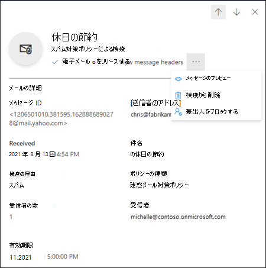

# EOP のユーザーとして検疫済みメッセージを検索して解放する

[!INCLUDE [Microsoft 365 Defender rebranding](../includes/microsoft-defender-for-office.md)]

**適用対象**
- [Exchange Online Protection](exchange-online-protection-overview.md)
- [Microsoft Defender for Office 365 プラン 1 およびプラン 2](defender-for-office-365.md)
- [Microsoft 365 Defender](../defender/microsoft-365-defender.md)

Exchange Online のメールボックスを使用している Microsoft 365 組織または Exchange Online のメールボックスを使用していないスタンドアロンの Exchange Online Protection (EOP) 組織では、危険な可能性があるメッセージまたは不要なメッセージは検疫済みメッセージとして保留されます。詳細については、「[EOP での検疫](quarantine-email-messages.md)」を参照してください。

検疫されたメッセージの受信者が、管理者以外のユーザーとしてメッセージに対して実行できる操作を次の表に示します。

 

****

|検疫の理由|表示|リリース|削除|
|---|:---:|:---:|:---:|
|バルク||||
|スパム||||
|フィッシング (高精度フィッシングではない)||||
|

検疫されたメッセージは、Microsoft 365 Defender ポータルで、または (管理者が設定している場合は) [エンドユーザーのスパム通知](use-spam-notifications-to-release-and-report-quarantined-messages.md)で表示および管理します。

## はじめに把握しておくべき情報

- Microsoft 365 Defender ポータルを開くには、<https://security.microsoft.com> にアクセスします。 **検疫ページ** を直接開くには、<https://security.microsoft.com/quarantine>を使用します。

- 管理者は、スパム対策ポリシーでメッセージを完全に削除する前に、メッセージを検疫で保持する期間を構成できます。 検疫期間が切れたメッセージは回復できません。 詳細については、「[EOP でのスパム対策ポリシーの構成](configure-your-spam-filter-policies.md)」を参照してください。

- 管理者は、スパム対策ポリシーで[ エンドユーザー スパム通知を有効にする](configure-your-spam-filter-policies.md#configure-end-user-spam-notifications)こともできます。 元のメッセージ受信者は、検疫されたスパム メッセージをこれらの通知から直接 *リリース* できます。 元のメッセージ受信者は、検疫済フィッシング メッセージ (高精度のフィッシング メッセージではありません) をこれらの通知から直接 *確認* することができます。 詳細については、「[EOP でのエンドユーザースパム通知](use-spam-notifications-to-release-and-report-quarantined-messages.md)」を参照してください。

- 高確度フィッシング、マルウェアとして検疫されるか、メール フロー ルール (別名: トランスポート ルール) により検疫されたメッセージは、管理者のみが管理でき、ユーザーに表示されません。 詳細については、「[EOP の管理者として検疫済みのメッセージやファイルを管理する](manage-quarantined-messages-and-files.md)」を参照してください。

- メッセージを移動して、それを誤検知 (迷惑メールではない) として報告できるのは一度だけです。

## 検疫済みメッセージを表示する

1. Microsoft 365 Defender ポータルで、**[メールと共同作業]** \> **[レビュー]** \> **[検疫]** に移動します。
2. **検疫** ページで、使用可能な列ヘッダーをクリックして結果を並べ替えることができます。 表示列を変更するには、[**列のカスタマイズ**] をクリックします。 既定値にはアスタリスク (\*) が付いています。

   - **受信時間**\*
   - **[件名]**\*
   - **[送信者]**\*
   - **[検疫の理由]**\*
   - **リリース状態**\*
   - **[ポリシーの種類]**\*
   - **[有効期限]**\*
   - **[受信者]**
   - **[メッセージ ID]**
   - **[ポリシー名]**
   - **メッセージ サイズ**
   - **メールの方向**

   完了したら、**[適用]** をクリックします。

3. 結果をフィルター処理するには、**[フィルター]** をクリックします。 使用できるフィルターは次のとおりです。

   - メッセージ

   - **[期限切れ日時]**: 検疫の期限が切れるタイミングでメッセージをフィルター処理します。
     - **[今日]**
     - **[今後 2 日間]**
     - **[今後 7 日間]**
     - **[カスタム]**: **[開始日]** と **[終了日]** を入力します。

   - **[受信日時]**: **[開始日]** と **[終了日]** を入力します。

   - **[検疫の理由]**:
     - **[バルク]**
     - **[スパム]**
     - **フィッシング**

   - **ポリシーの種類**: 次のポリシーの種類ごとに、メッセージをフィルター処理します。
     - **マルウェア対策ポリシー**
     - **安全な添付ファイルのポリシー** (Defender for Office 365)
     - **フィッシング対策ポリシー**
     - **迷惑メール対策ポリシー**
     - **トランスポート ルール** (メール フロー ルール)

   フィルターをクリアするには、**[クリア]** をクリックします。 フィルターのポップアップを非表示にするには、**[フィルター]** をもう一度クリックします。

4. 結果をフィルター処理するには、**[フィルター]** をクリックします。 次のフィルターは、表示される **フィルター** ポップアップで使用できます。
   - **[メッセージ ID]**: メッセージのグローバル一意識別子。
   - **[送信者のアドレス]**
   - **受信者の住所**
   - **件名**
   - **受信した時刻**: **開始時刻** と、**終了時刻**(日付) を入力します。
   - **[期限切れ日時]**: 検疫の期限が切れるタイミングでメッセージをフィルター処理します。
     - **[今日]**
     - **[今後 2 日間]**
     - **[今後 7 日間]**
     - **[カスタム]**: **[開始日]** と **[終了日]** を入力します。
   - **[検疫の理由]**:
     - **[バルク]**
     - **[スパム]**
     - **フィッシング**: スパム フィルター判定が **フィッシング詐欺** になったか、またはフィッシング対策保護によってメッセージが検疫されました ([スプーフィング設定](set-up-anti-phishing-policies.md#spoof-settings)または[偽装防止](set-up-anti-phishing-policies.md#impersonation-settings-in-anti-phishing-policies-in-microsoft-defender-for-office-365))。
     - **高確度のフィッシング**
   - **リリースの状態**: 次のいずれかの値。
     - **レビューが必要**
     - **承認済み**
     - **拒否された**
     - **リリースが要求されました**
     - **リリースされた**
   - **ポリシーの種類**: 次のポリシーの種類ごとに、メッセージをフィルター処理します。
     - **マルウェア対策ポリシー**
     - **安全な添付ファイルに関するポリシー**
     - **フィッシング対策ポリシー**
     - **迷惑メール対策ポリシー**
     - **トランスポート ルール** (メール フロー ルール)

   完了したら、**[適用]** をクリックします。 フィルターをクリアするには、![[フィルター クリア] アイコン](../../media/m365-cc-sc-clear-filters-icon.png)**[フィルターのクリア]** をクリックします。

5. **検索** ボックスと対応する値を使用して、特定のメッセージを検索します。 ワイルドカードはサポートされていません。 次の値に基づいて検索できます。
   - メッセージ ID
   - 送信者のメール アドレス
   - 受信者のメール アドレス
   - 件名。 メッセージの件名全体を使用します。 この検索では大文字と小文字は区別されません。
   - ポリシー名。 ポリシー名全体を使用します。 この検索では大文字と小文字は区別されません。

   検索条件を入力したら、Enter キーを押して結果をフィルター処理します。

特定の検疫済みメッセージを見つけたら、そのメッセージを選択して詳細を表示し、処理を実行します (メッセージの表示、解放、ダウンロード、または削除など)。

### 検疫済みメッセージの詳細を表示する

一覧から検疫済みメッセージを選択すると、表示される詳細ポップアップに次の情報が表示されます。

一覧でメール メッセージを選択すると、**[詳細]** ポップアップ ウィンドウにメッセージに関する次の詳細が表示されます。

- **[メッセージ ID]**: メッセージのグローバル一意識別子。
- **[送信者のアドレス]**
- **[受信日時]**: メッセージを受信した日時。
- **[件名]**
- [**検疫の理由**]: メッセージが [**迷惑メール**]、[**バルク メール**]、または [**フィッシング**] として識別されたかを表示します。
- **ポリシーの種類**: ポリシーの種類。 たとえば、**スパム対策ポリシー**。
- **受信者の数**
- **[受信者]**: メッセージに複数の受信者が含まれている場合は、**[メッセージのプレビュー]** か **[メッセージ ヘッダーを表示]** をクリックして受信者の完全な一覧を表示する必要があります。
- **[有効期限]**: 検疫からメッセージが自動的に完全に削除される日時。

メッセージに対してアクションを実行するには、次のセクションを参照してください。

> [!NOTE]
> 詳細ポップアップに留まり、表示される検疫済みメッセージを変更するには、ポップアップの上部にある上下の矢印を使用します。
>
> 

### 検疫済みメールを処理する

一覧から検疫済みメッセージを選択すると、詳細ポップアップで次のアクションを使用できます。

- **メールのリリース**\*: 受信トレイにメッセージを配信します。

- ![[メッセージ ヘッダー アイコンを表示]](../../media/m365-cc-sc-eye-icon.png):**[メッセージ ヘッダーの表示]**: このリンクをクリックすると、メッセージ ヘッダー テキストが表示されます。 **メッセージ ヘッダー** ポップアップは、次のリンクと共に表示されます。
- **メッセージ ヘッダーのコピー**: メッセージ ヘッダー (すべてのヘッダー フィールド) をクリップボードにコピーするには、このリンクをクリックします。
- **Microsoft Message Header Analyzer**: ヘッダー フィールドと値を詳細に分析するには、このリンクをクリックしてメッセージ ヘッダー アナライザーに移動します。 [**分析するメッセージ ヘッダーを挿入**] セクションにメッセージ ヘッダーを貼り付けて、 (Ctrl + V キーを押すか、右クリックして [**貼り付け**] を選択します)、それから **[ヘッダーの分析]** をクリックします。

[その他![アクション] アイコン](../../media/m365-cc-sc-more-actions-icon.png)**[その他のアクション]** をクリックすると、次の操作を実行できます。

- ![[メッセージのプレビュー] アイコン](../../media/m365-cc-sc-eye-icon.png)**[メッセージのプレビュー]**:: 表示されるポップアップ ウィンドウで、次のいずれかのタブを選択します。
  - **[ソース]**: すべてのリンクが無効になったメッセージ本文の HTML バージョンを表示します。
  - **[プレーン テキスト]**: プレーン テキストでメッセージ本文を表示します。

- ![[検疫アイコンからの削除]](../../media/m365-cc-sc-delete-icon.png)**[検疫から削除]**: 表示される警告で **[はい]** をクリックすると、メッセージは直ちに削除され、元の受信者には送信されません。

- ![[メッセージをダウンロード] アイコン](../../media/m365-cc-sc-download-icon.png)**[メールをダウンロード]**: 表示されるポップアップ ウィンドウで、 **[このメッセージをダウンロードするリスクを理解しています]** を選択して、**[ダウンロード]** をクリックして、メッセージのローカル コピーを .eml 形式で保存します。

- **送信者のブロック**:: **お使いの** メールボックスの [ブロックされた送信者] リストに送信者を追加します。 詳細については、「[メール送信者をブロックする](https://support.microsoft.com/office/b29fd867-cac9-40d8-aed1-659e06a706e4)」を参照してください。

\* このオプションは、既に解放されているメッセージでは使用できません (**[リリース済み] 状態** の値は **[リリース済み]**)。

メッセージを解放も削除もしないと、既定の検疫保持期間が経過した後に削除されます(**Expires** 列に表示されているように)。

> [!NOTE]
> モバイル デバイスでは、説明テキストはアクション アイコン用に使用できません。
>
> 
>
> アイコンの順序と対応する説明を次の表にまとめます。
>
> |アイコン|説明|
> |---:|---|
> ||**メールを解放する**|
> ||**メッセージ ヘッダーを表示する**|
> ||**メッセージのプレビュー**|
> ||**検疫から削除**|
> |![[送信者ブロック] アイコン](../../media/m365-cc-sc-block-sender-icon.png)|**差出人をブロックする**|

#### 複数の検疫済みメール メッセージを処理する

最初の列の左側にある空白の領域をクリックして、一覧で複数の検疫済みメッセージ (最大 100) を選択すると、次の操作を実行できる **[一括操作]** ドロップダウン リストが表示されます。

![検疫内のメッセージの [一括アクション] ドロップダウン リスト](../../media/quarantine-user-message-bulk-actions.png)

- ![ [リリースメール] アイコン](../../media/m365-cc-sc-check-mark-icon.png) **[メールのリリース]**: 受信トレイにメッセージを配信します。
- ![ [検疫アイコンから削除する] ](../../media/m365-cc-sc-delete-icon.png) **[メッセージの削除]**: 表示される警告で **[はい]** をクリックすると、メッセージは元の受信者に送信されずに検疫から直ちに削除されます。
