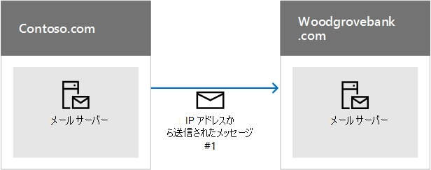

# <a name="how-microsoft-365-uses-sender-policy-framework-spf-to-prevent-spoofing"></a>Microsoft 365 において Sender Policy Framework (SPF) を使用して、スプーフィングを防止する方法

[!INCLUDE [Microsoft 365 Defender rebranding](../includes/microsoft-defender-for-office.md)]

**適用対象**
- [Exchange Online Protection](exchange-online-protection-overview.md)
- [Microsoft Defender for Office 365 プラン 1 およびプラン 2](defender-for-office-365.md)
- [Microsoft 365 Defender](../defender/microsoft-365-defender.md)

 **概要:** この記事では、Microsoft 365ポリシー フレームワーク (SPF) TXT レコードを DNS で使用して、宛先電子メール システムがカスタム ドメインから送信されたメッセージを信頼する方法について説明します。 これは、ユーザーから送信される送信メールにMicrosoft 365。 メッセージは、Microsoft 365内の受信者に送信Microsoft 365常に SPF を渡します。

SPF TXT レコードは、DNS 形式のレコードです。SPF TXT レコードで、メール メッセージの送信元のドメイン名を確認すると、スプーフィングやフィッシングの防止に役立ちます。SPF は、送信者の IP アドレスを、送信側ドメインの所有者とされる名前と照合して、メール メッセージの発信元を確認します。

> [!NOTE]
> SPF レコードの種類は、2014 年にインターネット技術標準化委員会 (IETF) によって廃止されました。代わりに、SPF 情報を公開するには、DNS で TXT レコードを必ず使用してください。この記事の以降の部分では、わかりやすいように SPF TXT レコードという用語を使用します。

ドメイン管理者は DNS の TXT レコードで SPF 情報を公開します。 この SPF 情報は、承認された送信メール サーバーを識別します。 送信先メール システムにより、承認された送信メール サーバーからメッセージが発信されたことが確認されます。 既に SPF に精通している場合、または簡単な展開を行い、Microsoft 365 の DNS の SPF TXT レコードに何を含めるかを知る必要がある場合は、「Microsoft 365 で[SPF](set-up-spf-in-office-365-to-help-prevent-spoofing.md)をセットアップする」に移動してスプーフィングを防止できます。 Microsoft 365 で完全にホストされている展開が必要ない場合、または SPF の動作方法や SPF のトラブルシューティング方法に関する詳細が必要な場合は、Microsoft 365 を読んでください。

> [!NOTE]
> 以前は、SharePoint Online も使用している場合、カスタム ドメインに別の SPF TXT レコードを追加する必要がありました。 この作業を行う必要はなくなりました。 この変更により、SharePoint Online の通知メッセージが [迷惑メール] フォルダーに振り分けられるリスクが軽減されます。 すぐに変更を加える必要は全く必要ないが、「ルックアップが多すぎる」エラーが表示された場合は、「Microsoft 365 の SPF のセットアップ」の説明に従って[SPF](set-up-spf-in-office-365-to-help-prevent-spoofing.md)TXT レコードを変更してスプーフィングを防止します。

## <a name="how-spf-works-to-prevent-spoofing-and-phishing-in-microsoft-365"></a>SPF がスプーフィングとフィッシング詐欺を防止するMicrosoft 365
<a name="HowSPFWorks"> </a>

SPF は、送信者がドメインの代理として送信することを許可されているかどうかを判断します。送信者がこの操作を許可されていない場合、つまり、受信側のサーバーで電子メールの SPF チェックが失敗した場合は、そのサーバー上で構成されたスパム ポリシーが、メッセージについて行う処理を決定します。

各 SPF TXT レコードには、SPF TXT レコードという宣言、ドメインからメールを送信できる IP アドレス、ドメインの代わりに送信できる外部ドメイン、および強制ルールの 3 つの部分が含まれます。 有効な SPF TXT レコードには、3 つすべてが必要です。 この記事では、SPF TXT レコードを形成する方法について説明し、SPF TXT レコード内のサービスを操作するためのベスト プラクティスをMicrosoft 365。 ドメイン レジストラーを操作してレコードを DNS に発行する手順へのリンクも提供されます。

### <a name="spf-basics-ip-addresses-allowed-to-send-from-your-custom-domain"></a>SPF の基本: カスタム ドメインからの送信が許可された IP アドレス
<a name="SPFBasicsIPaddresses"> </a>

SPF ルールの基本的な構文を見てみましょう。

v=spf1 \<IP\>\<enforcement rule\>

たとえば、contoso.com に対して次の SPF ルールが存在するとします。

v=spf1 \<IP address #1\> \<IP address #2\> \<IP address #3\>\<enforcement rule\>

この例では、SPF ルールは、ドメイン contoso.com について、これらの IP アドレスからのメールのみを受け入れるように受信電子メール サーバーに指示します。

- IP アドレス #1

- IP アドレス #2

- IP アドレス #3

この SPF ルールは受信メール サーバーに、メッセージが contoso.com からのものであるものの、これら 3 つの IP アドレスのいずれからのものでもない場合、受信側サーバーはメッセージに対して強制ルールを適用する必要があることを指示します。通常、強制ルールは次のオプションのいずれかです。

- **Hard fail。** メッセージ エンベロープ内に 'hard fail' を含むメッセージをマークし、受信側サーバーでこの種類のメッセージに対して構成されたスパム ポリシーに従います。

- **Soft fail。** メッセージ エンベロープ内に 'soft fail' を含むメッセージをマークします。通常、電子メール サーバーはこれらのメッセージを配信するように構成されます。ほとんどのエンド ユーザーには、このマークは表示されません。

- **Neutral。** 何もしません。つまり、メッセージ エンベロープをマークしません。通常、これはテスト用に予約されているものであり、ほとんど使用されません。

次の例は、さまざまな状況での SPF のしくみを示しています。これらの例では、contoso.com は送信者、woodgrovebank.com は受信者です。

### <a name="example-1-email-authentication-of-a-message-sent-directly-from-sender-to-receiver"></a>例 1:送信者から受信者に直接送信されるメッセージの電子メール認証
<a name="spfExample1"> </a>

SPF は、送信者から受信者へのパスが直接パスである場合に最適に機能します。次に例を示します。



Woodgrovebank.com がメッセージを受け取る際に、IP アドレス # 1 が contoso.com の SPF TXT レコードにある場合は、メッセージは SPF チェックに合格し認証されます。

### <a name="example-2-spoofed-sender-address-fails-the-spf-check"></a>例 2:偽装された送信者のアドレスが SPF チェックに失敗する
<a name="spfExample2"> </a>

フィッシャーが contoso.com を偽装する方法を見つけたとします。


ip アドレス #12 contoso.com の SPF TXT レコードに含めなされていないので、メッセージは SPF チェックに失敗し、受信者はスパムとしてマークを付けることができます。

### <a name="example-3-spf-and-forwarded-messages"></a>例 3:SPF と転送されたメッセージ
<a name="spfExample3"> </a>

SPF の欠点の 1 つは、電子メールが転送された場合に機能しなかっている点です。 たとえば、woodgrovebank.com のユーザーが、outlook.com アカウントにすべての電子メールを送信する転送ルールを設定しているとします。


メッセージはもともと woodgrovebank.com で SPF チェックに合格しますが、ip #25 が contoso.com の SPF TXT レコードに含めないので、outlook.com での SPF チェックは失敗します。 このため、Outlook.com はメッセージをスパムとしてマークする可能性があります。 この問題を回避するには、SPF を DKIM や DMARC などの他の電子メールの認証方法と組み合わせて使用します。

### <a name="spf-basics-including-third-party-domains-that-can-send-mail-on-behalf-of-your-domain"></a>SPF の基本:自分のドメインに代わってメールを送信できるサード パーティのドメインを含める
<a name="SPFBasicsIncludes"> </a>

IP アドレスに加えて、送信者としてドメインを含めるように SPF TXT レコードを構成することもできます。 これらは、SPF TXT レコードに "include" ステートメントとして追加されます。 たとえば、contoso.com には、所有する contoso.net と contoso.org からメール サーバーのすべての IP アドレスを含めることもできます。 これを行うには、contoso.com は次のような SPF TXT レコードを発行します。

```text
v=spf1 include:contoso.net include:contoso.org -all
```

受信サーバーが DNS でこのレコードを見た場合は、SPF TXT レコードに対して dns 参照を実行し、contoso.net を実行 contoso.org。レコード内に追加の include ステートメントが見 contoso.net、contoso.org に従います。 サービス拒否攻撃を防止するための、1 つの電子メール メッセージに対する DNS 参照の最大数は 10 です。 各 include ステートメントは追加の DNS 参照を表します。 メッセージが上限 10 を超えると、メッセージは SPF チェックに失敗します。 受信サーバーの構成方法に応じて、メッセージがこの制限に達すると、送信者はメッセージが生成された "ルックアップが多すぎます" または "メッセージの最大ホップ数が超過しました" というメッセージを取得する場合があります (ルックアップ ループがループし、DNS タイムアウトを超えた場合に発生する可能性があります)。 これを回避する方法のヒントについては、「[トラブルシューティング: SPF](how-office-365-uses-spf-to-prevent-spoofing.md#SPFTroubleshoot)のベスト プラクティス」を参照Microsoft 365。

## <a name="requirements-for-your-spf-txt-record-and-microsoft-365"></a>SPF TXT レコードと SPF TXT レコードの要件Microsoft 365
<a name="SPFReqsinO365"> </a>

Microsoft 365 のセットアップ時にメールを設定した場合、Microsoft メッセージング サーバーをドメインの正当なメール ソースとして識別する SPF TXT レコードが既に作成されています。 このレコードは、おそらく次のように表示されます。

```text
v=spf1 include:spf.protection.outlook.com -all
```

完全にホストされた顧客である場合、つまり、送信メールを送信するオンプレミスのメール サーバーがない場合、これは Office 365 用に発行する必要がある唯一の SPF TXT レコードです。

ハイブリッド展開がある場合 (つまり、いくつかのメールボックスがオンプレミスで、Microsoft 365 でホストされている場合)、または Exchange Online Protection (EOP) スタンドアロンのお客様 (つまり、組織が EOP を使用してオンプレミスのメールボックスを保護する) の場合は、各オンプレミス エッジ メール サーバーの送信 IP アドレスを DNS の SPF TXT レコードに追加する必要があります。

## <a name="form-your-spf-txt-record-for-microsoft-365"></a>ユーザーの SPF TXT レコードをMicrosoft 365
<a name="FormYourSPF"> </a>

この記事に記載されている構文の情報を使って、カスタム ドメイン用の SPF TXT レコードを形成します。ここに記載されていない他の構文オプションもありますが、これらが最もよく使うオプションです。レコードを形成した後は、ドメイン レジストラーでレコードを更新する必要があります。

SPF に含める必要があるドメインの詳細については、「Microsoft 365外部 DNS レコード[」を参照してください](../../enterprise/external-domain-name-system-records.md)。 ドメイン レジスト [ラーの](../../admin/get-help-with-domains/create-dns-records-at-any-dns-hosting-provider.md#add-or-edit-an-spf-txt-record-to-help-prevent-email-spam-outlook-exchange-online) SPF (TXT) レコードを更新するには、手順に従って手順を実行します。

### <a name="spf-txt-record-syntax-for-microsoft-365"></a>SPF TXT レコード構文のMicrosoft 365
<a name="SPFSyntaxO365"> </a>

SPF TXT レコードの一般的なMicrosoft 365構文を使用します。

```text
v=spf1 [<ip4>|<ip6>:<IP address>] [include:<domain name>] <enforcement rule>
```

たとえば、

```text
v=spf1 ip4:192.168.0.1 ip4:192.168.0.2 include:spf.protection.outlook.com -all
```

各部分の意味は次のとおりです。

- **v=spf1** は必須です。これは、SPF TXT レコードとして TXT レコードを定義します。

- **ip4** は、IP バージョン 4 のアドレスを使用していることを示します。**ip6** は、IP バージョン 6 のアドレスを使用していることを示します。IPv6 の IP アドレスを使用している場合は、この記事の例の **ip4** を **ip6** に置き換えます。CIDR 表記を使用して IP アドレス範囲を指定することもできます (たとえば、**ip4:192.168.0.1/26**)。

- _IP address_ は、SPF TXT レコードに追加する IP アドレスです。 通常、これは組織の送信メール サーバーの IP アドレスです。 複数の送信メール サーバーを一覧表示できます。 詳細については[、「Example: SPF TXT record for](how-office-365-uses-spf-to-prevent-spoofing.md#ExampleSPFMultipleMailServerO365)multiple out-premises mail servers and Microsoft 365」 を参照してください。

- _domain name_ は、正当な送信者として追加するドメインです。 ドメイン名の一覧については、「SPF に必要Microsoft 365外部 DNS レコード」[を参照してください](../../enterprise/external-domain-name-system-records.md)。

- 通常、強制ルールは次のいずれかです。

  - -all

    hard fail を示します。ドメインに対するすべての承認済みの IP アドレスが既知の場合は、SPF TXT レコードにそれらを一覧表示して、-all (hard fail) 修飾子を使用します。また、SPF のみを使用している場合、つまり、DMARC または DKIM のいずれも使用していない場合は、-all 修飾子を使用する必要もあります。常にこの修飾子を使用することをお勧めします。

  - ~all

    soft fail を示します。 IP アドレスの完全な一覧が不明な場合は、~all (ソフトフェール) 修飾子を使用する必要があります。 また、p=quarantine または p=reject と共に DMARC を使用している場合も、~all を使用できます。 それ以外の場合は、-all を使用します。

  - ?all

    neutral を示します。SPF のテスト時に使用されます。実際の展開でこの修飾子を使用することはお勧めしません。

### <a name="example-spf-txt-record-to-use-when-all-of-your-mail-is-sent-by-microsoft-365"></a>例: すべてのメールがユーザーによって送信される場合に使用する SPF TXT レコードMicrosoft 365
<a name="ExampleSPFNoSP"> </a>

すべてのメールが SPF TXT レコードMicrosoft 365送信される場合は、次のコマンドを使用します。

```text
v=spf1 include:spf.protection.outlook.com -all
```

### <a name="example-spf-txt-record-for-a-hybrid-scenario-with-one-on-premises-exchange-server-and-microsoft-365"></a>例: 1 つのオンプレミスのユーザーとユーザーが含むハイブリッド シナリオの SPF TXT Exchange ServerレコードMicrosoft 365
<a name="ExampleSPFHybridOneExchangeServer"> </a>

ハイブリッド環境で、オンプレミスの Exchange Server の IP アドレスが 192.168.0.1 である場合、SPF の強制ルールを hard fail に設定するために、SPF TXT レコードを次のように形成します。

```text
v=spf1 ip4:192.168.0.1 include:spf.protection.outlook.com -all
```

### <a name="example-spf-txt-record-for-multiple-outbound-on-premises-mail-servers-and-microsoft-365"></a>例: 複数の送信オンプレミスメール サーバーとサーバーの SPF TXT レコードMicrosoft 365
<a name="ExampleSPFMultipleMailServerO365"> </a>

複数の送信メール サーバーがある場合は、SPF TXT レコードに各メール サーバーの IP アドレスを含め、各 IP アドレスをスペースで分離し、その後に "ip4:" ステートメントを指定します。 以下に例を示します。

```text
v=spf1 ip4:192.168.0.1 ip4:192.168.0.2 ip4:192.168.0.3 include:spf.protection.outlook.com -all
```

## <a name="next-steps-set-up-spf-for-microsoft-365"></a>次の手順: SPF をセットアップして、Microsoft 365
<a name="SPFNextSteps"> </a>

SPF TXT レコードを作成したら、「Microsoft 365 で[SPF](set-up-spf-in-office-365-to-help-prevent-spoofing.md)をセットアップする」の手順に従って、スプーフィングを防止してドメインに追加します。

SPF は、スプーフィングを防止するために設計されていますが、SPF で防御できないスプーフィングの手法があります。 これらから保護するには、SPF をセットアップしたら、DKIM と DMARC を構成して、SPF をMicrosoft 365。 開始するには[、「DKIM を使用して](use-dkim-to-validate-outbound-email.md)カスタム ドメインから送信された送信メールを検証する」を参照Microsoft 365。 次に[、「DMARC を使用してメールを検証する」を参照Microsoft 365。](use-dmarc-to-validate-email.md)

## <a name="troubleshooting-best-practices-for-spf-in-microsoft-365"></a>トラブルシューティング: SPF のベスト プラクティス (Microsoft 365
<a name="SPFTroubleshoot"> </a>

カスタム ドメインに作成できる SPF TXT レコードは 1 つのみです。複数のレコードを作成すると、ラウンド ロビン状況の原因となり、SPF が失敗します。これを避けるために、各サブドメインに対して個別にレコードを作成できます。たとえば、contoso.com に 1 つのレコードを作成し、bulkmail.contoso.com に別のレコードを作成します。

電子メール メッセージが配信される前に 10 以上の DNS 参照が発生した場合、受信メール サーバーはパーマエラーとも呼ばれる永続的なエラーで応答し、メッセージが SPF チェックに失敗します。 また、受信側のサーバーは、次のようなエラーを含む配信不能レポート (NDR) で応答することもあります。

- メッセージのホップ数を超えました。

- メッセージに必要な参照数が多すぎます。

## <a name="avoiding-the-too-many-lookups-error-when-you-use-third-party-domains-with-microsoft-365"></a>サード パーティドメインを使用する場合に"参照が多すぎる" エラーを回避Microsoft 365
<a name="SPFTroubleshoot"> </a>

サード パーティのドメインの SPF TXT レコードには、受信側のサーバーに多数の DNS 参照を実行するよう指示するものがあります。たとえば、この記事の執筆時には、Salesforce.com のレコードに 5 つの include ステートメントが含まれています。

```text
v=spf1 include:_spf.google.com
include:_spfblock.salesforce.com
include:_qa.salesforce.com
include:_spfblock1.salesforce.com
include:spf.mandrillapp.com mx ~all
```

エラーを回避するために、(たとえばバルク メールを送信する) あらゆるユーザーがサブドメインを使用する必要があるというポリシーを、特にこの目的のために実装できます。次にバルク メールを含むサブドメイン用の別の SPF TXT レコードを定義します。

  salesforce.com の例などのように、SPF TXT レコードでドメインを使用する必要がある場合がありますが、サードパーティがこの目的のためにユーザーの使用するサブドメインを既に作成している場合もあります。たとえば、exacttarget.com は、SPF TXT レコードに対して使用する必要があるサブドメインを作成しました。


```text
cust-spf.exacttarget.com
```

SPF TXT レコードにサード パーティのドメインを含む場合は、参照の上限値 10 に達することを回避するために、どのドメインまたはサブドメインを使用するかを、サードパーティに確認する必要があります。

## <a name="how-to-view-your-current-spf-txt-record-and-determine-the-number-of-lookups-that-it-requires"></a>現在の SPF TXT レコードを表示し、それに必要な参照数を決定する方法
<a name="SPFTroubleshoot"> </a>

nslookup を使用して、SPF TXT レコードなどの DNS レコードを表示できます。また、ご希望に応じて、無料のオンライン ツールを多数入手し、SPF TXT レコードの内容を表示することもできます。SPF TXT を参照し、一連の include ステートメントとリダイレクトに従って、レコードが必要とする DNS 参照数を判断できます。オンライン ツールには、これらの参照数をカウントして表示するものもあります。この数を継続的に追跡することで、組織から送信されたメッセージが、受信側のサーバーからの permerror と呼ばれる永続的なエラーの要因にならないようにできます。

## <a name="for-more-information"></a>関連情報
<a name="SPFTroubleshoot"> </a>

SPF TXT レコードの追加に関するヘルプが必要ですか? カスタム ドメインでの Sender Policy Framework の使用方法の詳細については、「Microsoft 365 の DNS ホスティング プロバイダーで[DNS](../../admin/get-help-with-domains/create-dns-records-at-any-dns-hosting-provider.md#add-or-edit-an-spf-txt-record-to-help-prevent-email-spam-outlook-exchange-online)レコードを作成する」の記事を参照Microsoft 365。 [スパム対策メッセージ ヘッダーには、SPF](anti-spam-message-headers.md)チェックに使用される構文フィールドとMicrosoft 365フィールドが含まれます。
