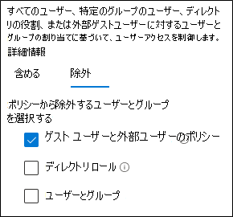

# ゲスト アクセスと B2B 外部ユーザー アクセスを許可するポリシー

この記事では、Azure Active Directory (Azure AD) Business-to-Business (B2B) アカウントを持つゲストおよび外部ユーザーに対するアクセスを許可するように、推奨されるデバイスと ID アクセス ポリシーを調整する方法について説明します。 このガイダンスは、共通の [ID ポリシーとデバイス アクセス ポリシーを基にしています](identity-access-policies.md)。

これらの推奨事項は、ベースラインレベルの保護 **に適用** するように設計されています。 ただし、機密性が高く規制の厳しい保護に関する特定のニーズに基づいて推奨事項 **を調整** することもできます。

B2B アカウントが Azure ADテナントで認証するためのパスを提供しても、これらのアカウントは環境全体にアクセスできません。 B2B ユーザーとそのアカウントは、条件付きアクセス ポリシーによって共有されるサービスやリソース (ファイルなど) にアクセスできます。

## ゲストと外部ユーザー アクセスを許可および保護するための一般的なポリシーの更新

次の図は、B2B ゲスト および外部ユーザー アクセスの共通 ID およびデバイス アクセス ポリシー間で追加または更新するポリシーを示しています。

次の表に、作成および更新する必要があるポリシーを示します。 共通ポリシーは、「共通 ID とデバイス アクセス ポリシー」の記事に関連付けられた構成 [手順にリンク](identity-access-policies.md) します。

|保護レベル|ポリシー|詳細情報|
|---|---|---|
|**Baseline**|[ゲストと外部ユーザーに対して常に MFA を要求する](identity-access-policies.md#require-mfa-based-on-sign-in-risk)|この新しいポリシーを作成し、次の構成を行います。 <ul><li>[**割り>ユーザー** とグループ>含める] で、[ユーザーとグループの選択] を選択し、[すべてのゲストユーザーと外部ユーザー **] を選択します**。</li><li>[ **割り>条件**>サインイン] で、多要素認証 (MFA) を常に適用するには、すべてのオプションをオフのままにします。</li></ul>|
||[サインイン リスクが中程度または高の場合に MFA *を* 要求 *する*](identity-access-policies.md#require-mfa-based-on-sign-in-risk)|ゲストと外部ユーザーを除外するには、このポリシーを変更します。|
||[準拠 PC が必要](identity-access-policies.md#require-compliant-pcs-but-not-compliant-phones-and-tablets)|ゲストと外部ユーザーを除外するには、このポリシーを変更します。|

条件付きアクセス ポリシーにゲストと外部ユーザーを含めるか除外するには、[割り当て] > [ユーザーとグループ] > [含める] または **[** 除外] で、[すべてのゲストユーザーと外部ユーザー] をチェック **します**。

## 詳細情報

### ゲストと外部ユーザー アクセス (Microsoft Teams

Microsoft Teamsユーザーを定義します。

- **ゲスト アクセス** では、Azure AD B2B アカウントを使用し、チームのメンバーとして追加し、チームの通信とリソースにアクセスできます。

- **外部アクセス** は、B2B アカウントを持つ外部ユーザー用です。 外部ユーザー アクセスには、招待、通話、チャット、会議が含まれますが、チーム メンバーシップとチームのリソースへのアクセスは含まれます。

詳細については、「チームのゲストと外部ユーザー アクセスの [比較」を参照してください](/microsoftteams/communicate-with-users-from-other-organizations#compare-external-and-guest-access)。

Teams の ID およびデバイス アクセス ポリシーのセキュリティ保護の詳細については、「Teams チャット、グループ、およびファイルのセキュリティ保護に関するポリシーの推奨事項」を[参照してください](teams-access-policies.md)。

### ゲストユーザーと外部ユーザーに対して常に MFA を要求する

このポリシーは、ゲストがホーム テナントで MFA に登録されているかどうかに関係なく、テナントに MFA を登録するように求めるプロンプトを表示します。 テナント内のリソースにアクセスする場合、ゲストと外部ユーザーは要求ごとに MFA を使用する必要があります。

### ゲストと外部ユーザーをリスクベースの MFA から除外する

組織は Azure AD Identity Protection を使用して B2B ユーザーにリスクベースのポリシーを適用することができますが、Azure AD Identity Protection for B2B コラボレーション ユーザーのホーム ディレクトリに存在する ID が原因で、リソース ディレクトリに実装する場合に制限があります。 これらの制限により、リスクベースの MFA ポリシーからゲストを除外し、常に MFA を使用する必要があります。

詳細については [、「B2B コラボレーション ユーザーの Id 保護の制限」を参照してください](/azure/active-directory/identity-protection/concept-identity-protection-b2b#limitations-of-identity-protection-for-b2b-collaboration-users)。

### ゲストと外部ユーザーをデバイス管理から除外する

デバイスを管理できるのは 1 つの組織のみです。 ゲストと外部ユーザーをデバイスコンプライアンスを必要とするポリシーから除外しない場合、これらのポリシーはこれらのユーザーをブロックします。

## 次の手順

次の条件付きアクセス ポリシーを構成します。

- [Microsoft Teams](teams-access-policies.md)
- [Exchange Online](secure-email-recommended-policies.md)
- [SharePoint](sharepoint-file-access-policies.md)
- [Microsoft Cloud App Security](mcas-saas-access-policies.md)
 