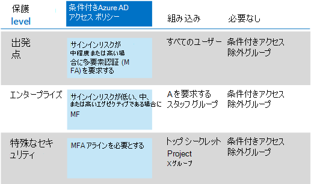

# 一般的なゼロ信頼 ID とデバイス アクセス ポリシー

この記事では、Azure Active Directory (Azure AD) アプリケーション プロキシで公開されたオンプレミス アプリケーションを含む、Microsoft 365 クラウド サービスへのアクセスをセキュリティ保護するための一般的な推奨されるゼロトラスト ID とデバイス アクセス ポリシーについて説明します。

このガイダンスでは、新しくプロビジョニングされた環境に推奨ポリシーを展開する方法について説明します。 これらのポリシーを個別のラボ環境で設定すると、事前運用環境と実稼働環境にロールアウトをステージングする前に、推奨されるポリシーを理解して評価できます。 新しくプロビジョニングされた環境は、評価ニーズを反映するためにクラウド専用またはハイブリッドにできます。

## ポリシー セット

次の図は、推奨されるポリシーのセットを示しています。 各ポリシーが適用する保護の層、およびポリシーが PC、電話、タブレット、またはデバイスの両方のカテゴリに適用されるかどうかを示します。 また、これらのポリシーを構成する場所も示します。

:::image type="content" source="../../media/microsoft-365-policies-configurations/identity-device-access-policies-byplan.png" alt-text="ゼロトラスト ID とデバイス アクセスを構成するための一般的なポリシー。" lightbox="../../media/microsoft-365-policies-configurations/identity-device-access-policies-byplan.png":::

<!--

Here's a one-page PDF summary:

   [View as a PDF](../../downloads/MSFT-cloud-architecture-identity-device-protection-handout.pdf) \| [Download as a PDF](https://github.com/MicrosoftDocs/microsoft-365-docs/raw/public/microsoft-365/downloads/MSFT-cloud-architecture-identity-device-protection-handout.pdf)

--> 

この記事の残りの部分では、これらのポリシーを構成する方法について説明します。

> [!NOTE]
> Intune にデバイスを登録する前に多要素認証 (MFA) の使用を要求して、デバイスが目的のユーザーを所有することを保証することを推奨します。 デバイス コンプライアンス ポリシーを適用するには、Intune にデバイスを登録する必要があります。

これらのタスクを実行する時間を与えるために、次の表に示す順序で開始点ポリシーを実装することをお勧めします。 ただし、エンタープライズおよび特殊なセキュリティ レベルの保護に関する MFA ポリシーは、いつでも実装できます。

|保護レベル|ポリシー|詳細情報|ライセンス|
|---|---|---|---|
|**開始点**|[サインインのリスクが *中*、または *高* のときに MFA を要求する](#require-mfa-based-on-sign-in-risk)||Microsoft 365 E5またはMicrosoft 365 E3 E5 セキュリティ アドオンを使用する|
||[先進認証をサポートしないクライアントはブロックする](#block-clients-that-dont-support-multi-factor)|最新の認証を使用しないクライアントは条件付きアクセス ポリシーをバイパスできます。そのため、これらをブロックすることが重要です。|Microsoft 365 E3 または E5|
||[高リスク ユーザーはパスワードを変更する必要がある](#high-risk-users-must-change-password)|リスクの高いアクティビティが自分のアカウントで検出された場合、サインイン時にユーザーにパスワードの変更を強制的に行います。|Microsoft 365 E5またはMicrosoft 365 E3 E5 セキュリティ アドオンを使用する|
||[アプリケーション保護ポリシー (APP) データ保護の適用](#apply-app-data-protection-policies)|プラットフォーム (Windows iOS/iPadOS、Android) ごとに 1 つの Intune アプリ保護ポリシー。|Microsoft 365 E3 または E5|
||[承認済みアプリとアプリ保護を要求する](#require-approved-apps-and-app-protection)|iOS、iPadOS、Android を使用してスマートフォンやタブレットにモバイル アプリ保護を適用します。|Microsoft 365 E3 または E5|
|**エンタープライズ**|[サインイン リスクが低、中、高の場合 *に* MFA を要求 *する*](#require-mfa-based-on-sign-in-risk)||Microsoft 365 E5またはMicrosoft 365 E3 E5 セキュリティ アドオンを使用する|
||[デバイス コンプライアンス ポリシーの定義](#define-device-compliance-policies)|プラットフォームごとに 1 つのポリシー。|Microsoft 365 E3 または E5|
||[準拠した PC とモバイル デバイスが必要](#require-compliant-pcs-and-mobile-devices)|Pc (Windows macOS) と電話またはタブレット (iOS、iPadOS、または Android) の両方に Intune 管理を適用します。|Microsoft 365 E3 または E5|
|**特殊なセキュリティ**|[*常に* MFA が必要](#assigning-policies-to-groups-and-users)||Microsoft 365 E3 または E5|

## グループとユーザーへのポリシーの割り当て

ポリシーを構成する前に、保護Azure ADグループを特定します。 通常、開始点の保護は組織内のすべてのユーザーに適用されます。 開始点とエンタープライズ保護の両方に含まれるユーザーには、すべての開始点ポリシーとエンタープライズ ポリシーが適用されます。 保護は累積的であり、最も制限の厳しいポリシーが適用されます。

条件付きアクセスの除外用にAzure ADグループを作成する方法をお勧めします。 [割り当て] セクションの [ユーザーとグループ]  設定の [除外] 値で、すべての条件付きアクセス ポリシーにこのグループ **を追加** します。 これにより、アクセスの問題のトラブルシューティング中にユーザーにアクセスを提供する方法が提供されます。 これは一時的なソリューションとしてのみお勧めします。 このグループで変更を監視し、除外グループが意図した方法でのみ使用されている必要があります。

MFA を要求するグループの割り当てと除外の例を次に示します。

結果は次のとおりです。

- サインイン リスクが中程度または高の場合は、すべてのユーザーが MFA を使用する必要があります。

- Executive Staff グループのメンバーは、サインイン リスクが低、中、高の場合に MFA を使用する必要があります。

  この場合、Executive Staff グループのメンバーは、開始点とエンタープライズの条件付きアクセス ポリシーの両方と一致します。 両方のポリシーのアクセス制御が組み合わされ、この場合はエンタープライズ条件付きアクセス ポリシーと同じです。

- X グループのトップ シークレット Projectは常に MFA を使用する必要があります

  この場合、トップ シークレット グループ X グループのProjectは、開始点と特殊なセキュリティ条件付きアクセス ポリシーの両方に一致します。 両方のポリシーのアクセス制御が組み合わされます。 特殊なセキュリティ条件付きアクセス ポリシーのアクセス制御は制限が厳しいため、使用されます。

グループとユーザーに高レベルの保護を適用する場合は注意が必要です。 たとえば、トップ シークレット Project X グループのメンバーは、Project X の特殊なセキュリティ コンテンツで作業していない場合でも、サインインの度に MFA を使用する必要があります。

これらのAzure ADの一部として作成されたすべてのグループは、グループとしてMicrosoft 365があります。 これは、ドキュメントをセキュリティで保護する際に、Microsoft Teamsラベルを展開SharePoint。

## サインイン リスクに基づいて MFA を要求する

使用を要求する前に、ユーザーに MFA を登録する必要があります。 E5 セキュリティ アドオンを使用する Microsoft 365 E5、Microsoft 365 E3、EMS E5 を使用した Office 365、または個々の Azure AD Premium P2 ライセンスがある場合は、Azure AD Identity Protection を使用して MFA 登録ポリシーを使用して、ユーザーが MFA に登録する必要があります。 前提条件 [となる作業には、](identity-access-prerequisites.md) すべてのユーザーを MFA に登録する作業が含まれます。

ユーザーが登録された後、新しい条件付きアクセス ポリシーを使用してサインインに MFA を要求できます。

1. [Azure Portal](https://portal.azure.com) に移動し、資格情報でサインインします。
2. Azure サービスの一覧で、[サービス] **をAzure Active Directory**。
3. [管理] **ボックスの** 一覧で、[ **セキュリティ] を選択** し、[条件付きアクセス] **を選択します**。
4. [ **新しいポリシー] を** 選択し、新しいポリシーの名前を入力します。

次の表では、サインイン リスクに基づいて MFA を要求する条件付きアクセス ポリシー設定について説明します。

[割り **当て] セクションで、次の設定を** 行います。

|設定|[プロパティ]|値|注|
|---|---|---|---|
|ユーザーとグループ|含める|**[ユーザーとグループ] >グループを選択** する: 対象のユーザー アカウントを含む特定のグループを選択します。|パイロット ユーザー アカウントを含むグループから開始します。|
||除外|**ユーザーとグループ**: 条件付きアクセス例外グループを選択します。サービス アカウント (アプリ ID)。|メンバーシップは、必要に応じて一時的に変更する必要があります。|
|クラウド アプリまたはアクション|**クラウド アプリ > Include**|**[アプリの選択**]: このポリシーを適用するアプリを選択します。 たとえば、[設定] をExchange Online。||
|条件|||環境とニーズに固有の条件を構成します。|
||サインイン リスク||次の表のガイダンスを参照してください。|

### サインインリスク条件の設定

対象とする保護レベルに基づいてリスク レベルの設定を適用します。

|保護のレベル|必要なリスク レベルの値|Action|
|---|---|---|
|開始点|高、中|両方を確認します。|
|大企業|高、中、低|3 つすべてがチェックされます。|
|特殊なセキュリティ||MFA を常に適用するには、すべてのオプションをオフのままにします。|

[アクセス制御 **] セクションで、次の操作を** 行います。

|設定|[プロパティ]|値|Action|
|---|---|---|---|
|許可|**Grant access**||選択|
|||**多要素認証を要求する**|チェック|
||**選択したコントロールすべてが必要**||選択|

[選択 **] を** 選択して[付与] **設定を保存** します。

最後に、[ポリシーを有効 **にする] で [オン****] を選択** し、[作成] を **選択します**。

また、[What [if] ツールを使用して](/azure/active-directory/active-directory-conditional-access-whatif) ポリシーをテストする方法も検討してください。

## 多要素をサポートしないクライアントをブロックする

多要素認証をサポートしないクライアントをブロックするには、条件付きアクセス ポリシーのこれらの表の設定を使用します。

多[要素認証を](../../enterprise/microsoft-365-client-support-multi-factor-authentication.md)サポートするクライアントのMicrosoft 365については、この記事を参照してください。

[割り **当て] セクションで、次の設定を** 行います。

|設定|[プロパティ]|値|注|
|---|---|---|---|
|ユーザーとグループ|含める|**[ユーザーとグループ] >グループを選択** する: 対象のユーザー アカウントを含む特定のグループを選択します。|パイロット ユーザー アカウントを含むグループから開始します。|
||除外|**ユーザーとグループ**: 条件付きアクセス例外グループを選択します。サービス アカウント (アプリ ID)。|メンバーシップは、必要に応じて一時的に変更する必要があります。|
|クラウド アプリまたはアクション|**クラウド アプリ > Include**|**[アプリの** 選択]: 最新の認証をサポートしていないクライアントに対応するアプリを選択します。||
|条件|**クライアント アプリ**|[構成 **] で [はい** ] を **選択します。** 
 ブラウザーとモバイル アプリと **デスクトップ クライアント****のチェック マークを解除する**||

[アクセス制御 **] セクションで、次の操作を** 行います。

|設定|[プロパティ]|値|Action|
|---|---|---|---|
|許可|**[アクセスのブロック]**||選択|
||**選択したコントロールすべてが必要**||選択|

[選択 **] を** 選択して[付与] **設定を保存** します。

最後に、[ポリシーを有効 **にする] で [オン****] を選択** し、[作成] を **選択します**。

What if ツール [を使用して](/azure/active-directory/active-directory-conditional-access-whatif) ポリシーをテストする方法を検討してください。

このExchange Online、認証ポリシーを使用して基本認証を無効にし、すべてのクライアント アクセス要求で最新の認証を使用できます。

## 高リスク ユーザーはパスワードを変更する必要がある

サインイン時に、危険度の高いユーザーのすべての侵害されたアカウントが強制的にパスワード変更を実行することを確認するには、次のポリシーを適用する必要があります。

管理者資格情報を使用して [Microsoft Azure ポータル (https://portal.azure.com)](https://portal.azure.com/) にログインしてから、**[Azure AD Identity Protection]、[ユーザーのリスク ポリシー]** の順に移動します。

[割り **当て] セクションで、次の設定を** 行います。

|型|[プロパティ]|値|Action|
|---|---|---|---|
|Users|含める|**すべてのユーザー**|選択|
|ユーザーのリスク|**High**||選択|

2 番目の **[割り当て] セクションで、次の設定を** 行います。

|型|[プロパティ]|値|Action|
|---|---|---|---|
|Access|**SSL 経由でのみ**||選択|
|||**パスワードの変更を必須とする**|チェック|

[完了 **] を** 選択して、 **アクセス設定を** 保存します。

最後に、[ポリシーの適用 **] で [オン****] を選択し**、[保存] を **選択します**。

What if ツール [を使用して](/azure/active-directory/active-directory-conditional-access-whatif) ポリシーをテストする方法を検討してください。

このポリシーを Configure [Azure AD パスワード](/azure/active-directory/authentication/concept-password-ban-bad)保護と組み合わせて使用します。このポリシーは、既知の脆弱なパスワードとそのバリアント、および組織固有の追加の弱い用語を検出してブロックします。 パスワード保護Azure AD使用すると、変更されたパスワードが強力なパスワードになります。

## アプリ データ保護ポリシーを適用する

APP は、許可するアプリと、組織のデータに対して実行できるアクションを定義します。 APP で使用できる選択肢により、組織は特定のニーズに合わせて保護を調整できます。 場合によっては、完全なシナリオを実装するためにどのポリシー設定が必要であるかが明確ではないことがあります。 組織がモバイル クライアント エンドポイントのセキュリティ強化を優先できるよう、Microsoft では、iOS および Android モバイル アプリ管理のための APP データ保護フレームワークの分類を導入しました。

APP データ保護フレームワークは 3 つの異なる構成レベルに編成されており、各レベルは前のレベルを基に構築されています。

- **レベル 1: Enterpriseデータ** 保護を使用すると、アプリは PIN で保護され、暗号化され、選択的ワイプ操作が実行されます。 Android デバイスの場合、このレベルでは Android デバイスの構成証明を検証します。 これは、Exchange Online メールボックス ポリシーに類似したデータ保護制御を提供し、IT 部門およびユーザー集団に APP を経験させる、エントリ レベルの構成です。
- **レベル 2: データEnterprise強化されたデータ** 保護では、APP データ漏洩防止メカニズムと最小 OS 要件が導入されています。 この構成は、職場または学校のデータにアクセスするほとんどのモバイル ユーザーに適用されます。
- **レベル 3: 高度Enterprise保護** には、高度なデータ保護メカニズム、強化された PIN 構成、および APP Mobile Threat Defense が導入されています。 この構成は、危険度の高いデータにアクセスするユーザーに適しています。

各構成レベルおよび、最低限保護する必要のあるアプリに関する具体的な推奨事項については、「[アプリ保護ポリシーを使用するデータ保護フレームワーク](/mem/intune/apps/app-protection-framework)」を参照してください。

[ゼロ](microsoft-365-policies-configurations.md)トラスト ID およびデバイス アクセス構成で概説されている原則を使用して、開始点と Enterprise 保護層は、レベル 2 エンタープライズ拡張データ保護設定と密接にマップされます。 特殊なセキュリティ保護層は、レベル 3 エンタープライズの高データ保護設定に密接にマップされます。

|保護レベル|アプリ保護ポリシー|詳細情報|
|---|---|---|
|開始点|[レベル 2 の拡張データ保護](/mem/intune/apps/app-protection-framework#level-2-enterprise-enhanced-data-protection)|レベル 2 で適用されるポリシー設定には、レベル 1 に推奨されるポリシー設定すべてが含まれています。以下のポリシー設定に追加または更新して、レベル 1 よりも多くのコントロールとより高度な構成を実装します。|
|大企業|[レベル 2 の拡張データ保護](/mem/intune/apps/app-protection-framework#level-2-enterprise-enhanced-data-protection)|レベル 2 で適用されるポリシー設定には、レベル 1 に推奨されるポリシー設定すべてが含まれています。以下のポリシー設定に追加または更新して、レベル 1 よりも多くのコントロールとより高度な構成を実装します。|
|特殊なセキュリティ|[レベル 3 エンタープライズの高データ保護](/mem/intune/apps/app-protection-framework#level-3-enterprise-high-data-protection)|レベル 3 で適用されるポリシー設定には、レベル 1 とレベル 2 に推奨されるポリシー設定すべてが含まれます。以下のポリシー設定に追加または更新して、レベル 2 よりも多くのコントロールとより高度な構成を実装します。|

データ保護フレームワークの設定を使用して、Microsoft エンドポイント マネージャープラットフォーム (iOS と Android) ごとに新しいアプリ保護ポリシーを作成するには、次の方法を実行します。

1. 「アプリ保護ポリシーを作成して展開する方法」の手順に従って、ポリシーを手動[で作成](/mem/intune/apps/app-protection-policies)Microsoft Intune。
2. [Intune の PowerShell スクリプトを](https://github.com/microsoft/Intune-Config-Frameworks/tree/master/AppProtectionPolicies)使用して、サンプルの Intune アプリ保護ポリシー構成フレームワーク JSON [テンプレートをインポートします](https://github.com/microsoftgraph/powershell-intune-samples)。

## 承認済みアプリと APP 保護を要求する

Intune で適用したアプリ保護ポリシーを適用するには、条件付きアクセス ポリシーを作成して、承認済みのクライアント アプリと APP 保護ポリシーで設定された条件を要求する必要があります。

アプリ保護ポリシーを適用するには、「条件付きアクセスによるクラウド アプリ アクセスのアプリ保護ポリシーを要求する」で説明されている一連のポリシー [が必要です](/azure/active-directory/conditional-access/app-protection-based-conditional-access)。 これらのポリシーは、それぞれ、この推奨される ID およびアクセス構成ポリシーセットに含まれています。

承認済みアプリと APP 保護を必要とする条件付きアクセス ポリシーを作成するには、「モバイル デバイスで承認済みのクライアント アプリまたはアプリ保護ポリシーを要求する」の手順に従います。アプリ保護ポリシーで保護されているモバイル アプリ内のアカウントだけが Microsoft 365 エンドポイントにアクセスできます。

   > [!NOTE]
   > このポリシーにより、モバイル ユーザーは該当するアプリをMicrosoft 365すべてのエンドポイントにアクセスできます。

また、このポリシーは、モバイル Exchange ActiveSyncクライアントがデバイスに接続Exchange Online。 ただし、すべてのデバイスでデータを処理する個別Exchange ActiveSync作成できます。 詳細については、「[ActiveSync クライアントをブロックする」](secure-email-recommended-policies.md#block-activesync-clients)を参照してください。これは、基本認証を利用Exchange ActiveSyncクライアントがクライアントに接続Exchange Online。 このポリシーは、この記事の上部にある図には示されません。 詳細については、「ポリシーに関する [電子メールのセキュリティ保護に関する推奨事項」を参照してください](secure-email-recommended-policies.md)。

 このポリシーでは、許可コントロール [承認済みクライアント アプリを必要とする] と [[アプリ保護](/azure/active-directory/conditional-access/concept-conditional-access-grant#require-approved-client-app) ポリシーを要求 [する] を活用します](/azure/active-directory/conditional-access/concept-conditional-access-grant#require-app-protection-policy)。

最後に、iOS および Android デバイス上の他のクライアント アプリの従来の認証をブロックすると、これらのクライアントは条件付きアクセス ポリシーをバイパスできません。 この記事のガイダンスに従っている場合は、最新の認証をサポートしていないクライアントのブロック [を既に構成しています](#block-clients-that-dont-support-multi-factor)。

<!---
With Conditional Access, organizations can restrict access to approved (modern authentication capable) iOS and Android client apps with Intune app protection policies applied to them. Several Conditional Access policies are required, with each policy targeting all potential users. Details on creating these policies can be found in [Require app protection policy for cloud app access with Conditional Access](/azure/active-directory/conditional-access/app-protection-based-conditional-access).

1. Follow "Step 1: Configure an Azure AD Conditional Access policy for Microsoft 365" in [Scenario 1: Microsoft 365 apps require approved apps with app protection policies](/azure/active-directory/conditional-access/app-protection-based-conditional-access#scenario-1-office-365-apps-require-approved-apps-with-app-protection-policies), which allows Outlook for iOS and Android, but blocks OAuth capable Exchange ActiveSync clients from connecting to Exchange Online.

   > [!NOTE]
   > This policy ensures mobile users can access all Office endpoints using the applicable apps.

2. If enabling mobile access to Exchange Online, implement [Block ActiveSync clients](secure-email-recommended-policies.md#block-activesync-clients), which prevents Exchange ActiveSync clients leveraging basic authentication from connecting to Exchange Online.

   The above policies leverage the grant controls [Require approved client app](/azure/active-directory/conditional-access/concept-conditional-access-grant#require-approved-client-app) and [Require app protection policy](/azure/active-directory/conditional-access/concept-conditional-access-grant#require-app-protection-policy).

3. Disable legacy authentication for other client apps on iOS and Android devices. For more information, see [Block clients that don't support modern authentication](#block-clients-that-dont-support-modern-authentication).
-->

## デバイス コンプライアンス ポリシーの定義

デバイス コンプライアンス ポリシーは、デバイスが準拠と判断するために満たす必要がある要件を定義します。 Intune デバイスコンプライアンス ポリシーは、管理センター内Microsoft エンドポイント マネージャー作成します。

PC、電話、またはタブレット プラットフォームごとにポリシーを作成する必要があります。

- Android デバイス管理者
- Android Enterprise
- iOS/iPadOS
- macOS
- Windows 8.1 以降
- Windows 10 以降

デバイス コンプライアンス ポリシーを作成するには、管理者資格情報を使用して [Microsoft エンドポイント マネージャー 管理](https://endpoint.microsoft.com)  \>  \>センターにログインし、[デバイス コンプライアンス ポリシー] **に移動します**。 **[ポリシーを作成する]** を選択します。

デバイス コンプライアンス ポリシーを展開するには、ユーザー グループに割り当てる必要があります。 ポリシーを作成して保存した後で、ポリシーを割り当てる。 管理センターでポリシーを選択し、[割り当て] **を選択します**。 ポリシーを受信するグループを選択した後、[保存] を **選択して、** そのグループの割り当てを保存し、ポリシーを展開します。

Intune でコンプライアンス ポリシーを作成する手順については、「Intune ドキュメントの「コンプライアンス ポリシーを作成する」を参照Microsoft Intuneを参照してください。

### iOS の推奨設定

iOS/iPadOS ではいくつかの登録シナリオがサポートされていますが、そのうち 2 つはこのフレームワークの一部として扱われています。

- [個人所有デバイスのデバイス登録](/mem/intune/enrollment/ios-enroll) – これらのデバイスは個人所有であり、仕事と個人の両方の使用に使用されます。
- [企業所有のデバイス](/mem/intune/enrollment/device-enrollment-program-enroll-ios) の監視された自動デバイス登録 - これらのデバイスは企業所有であり、1 人のユーザーに関連付けされ、個人の使用ではなく仕事専用に使用されます。

iOS/iPadOS セキュリティ構成フレームワークは、いくつかの異なる構成シナリオに編成され、個人所有デバイスと監視デバイスのガイダンスを提供します。

個人所有のデバイスの場合:

- 基本セキュリティ (レベル 1) – ユーザーが仕事や学校のデータにアクセスする個人用デバイスの最小セキュリティ構成として、この構成をお勧めします。 これを行うには、パスワード ポリシー、デバイス ロック特性を適用し、特定のデバイス機能 (信頼できない証明書など) を無効にします。
- セキュリティの強化 (レベル 2) – ユーザーが機密情報や機密情報にアクセスするデバイスに対して、この構成をお勧めします。 この構成では、データ共有の統制を適用します。 この構成は、デバイス上の職場や学校のデータにアクセスするほとんどのモバイル ユーザーに適用されます。
- セキュリティの高い (レベル 3) – 一意にリスクが高い特定のユーザーまたはグループが使用するデバイス (権限のない開示によって組織に大いなる損失が発生する機密性の高いデータを処理するユーザー) に対して、この構成をお勧めします。 この構成は、より強力なパスワード ポリシーを制定し、特定のデバイス機能を無効にし、追加のデータ転送制限を適用します。

監視対象デバイスの場合:

- 基本セキュリティ (レベル 1) – ユーザーが仕事や学校のデータにアクセスする監視対象デバイスの最小セキュリティ構成として、この構成をお勧めします。 これを行うには、パスワード ポリシー、デバイス ロック特性を適用し、特定のデバイス機能 (信頼できない証明書など) を無効にします。
- セキュリティの強化 (レベル 2) – ユーザーが機密情報や機密情報にアクセスするデバイスに対して、この構成をお勧めします。 この構成では、データ共有の統制を適用し、USB デバイスへのアクセスをブロックします。 この構成は、デバイス上の職場や学校のデータにアクセスするほとんどのモバイル ユーザーに適用されます。
- セキュリティの高い (レベル 3) – 一意にリスクが高い特定のユーザーまたはグループが使用するデバイス (権限のない開示によって組織に大いなる損失が発生する機密性の高いデータを処理するユーザー) に対して、この構成をお勧めします。 この構成は、より強力なパスワード ポリシーを制定し、特定のデバイス機能を無効にし、追加のデータ転送制限を適用し、Apple のボリューム購入プログラムを通じてアプリをインストールする必要があります。

ゼロトラスト ID とデバイス アクセス構成で概説されている原則を使用して、開始点と Enterprise 保護層は、レベル 2 の強化されたセキュリティ設定と密接にマップされます。 特殊なセキュリティ保護層は、レベル 3 の高セキュリティ設定に密接にマップされます。

|保護レベル  |デバイス ポリシー |詳細情報  |
|---------|---------|---------|
|開始点     |強化されたセキュリティ (レベル 2)         |レベル 2 で適用されるポリシー設定には、レベル 1 に推奨されるポリシー設定すべてが含まれています。以下のポリシー設定に追加または更新して、レベル 1 よりも多くのコントロールとより高度な構成を実装します。         |
|大企業     |強化されたセキュリティ (レベル 2)         |レベル 2 で適用されるポリシー設定には、レベル 1 に推奨されるポリシー設定すべてが含まれています。以下のポリシー設定に追加または更新して、レベル 1 よりも多くのコントロールとより高度な構成を実装します。         |
|特殊なセキュリティ     |高セキュリティ (レベル 3)         |レベル 3 で適用されるポリシー設定には、レベル 1 とレベル 2 に推奨されるポリシー設定すべてが含まれます。以下のポリシー設定に追加または更新して、レベル 2 よりも多くのコントロールとより高度な構成を実装します。         |

各構成レベルの特定のデバイスコンプライアンスとデバイス制限の推奨事項を確認するには、 [iOS/iPadOS セキュリティ構成フレームワークを確認してください](/mem/intune/enrollment/ios-ipados-configuration-framework)。

### Android の推奨設定

Android Enterpriseはいくつかの登録シナリオをサポートします。このフレームワークの一部として次の 2 つが対象となります。

- [Android Enterpriseプロファイル](/intune/android-work-profile-enroll) – この登録モデルは、一般に個人所有のデバイスで使用されます。IT は、作業データと個人データの明確な分離境界を提供したいと考えます。 IT によって制御されるポリシーは、作業データを個人プロファイルに転送できないことを確認します。
- [Android Enterprise](/intune/android-fully-managed-enroll)完全に管理されたデバイス – これらのデバイスは、企業所有であり、1 人のユーザーに関連付け、仕事用として使用され、個人的な使用には使用されません。

Android Enterprise構成フレームワークは、いくつかの異なる構成シナリオに編成され、作業プロファイルと完全に管理されたシナリオに関するガイダンスを提供します。

Android の場合Enterpriseプロファイル デバイス:

- 作業プロファイル拡張セキュリティ (レベル 2) – ユーザーが仕事や学校のデータにアクセスする個人用デバイスの最小セキュリティ構成として、この構成をお勧めします。 この構成では、パスワード要件が導入され、仕事用のデータと個人データが分離され、Android デバイスの構成証明が検証されます。
- ワーク プロファイルのセキュリティの高い (レベル 3) – 特定のユーザーまたはグループが一意にリスクが高いデバイス (権限のない開示によって組織に大いなる損失が発生する機密性の高いデータを処理するユーザー) に対して、この構成をお勧めします。 この構成では、モバイル脅威防御または Microsoft Defender for Endpoint が導入され、Android の最小バージョンを設定し、より強力なパスワード ポリシーを制定し、作業と個人の分離をさらに制限します。

Android Enterprise のフル マネージド デバイスの場合:

- 完全に管理された基本セキュリティ (レベル 1) – エンタープライズ デバイスの最小セキュリティ構成としてこの構成を推奨します。 この構成は、仕事や学校のデータにアクセスするほとんどのモバイル ユーザーに適用されます。 この構成では、パスワード要件が導入され、Android の最小バージョンが設定され、特定のデバイス制限が適用されます。
- 完全に管理された拡張セキュリティ (レベル 2) – ユーザーが機密情報または機密情報にアクセスするデバイスに対して、この構成をお勧めします。 この構成は、より強力なパスワード ポリシーを制定し、ユーザー/アカウント機能を無効にします。
- 完全に管理された高セキュリティ (レベル 3) - 一意にリスクが高い特定のユーザーまたはグループが使用するデバイス (権限のない開示によって組織に大いなる損失が発生する機密性の高いデータを処理するユーザー) に対して、この構成をお勧めします。 この構成により、Android の最小バージョンが増加し、モバイル脅威防御または Microsoft Defender for Endpoint が導入され、追加のデバイス制限が適用されます。

[ゼロ](microsoft-365-policies-configurations.md)トラスト ID とデバイス アクセス構成で概説されている原則を使用して、開始点と Enterprise 保護層は、個人所有デバイスのレベル 1 の基本的なセキュリティと、完全に管理されたデバイスのレベル 2 の強化されたセキュリティ設定と密接にマップされます。 特殊なセキュリティ保護層は、レベル 3 の高セキュリティ設定に密接にマップされます。

Android の場合Enterpriseプロファイル デバイス:

|保護レベル  |デバイス ポリシー |詳細情報  |
|---------|---------|---------|
|開始点     |作業プロファイル: 基本セキュリティ (レベル 1)      |該当なし         |
|大企業     |作業プロファイル: 基本セキュリティ (レベル 1)         |該当なし         |
|開始点     |完全管理: 拡張セキュリティ (レベル 2)       |レベル 2 で適用されるポリシー設定には、レベル 1 に推奨されるポリシー設定すべてが含まれています。以下のポリシー設定に追加または更新して、レベル 1 よりも多くのコントロールとより高度な構成を実装します。         |
|大企業     |完全管理: 拡張セキュリティ (レベル 2)         |レベル 2 で適用されるポリシー設定には、レベル 1 に推奨されるポリシー設定すべてが含まれています。以下のポリシー設定に追加または更新して、レベル 1 よりも多くのコントロールとより高度な構成を実装します。         |
|特殊なセキュリティ     |高セキュリティ (レベル 3)         |レベル 3 で適用されるポリシー設定には、レベル 1 とレベル 2 に推奨されるポリシー設定すべてが含まれます。以下のポリシー設定に追加または更新して、レベル 2 よりも多くのコントロールとより高度な構成を実装します。         |

構成レベルごとに特定のデバイスコンプライアンスとデバイス制限の推奨事項を確認するには、Android Enterprise[セキュリティ構成フレームワークを確認してください](/mem/intune/enrollment/android-configuration-framework)。

### このページ以降のWindows 10設定

ポリシー作成プロセスの手順 **2**: コンプライアンス設定で構成されている、Windows 10以降を実行している PC では、次の設定が推奨されます。

[**デバイスの正常性> Windows正常性構成証明サービス** の評価ルールについては、次の表を参照してください。

|プロパティ|値|Action|
|---|---|---|
|BitLocker を要求する|必須|選択|
|デバイスでセキュア ブートを有効にする必要がある|必須|選択|
|コードの整合性を要求する|必須|選択|

[ **デバイスのプロパティ]** で、IT およびセキュリティ ポリシーに基づいてオペレーティング システムのバージョンに適切な値を指定します。

[ **Configuration Manager コンプライアンス] で、[** 要求] を **選択します**。

システム **セキュリティについては、** 次の表を参照してください。

|型|[プロパティ]|値|Action|
|---|---|---|---|
|Password|モバイル デバイスのロックを解除するパスワードを要求する|必須|選択|
||単純なパスワード|ブロック|選択|
||パスワードの種類|デバイスの既定値|選択|
||パスワードの最小文字数|6 |型|
||パスワードが要求されるまでの非アクティブの最長時間 (分)|15 |型 
 この設定は、Android バージョン 4.0 以上または KNOX 4.0 以上でサポートされています。 iOS デバイスの場合、iOS 8.0 以上でサポートされています。|
||パスワードの有効期限 (日)|41|型|
||再使用を禁止するパスワード世代数|5|型|
||デバイスがアイドル状態から戻る際にパスワードを要求する (Mobile および Holographic)|必須|Windows 10以降に使用可能|
|暗号化|デバイス上のデータ ストレージの暗号化|必須|選択|
|デバイス セキュリティ|ファイアウォール|必須|選択|
||ウイルス対策|必須|選択|
||スパイウェア対策|必須|選択 
 この設定には、アプリに登録されているスパイウェア対策ソリューションWindows セキュリティがあります。|
|クラウド用 Defender|Microsoft Defender マルウェア対策|必須|選択|
||Microsoft Defender マルウェア対策の最小バージョン||型 
 デスクトップでのみWindows 10されます。 Microsoft では、最新バージョンから 5 つ以下のバージョンをお勧めします。|
||Microsoft Defender マルウェア対策の署名を最新の情報に更新する|必須|選択|
||リアルタイム保護|必須|選択 
 デスクトップおよび以降のデスクトップWindows 10サポートのみ|

#### Microsoft Defender for Endpoint

|型|[プロパティ]|値|Action|
|---|---|---|---|
|Microsoft Defender for Endpoint rules in the Microsoft エンドポイント マネージャー センター|[デバイスがコンピューター リスク スコアの下にあるか、または下にある必要がある](/mem/intune/protect/advanced-threat-protection-configure#create-and-assign-compliance-policy-to-set-device-risk-level)|中|選択|

<!--
## Require compliant PCs (but not compliant phones and tablets)

Before adding a policy to require compliant PCs, be sure to enroll your devices for management in Intune. Using multi-factor authentication is recommended before enrolling devices into Intune for assurance that the device is in the possession of the intended user.

To require compliant PCs:

1. Go to the [Azure portal](https://portal.azure.com), and sign in with your credentials.
2. In the list of Azure services, choose **Azure Active Directory**.
3. In the **Manage** list, choose **Security**, and then choose **Conditional Access**.
4. Choose **New policy** and type the new policy's name.

5. Under **Assignments**, choose **Users and groups** and include who you want the policy to apply to. Also exclude your Conditional Access exclusion group.

6. Under **Assignments**, choose **Cloud apps or actions**.

7. For **Include**, choose **Select apps > Select**, and then select the desired apps from the **Cloud apps** list. For example, select Office 365. Choose **Select** when done.

8. To require compliant PCs (but not compliant phones and tablets), under **Assignments**, choose **Conditions > Device platforms**. Select **Yes** for **Configure**. Choose  **Select device platforms**, select **Yes** and select **Any device** and under Exclude select **iOS** and **Android**, and then choose **Done**.

9. Under **Access controls**, choose **Grant** .

10. Choose **Grant access** and then check **Require device to be marked as compliant**. For multiple controls, select **Require all the selected controls**. When complete, choose **Select**.

11. Select **On** for **Enable policy**, and then choose **Create**.

> [!NOTE]
> Make sure that your device is compliant before enabling this policy. Otherwise, you could get locked out and will be unable to change this policy until your user account has been added to the Conditional Access exclusion group.

--> 

## 準拠した PC とモバイル デバイスが必要

すべてのデバイスのコンプライアンスを要求するには、次の操作を行います。

1. [Azure Portal](https://portal.azure.com) に移動し、資格情報でサインインします。
2. Azure サービスの一覧で、[サービス] **をAzure Active Directory**。
3. [管理] **ボックスの** 一覧で、[ **セキュリティ] を選択** し、[条件付きアクセス] **を選択します**。
4. [ **新しいポリシー] を** 選択し、新しいポリシーの名前を入力します。

5. [ **割り当て**] で **、[ユーザーとグループ] を選択** し、ポリシーを適用するユーザーを含める。 条件付きアクセス除外グループも除外します。

6. [割 **り当て] で**、[ **クラウド アプリまたはアクション] を選択します**。

7. [ **含める**] で、[アプリを選択 **>選択**] を選択し、[クラウド アプリ] リストから目的のアプリ **を選択** します。 たとえば、[設定] をOffice 365。 [完了 **時に選択** ] を選択します。

8. [アクセス **制御] で、[** 許可] **を選択します** 。

9. [アクセス **を許可する] を** 選択し、[ **デバイスを準拠としてマークする] をオンにします**。 複数のコントロールの場合は、[すべての **選択したコントロールを要求する] を選択します**。 完了したら、[選択] を **選択します**。

10. [ポリシー **を有効にする****] で [オン] を** 選択し、[作成] を **選択します**。

> [!NOTE]
> このポリシーを有効にする前に、デバイスが準拠している必要があります。 それ以外の場合は、ユーザー アカウントが条件付きアクセス除外グループに追加されるまで、ロックアウトされ、このポリシーを変更できません。

## 次のステップ

[ゲストユーザーと外部ユーザーのポリシー推奨事項の詳細](identity-access-policies-guest-access.md)
