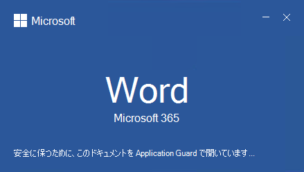

# <a name="application-guard-for-office-for-admins"></a><span data-ttu-id="b7928-105">管理者向け Application Guard for Office</span><span class="sxs-lookup"><span data-stu-id="b7928-105">Application Guard for Office for admins</span></span>

<span data-ttu-id="b7928-106">**適用対象:** Word、Excel、およびPowerPoint for Microsoft 365、Windows 10 Enterprise</span><span class="sxs-lookup"><span data-stu-id="b7928-106">**Applies to:** Word, Excel, and PowerPoint for Microsoft 365, Windows 10 Enterprise</span></span>

<span data-ttu-id="b7928-107">Microsoft Defender Application Guard Office (Application Guard for Office) は、信頼されていないファイルが信頼できるリソースにアクセスし、企業が新しい攻撃や新たな攻撃から安全にアクセスするのを防ぐのに役立ちます。</span><span class="sxs-lookup"><span data-stu-id="b7928-107">Microsoft Defender Application Guard for Office (Application Guard for Office) helps prevent untrusted files from accessing trusted resources, keeping your enterprise safe from new and emerging attacks.</span></span> <span data-ttu-id="b7928-108">この記事では、管理者が Application Guard for Office のプレビュー用にデバイスをセットアップする方法についてOffice。</span><span class="sxs-lookup"><span data-stu-id="b7928-108">This article walks admins through setting up devices for a preview of Application Guard for Office.</span></span> <span data-ttu-id="b7928-109">デバイス上でアプリケーション ガードを有効にするためのシステム要件とインストール手順Office提供します。</span><span class="sxs-lookup"><span data-stu-id="b7928-109">It provides information about system requirements and installation steps to enable Application Guard for Office on a device.</span></span>

## <a name="prerequisites"></a><span data-ttu-id="b7928-110">前提条件</span><span class="sxs-lookup"><span data-stu-id="b7928-110">Prerequisites</span></span>

### <a name="minimum-hardware-requirements"></a><span data-ttu-id="b7928-111">ハードウェアの最小要件</span><span class="sxs-lookup"><span data-stu-id="b7928-111">Minimum hardware requirements</span></span>

* <span data-ttu-id="b7928-112">**CPU**: 64 ビット、4 コア (物理または仮想)、仮想化拡張機能 (Intel VT-x OR AMD-V)、Core i5 同等以上の推奨</span><span class="sxs-lookup"><span data-stu-id="b7928-112">**CPU**: 64-bit, 4 cores (physical or virtual), virtualization extensions (Intel VT-x OR AMD-V), Core i5 equivalent or higher recommended</span></span>
* <span data-ttu-id="b7928-113">**物理メモリ**: 8 GB RAM</span><span class="sxs-lookup"><span data-stu-id="b7928-113">**Physical memory**: 8-GB RAM</span></span>
* <span data-ttu-id="b7928-114">**ハード ディスク**: システム ドライブ上の空き領域の 10 GB (SSD 推奨)</span><span class="sxs-lookup"><span data-stu-id="b7928-114">**Hard disk**: 10 GB of free space on the system drive (SSD recommended)</span></span>

### <a name="minimum-software-requirements"></a><span data-ttu-id="b7928-115">最小ソフトウェア要件</span><span class="sxs-lookup"><span data-stu-id="b7928-115">Minimum software requirements</span></span>

* <span data-ttu-id="b7928-116">**Windows 10**: Windows 10 Enterprise エディション、クライアント ビルド バージョン 2004 (20H1) ビルド 19041 以降</span><span class="sxs-lookup"><span data-stu-id="b7928-116">**Windows 10**: Windows 10 Enterprise edition, Client Build version 2004 (20H1) build 19041 or later</span></span>
* <span data-ttu-id="b7928-117">**Office**: Office チャネルと月次 Enterprise チャネルのビルド バージョン 2011 16.0.13530.10000 以降。</span><span class="sxs-lookup"><span data-stu-id="b7928-117">**Office**: Office Current Channel and Monthly Enterprise Channel, Build version 2011 16.0.13530.10000 or later.</span></span> <span data-ttu-id="b7928-118">32 ビットバージョンと 64 ビット バージョンの両方のOfficeサポートされています。</span><span class="sxs-lookup"><span data-stu-id="b7928-118">Both 32-bit and 64-bit versions of Office are supported.</span></span>
* <span data-ttu-id="b7928-119">**更新プログラム パッケージ**: Windows 10月次セキュリティ更新 [プログラム KB4571756](https://support.microsoft.com/help/4571756/windows-10-update-KB4571756)</span><span class="sxs-lookup"><span data-stu-id="b7928-119">**Update package**: Windows 10 cumulative monthly security update [KB4571756](https://support.microsoft.com/help/4571756/windows-10-update-KB4571756)</span></span>

<span data-ttu-id="b7928-120">システム要件の詳細については、「システム要件」を参照[Microsoft Defender Application Guard。](/windows/security/threat-protection/microsoft-defender-application-guard/reqs-md-app-guard)</span><span class="sxs-lookup"><span data-stu-id="b7928-120">For detailed system requirements, refer to [System requirements for Microsoft Defender Application Guard](/windows/security/threat-protection/microsoft-defender-application-guard/reqs-md-app-guard).</span></span> <span data-ttu-id="b7928-121">また、仮想化テクノロジを有効にする方法については、コンピューターの製造元のガイドを参照してください。</span><span class="sxs-lookup"><span data-stu-id="b7928-121">Also, please refer to your computer manufacturer's guides on how to enable virtualization technology.</span></span>
<span data-ttu-id="b7928-122">更新プログラム チャネルの詳細Office、更新プログラム[チャネルの概要を](/deployoffice/overview-update-channels)参照Microsoft 365。</span><span class="sxs-lookup"><span data-stu-id="b7928-122">To learn more about Office update channels, see [Overview of update channels for Microsoft 365](/deployoffice/overview-update-channels).</span></span>

### <a name="licensing-requirements"></a><span data-ttu-id="b7928-123">ライセンスの要件</span><span class="sxs-lookup"><span data-stu-id="b7928-123">Licensing requirements</span></span>

* <span data-ttu-id="b7928-124">Microsoft 365 E5またはMicrosoft 365 E5 Security</span><span class="sxs-lookup"><span data-stu-id="b7928-124">Microsoft 365 E5 or Microsoft 365 E5 Security</span></span>

## <a name="deploy-application-guard-for-office"></a><span data-ttu-id="b7928-125">アプリケーションのアプリケーション ガードを展開Office</span><span class="sxs-lookup"><span data-stu-id="b7928-125">Deploy Application Guard for Office</span></span>

### <a name="enable-application-guard-for-office"></a><span data-ttu-id="b7928-126">アプリケーションのアプリケーション ガードを有効Office</span><span class="sxs-lookup"><span data-stu-id="b7928-126">Enable Application Guard for Office</span></span>

1. <span data-ttu-id="b7928-127">累積的な毎月の **Windows 10 KB4571756 をダウンロードしてインストールします**。</span><span class="sxs-lookup"><span data-stu-id="b7928-127">Download and install **Windows 10 cumulative monthly security updates KB4571756**.</span></span>

2. <span data-ttu-id="b7928-128">[機能 **Microsoft Defender Application Guard] Windows** 選択し **、[OK] を選択します**。</span><span class="sxs-lookup"><span data-stu-id="b7928-128">Select **Microsoft Defender Application Guard** under Windows Features and  select **OK**.</span></span> <span data-ttu-id="b7928-129">Application Guard 機能を有効にすると、システムの再起動が促されます。</span><span class="sxs-lookup"><span data-stu-id="b7928-129">Enabling the Application Guard feature will prompt a system reboot.</span></span> <span data-ttu-id="b7928-130">今すぐ再起動するか、手順 3 の後に再起動することを選択できます。</span><span class="sxs-lookup"><span data-stu-id="b7928-130">You can choose to reboot now or after step 3.</span></span>

   ![WindowsAG を示す [機能] ダイアログ ボックス](../../media/ag03-deploy.png)

   <span data-ttu-id="b7928-132">この機能は、管理者として次の PowerShell コマンドを実行して有効にすることもできます。</span><span class="sxs-lookup"><span data-stu-id="b7928-132">The feature can also be enabled by running the following PowerShell command as administrator:</span></span>

   ```powershell
   Enable-WindowsOptionalFeature -online -FeatureName Windows-Defender-ApplicationGuard
   ```

3. <span data-ttu-id="b7928-133">管理モード **でMicrosoft Defender Application Guardを検索** し、グループ ポリシーを [コンピューター構成管理用テンプレート] Windows **\\ \\ でMicrosoft Defender Application Guard。 \\**</span><span class="sxs-lookup"><span data-stu-id="b7928-133">Search for **Microsoft Defender Application Guard in Managed Mode**, a group policy in **Computer Configuration\\Administrative Templates\\Windows Components\\Microsoft Defender Application Guard**.</span></span> <span data-ttu-id="b7928-134">[オプション] の値を **2** または **3** に設定し **、[OK]** または [適用] を選択して、このポリシーを有効 **にします**。</span><span class="sxs-lookup"><span data-stu-id="b7928-134">Turn on this policy by setting the value under Options as **2** or **3**, and then selecting **OK** or **Apply**.</span></span>

   

   <span data-ttu-id="b7928-136">代わりに、対応する CSP ポリシーを設定できます。</span><span class="sxs-lookup"><span data-stu-id="b7928-136">Instead, you can set the corresponding CSP policy:</span></span>

   > <span data-ttu-id="b7928-137">OMA-URI: **./Device/Vendor/MSFT/WindowsDefenderApplicationGuard/設定/AllowWindowsDefenderApplicationGuard**</span><span class="sxs-lookup"><span data-stu-id="b7928-137">OMA-URI: **./Device/Vendor/MSFT/WindowsDefenderApplicationGuard/Settings/AllowWindowsDefenderApplicationGuard**</span></span> <br> <span data-ttu-id="b7928-138">データ型: **整数**</span><span class="sxs-lookup"><span data-stu-id="b7928-138">Data type: **Integer**</span></span> <br> <span data-ttu-id="b7928-139">値: **2**</span><span class="sxs-lookup"><span data-stu-id="b7928-139">Value: **2**</span></span>

4. <span data-ttu-id="b7928-140">システムを再起動します。</span><span class="sxs-lookup"><span data-stu-id="b7928-140">Restart the system.</span></span>

### <a name="set-diagnostics--feedback-to-send-full-data"></a><span data-ttu-id="b7928-141">完全なデータ&送信する診断とフィードバックの設定</span><span class="sxs-lookup"><span data-stu-id="b7928-141">Set Diagnostics & feedback to send full data</span></span>

> [!NOTE]
> <span data-ttu-id="b7928-142">ただし、これは必須ではありません。ただし、オプションの診断データを構成すると、報告された問題の診断に役立ちます。</span><span class="sxs-lookup"><span data-stu-id="b7928-142">This is not required, however, configuring optional diagnostics data will help diagnose reported issues.</span></span>

<span data-ttu-id="b7928-143">この手順では、問題の特定と修正に必要なデータが Microsoft に届くという保証を行います。</span><span class="sxs-lookup"><span data-stu-id="b7928-143">This step ensures that the data necessary to identify and fix problems is reaching Microsoft.</span></span> <span data-ttu-id="b7928-144">次の手順に従って、デバイスで診断Windowsします。</span><span class="sxs-lookup"><span data-stu-id="b7928-144">Follow these steps to enable diagnostics on your Windows device:</span></span>

1. <span data-ttu-id="b7928-145">[**スタート設定** から開きます。</span><span class="sxs-lookup"><span data-stu-id="b7928-145">Open **Settings** from the Start menu.</span></span>

   ![[スタート] メニュー](../../media/ag05-diagnostic.png)

2. <span data-ttu-id="b7928-147">[プライバシー **Windows 設定]** を **選択します**。</span><span class="sxs-lookup"><span data-stu-id="b7928-147">On **Windows Settings**, select **Privacy**.</span></span>

   

3. <span data-ttu-id="b7928-149">[プライバシー] の下で、[診断 **&フィードバック] を選択し、[** オプションの **診断データ] を選択します**。</span><span class="sxs-lookup"><span data-stu-id="b7928-149">Under Privacy, select **Diagnostics & feedback** and select **Optional diagnostic data**.</span></span>

   ![[診断とフィードバック] メニュー](../../media/ag07a-diagnostic.png)

<span data-ttu-id="b7928-151">診断設定の構成Windows詳細については、「組織での診断[Windowsの構成」を参照してください](/windows/privacy/configure-windows-diagnostic-data-in-your-organization#enterprise-management)。</span><span class="sxs-lookup"><span data-stu-id="b7928-151">For more on configuring Windows diagnostic settings, refer to [Configuring Windows diagnostic data in your organization](/windows/privacy/configure-windows-diagnostic-data-in-your-organization#enterprise-management).</span></span>

### <a name="confirm-that-application-guard-for-office-is-enabled-and-working"></a><span data-ttu-id="b7928-152">アプリケーションの Application Guard が有効Office動作を確認する</span><span class="sxs-lookup"><span data-stu-id="b7928-152">Confirm that Application Guard for Office is enabled and working</span></span>

<span data-ttu-id="b7928-153">Application Guard for Office が有効になっているか確認する前に、ポリシーが展開されているデバイスで Word、Excel、PowerPoint を起動します。</span><span class="sxs-lookup"><span data-stu-id="b7928-153">Before confirming that Application Guard for Office is enabled, launch Word, Excel, or PowerPoint on a device where the policies have been deployed.</span></span> <span data-ttu-id="b7928-154">アクティブ化Office確認します。</span><span class="sxs-lookup"><span data-stu-id="b7928-154">Make sure Office is activated.</span></span> <span data-ttu-id="b7928-155">作業 ID を使用して、最初に製品のライセンス認証をOffice場合があります。</span><span class="sxs-lookup"><span data-stu-id="b7928-155">You may need to use your work identity to activate the Office product first.</span></span>

<span data-ttu-id="b7928-156">Application Guard for Officeが有効Office、Word、Excel、または PowerPointを起動し、信頼されていないドキュメントを開きます。</span><span class="sxs-lookup"><span data-stu-id="b7928-156">To confirm that Application Guard for Office is enabled, launch Word, Excel, or PowerPoint, and then open an untrusted document.</span></span> <span data-ttu-id="b7928-157">たとえば、インターネットからダウンロードされたドキュメントや、組織外のユーザーからの電子メールの添付ファイルを開きます。</span><span class="sxs-lookup"><span data-stu-id="b7928-157">For example, you can open a document that was downloaded from the internet or an email attachment from someone outside your organization.</span></span>

<span data-ttu-id="b7928-158">信頼されていないファイルを初めて開いた場合、次のOfficeのようなスプラッシュ画面が表示される場合があります。</span><span class="sxs-lookup"><span data-stu-id="b7928-158">When you first open an untrusted file, you may see an Office splash screen like the following example.</span></span> <span data-ttu-id="b7928-159">アプリケーション のアプリケーション ガードがアクティブ化され、Office開いている間、しばらくの間表示される場合があります。</span><span class="sxs-lookup"><span data-stu-id="b7928-159">It might be displayed for some time while Application Guard for Office is being activated and the file is being opened.</span></span> <span data-ttu-id="b7928-160">それ以降の信頼されていないファイルの開き方が速くなります。</span><span class="sxs-lookup"><span data-stu-id="b7928-160">Subsequent openings of untrusted files should be faster.</span></span>



<span data-ttu-id="b7928-162">開いていると、ファイルが Application Guard 内で開いて次のような視覚的なインジケーターが表示Office。</span><span class="sxs-lookup"><span data-stu-id="b7928-162">Upon being opened, the file should display a few visual indicators that the file was opened inside Application Guard for Office:</span></span>

* <span data-ttu-id="b7928-163">リボンの吹き出し</span><span class="sxs-lookup"><span data-stu-id="b7928-163">A callout in the ribbon</span></span>

  

* <span data-ttu-id="b7928-165">タスク バーにシールドが付くアプリケーション アイコン</span><span class="sxs-lookup"><span data-stu-id="b7928-165">The application icon with a shield in the taskbar</span></span>

  

## <a name="configure-application-guard-for-office"></a><span data-ttu-id="b7928-167">アプリケーション用の Application Guard を構成Office</span><span class="sxs-lookup"><span data-stu-id="b7928-167">Configure Application Guard for Office</span></span>

<span data-ttu-id="b7928-168">Office次のポリシーをサポートし、アプリケーション の機能を構成するために Application Guard をOffice。</span><span class="sxs-lookup"><span data-stu-id="b7928-168">Office supports the following policies to enable you to configure the capabilities of Application Guard for Office.</span></span> <span data-ttu-id="b7928-169">これらのポリシーは、グループ ポリシーまたはクラウド ポリシー サービスを使用[Office構成できます](/DeployOffice/overview-office-cloud-policy-service)。</span><span class="sxs-lookup"><span data-stu-id="b7928-169">These policies can be configured through Group policies or through the [Office cloud policy service](/DeployOffice/overview-office-cloud-policy-service).</span></span>
<span data-ttu-id="b7928-170">「User Configuration Administrative Templates Microsoft Office **\\ \\ 2016 \\ \\ \\** Security 設定 セキュリティ センター Application Guard」のグループ ポリシー設定を確認して、管理者による構成セットを参照してください。</span><span class="sxs-lookup"><span data-stu-id="b7928-170">See configuration set by your administrator by reviewing group policy settings in  **User Configuration\\Administrative Templates\\Microsoft Office 2016\\Security Settings\\Trust Center\\Application Guard**.</span></span>


> [!NOTE]
> <span data-ttu-id="b7928-171">これらのポリシーを構成すると、Application Guard で開いたファイルの一部の機能が無効Office。</span><span class="sxs-lookup"><span data-stu-id="b7928-171">Configuring these policies can disable some functionalities for files opened in Application Guard for Office.</span></span>

|<span data-ttu-id="b7928-172">ポリシー</span><span class="sxs-lookup"><span data-stu-id="b7928-172">Policy</span></span>|<span data-ttu-id="b7928-173">説明</span><span class="sxs-lookup"><span data-stu-id="b7928-173">Description</span></span>|
|---|---|
|<span data-ttu-id="b7928-174">アプリケーションに Application Guard を使用Office</span><span class="sxs-lookup"><span data-stu-id="b7928-174">Don't use Application Guard for Office</span></span>|<span data-ttu-id="b7928-175">このポリシーを有効にすると、Word、Excel、PowerPoint は、アプリケーション ガードの代わりに保護されたビュー分離コンテナーを使用Office。</span><span class="sxs-lookup"><span data-stu-id="b7928-175">Enabling this policy will force Word, Excel, and PowerPoint to use the Protected View isolation container instead of Application Guard for Office.</span></span> <span data-ttu-id="b7928-176">このポリシーを使用すると、アプリケーション の有効な状態をOfficeに問題がある場合に、アプリケーション ガードを一時的に無効Microsoft Edge。</span><span class="sxs-lookup"><span data-stu-id="b7928-176">This policy can be used to temporarily disable Application Guard for Office when there are issues in leaving it enabled for Microsoft Edge.</span></span>|
|<span data-ttu-id="b7928-177">コンテナーの事前作成Office Application Guard を構成する</span><span class="sxs-lookup"><span data-stu-id="b7928-177">Configure Application Guard for Office container pre-creation</span></span>|<span data-ttu-id="b7928-178">このポリシーは、信頼されていないファイルを分離Office Application Guard for Office、実行時のパフォーマンスを向上するために事前に作成されるかどうかを決定します。</span><span class="sxs-lookup"><span data-stu-id="b7928-178">This policy determines if the Application Guard for Office container, for isolating untrusted files, is pre-created for improved run-time performance.</span></span> <span data-ttu-id="b7928-179">この設定を有効にした場合は、コンテナーの事前作成を続行する日数を指定するか、Office 組み込みのヒューリスティックでコンテナーを事前に作成できます。</span><span class="sxs-lookup"><span data-stu-id="b7928-179">If you enable this setting, you can specify the number of days to continue pre-creating a container or let the Office built-in heuristic pre-create the container.</span></span>
|<span data-ttu-id="b7928-180">Application Guard で開いたドキュメントのコピー/貼りOffice貼り付けを許可Office</span><span class="sxs-lookup"><span data-stu-id="b7928-180">Don't allow copy/paste for Office documents opened in Application Guard for Office</span></span>|<span data-ttu-id="b7928-181">このポリシーを有効にすると、ユーザーは Application Guard for Office で開いたドキュメントから外部で開いたドキュメントにコンテンツをコピーして貼り付けできません。</span><span class="sxs-lookup"><span data-stu-id="b7928-181">Enabling this policy will prevent a user from copying and pasting content from a document opened in Application Guard for Office to a document opened outside of it.</span></span>|
|<span data-ttu-id="b7928-182">Application Guard でハードウェア アクセラレータを無効にして、Office</span><span class="sxs-lookup"><span data-stu-id="b7928-182">Disable hardware acceleration in Application Guard for Office</span></span>|<span data-ttu-id="b7928-183">このポリシーは、Application Guard for Officeハードウェア アクセラレータを使用してグラフィックスをレンダリングするかどうかを制御します。</span><span class="sxs-lookup"><span data-stu-id="b7928-183">This policy controls whether Application Guard for Office uses hardware acceleration to render graphics.</span></span> <span data-ttu-id="b7928-184">この設定を有効にすると、Application Guard for Office はソフトウェア ベース (CPU) レンダリングを使用し、サードパーティのグラフィックス ドライバーを読み込むか、接続されているグラフィックス ハードウェアを操作しません。</span><span class="sxs-lookup"><span data-stu-id="b7928-184">If you enable this setting, Application Guard for Office uses software-based (CPU) rendering and won't load any third-party graphics drivers or interact with any connected graphics hardware.</span></span>
|<span data-ttu-id="b7928-185">Application Guard でサポートされていないファイルの種類の保護を無効にOffice</span><span class="sxs-lookup"><span data-stu-id="b7928-185">Disable unsupported file types protection in Application Guard for Office</span></span>|<span data-ttu-id="b7928-186">このポリシーは、Application Guard for Officeサポートされていないファイルの種類を開くことをブロックするか、保護されたビューへのリダイレクトを有効にするかどうかを制御します。</span><span class="sxs-lookup"><span data-stu-id="b7928-186">This policy controls whether Application Guard for Office will block unsupported file types from being opened or if it will enable the redirection to Protected View.</span></span>
|<span data-ttu-id="b7928-187">Application Guard で開いたドキュメントのカメラとマイクへのアクセスをオフOffice</span><span class="sxs-lookup"><span data-stu-id="b7928-187">Turn off camera and microphone access for documents opened in Application Guard for Office</span></span>|<span data-ttu-id="b7928-188">このポリシーを有効にすると、Application Guard OfficeのカメラとマイクへのアクセスがOffice。</span><span class="sxs-lookup"><span data-stu-id="b7928-188">Enabling this policy will remove Office access to the camera and microphone inside Application Guard for Office.</span></span>|
|<span data-ttu-id="b7928-189">Application Guard で開いたドキュメントからの印刷を制限Office</span><span class="sxs-lookup"><span data-stu-id="b7928-189">Restrict printing from documents opened in Application Guard for Office</span></span>|<span data-ttu-id="b7928-190">このポリシーを有効にすると、ユーザーが Application Guard で開いたファイルから印刷できるプリンターが制限Office。</span><span class="sxs-lookup"><span data-stu-id="b7928-190">Enabling this policy will limit the printers that a user can print to from a file opened in Application Guard for Office.</span></span> <span data-ttu-id="b7928-191">たとえば、このポリシーを使用して、ユーザーに PDF への印刷のみを制限できます。</span><span class="sxs-lookup"><span data-stu-id="b7928-191">For example, you can use this policy to restrict users to only print to PDF.</span></span>|
|<span data-ttu-id="b7928-192">ユーザーがファイルに対する保護のために Application Guard をOffice防ぐ</span><span class="sxs-lookup"><span data-stu-id="b7928-192">Prevent users from removing Application Guard for Office protection on files</span></span>|<span data-ttu-id="b7928-193">このポリシーを有効にすると、Office アプリケーション エクスペリエンス内で) オプションが削除され、Office 保護のために Application Guard を無効にしたり、Application Guard for Office の外部でファイルを開くOffice。</span><span class="sxs-lookup"><span data-stu-id="b7928-193">Enabling this policy will remove the option (within the Office application experience) to disable Application Guard for Office protection or to open a file outside Application Guard for Office.</span></span> <p> <span data-ttu-id="b7928-194">**注:** ユーザーは、ファイルから mark-of-the-web プロパティを手動で削除するか、ドキュメントを信頼できる場所に移動することによって、このポリシーをバイパスできます。</span><span class="sxs-lookup"><span data-stu-id="b7928-194">**Note:** Users can still bypass this policy by manually removing the mark-of-the-web property from the file or by moving a document to a Trusted location.</span></span>|
|

> [!NOTE]
> <span data-ttu-id="b7928-195">次のポリシーでは、ユーザーがサインアウトして再度サインインして、Windowsを有効にする必要があります。</span><span class="sxs-lookup"><span data-stu-id="b7928-195">The following policies will require the user to sign out and sign in again to Windows to take effect:</span></span>
>
> * <span data-ttu-id="b7928-196">Application Guard で開いたドキュメントのコピー/貼り付けを無効にOffice</span><span class="sxs-lookup"><span data-stu-id="b7928-196">Disable copy/paste for documents opened in Application Guard for Office</span></span>
> * <span data-ttu-id="b7928-197">Application Guard で開いたドキュメントの印刷を制限Office</span><span class="sxs-lookup"><span data-stu-id="b7928-197">Restrict printing for documents opened in Application Guard for Office</span></span>
> * <span data-ttu-id="b7928-198">Application Guard で開いたドキュメントへのカメラとマイクのアクセスをオフOffice</span><span class="sxs-lookup"><span data-stu-id="b7928-198">Turn off camera and mic access to documents opened in Application Guard for Office</span></span>

## <a name="submit-feedback"></a><span data-ttu-id="b7928-199">フィードバックの送信</span><span class="sxs-lookup"><span data-stu-id="b7928-199">Submit feedback</span></span>

### <a name="submit-feedback-via-feedback-hub"></a><span data-ttu-id="b7928-200">フィードバック ハブ経由でフィードバックを送信する</span><span class="sxs-lookup"><span data-stu-id="b7928-200">Submit feedback via Feedback Hub</span></span>

<span data-ttu-id="b7928-201">Application Guard for Officeを起動するときに問題が発生した場合は、フィードバック ハブからフィードバックを送信してください。</span><span class="sxs-lookup"><span data-stu-id="b7928-201">If you encounter any issues when launching Application Guard for Office, you're encouraged to submit your feedback via Feedback Hub:</span></span>

1. <span data-ttu-id="b7928-202">フィードバック ハブ **アプリを開き** 、サインインします。</span><span class="sxs-lookup"><span data-stu-id="b7928-202">Open the **Feedback Hub app** and sign in.</span></span>

2. <span data-ttu-id="b7928-203">Application Guard の起動中にエラー ダイアログが表示される場合は、エラー ダイアログで **[Microsoft** に報告] を選択して、新しいフィードバックの送信を開始します。</span><span class="sxs-lookup"><span data-stu-id="b7928-203">If you get an error dialog while launching Application Guard, select **Report to Microsoft** in the error dialog to start a new feedback submission.</span></span> <span data-ttu-id="b7928-204">それ以外の場合は <https://aka.ms/mdagoffice-fb> 、Application Guard **+ &nbsp;** の適切なカテゴリを選択し、[新しいフィードバックを追加する] を選択します。</span><span class="sxs-lookup"><span data-stu-id="b7928-204">Otherwise, navigate to <https://aka.ms/mdagoffice-fb> to select the correct category for Application Guard, then select **+&nbsp;Add new feedback** near the top right.</span></span>

3. <span data-ttu-id="b7928-205">[フィードバックの概要] ボックス **に** 、まだ入力されていない場合の概要を入力します。</span><span class="sxs-lookup"><span data-stu-id="b7928-205">Enter a summary in the **Summarize your feedback** box if it isn't already filled in for you.</span></span>

4. <span data-ttu-id="b7928-206">[詳細な説明] ボックスに、発生した問題の詳細な説明と実行した手順を **入力** し、[次へ] を **選択します**。</span><span class="sxs-lookup"><span data-stu-id="b7928-206">Enter a detailed description of the issue that you experienced and what steps you took in the **Explain in more detail** box, then select **Next**.</span></span>

5. <span data-ttu-id="b7928-207">[問題] の横にあるバブルを **選択します**。</span><span class="sxs-lookup"><span data-stu-id="b7928-207">Select the bubble next to **Problem**.</span></span> <span data-ttu-id="b7928-208">選択したカテゴリが [セキュリティとプライバシー] Microsoft Defender Application Guard **\> – Officeし、[次へ**] を選択 **します**。</span><span class="sxs-lookup"><span data-stu-id="b7928-208">Make sure the category selected is **Security and Privacy \> Microsoft Defender Application Guard – Office**, then select **Next**.</span></span>

6. <span data-ttu-id="b7928-209">[新 **しいフィードバック] を選択** し、[次へ] **を選択します**。</span><span class="sxs-lookup"><span data-stu-id="b7928-209">Select **New feedback**, then **Next**.</span></span>

7. <span data-ttu-id="b7928-210">問題に関するトレースを収集します。</span><span class="sxs-lookup"><span data-stu-id="b7928-210">Collect traces about the issue:</span></span>

   1. <span data-ttu-id="b7928-211">[自分の **問題の再作成] タイルを** 展開します。</span><span class="sxs-lookup"><span data-stu-id="b7928-211">Expand the **Recreate my problem** tile.</span></span>

   2. <span data-ttu-id="b7928-212">Application Guard の実行中に発生する問題が発生した場合は、Application Guard インスタンスを開きます。</span><span class="sxs-lookup"><span data-stu-id="b7928-212">If the issue you're experiencing occurs while Application Guard is running, open an Application Guard instance.</span></span> <span data-ttu-id="b7928-213">インスタンスを開く場合、Application Guard コンテナー内から追加のトレースを収集できます。</span><span class="sxs-lookup"><span data-stu-id="b7928-213">Opening an instance allows additional traces to be collected from within the Application Guard container.</span></span>

   3. <span data-ttu-id="b7928-214">[ **記録の開始]** を選択し、タイルの回転が停止するのを待ち、録音を *停止* します。</span><span class="sxs-lookup"><span data-stu-id="b7928-214">Select **Start recording**, and wait for the tile to stop spinning and say *Stop recording*.</span></span>

   4. <span data-ttu-id="b7928-215">Application Guard の問題を完全に再現します。</span><span class="sxs-lookup"><span data-stu-id="b7928-215">Fully reproduce the issue with Application Guard.</span></span> <span data-ttu-id="b7928-216">再現には、Application Guard インスタンスを起動しようとして失敗するまで待機したり、実行中の Application Guard インスタンスで問題を再現したりすることがあります。</span><span class="sxs-lookup"><span data-stu-id="b7928-216">Reproduction might include attempting to launch an Application Guard instance and waiting until it fails, or reproducing an issue in a running Application Guard instance.</span></span>

   5. <span data-ttu-id="b7928-217">[記録の **停止] タイルを選択** します。</span><span class="sxs-lookup"><span data-stu-id="b7928-217">Select the **Stop recording** tile.</span></span>

   6. <span data-ttu-id="b7928-218">送信後数分間でも、実行中の Application Guard インスタンスを開いた状態にしておき、コンテナー診断も収集できます。</span><span class="sxs-lookup"><span data-stu-id="b7928-218">Keep any running Application Guard instance(s) open, even for a few minutes after submission, so that container diagnostics can also be collected.</span></span>

8. <span data-ttu-id="b7928-219">問題に関連するスクリーンショットやファイルを添付します。</span><span class="sxs-lookup"><span data-stu-id="b7928-219">Attach any relevant screenshots or files related to the problem.</span></span>

9. <span data-ttu-id="b7928-220">[**送信**] を選択します。</span><span class="sxs-lookup"><span data-stu-id="b7928-220">Select **Submit**.</span></span>

### <a name="submit-feedback-via-office-customer-voice"></a><span data-ttu-id="b7928-221">カスタマー ボイスからフィードバックOffice送信する</span><span class="sxs-lookup"><span data-stu-id="b7928-221">Submit feedback via Office Customer Voice</span></span>

<span data-ttu-id="b7928-222">また、Application Guard でドキュメントを開いたOffice問題が発生した場合は、Officeからフィードバックを送信できます。</span><span class="sxs-lookup"><span data-stu-id="b7928-222">You may also submit feedback from within Office if the issue happens when Office documents are opened in Application Guard.</span></span> <span data-ttu-id="b7928-223">フィードバックの送信[については、「Officeインサイ](https://insider.office.com/handbook)ダー ハンドブック」を参照してください。</span><span class="sxs-lookup"><span data-stu-id="b7928-223">Refer to the [Office Insider Handbook](https://insider.office.com/handbook) for submitting feedback.</span></span>

## <a name="integration-with-microsoft-defender-for-endpoint-and-microsoft-defender-for-office-365"></a><span data-ttu-id="b7928-224">エンドポイント向け Microsoft Defender と Microsoft Defender との統合とOffice 365</span><span class="sxs-lookup"><span data-stu-id="b7928-224">Integration with Microsoft Defender for Endpoint and Microsoft Defender for Office 365</span></span>

<span data-ttu-id="b7928-225">Application Guard for Office Microsoft Defender for Endpoint と統合され、分離された環境で発生する悪意のあるアクティビティの監視とアラートを提供します。</span><span class="sxs-lookup"><span data-stu-id="b7928-225">Application Guard for Office is integrated with Microsoft Defender for Endpoint to provide monitoring and alerting on malicious activity that happens in the isolated environment.</span></span>

<span data-ttu-id="b7928-226">[セーフ E365 E5](/microsoft-365/security/office-365-security/safe-docs)のドキュメントは、Microsoft Defender for Endpoint を使用して、アプリケーション ガードで開いたドキュメントをスキャンして、ユーザーのOffice。</span><span class="sxs-lookup"><span data-stu-id="b7928-226">[Safe Documents in Microsoft E365 E5](/microsoft-365/security/office-365-security/safe-docs) is a feature that uses Microsoft Defender for Endpoint to scan documents opened in Application Guard for Office.</span></span> <span data-ttu-id="b7928-227">追加の保護層では、スキャンの結果が決定されるまで、ユーザーはアプリケーションOfficeアプリケーション ガードから離れることができます。</span><span class="sxs-lookup"><span data-stu-id="b7928-227">For an additional layer of protection, users can't leave Application Guard for Office until the results of the scan have been determined.</span></span>

<span data-ttu-id="b7928-228">Microsoft Defender for Endpoint は、エンタープライズ ネットワークが高度な脅威を防止、検出、調査、および対応するために設計されたセキュリティ プラットフォームです。</span><span class="sxs-lookup"><span data-stu-id="b7928-228">Microsoft Defender for Endpoint is a security platform designed to help enterprise networks prevent, detect, investigate, and respond to advanced threats.</span></span> <span data-ttu-id="b7928-229">このプラットフォームの詳細については [、「Microsoft Defender for Endpoint」を参照してください](https://www.microsoft.com/microsoft-365/windows/microsoft-defender-atp)。</span><span class="sxs-lookup"><span data-stu-id="b7928-229">For more details about this platform, see [Microsoft Defender for Endpoint](https://www.microsoft.com/microsoft-365/windows/microsoft-defender-atp).</span></span> <span data-ttu-id="b7928-230">このプラットフォームへのデバイスのオンボーディングの詳細については、「デバイスを Microsoft Defender for Endpoint Service にオンボードする [」を参照してください](/windows/security/threat-protection/microsoft-defender-atp/onboard-configure)。</span><span class="sxs-lookup"><span data-stu-id="b7928-230">To learn more about onboarding devices to this platform, see [Onboard devices to the Microsoft Defender for Endpoint service](/windows/security/threat-protection/microsoft-defender-atp/onboard-configure).</span></span>

<span data-ttu-id="b7928-231">また、Defender for Endpoint で動作Office 365 Microsoft Defender を構成できます。</span><span class="sxs-lookup"><span data-stu-id="b7928-231">You can also configure Microsoft Defender for Office 365 to work with Defender for Endpoint.</span></span> <span data-ttu-id="b7928-232">詳細については、「Integrate [Defender for Office 365 Microsoft Defender for Endpoint」を参照してください](integrate-office-365-ti-with-mde.md)。</span><span class="sxs-lookup"><span data-stu-id="b7928-232">For more info, refer to [Integrate Defender for Office 365 with Microsoft Defender for Endpoint](integrate-office-365-ti-with-mde.md).</span></span>

## <a name="limitations-and-considerations"></a><span data-ttu-id="b7928-233">制限事項と考慮事項</span><span class="sxs-lookup"><span data-stu-id="b7928-233">Limitations and considerations</span></span>

* <span data-ttu-id="b7928-234">Application Guard for Office は、信頼されていないドキュメントを分離して、信頼できる企業リソース、イントラネット、ユーザーの ID、およびコンピューター上の任意のファイルにアクセスできない保護モードです。</span><span class="sxs-lookup"><span data-stu-id="b7928-234">Application Guard for Office is a protected mode that isolates untrusted documents so that they can't access trusted corporate resources, an intranet, the user's identity, and arbitrary files on the computer.</span></span> <span data-ttu-id="b7928-235">その結果、ユーザーがそのようなアクセスに依存する機能 (たとえば、ディスク上のローカル ファイルから画像を挿入する) にアクセスしようとすると、アクセスは失敗し、次の例のようなプロンプトが表示されます。</span><span class="sxs-lookup"><span data-stu-id="b7928-235">As a result, if a user tries to access a feature that has a dependency on such access—for example, inserting a picture from a local file on disk—the access will fail and produce a prompt like the following example.</span></span> <span data-ttu-id="b7928-236">信頼されていないドキュメントが信頼できるリソースにアクセスするには、ドキュメントから Application Guard 保護を削除する必要があります。</span><span class="sxs-lookup"><span data-stu-id="b7928-236">To enable an untrusted document to access trusted resources, users must remove Application Guard protection from the document.</span></span>

  ![[安全を保つために、この機能は使用できません] というダイアログ ボックス](../../media/ag10-limitations.png)

  > [!NOTE]
  > <span data-ttu-id="b7928-238">ユーザーに対して、ファイルとそのソースを信頼している場合、または保護元を信頼している場合にのみ、保護を削除する必要があります。</span><span class="sxs-lookup"><span data-stu-id="b7928-238">Advise users to only remove protection if they trust the file and its source or where it came from.</span></span>

* <span data-ttu-id="b7928-239">マクロやコントロールのようなドキュメント内のアクティブ なActiveXは、アプリケーション ガードで無効Office。</span><span class="sxs-lookup"><span data-stu-id="b7928-239">Active content in documents like macros and ActiveX controls are disabled in Application Guard for Office.</span></span> <span data-ttu-id="b7928-240">アクティブ なコンテンツを有効にするには、Application Guard 保護を削除する必要があります。</span><span class="sxs-lookup"><span data-stu-id="b7928-240">Users need to remove Application Guard protection to enable active content.</span></span>

* <span data-ttu-id="b7928-241">Application Guard で読み取り専用として開いている別の組織の OneDrive、OneDrive for Business、または SharePoint Online から共有されたネットワーク共有またはファイルからの信頼されていないファイル。</span><span class="sxs-lookup"><span data-stu-id="b7928-241">Untrusted files from network shares or files shared from OneDrive, OneDrive for Business, or SharePoint Online from a different organization open as read-only in Application Guard.</span></span> <span data-ttu-id="b7928-242">ユーザーは、そのようなファイルのローカル コピーを保存してコンテナー内で作業を続行したり、元のファイルを直接操作するために保護を削除することができます。</span><span class="sxs-lookup"><span data-stu-id="b7928-242">Users can save a local copy of such files to continue working in the container or remove protection to directly work with the original file.</span></span>

* <span data-ttu-id="b7928-243">Information Rights Management (IRM) によって保護されているファイルは、既定でブロックされます。</span><span class="sxs-lookup"><span data-stu-id="b7928-243">Files that are protected by Information Rights Management (IRM) are blocked by default.</span></span> <span data-ttu-id="b7928-244">ユーザーが保護されたビューでこのようなファイルを開く場合、管理者は、組織のサポートされていないファイルの種類のポリシー設定を構成する必要があります。</span><span class="sxs-lookup"><span data-stu-id="b7928-244">If users want to open such files in Protected View, an administrator must configure policy settings for unsupported file types for the organization.</span></span>

* <span data-ttu-id="b7928-245">Application Guard for OfficeアプリケーションをOfficeするカスタマイズは、ユーザーがサインアウトして再度サインインした後、またはデバイスが再起動した後も保持されません。</span><span class="sxs-lookup"><span data-stu-id="b7928-245">Any customizations to Office applications in Application Guard for Office won't persist after a user signs out and signs in again or after the device restarts.</span></span>

* <span data-ttu-id="b7928-246">UIA フレームワークを使用するアクセシビリティ ツールのみ、アプリケーション ガードで開いたファイルに対してアクセス可能なエクスペリエンスを提供Office。</span><span class="sxs-lookup"><span data-stu-id="b7928-246">Only Accessibility tools that use the UIA framework can provide an accessible experience for files opened in Application Guard for Office.</span></span>

* <span data-ttu-id="b7928-247">インストール後に Application Guard を最初に起動するには、ネットワーク接続が必要です。</span><span class="sxs-lookup"><span data-stu-id="b7928-247">Network connectivity is required for the first launch of Application Guard after installation.</span></span> <span data-ttu-id="b7928-248">Application Guard がライセンスを検証するには、接続が必要です。</span><span class="sxs-lookup"><span data-stu-id="b7928-248">Connectivity is required for Application Guard to validate the license.</span></span>

* <span data-ttu-id="b7928-249">ドキュメントの情報セクションでは、Last *Modified By* プロパティに **WDAGUtilityAccount** がユーザーとして表示される場合があります。</span><span class="sxs-lookup"><span data-stu-id="b7928-249">In the document's info section, the *Last Modified By* property may display **WDAGUtilityAccount** as the user.</span></span> <span data-ttu-id="b7928-250">WDAGUtilityAccount は、Application Guard で構成された匿名ユーザーです。</span><span class="sxs-lookup"><span data-stu-id="b7928-250">WDAGUtilityAccount is the anonymous user configured in Application Guard.</span></span> <span data-ttu-id="b7928-251">デスクトップ ユーザーの ID は Application Guard コンテナー内で共有されていない。</span><span class="sxs-lookup"><span data-stu-id="b7928-251">The desktop user's identity isn't shared inside the Application Guard container.</span></span>

## <a name="performance-optimizations-for-application-guard-for-office"></a><span data-ttu-id="b7928-252">アプリケーション用 Application Guard のパフォーマンスOffice</span><span class="sxs-lookup"><span data-stu-id="b7928-252">Performance optimizations for Application Guard for Office</span></span>

<span data-ttu-id="b7928-253">このセクションでは、Application Guard で使用されるパフォーマンスの最適化の概要をOffice。</span><span class="sxs-lookup"><span data-stu-id="b7928-253">This section provides an overview of the performance optimizations used in Application Guard for Office.</span></span> <span data-ttu-id="b7928-254">この情報は、Application Guard が有効な場合に、管理者がシステムまたはシステム全体Officeのパフォーマンスに関連するユーザーからのレポートを診断するのに役立ちます。</span><span class="sxs-lookup"><span data-stu-id="b7928-254">This information can help administrators diagnose reports from users related to the performance of Office or the overall system when Application Guard is enabled.</span></span>

<span data-ttu-id="b7928-255">Application Guard は仮想化コンテナーを使用して、信頼されていないドキュメントをシステムから分離します。</span><span class="sxs-lookup"><span data-stu-id="b7928-255">Application Guard uses a virtualized container to isolate untrusted documents away from the system.</span></span> <span data-ttu-id="b7928-256">コンテナーを作成し、Application Guard コンテナーをセットアップして Office ドキュメントを開くプロセスでは、パフォーマンスのオーバーヘッドが発生し、ユーザーが信頼できないドキュメントを開く際のユーザー エクスペリエンスに悪影響を及ぼす可能性があります。</span><span class="sxs-lookup"><span data-stu-id="b7928-256">The process of creating a container and setting up the Application Guard container to open Office documents has a performance overhead that might negatively affect user experience when users open an untrusted document.</span></span>

<span data-ttu-id="b7928-257">必要なファイルを開くエクスペリエンスをユーザーに提供するために、Application Guard はロジックを使用して、システムで次のヒューリスティックが満たされている場合にコンテナーを事前に作成します。ユーザーが過去 28 日間に保護ビューまたは Application Guard でファイルを開いた。</span><span class="sxs-lookup"><span data-stu-id="b7928-257">To provide users with the expected file-opening experience, Application Guard uses logic to pre-create a container when the following heuristic is met on a system: A user has opened a file in either Protected View or Application Guard in the past 28 days.</span></span>

<span data-ttu-id="b7928-258">このヒューリスティックが満たされた場合、Office ユーザーがサインインした後、ユーザーの Application Guard コンテナーを事前に作成Windows。</span><span class="sxs-lookup"><span data-stu-id="b7928-258">When this heuristic is met, Office will pre-create an Application Guard container for the user after they sign in to Windows.</span></span> <span data-ttu-id="b7928-259">この事前作成操作の進行中に、システムのパフォーマンスが低下する可能性がありますが、操作が完了するとすぐに効果が解決されます。</span><span class="sxs-lookup"><span data-stu-id="b7928-259">While this pre-create operation is in progress, the system may experience slow performance, but the effect will resolve as soon as the operation completes.</span></span>

> [!NOTE]
> <span data-ttu-id="b7928-260">ヒューリスティックがコンテナーを事前に作成するために必要なヒントは、ユーザーがコンテナーを使用Officeアプリケーションによって生成されます。</span><span class="sxs-lookup"><span data-stu-id="b7928-260">The hints needed for the heuristic to pre-create the container are generated by Office applications as a user uses them.</span></span> <span data-ttu-id="b7928-261">ユーザーが Application Guard が有効になっている新しいシステムに Office をインストールした場合、Office は、ユーザーがシステムで信頼されていないドキュメントを初めて開くまで、コンテナーを事前に作成しません。</span><span class="sxs-lookup"><span data-stu-id="b7928-261">If a user installs Office on a new system where Application Guard is enabled, Office will not pre-create the container until after the first time a user opens an untrusted document on the system.</span></span> <span data-ttu-id="b7928-262">ユーザーは、この最初のファイルが Application Guard で開くのに時間がかかるのを確認します。</span><span class="sxs-lookup"><span data-stu-id="b7928-262">The user will observe that this first file takes longer to open in Application Guard.</span></span>

## <a name="known-issues"></a><span data-ttu-id="b7928-263">既知の問題</span><span class="sxs-lookup"><span data-stu-id="b7928-263">Known issues</span></span>

* <span data-ttu-id="b7928-264">Web リンク ( または `http` `https` ) を選択しても、ブラウザーは開かれません。</span><span class="sxs-lookup"><span data-stu-id="b7928-264">Selecting web links (`http` or `https`) doesn't open the browser.</span></span>
* <span data-ttu-id="b7928-265">Application Guard で開かれたドキュメントにリッチ テキスト形式 (RTF) コンテンツまたは画像Office貼り付けは、現時点ではサポートされていません。</span><span class="sxs-lookup"><span data-stu-id="b7928-265">Pasting rich text format (RTF) content or images in Office documents opened with Application Guard isn't supported at this time.</span></span>
* <span data-ttu-id="b7928-266">サポートされていないファイルの種類保護ポリシーの既定の設定は、信頼されていないサポートされていないファイルの種類の Information Rights Management (IRM)、CSV、または HTML の開きをブロックすることです。</span><span class="sxs-lookup"><span data-stu-id="b7928-266">The default setting for unsupported file types protection policy is to block opening untrusted unsupported file types of Information Rights Management (IRM), CSV, or HTML.</span></span>
* <span data-ttu-id="b7928-267">.NET を更新すると、Application Guard でファイルが開かない場合があります。</span><span class="sxs-lookup"><span data-stu-id="b7928-267">Updates to .NET might cause files to fail to open in Application Guard.</span></span> <span data-ttu-id="b7928-268">回避策として、ユーザーは、このエラーが発生した場合にデバイスを再起動できます。</span><span class="sxs-lookup"><span data-stu-id="b7928-268">As a workaround, users can restart their device when they come across this failure.</span></span> <span data-ttu-id="b7928-269">この問題の詳細については、「サンドボックスを開く際にエラー メッセージを受け取[Windows Defender Application Guard」Windowsします](https://support.microsoft.com/help/4575917/receiving-an-error-message-when-attempting-to-open-windows-defender-ap)。</span><span class="sxs-lookup"><span data-stu-id="b7928-269">Learn more about the issue at [Receiving an error message when attempting to open Windows Defender Application Guard or Windows Sandbox](https://support.microsoft.com/help/4575917/receiving-an-error-message-when-attempting-to-open-windows-defender-ap).</span></span>
