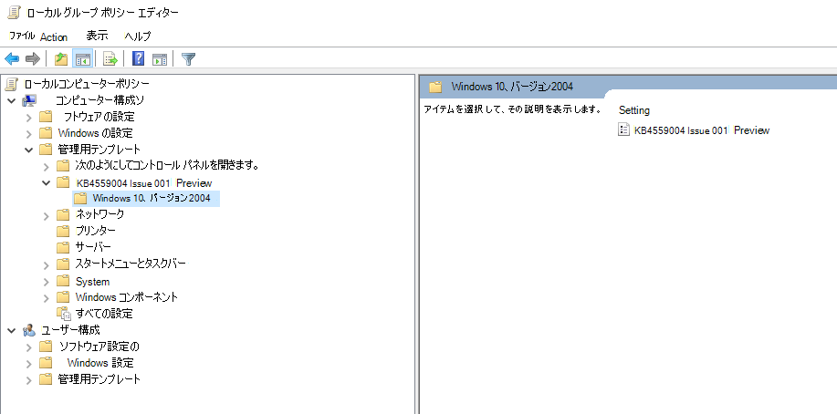

# <a name="application-guard-for-office-public-preview-for-admins"></a>管理者向けの Office 用アプリケーションガード (パブリックプレビュー)


**適用対象:** Word、Excel、および PowerPoint for Microsoft 365、Windows 10 Enterprise

>[!IMPORTANT]
>一部の情報は、市販される前に大幅に変更される可能性がある prereleased 製品に関連しています。 Microsoft makes no warranties, express or implied, with respect to the information provided here.


Microsoft Defender Application Guard for Office (Application Guard for Office) は、信頼されていないファイルが信頼されたリソースにアクセスしないようにすることにより、新しい攻撃や新たな攻撃からエンタープライズを保護します。 この記事では、管理者が Office 用 Application Guard のプレビュー用のデバイスをセットアップする手順を説明します。 デバイス上の Office 用 Application Guard を有効にするためのシステム要件とインストール手順に関する情報を提供します。

## <a name="prerequisites"></a>前提条件

### <a name="minimum-hardware-requirements"></a>ハードウェアの最小要件

* **CPU**:64 ビット、4コア (物理または仮想)、仮想化拡張機能 (Intel VT-x または AMD-V)、コア i5 同等またはそれ以上推奨
* **物理メモリ**: 8 GB の RAM
* **ハードディスク**: システムドライブに 10 GB の空き領域 (SSD を推奨)

### <a name="minimum-software-requirements"></a>最小ソフトウェア要件

* **Windows 10**: Windows 10 Enterprise Edition、クライアントビルドバージョン 2004 (20H1) ビルド19041
* **Office**: Office ベータチャネルビルドバージョン 2008 16.0.13212 以降
* **更新プログラムパッケージ**: 毎月の Windows 10 累積セキュリティ更新プログラム [KB4566782](https://support.microsoft.com/help/4566782/windows-10-update-kb4566782) 

システム要件の詳細については、「 [Microsoft Defender Application Guard のシステム要件](https://docs.microsoft.com/windows/security/threat-protection/microsoft-defender-application-guard/reqs-md-app-guard)」を参照してください。 Office Insider Preview ビルドの詳細については、「 [Office insider ビルドの展開の](https://insider.office.com/business/deploy)概要」を参照してください。

### <a name="licensing-requirements"></a>ライセンスの要件
* Microsoft 365 E5 または Microsoft 365 E5 セキュリティ

## <a name="deploy-application-guard-for-office"></a>Office 用 Application Guard を展開する

### <a name="enable-application-guard-for-office"></a>Office 用 Application Guard を有効にする

1.  **Windows 10 累積された毎月のセキュリティ更新プログラム KB4566782**をダウンロードしてインストールします。 

2. [**Office 機能有効化パッケージの Application Guard を**](https://download.microsoft.com/download/e/4/c/e4c1180a-fcff-462a-8324-4151c44973a8/Windows%20Preview%20-%20WDAG%20Office%20070920%2001.msi)ダウンロードしてインストールします。 このパッケージでは、[ **コンピューターの構成 \ 管理用テンプレート**] の下に "KB4559004 Issue 001 Preview" というグループポリシーがインストールされます。 このグループポリシーを **有効**に設定します。
     

     

    次のレジストリキーを直接設定することもできます。 
    
    ```
    reg add HKLM\SYSTEM\CurrentControlSet\Policies\Microsoft\FeatureManagement\Overrides /v 3457697930 /t REG_DWORD /d 1 
    ```
    ```
    reg add HKLM\SYSTEM\CurrentControlSet\Policies\Microsoft\FeatureManagement\Overrides /v 94539402 /t REG_DWORD /d 1 
    ```
    次に、次の PowerShell コマンドを実行します。 
    
    ```powershell
    Get-ScheduledTask -TaskName "ReconcileFeatures" -TaskPath "\Microsoft\Windows\Flighting\FeatureConfig\" | Start-ScheduledTask 
    ```

3.  [Windows の機能] の下にある [ **Microsoft Defender Application Guard** ] を選択し、[ **OK]** を選択します。 Application Guard 機能を有効にすると、システムの再起動が求められます。 今すぐ再起動するか、手順4の後で再起動するかを選択できます。

    ![AG が表示されている [Windows の機能] ダイアログボックス](../../media/ag03-deploy.png)
    
    この機能は、管理者として次の PowerShell コマンドを実行することによって有効にすることもできます。 

    ```powershell
    Enable-WindowsOptionalFeature -online -FeatureName Windows-Defender-ApplicationGuard 
    ```

4.  「 **コンピューターの構成 \\ 管理用テンプレート \\ Windows コンポーネント \\ microsoft defender application guard**」にある「管理モードグループポリシー」の「microsoft defender application Guard」を参照してください。 [オプション] の値を **2** または **3** に設定し、[ **OK]** または [ **適用**] を選択して、このポリシーを有効にします。

    
  
    または、対応する CSP ポリシーを設定することもできます。 

    OMA URI: **./Device/Vendor/MSFT/WindowsDefenderApplicationGuard/Settings/AllowWindowsDefenderApplicationGuard** 
    <br>データ型: **Integer** 
    <br>値: **2**


5.  システムを再起動します。

### <a name="set-diagnostics--feedback-to-send-full-data"></a>完全なデータを送信するための診断 & フィードバックの設定

この手順により、問題を特定して修正するために必要なデータが Microsoft に届くことが保証されます。 Windows デバイスで診断を有効にするには、次の手順を実行します。

1.  [スタート] メニューから [ **設定** ] を開きます。

    ![[スタート] メニュー](../../media/ag05-diagnostic.png)

2.  [ **Windows の設定**] で、[ **プライバシー**] を選択します。

    ![[Windows の設定] メニュー](../../media/ag06-diagnostic.png)

3.  [プライバシー] で [ **診断 &** ] を選択し、[ **オプションの診断データ**] を選択します。

    ![[診断とフィードバック] メニュー](../../media/ag07a-diagnostic.png)

Windows 診断設定の構成の詳細については、「 [組織で windows 診断データを構成する」](https://docs.microsoft.com/windows/privacy/configure-windows-diagnostic-data-in-your-organization#enterprise-management)を参照してください。

### <a name="confirm-that-application-guard-for-office-is-enabled-and-working"></a>Office 用アプリケーションガードが有効で動作していることを確認する

Office の Application Guard が有効になっていることを確認する前に、ポリシーが展開されているデバイスで Word、Excel、または PowerPoint を起動します。 Office がライセンス認証されていることを確認します。 最初に Office 製品のライセンス認証を行うには、職場の id を使用する必要がある場合があります。

Office 用アプリケーションキラーが有効になっていることを確認するために、Word、Excel、または PowerPoint を起動して、信頼されていないドキュメントを開きます。 たとえば、インターネットからダウンロードしたドキュメントや、組織外のユーザーからの電子メール添付ファイルを開くことができます。

信頼されていないファイルが初めて起動されたときに、次のような Office スプラッシュスクリーンが表示されることがあります。 Application Guard for Office がアクティブ化され、ファイルが開かれている間、しばらくの間は表示されることがあります。 信頼されていないファイルの以降の起動は高速になります。


ファイルを開くときに、ファイルが Application Guard for Office の内部で開かれたことを示す視覚的なインジケーターがいくつか表示されます。

* リボンの吹き出し

    
* タスクバーに盾があるアプリケーションアイコン 

    


## <a name="configure-application-guard-for-office"></a>Office 用 Application Guard を構成する
Office では、次のポリシーをサポートして、Office 用 Application Guard の機能を構成することができます。 これらのポリシーは、グループポリシーまたは Office クラウドポリシーサービスを使用して構成できます。 

>[!NOTE] 
> これらのポリシーは近日中に利用可能になります。
>また、これらのポリシーを構成すると、Application Guard for Office で開かれたファイルの一部の機能を無効にすることができます。

| ポリシー                                                                          | 説明                                                                                                                                                                                                                                                                                             |
|---------------------------------------------------------------------------------|---------------------------------------------------------------------------------------------------------------------------------------------------------------------------------------------------------------------------------------------------------------------------------------------------------|
| Office 用 Application Guard を無効にする                                            | このポリシーを有効にすると、Word、Excel、および PowerPoint で、Office の Application Guard ではなく、保護されたビューの分離コンテナーが使用されるようになります。 このポリシーを使用すると、エッジを有効にしたままでも問題が発生した場合に、Office の Application Guard を一時的に無効にすることができます。                                  |
| Application Guard で開いたドキュメントのコピー/貼り付けを無効にする                    | このポリシーを有効にすると、ユーザーは Application Guard for Office で開かれているドキュメントから外部で開いているドキュメントにコンテンツをコピーして貼り付けることができなくなります。                                                                                                                                   |
| ユーザーがファイルの Application Guard 保護を削除できないようにする               | このポリシーを有効にすると、(Office アプリケーションの環境内) のオプションが削除され、Application Guard 保護を無効にするか、Application Guard の外部でファイルを開くことができます。 <br><br>**注:** ユーザーは、このポリシーを引き続きバイパスできます。このプロパティは、ファイルから手動で削除するか、ドキュメントを信頼できる場所に移動します。 |
| Application Guard で開いたドキュメントからの印刷を制限する                    | このポリシーを有効にすると、ユーザーが Application Guard for Office で開いているファイルから印刷できるプリンターが制限されます。 たとえば、このポリシーを使用すると、ユーザーが PDF のみに印刷されるように制限することができます。                              |
| Application Guard で開いたドキュメントのカメラとマイクへのアクセスをオフにする | このポリシーを有効にすると、office の Application Guard 内のカメラおよびマイクへの Office アクセスが削除されます。                                                                                                                                                                                                     |
>[!NOTE] 
>次のポリシーでは、ユーザーがログオフし、Windows に再ログインして有効にする必要があります。
> 
> *  Application Guard で開いたドキュメントのコピー/貼り付けを無効にする
>*  Application Guard で開いたドキュメントの印刷を制限する
> *  Application Guard で開かれたドキュメントへのカメラおよびマイクアクセスをオフにする


## <a name="submit-feedback"></a>フィードバックの送信

### <a name="submit-feedback-via-feedback-hub"></a>フィードバックハブ経由でフィードバックを送信する

Office の Application Guard を起動するときに問題が発生した場合は、フィードバックハブからフィードバックを送信することをお勧めします。

1.  [ **フィードバックハブアプリ** ] を開き、サインインします。

2.  Application Guard の起動中にエラーダイアログが表示された場合は、[エラー] ダイアログで [ **Microsoft に報告** する] を選択して、新しいフィードバック提出を開始します。 それ以外の場合は、に移動して <https://aka.ms/wdagoffice-fb> Application Guard の適切なカテゴリを選択し、右上にある [ **+ 新しいフィードバックの追加** ] を選択します。

3.  [フィードバックを **要約** する] ボックスに入力します (まだ入力されていない場合)。

4.  発生した問題についての詳細な説明と必要な手順を記入し **て、[** **次へ**] を選択します。

5.  [問題] の横にある [バブル] を選択します。 選択したカテゴリが [ **セキュリティとプライバシー] \> Microsoft Defender Application Guard – Office**] であることを確認して、[ **次へ**] を選択します。

6.  [ **新しいフィードバック**] を選択し、[ **次へ**] をクリックします。

7.  次の問題に関するトレースを収集します。

    1. **[問題の再作成**] タイルを展開します。

    2.  Application Guard の実行中に発生している問題が発生した場合は、Application Guard インスタンスを開きます。 これにより、Application Guard コンテナー内から追加のトレースを収集できます。

    3.  [ **録音を開始** する] を選択し、タイルが回転を停止するのを待ち、 *録音を停止*します。

    4.  問題を Application Guard に完全に再現します。 これには、Application Guard インスタンスを起動し、障害が発生するまで待機する、または実行中の Application Guard インスタンスで問題を再現しようとする場合があります。

    5.  [ **記録終了** ] タイルを選択します。

    6.  実行中の Application Guard インスタンス/s は、送信後数分まで開いたままにしておき、コンテナーの診断を収集することもできます。

8.  問題に関連するすべてのスクリーンショットまたはファイルを添付します。

9.  **[送信]** を選択します。


### <a name="submit-feedback-via-office-customer-voice"></a>Office のお客様の声でフィードバックを送信する

Office ドキュメントを Application Guard で開いたときに問題が発生した場合は、Office からフィードバックを送信することもできます。 フィードバックを送信するには、「 [Office Insider ハンドブック](https://insider.office.com/handbook) 」を参照してください。

## <a name="integration-with-microsoft-defender-atp-and-office-atp"></a>Microsoft Defender ATP および Office ATP との統合

Office 用 Application Guard は Microsoft Defender 前貸し脅威保護 (ATP) と統合されており、分離環境で発生する悪意のあるアクティビティについての監視と警告を提供します。

Microsoft Defender ATP は、企業ネットワークによる、高度な脅威の防止、検出、調査、応答を支援するように設計されたセキュリティプラットフォームです。 このプラットフォームの詳細については、 [Microsoft Defender Advanced Threat Protection](https://www.microsoft.com/microsoft-365/windows/microsoft-defender-atp) ページを参照してください。 オンボードデバイスのこのプラットフォームへのオンボードデバイスの詳細について [は、「Microsoft DEFENDER ATP サービス」を](https://docs.microsoft.com/windows/security/threat-protection/microsoft-defender-atp/onboard-configure)参照してください。

また、Microsoft Defender ATP を使用するように Office 365 ATP を構成することもできます。 [Microsoft DEFENDER atp を使用した Office 365 atp の統合](https://docs.microsoft.com/microsoft-365/security/office-365-security/integrate-office-365-ti-with-wdatp?view=o365-worldwide)を参照してください。

## <a name="limitations-and-considerations"></a>制限事項と考慮事項

* Office の Application Guard は、信頼されていないドキュメントを分離して、信頼された企業リソース、イントラネット、ユーザーの id、およびコンピューター上に存在する任意のファイルにアクセスする制限モードです。 そのため、ユーザーがそのようなアクセスに依存している機能にアクセスしようとすると、たとえば、ディスク上のローカルファイルから画像を挿入しようとしたときに、エラーが発生し、次のようなプロンプトが表示されます。 信頼されていないドキュメントが信頼できるリソースにアクセスできるようにするには、ユーザーはドキュメントから Application Guard protection を削除する必要があります。

    

    >[!NOTE]    
    >ファイルとそのソースまたはそのソースが信頼されている場合にのみ保護を解除するようにユーザーにアドバイスします。

* Application Guard for Office では、マクロや ActiveX コントロールなどのドキュメント内のアクティブコンテンツは無効になります。 ユーザーは、active コンテンツを有効にするために Application Guard protection を削除する必要があります。

* ネットワーク共有または OneDrive、OneDrive for Business、または別の組織から共有されているファイルから開かれた信頼されていないファイルは、Application Guard で読み取り専用として開きます。 ユーザーは、そのようなファイルのローカルコピーを保存して、コンテナーで作業を続けたり、保護を解除して元のファイルを直接操作したりできます。

* Information Rights Management (IRM) で保護されているファイルは、引き続き保護されたビューで開きます。
* Application Guard for Office の Office アプリケーションに対するカスタマイズは、ユーザーがログオフし、デバイスを再度ログインまたは再起動した後に保持されません。 

* UIA framework を使用するアクセシビリティツールのみが、Application Guard for Office で開かれたファイルにアクセスできる操作を提供できます。

* インストール後に Application Guard を最初に起動するには、ネットワーク接続が必要です。 これは、Application Guard がライセンスを検証するために必要です。
* ドキュメントの [情報] セクションの [ *最終更新者* ] プロパティには、ユーザーとして Wdagutility アカウントが表示されることがあります。 これは、デスクトップユーザーの id が Application Guard コンテナー内で共有されていない場合に、Application Guard で構成された匿名ユーザーです。 

## <a name="performance-optimizations-for-application-guard"></a>Application Guard のパフォーマンスの最適化 

このセクションでは、Office 用 Application Guard で使用されるパフォーマンス最適化の概要について説明します。 この情報は、Application Guard が有効になっている場合に、Office またはシステム全体のパフォーマンスに関連するユーザーからレポートを診断するために役立ちます。 

Application Guard は、仮想化されたコンテナーを使用して、信頼されていないドキュメントをシステムから分離します。 コンテナーを作成し、Application Guard コンテナーを設定して Office ドキュメントを開くプロセスでは、ユーザーが信頼されていないドキュメントを開くときに、ユーザーの操作に悪影響を及ぼす可能性のあるパフォーマンスオーバーヘッドが発生します。 


アプリケーションガードは、予想されるファイルを開く操作をユーザーに提供するために、ロジックを使用して、次のヒューリスティックがシステムで満たされている場合に、コンテナーを事前に作成します。ユーザーが過去28日間に、保護ビューまたは Application Guard のいずれかでファイルを開いた。 

このヒューリスティックが満たされている場合、Office は Windows にログインした後に、ユーザーの Application Guard コンテナーを事前に作成します。 この作成前操作が進行中の場合、システムのパフォーマンスが低下する可能性があります。 操作が完了すると、これはすぐに解決されます。 


>[!NOTE] 
>コンテナーを事前に作成するために使用されるヒューリスティックに必要なヒントは、ユーザーが Office アプリケーションを使用しているときに生成されます。 ユーザーが、Application Guard が有効になっている新しいシステムに Office をインストールした場合、Office は、ユーザーがシステム上で信頼されていないドキュメントを初めて開いたときまで、コンテナーを事前に作成しません。 この最初のファイルは Application Guard で開くのに時間がかかることをユーザーに確認します。 

## <a name="known-issues-in-preview"></a>プレビューでの既知の問題

* [Web リンク] を ```http``` クリック ```https``` しても、ブラウザーは開きません。 
* .NET の更新により、Application Guard でファイルが開くことができなくなります。 回避策として、この問題が発生したときにユーザーがデバイスを再起動することができます。
    [Windows Defender Application Guard または Windows サンドボックスを開こうとすると、エラーメッセージが表示](https://support.microsoft.com/help/4575917/receiving-an-error-message-when-attempting-to-open-windows-defender-ap)される問題の詳細について説明します。
