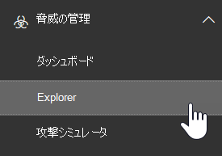

# エンドポイントの Microsoft Defender と Office 365 の Microsoft Defender を併用する

[!INCLUDE [Microsoft 365 Defender rebranding](../includes/microsoft-defender-for-office.md)]

Microsoft defender [For Office 365](office-365-atp.md)は、[エンドポイントの microsoft defender](https://docs.microsoft.com/windows/security/threat-protection)と連携するように構成できます。

Microsoft defender for Office 365 とエンドポイントの Microsoft Defender を統合することで、ユーザーのデバイスが危険にさらされている場合に、セキュリティ運用チームが迅速に監視し、アクションを実行することができます。 たとえば、統合が有効になると、セキュリティ運用チームは、検出された電子メールメッセージによって影響を受ける可能性があるデバイスを確認したり、エンドポイント用 Microsoft Defender のデバイスに対して生成された最近の通知の数を表示したりできます。 

次の図は、エンドポイントの統合を有効にした状態で、[ **デバイス** ] タブがどのようなものかを示しています。
  

  
この例では、検出された電子メールメッセージの受信者に4つのデバイスがあり、1つに通知があることがわかります。 デバイスのリンクをクリックすると、Microsoft Defender セキュリティセンター () にそのページが表示さ [https://securitycenter.windows.com](https://securitycenter.windows.com) れます。

> [!TIP]
> **[Microsoft Defender セキュリティセンター](https://docs.microsoft.com/windows/security/threat-protection/microsoft-defender-atp/use)** (エンドポイントポータルの microsoft defender とも呼ばれます) の詳細については、こちらを参照してください。
  
## 要件

- 組織には、Microsoft Defender for Office 365 (または Office 365 E5) および Microsoft Defender for Endpoint が必要です。
    
- [セキュリティ/ &amp; コンプライアンスセンター](https://protection.office.com)では、全体管理者であるか、セキュリティ管理者の役割 (セキュリティ管理者など) が割り当てられている必要があります。 ( [セキュリティ &amp; コンプライアンスセンターのアクセス許可を](permissions-in-the-security-and-compliance-center.md)参照)
    
- セキュリティ & コンプライアンスセンターと Microsoft Defender セキュリティセンターの両方の [エクスプローラー (またはリアルタイム検出)](threat-explorer.md) にアクセスできる必要があります。
    
## Microsoft defender for Office 365 とエンドポイントの microsoft defender を統合するには

Microsoft defender for Office 365 とエンドポイントの Microsoft Defender との統合は、セキュリティ & コンプライアンスセンターと Microsoft Defender セキュリティセンターの両方を使用して行います。
  
1. グローバル管理者またはセキュリティ管理者として、に移動して、に [https://protection.office.com](https://protection.office.com) サインインします。 (これにより、Office 365 セキュリティ & コンプライアンスセンターに移動します。)
    
2. ナビゲーションウィンドウで、[**脅威管理** エクスプローラー] を選択し  >  **Explorer** ます。  
    
3. 画面の右上隅で、[ **エンドポイント設定] に [Defender**] を選択します。
    
4. [エンドポイントの接続の Microsoft defender] ダイアログボックスで、[ **エンドポイントの Microsoft defender への接続**] をオンにします。  
    
5. Microsoft Defender セキュリティセンター () に移動 [https://securitycenter.windows.com](https://securitycenter.windows.com) します。

6. ナビゲーションバーで、[ **設定**] を選択します。 [ **全般**] で、[ **高度な機能**] を選択します。

7. [ **Office 365 の脅威インテリジェンス接続**] まで下にスクロールし、接続をオンにします。  

## 関連記事

[Office 365 の脅威の調査および応答機能](office-365-ti.md)
  
[Microsoft Defender for Office 365](office-365-atp.md)
  
[Microsoft Defender for Endpoint](https://docs.microsoft.com/windows/security/threat-protection)
