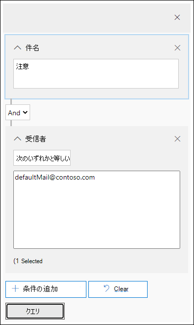

# Office 365 で配信された悪意のある電子メールを調査および修復する

[Office 365 Advanced Threat Protection](office-365-atp.md)を使用すると、組織内のユーザーにリスクがあるというアクティビティを調査し、組織を保護するための処置を取ることができます。 たとえば、組織のセキュリティチームに属している場合は、配信された不審な電子メールメッセージを見つけて調査することができます。 これを行うには、[脅威エクスプローラー (またはリアルタイムの検出)](threat-explorer.md)を使用します。
  
## 開始する前に

次の要件が満たされていることを確認してください。
  
- 組織では、 [Office 365 Advanced Threat Protection](office-365-atp.md)と[ライセンスがユーザーに割り当てら](../../admin/manage/assign-licenses-to-users.md)れています。
    
- 組織の[監査ログ](../../compliance/turn-audit-log-search-on-or-off.md)が有効になっている。 
    
- 組織には、スパム対策、マルウェア対策、フィッシング対策などに対して定義されたポリシーがあります。 「 [Office 365 の脅威から保護](protect-against-threats.md)する」を参照してください。
    
- グローバル管理者であるか、セキュリティ管理者、またはセキュリティ&amp; /コンプライアンスセンターで割り当てられている検索および削除の役割を持っているかどうか。 [ &amp;セキュリティ/コンプライアンスセンターの「アクセス許可」を](permissions-in-the-security-and-compliance-center.md)参照してください。 操作によっては、新しいプレビューの役割が割り当てられている必要もあります。 

#### ロールの権限のプレビュー

メッセージヘッダーの表示や電子メールメッセージのコンテンツのダウンロードなどの特定のアクションを実行するには、別の適切な役割グループに*プレビュー*が追加された新しい役割を持っている必要があります。 次の表で、必要な役割とアクセス許可を明確にします。

|アクティビティ  |役割グループ |必要なプレビューの役割  |
|---------|---------|---------|
|脅威エクスプローラー (およびリアルタイム検出) を使用して脅威を分析する     |グローバル管理者   セキュリティ管理者   セキュリティ閲覧者     | いいえ   |
|脅威エクスプローラー (およびリアルタイム検出) を使用して、電子メールメッセージのヘッダーを表示し、検疫された電子メールメッセージをプレビューしてダウンロードする    |グローバル管理者   セキュリティ管理者  セキュリティ閲覧者   |       いいえ  |
|脅威エクスプローラーを使用してヘッダーを表示し、メールボックスに配信された電子メールメッセージをダウンロードする     |グローバル管理者  セキュリティ管理者   セキュリティ閲覧者   Preview   |   はい      |

> [!NOTE]
> *プレビュー*は役割であり、役割グループではありません。Office 365 の既存の役割グループにプレビューの役割を追加する必要があります。 グローバル管理者の役割には、Microsoft 365 管理センター[https://admin.microsoft.com](https://admin.microsoft.com)() が割り当てられており、セキュリティ管理者およびセキュリティリーダーの役割はセキュリティ[https://protection.office.com](https://protection.office.com)& コンプライアンスセンター () で割り当てられます。 役割とアクセス許可の詳細については、「[セキュリティ & コンプライアンスセンター」の「アクセス許可](permissions-in-the-security-and-compliance-center.md)」を参照してください。

## 配信された疑わしいメールを見つけて削除する

脅威エクスプローラーは、メッセージの検索と削除、悪意のある電子メールの送信者の IP アドレスの識別、さらなる調査のためのインシデントの開始など、複数の目的に使用できる強力なレポートです。 次の手順では、エクスプローラーを使用して受信者のメールボックスから悪意のある電子メールを検索し、削除する方法について説明します。

> [!NOTE]
> 現在、エクスプローラーでの既定の検索には Zapped の項目は含まれていません。  これは、マルウェアまたはフィッシングのようなビューなど、すべてのビューに適用されます。 Zapped アイテムを含めるには、' 配信アクション ' セットを追加して、「削除による ZAP」を含める必要があります。 すべてのオプションを含めると、Zapped アイテムを含むすべての配信アクションの結果が表示できます。

1. [**脅威エクスプローラー] に移動**し[https://protection.office.com](https://protection.office.com)ます。「Office 365 の職場または学校アカウントを使用してサインインする」に移動します。 これにより、セキュリティ&amp;コンプライアンスセンターに移動します。

2. 左側のナビゲーションサイドリンクバーで、[**脅威管理** \> **エクスプローラー**] を選択します。

    

    <!-- You may notice the new **Special actions** column. This feature is aimed at telling admins the outcome of processing an email. The **Special actions** column can be accessed in the same place as **Delivery action** and **Delivery location**. Special actions might be updated at the end of Threat Explorer's email timeline, which is a new feature aimed at making the hunting experience better for admins.-->

3. **脅威エクスプローラーのビュー**: [**表示**] メニューで、[**すべての電子メール**] を選択します。

    ![脅威エクスプローラの [表示] メニュー、および電子メールのマルウェア、フィッシング、提出、およびすべての電子メールオプション。また、コンテンツマルウェアの場合もあります。](../../media/tp-InvestigateMalEmail-viewmenu.png)

    現在、*マルウェア*の表示は既定の設定であり、マルウェアの脅威が検出されたメールをキャプチャします。 *フィッシング*ビューは、フィッシングの場合と同じように動作します。

    ただし、*すべての電子メール*ビューは、脅威が検出されたかどうかにかかわらず、組織が受信するすべてのメールを一覧表示します。 想像できるように、これは大量のデータなので、このビューにはフィルターを適用するように求めるプレースホルダーが表示されます。 (このビューは、ATP P2 のお客様に対してのみ使用できます。)

    *提出*されたメールは、管理者またはユーザーが Microsoft に報告したすべてのメールを表示します。

4. **脅威エクスプローラーでの検索とフィルター**: 検索バーのページの上部にフィルターが表示され、管理者が調査を行うのに役立ちます。 複数のフィルターを同時に適用して、検索を絞り込むために複数のコンマで区切られた値をフィルターに追加することに注意してください。 次の点に注意してください。
    - フィルターは、ほとんどのフィルター条件を完全に一致させます。
    - 件名フィルターは、CONTAINS クエリを使用します。
    - URL フィルターは、プロトコルを使用してもしなくても機能しません (例、 https)。
    - URL ドメイン、URL パス、URL ドメインおよびパスフィルターは、フィルター処理のためにプロトコルを必要としません。
    - フィルターの値を変更して関連性の高い結果を取得するたびに、[最新の情報に更新] アイコンをクリックする必要があります。

5. **高度なフィルター**: これらのフィルターを使用すると、複雑なクエリを作成し、データセットをフィルター処理できます。 [*高度なフィルター* ] をクリックすると、ポップアップが表示され、オプションが表示されます。

   高度なフィルター処理は、検索機能に優れています。 ブール値フィルターは、*受信者*、*送信者*、および*送信者ドメイン*で導入され、管理者が値を除外して調査できるようにし**ています**。 このオプションは、[選択パラメーター*には含ま*れません] の下に表示されます。 管理者が通知メールボックス、既定の返信メールボックスを調査から除外することはでき**ません**。これは、管理者が特定の件名 (subject = "アテンション") を検索し、受信者が*defaultMail@contoso.com のいずれ*にも設定できない場合に便利です。 これは厳密な値の検索です。

   

   *時間でのフィルター処理によっ*て、組織のセキュリティチームが迅速にドリルダウンされます。 最短許容期間は30分です。 タイムフレーム (3 時間前に発生したなど) で疑わしいアクションを絞り込むことができる場合は、コンテキストを制限し、問題を特定するのに役立ちます。

  ![[時間によるフィルタリング] オプションを選択すると、セキュリティチームが処理する必要のあるデータの量を絞り込むことができ、最短時間は30分です。](../../media/tp-InvestigateMalEmail-FilterbyHours.png)

6. **脅威エクスプローラーのフィールド**: 脅威エクスプローラは、*配信アクション*、*配信場所*、*特別なアクション*、*方向性*、*オーバーライド*、 *URL の脅威*など、より多くのセキュリティ関連のメール情報を公開します。 また、組織のセキュリティチームがより確実に調査を行うこともできます。 

    *配信アクション*は、既存のポリシーまたは検出のために電子メールに対して実行されたアクションです。 電子メールで実行可能なアクションは次のとおりです。
    - **配信**済み–電子メールはユーザーの受信トレイまたはフォルダーに配信され、ユーザーは直接アクセスできます。
    - **Junked** (迷惑メールに配信)-電子メールは、ユーザーの迷惑メールフォルダーまたは削除済みフォルダーに送信され、ユーザーは迷惑メールまたは削除されたフォルダー内の電子メールメッセージにアクセスできます。
    - [**ブロック**済み]: 検疫された、失敗した、または削除された電子メールメッセージ。 (ユーザーが完全にアクセスすることはできません。)
    - [**置換**] –悪意のある添付ファイルが、添付ファイルが悪意のあるファイルに置き換えられた場合の電子メール

    **配信先**: 配信場所フィルターは、管理者が悪意のあるメールが終了した場所と、それに対して実行された操作を把握するために使用できます。 結果のデータをスプレッドシートにエクスポートできます。 可能な配信場所は次のとおりです。
    - **受信トレイまたはフォルダー** –メールルールに従って、受信トレイまたは特定のフォルダーに電子メールが送信されます。
    - **オンプレミスまたは外部**–メールボックスはクラウドには存在しませんが、オンプレミスになっています。
    - **迷惑メールフォルダー** –電子メールはユーザーの迷惑メールフォルダーにあります。
    - **削除済みアイテムフォルダー** –電子メールはユーザーの [削除済みアイテム] フォルダーにあります。
    - **検疫**–検疫内の電子メール。ユーザーのメールボックスには含まれません。
    - **Failed** –メールがメールボックスに到達できませんでした。
    - **削除**されました。メールフロー内の任意の場所で電子メールが失われました。

    **方向性**: このオプションを使用すると、セキュリティ運用チームがメールの送信元または移行先の「direction」によってフィルター処理を行うことができます。 方向性の値は、*受信*、*送信*、および*組織内*(外部から組織に入ってくるメールに対応するもの、組織外から送信されるもの、組織内に内部で送信されるものなど) です。 この情報によって、セキュリティ運用チームは、方向性の値 (例. *受信*) と、送信者のドメイン (内部ドメインとして*表示*されます) は、明らかになります。 方向性の値は独立しており、メッセージの追跡とは異なる場合があります。 結果をスプレッドシートにエクスポートできます。

    **Overrides**: このフィルターは、メールの [詳細] タブに表示される情報を取得し、それを使用*して、* メールの受信を許可またはブロックするための組織またはユーザーポリシーを公開します。 このフィルターの最も重要な点は、組織のセキュリティチームが構成によって配信された疑わしいメールの数を確認するのに役立つということです。 これにより、許可とブロックを必要に応じて変更する機会が得られます。 このフィルターの結果セットは、スプレッドシートにエクスポートできます。

|脅威エクスプローラーのオーバーライド  | 意味  |
|---------|---------|
|組織のポリシーによって許可される     |   組織のポリシーによって指示されたメールボックスへのメールが許可されています。       |
|組織のポリシーによるブロック      |  組織のポリシーに従ってメールボックスへの配信がブロックされました。    |
|組織のポリシーによってブロックされるファイル拡張子     | 組織のポリシーによって指示されたように、ファイルはメールボックスへの配信がブロックされました。        |
|ユーザーポリシーによって許可される     | メールボックスには、ユーザーポリシーによって指示されたとおりにメールが許可されていました。        |
|ユーザーポリシーによるブロック     | ユーザーポリシーの指示に従ってメールボックスへの配信がブロックされました。        |

**Url の脅威**: url によって提示される脅威を示すために、[url の脅威] フィールドが電子メールの [*詳細*] タブに含まれています。 URL によって提示される脅威には、*マルウェア*、*フィッシング*、*スパム*が含まれる可能性があります。脅威のない url は、[脅威] セクションでは*何も**ありません*。

7. **電子メールのタイムラインビュー**: これ以上調査するには、セキュリティ運用チームが電子メールの詳細を掘り下げなければならない可能性があります。 電子メールタイムラインを使用すると、管理者は電子メールの配信から配信後のアクションを表示できます。 電子メールのタイムラインを表示するには、電子メールメッセージの件名をクリックし、[電子メールのタイムライン] をクリックします。 (概要や詳細など、パネル上の他の見出しの中に表示されます)。これらの結果は、スプレッドシートにエクスポートできます。

    電子メールのタイムラインには、電子メールのすべての配信イベントと配信後イベントを示すテーブルが表示されます。 その他のアクションが電子メールに存在しない場合、元の配信に対して1つのイベントが表示されます。これは、*ブロック*された場合など、verdict のように、*フィッシング*のようになります。 管理者は、すべての電子メールのタイムラインをエクスポートできます。これには、タブおよび電子メールのすべての詳細 (たとえば、件名、送信者、受信者、ネットワーク、メッセージ ID など) が含まれます。 メールが到着した後に発生したイベントを理解するために、さまざまな場所をチェックするのにかかる時間が短くなるため、電子メールのタイムラインはランダム化されます。 複数のイベントが電子メールで同時に発生するか、または同じ時刻になると、それらのイベントはタイムラインビューに表示されます。

8. **プレビュー/ダウンロード**: 脅威エクスプローラは、疑わしい電子メールを調査するために必要な詳細をセキュリティ運用チームに提供します。 セキュリティ運用チームは、次のいずれかを実行できます。

    - [配信アクションと場所を確認](#check-the-delivery-action-and-location)します。

    - [メールのタイムラインを表示](#view-the-timeline-of-your-email)します。

    ##### 配信アクションと場所を確認する

    [脅威エクスプローラー (およびリアルタイムの検出)](threat-explorer.md)で、[前の**配信状態**] 列ではなく、**配信アクション**と**配信場所**の列が作成されました。 この結果、電子メールメッセージがどこにあるかをより完全に把握できます。 この変更の目的の1つは、調査をセキュリティ運用チームにとって簡単にすることですが、最終的に問題の電子メールメッセージの場所をひとめで把握することになります。

    配信状態は、次の2つの列に分けられました。

    - **配信アクション**-この電子メールの状態は何ですか。

    - **配信場所**-この電子メールは、結果としてルーティングされましたか?

    配信アクションは、既存のポリシーまたは検出のために電子メールに対して実行されたアクションです。 電子メールで実行可能なアクションは次のとおりです。

    - **配信**済み–電子メールはユーザーの受信トレイまたはフォルダーに配信され、ユーザーは直接アクセスできます。

    - **Junked** –電子メールがユーザーの迷惑フォルダーまたは削除されたフォルダーに送信され、ユーザーは迷惑メールまたは削除されたフォルダー内の電子メールメッセージにアクセスできる。

    - [**ブロック**済み]: 検疫された、失敗した、または削除された電子メールメッセージ。 (ユーザーが完全にアクセスすることはできません。)

    - [**置換**] –悪意のある添付ファイルが、添付ファイルが悪意のあるファイルに置き換えられた場合の電子メール。
 
    [配信場所] には、配信後に実行されるポリシーと検出の結果が表示されます。 配信アクションにリンクされています。 このフィールドは、問題のメールが検出されたときに実行される処理を把握するために追加されました。 配信場所の指定可能な値は次のとおりです。

    - **受信トレイまたはフォルダー** –メールが受信トレイまたはフォルダーにある (メールルールに従って)。

    - **オンプレミスまたは外部**–メールボックスがクラウド上に存在していますが、オンプレミスになっています。

    - **迷惑メールフォルダー** –電子メールはユーザーの迷惑メールフォルダーにあります。

    - **削除済みアイテムフォルダー** –電子メールはユーザーの [削除済みアイテム] フォルダーにあります。

    - **検疫**–検疫内の電子メール。ユーザーのメールボックスには含まれません。

    - **Failed** –メールがメールボックスに到達できませんでした。

    - **削除**–メールフロー内の任意の場所に電子メールが失われます。

     ##### メールのタイムラインを表示する
  
     **電子メールタイムライン**は、セキュリティ運用チームにとって使いやすいようにするための脅威エクスプローラーのフィールドです。 電子メールで複数のイベントが同時に発生するか、または同じ時刻に近いときに、これらのイベントがタイムラインビューに表示されます。 電子メールへの配信後に発生する一部のイベントは、[**特殊なアクション**] 列に記録されます。 メールメッセージのタイムラインからの情報と、配信後に実行された特別な操作によって、管理者はポリシーと脅威の処理についての洞察を得ることができます (メールがルーティングされた場所や、場合によっては最終的な評価は何かなど)。

<!-- Reference material

1. **Navigate to Threat Explorer**: Go to [https://protection.office.com](https://protection.office.com) and sign in using your work or school account for Office 365. This takes you to the Security &amp; Compliance Center. 

2. In the left navigation quick-launch, choose **Threat management** \> **Explorer**.

3. Click on the subject of an email message, and then click **Email timeline**. (It appears among other headings on the panel like **Summary** or **Details**.)

    Once you've opened the email timeline, you should see a table that tells you the post-delivery events for that mail. In the case of no further events for the email, you should see a single event for the original delivery that states a result like **Blocked** with a verdict like **Phish**. The tab also has the option to export the entire email timeline, and this exports all the details on the tab and details on the email (things like Subject, Sender, Recipient, Network, and Message ID).

    The email timeline cuts down on randomization because there is less time spent checking different locations to try to understand events that happened since the email arrived. When multiple events happen at, or close to, the same time on an email, those events show up in a timeline view. 
    
    Some events that happen post-delivery to your mail are captured in the **Special actions** column. Combining the information from the email timeline along with special actions taken on email post-delivery gives admins insight into how their policies work, where the email was finally routed, and, in some cases, what the final assessment was. 

4. In the **View** menu, choose **All email**.

    
  
    Notice the labels that appear in the report, such as **Delivered**, **Unknown**, or **Delivered to junk**.

    
    
    (Depending on the actions that were taken on email messages for your organization, you might see other labels, such as **Blocked** or **Replaced**.)
    
5. In the report, choose **Delivered** to view only email messages that ended up in users' inboxes.

    
  
6. Below the chart, review the **Email** list below the chart.

    
  
7. In the list, choose an item to view more details about that email message. For example, you can click the subject line to view information about the sender, recipients, attachments, and other similar email messages.

    
  
8. After viewing information about email messages, select one or more items in the list to activate **+ Actions**.
    
9. Use the **+ Actions** list to apply an action, such as **Move to deleted** items. This deletes the selected messages from the recipients' mailboxes.

    

## Dealing with suspicious email messages

Malicious attackers might be sending mail to people in your organization in an attempt to phish their credentials and gain access to your corporate secrets. To help prevent this, you use the threat protection services in Office 365, including [Exchange Online Protection](exchange-online-protection-overview.md) and [Advanced Threat Protection](office-365-atp.md). However, it occasionally happens that an attacker sends email that contains a link (URL) that only later points to malicious content (such as malware). Or, you might realize too late that someone in your organization has been compromised, and while they were compromised, an attacker used their account to send email to other people in your organization. As part of dealing with either of these scenarios, you can remove suspicious email messages from user inboxes. To do that, you can use [Threat Explorer](threat-explorer.md).

## Finding re-routed email messages after actions are taken

Threat Explorer provides your security operations team with the details they need to investigate suspicious email. Your security operations team can:

- [View the email headers and download the email body](#view-the-email-headers-and-download-the-email-body) 

- [Check the delivery action and location](#check-the-delivery-action-and-location)

- [View the timeline of your email](#view-the-timeline-of-your-email)

### View the email headers and download the email body

The ability to preview email headers and download the body of an email body are powerful capabilities in Threat Explorer. Appropriate [permissions](permissions-in-the-security-and-compliance-center.md) must be assigned. See [Preview role permissions](#preview-role-permissions).

To access your message header and email download options, follow these steps: 

1. Go to [https://protection.office.com](https://protection.office.com) and sign in using your work or school account for Office 365. This takes you to the Security &amp; Compliance Center. 
    
2. In the left navigation, choose **Threat management** \> **Explorer**.

3. Click on a subject in the Threat Explorer table. 

    This opens the flyout, where both header preview and email download links are positioned.

    

> [!IMPORTANT]
> This capability doesn't show up for email messages that were never found in a user's mailbox, which can happen if an email was dropped or its delivery failed. In cases where email messages were deleted from users' mailboxes, admins see a "Mail not found" error message.
-->

## 関連項目

[Office 365 Advanced Threat Protection](office-365-ti.md)
  
[Office 365 で脅威から保護する](protect-against-threats.md)
  
[Office 365 Advanced Threat Protection のレポートを表示する](view-reports-for-atp.md)
