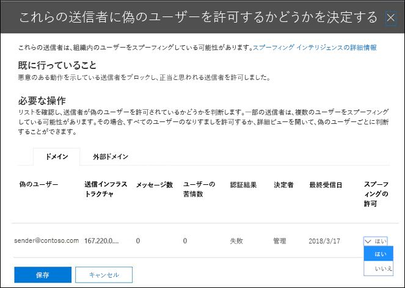

# <a name="configure-spoof-intelligence-in-eop"></a><span data-ttu-id="b9943-103">EOP でスプーフィングインテリジェンスを構成する</span><span class="sxs-lookup"><span data-stu-id="b9943-103">Configure spoof intelligence in EOP</span></span>

<span data-ttu-id="b9943-104">Exchange online またはスタンドアロンの exchange Online Protection (EOP) 組織にメールボックスがあり、Exchange Online メールボックスを使用していない場合、受信電子メールメッセージは2018年10月の間に EOP によって自動的に保護されます。365</span><span class="sxs-lookup"><span data-stu-id="b9943-104">In Microsoft 365 organizations with mailboxes in Exchange Online or standalone Exchange Online Protection (EOP) organizations without Exchange Online mailboxes, inbound email messages are automatically protected against spoofing by EOP as of October 2018.</span></span> <span data-ttu-id="b9943-105">EOP は、組織のフィッシングに対する全体的な防衛の一環としてスプーフィングインテリジェンスを使用します。</span><span class="sxs-lookup"><span data-stu-id="b9943-105">EOP uses spoof intelligence as part of your organization's overall defense against phishing.</span></span> <span data-ttu-id="b9943-106">詳細については、「 [EOP でのスプーフィング対策保護](anti-spoofing-protection.md)」を参照してください。</span><span class="sxs-lookup"><span data-stu-id="b9943-106">For more information, see [Anti-spoofing protection in EOP](anti-spoofing-protection.md).</span></span>

<span data-ttu-id="b9943-107">送信者が電子メールアドレスをスプーフすると、組織のドメインのいずれかのユーザー、または組織に電子メールを送信する外部ドメインのユーザーのように見えます。</span><span class="sxs-lookup"><span data-stu-id="b9943-107">When a sender spoofs an email address, they appear to be a user in one of your organization's domains, or a user in an external domain that sends email to your organization.</span></span> <span data-ttu-id="b9943-108">スパムやフィッシング詐欺メールを送信するための送信者スプーフィングを行う攻撃者は、ブロックする必要があります。</span><span class="sxs-lookup"><span data-stu-id="b9943-108">Attackers who spoof senders to send spam or phishing email need to be blocked.</span></span> <span data-ttu-id="b9943-109">しかし、正当な送信者がスプーフィングになっているシナリオもあります。</span><span class="sxs-lookup"><span data-stu-id="b9943-109">But there are scenarios where legitimate senders are spoofing.</span></span> <span data-ttu-id="b9943-110">たとえば、次のようにします。</span><span class="sxs-lookup"><span data-stu-id="b9943-110">For example:</span></span>

- <span data-ttu-id="b9943-111">内部ドメインのスプーフィングの正当なシナリオ:</span><span class="sxs-lookup"><span data-stu-id="b9943-111">Legitimate scenarios for spoofing internal domains:</span></span>

  - <span data-ttu-id="b9943-112">サードパーティの送信者は、ドメインを使用して、会社の投票のために自分の従業員に一括メールを送信します。</span><span class="sxs-lookup"><span data-stu-id="b9943-112">Third-party senders use your domain to send bulk mail to your own employees for company polls.</span></span>

  - <span data-ttu-id="b9943-113">外部企業は、ユーザーの代わりに広告や製品の更新を生成して送信します。</span><span class="sxs-lookup"><span data-stu-id="b9943-113">An external company generates and sends advertising or product updates on your behalf.</span></span>

  - <span data-ttu-id="b9943-114">アシスタントは、組織内の他のユーザーに対して定期的に電子メールを送信する必要があります。</span><span class="sxs-lookup"><span data-stu-id="b9943-114">An assistant regularly needs to send email for another person within your organization.</span></span>

  - <span data-ttu-id="b9943-115">内部アプリケーションが電子メール通知を送信します。</span><span class="sxs-lookup"><span data-stu-id="b9943-115">An internal application sends email notifications.</span></span>

- <span data-ttu-id="b9943-116">外部ドメインをスプーフィングするための正当なシナリオ:</span><span class="sxs-lookup"><span data-stu-id="b9943-116">Legitimate scenarios for spoofing external domains:</span></span>

  - <span data-ttu-id="b9943-117">送信者は、メーリングリスト (ディスカッションリストとも呼ばれます) 上にあり、メーリングリストは元の送信者からメーリングリストのすべての参加者に電子メールを中継します。</span><span class="sxs-lookup"><span data-stu-id="b9943-117">The sender is on a mailing list (also known as a discussion list), and the mailing list relays email from the original sender to all the participants on the mailing list.</span></span>

  - <span data-ttu-id="b9943-118">外部企業は、別の会社に代わって電子メールを送信します (たとえば、自動化されたレポートや、サービスとしてのソフトウェア会社など)。</span><span class="sxs-lookup"><span data-stu-id="b9943-118">An external company sends email on behalf of another company (for example, an automated report or a software-as-a-service company).</span></span>

<span data-ttu-id="b9943-119">スプーフィングインテリジェンス、特に既定の (および唯一の) スプーフィングインテリジェンスポリシーにより、正当な送信者が送信したスプーフィングされた電子メールが EOP スパムフィルターや外部の電子メールシステムでキャッチされないようにしながら、スパムまたはフィッシング攻撃からユーザーを保護することができます。</span><span class="sxs-lookup"><span data-stu-id="b9943-119">Spoof intelligence, and specifically the default (and only) spoof intelligence policy, helps ensure that the spoofed email sent by legitimate senders doesn't get caught up in EOP spam filters or external email systems, while protecting your users from spam or phishing attacks.</span></span>

<span data-ttu-id="b9943-120">セキュリティ & コンプライアンスセンター、または PowerShell (exchange online のメールボックスを使用する Microsoft 365 組織の場合は exchange online PowerShell、exchange online メールボックスを使用していない組織の場合は、スタンドアロン EOP PowerShell) で、スプーフィングインテリジェンスを管理できます。</span><span class="sxs-lookup"><span data-stu-id="b9943-120">You can manage spoof intelligence in the Security & Compliance Center, or in PowerShell (Exchange Online PowerShell for Microsoft 365 organizations with mailboxes in Exchange Online; standalone EOP PowerShell for organizations without Exchange Online mailboxes).</span></span>

## <a name="what-do-you-need-to-know-before-you-begin"></a><span data-ttu-id="b9943-121">はじめに把握しておくべき情報</span><span class="sxs-lookup"><span data-stu-id="b9943-121">What do you need to know before you begin?</span></span>

- <span data-ttu-id="b9943-122"><https://protection.office.com/> でセキュリティ/コンプライアンス センターを開きます。</span><span class="sxs-lookup"><span data-stu-id="b9943-122">You open the Security & Compliance Center at <https://protection.office.com/>.</span></span> <span data-ttu-id="b9943-123">**[スパム対策の設定]** ページに直接移動するには、<https://protection.office.com/antispam> を使用します。</span><span class="sxs-lookup"><span data-stu-id="b9943-123">To go directly to the **Anti-spam settings** page, use <https://protection.office.com/antispam>.</span></span> <span data-ttu-id="b9943-124">**フィッシング対策**ページに直接移動するには、を使用 <https://protection.office.com/antiphishing> します。</span><span class="sxs-lookup"><span data-stu-id="b9943-124">To go directly to the **Anti-phishing** page, use <https://protection.office.com/antiphishing>.</span></span>

- <span data-ttu-id="b9943-125">Exchange Online PowerShell へ接続するには、「[Exchange Online PowerShell に接続する](https://docs.microsoft.com/powershell/exchange/connect-to-exchange-online-powershell)」を参照してください。</span><span class="sxs-lookup"><span data-stu-id="b9943-125">To connect to Exchange Online PowerShell, see [Connect to Exchange Online PowerShell](https://docs.microsoft.com/powershell/exchange/connect-to-exchange-online-powershell).</span></span> <span data-ttu-id="b9943-126">スタンドアロンの EOP PowerShell に接続するには、「 [Exchange Online Protection の powershell への接続](https://docs.microsoft.com/powershell/exchange/connect-to-exchange-online-protection-powershell)」を参照してください。</span><span class="sxs-lookup"><span data-stu-id="b9943-126">To connect to standalone EOP PowerShell, see [Connect to Exchange Online Protection PowerShell](https://docs.microsoft.com/powershell/exchange/connect-to-exchange-online-protection-powershell).</span></span>

- <span data-ttu-id="b9943-127">このトピックの手順を実行する前に、アクセス許可を割り当てる必要があります。</span><span class="sxs-lookup"><span data-stu-id="b9943-127">You need to be assigned permissions before you can do the procedures in this topic:</span></span>

  - <span data-ttu-id="b9943-128">スプーフィングインテリジェンスポリシーを変更したり、スプーフィングインテリジェンスを有効または無効にしたりするには、次のいずれかの役割グループのメンバーである必要があります。</span><span class="sxs-lookup"><span data-stu-id="b9943-128">To modify the spoof intelligence policy or enable or disable spoof intelligence, you need to be a member of one of the following role groups:</span></span>

    - <span data-ttu-id="b9943-129">[セキュリティ & コンプライアンスセンター](permissions-in-the-security-and-compliance-center.md)の**組織管理**または**セキュリティ管理者**。</span><span class="sxs-lookup"><span data-stu-id="b9943-129">**Organization Management** or **Security Administrator** in the [Security & Compliance Center](permissions-in-the-security-and-compliance-center.md).</span></span>
    - <span data-ttu-id="b9943-130">[Exchange Online](https://docs.microsoft.com/Exchange/permissions-exo/permissions-exo#role-groups)での**組織の管理**または**検疫の管理**。</span><span class="sxs-lookup"><span data-stu-id="b9943-130">**Organization Management** or **Hygiene Management** in [Exchange Online](https://docs.microsoft.com/Exchange/permissions-exo/permissions-exo#role-groups).</span></span>

  - <span data-ttu-id="b9943-131">スプーフィングインテリジェンスポリシーへの読み取り専用アクセスでは、次のいずれかの役割グループのメンバーである必要があります。</span><span class="sxs-lookup"><span data-stu-id="b9943-131">For read-only access to the spoof intelligence policy, you need to be a member of one of the following role groups:</span></span>

    - <span data-ttu-id="b9943-132">[セキュリティ & コンプライアンスセンター](permissions-in-the-security-and-compliance-center.md)の**セキュリティリーダ**。</span><span class="sxs-lookup"><span data-stu-id="b9943-132">**Security Reader** in the [Security & Compliance Center](permissions-in-the-security-and-compliance-center.md).</span></span>
    - <span data-ttu-id="b9943-133">[Exchange Online](https://docs.microsoft.com/Exchange/permissions-exo/permissions-exo#role-groups)での**表示のみの組織の管理**。</span><span class="sxs-lookup"><span data-stu-id="b9943-133">**View-Only Organization Management** in [Exchange Online](https://docs.microsoft.com/Exchange/permissions-exo/permissions-exo#role-groups).</span></span>

- <span data-ttu-id="b9943-134">スプーフィングインテリジェンスに推奨される設定については、「 [EOP default フィッシング対策ポリシーの設定](recommended-settings-for-eop-and-office365-atp.md#eop-default-anti-phishing-policy-settings)」を参照してください。</span><span class="sxs-lookup"><span data-stu-id="b9943-134">For our recommended settings for spoof intelligence, see [EOP default anti-phishing policy settings](recommended-settings-for-eop-and-office365-atp.md#eop-default-anti-phishing-policy-settings).</span></span>

## <a name="use-the-security--compliance-center-to-manage-spoofed-senders"></a><span data-ttu-id="b9943-135">セキュリティ & コンプライアンスセンターを使用してスプーフィングされた送信者を管理する</span><span class="sxs-lookup"><span data-stu-id="b9943-135">Use the Security & Compliance Center to manage spoofed senders</span></span>

> [!NOTE]
> <span data-ttu-id="b9943-136">Microsoft 365 Enterprise E5 サブスクリプションを使用している場合、または Office 365 Advanced Threat Protection (Office 365 ATP) アドオンを個別に購入した場合は、[スプーフィングインテリジェンスの洞察](walkthrough-spoof-intelligence-insight.md)を通じてドメインをスプーフィングしている送信者を管理することもできます。</span><span class="sxs-lookup"><span data-stu-id="b9943-136">If you have an Microsoft 365 Enterprise E5 subscription or have separately purchased an Office 365 Advanced Threat Protection (Office 365 ATP) add-on, you can also manage senders who are spoofing your domain through the [Spoof Intelligence insight](walkthrough-spoof-intelligence-insight.md).</span></span>

1. <span data-ttu-id="b9943-137">セキュリティ/コンプライアンス センターで、**[脅威の管理]** \> **[ポリシー]** \> **[迷惑メール対策]** に移動します。</span><span class="sxs-lookup"><span data-stu-id="b9943-137">In the Security & Compliance Center, go to **Threat management** \> **Policy** \> **Anti-spam**.</span></span>

2. <span data-ttu-id="b9943-138">[**スパム対策設定**] ページで、[ ![ 展開] アイコンをクリックして [ ](../../media/scc-expand-icon.png) **スプーフィングインテリジェンスポリシー**] を展開します。</span><span class="sxs-lookup"><span data-stu-id="b9943-138">On the **Anti-spam settings** page, click  to expand **Spoof intelligence policy**.</span></span>

   

3. <span data-ttu-id="b9943-140">次のいずれかの選択を行います。</span><span class="sxs-lookup"><span data-stu-id="b9943-140">Make one of the following selections:</span></span>

   - <span data-ttu-id="b9943-141">**新しい送信者を確認する**</span><span class="sxs-lookup"><span data-stu-id="b9943-141">**Review new senders**</span></span>
   - <span data-ttu-id="b9943-142">**レビュー済みの送信者を表示する**</span><span class="sxs-lookup"><span data-stu-id="b9943-142">**Show me senders I already reviewed**</span></span>

4. <span data-ttu-id="b9943-143">表示される [ユーザー] ポップアップの**スプーフィングを許可するかどう**かを決定するには、次のタブのいずれかを選択します。</span><span class="sxs-lookup"><span data-stu-id="b9943-143">In the **Decide if these senders are allowed to spoof your users** flyout that appears, select one of the following tabs:</span></span>

   - <span data-ttu-id="b9943-144">**ドメイン**: 送信者が内部ドメイン内のユーザーを偽装します。</span><span class="sxs-lookup"><span data-stu-id="b9943-144">**Your Domains**: Senders spoofing users in your internal domains.</span></span>
   - <span data-ttu-id="b9943-145">**外部ドメイン**: 送信者は外部ドメインのユーザーを偽装します。</span><span class="sxs-lookup"><span data-stu-id="b9943-145">**External Domains**: Senders spoofing users in external domains.</span></span>

5. <span data-ttu-id="b9943-146">[  **スプーフィングが許可さ**れていますか?] 列の [展開] アイコンをクリックします。</span><span class="sxs-lookup"><span data-stu-id="b9943-146">Click  in the **Allowed to spoof?** column.</span></span> <span data-ttu-id="b9943-147">スプーフィングされた送信者を許可する場合は [**はい]** を選択し、メッセージをスプーフィングとしてマークする場合は [**いいえ**] を選択します。</span><span class="sxs-lookup"><span data-stu-id="b9943-147">Choose **Yes** to allow the spoofed sender, or choose **No** to mark the message as spoofed.</span></span> <span data-ttu-id="b9943-148">このアクションは、既定のフィッシング対策ポリシーまたはカスタムの ATP のフィッシング対策ポリシーによって制御されます (既定値は **[迷惑メールフォルダーにメッセージを移動**します)]。</span><span class="sxs-lookup"><span data-stu-id="b9943-148">The action is controlled by the default anti-phishing policy or custom ATP anti-phishing policies (the default value is **Move message to Junk Email folder**).</span></span> <span data-ttu-id="b9943-149">詳細については、「[フィッシング対策ポリシーのスプーフィング設定](set-up-anti-phishing-policies.md#spoof-settings)」を参照してください。</span><span class="sxs-lookup"><span data-stu-id="b9943-149">For more information, see [Spoof settings in anti-phishing policies](set-up-anti-phishing-policies.md#spoof-settings).</span></span>

   

   <span data-ttu-id="b9943-151">表示される列と値については、次の一覧で説明します。</span><span class="sxs-lookup"><span data-stu-id="b9943-151">The columns and values that you see are explained in the following list:</span></span>

   - <span data-ttu-id="b9943-152">**偽装ユーザー**: スプーフィングされているユーザーアカウント。</span><span class="sxs-lookup"><span data-stu-id="b9943-152">**Spoofed user**: The user account that's being spoofed.</span></span> <span data-ttu-id="b9943-153">これは、 `5322.From` 電子メールクライアントに表示される差出人アドレス (アドレスとも呼ばれます) のメッセージ送信者です。</span><span class="sxs-lookup"><span data-stu-id="b9943-153">This is the message sender in the From address (also known as the `5322.From` address) that's shown in email clients.</span></span> <span data-ttu-id="b9943-154">このアドレスの有効性は、SPF によってチェックされません。</span><span class="sxs-lookup"><span data-stu-id="b9943-154">The validity of this address is not checked by SPF.</span></span>

     - <span data-ttu-id="b9943-155">[**自分のドメイン**] タブの値に1つの電子メールアドレスが含まれている場合、または送信元の電子メールサーバーが複数のユーザーアカウントを偽装している場合は、複数のユーザーアカウントが含ま**れています。**</span><span class="sxs-lookup"><span data-stu-id="b9943-155">On the **Your Domains** tab, the value contains a single email address, or if the source email server is spoofing multiple user accounts, it contains **More than one**.</span></span>

     - <span data-ttu-id="b9943-156">[**外部ドメイン**] タブの値には、完全な電子メールアドレスではなく、偽装されたユーザーのドメインが含まれています。</span><span class="sxs-lookup"><span data-stu-id="b9943-156">On the **External Domains** tab, the value contains the domain of the spoofed user, not the full email address.</span></span>

   - <span data-ttu-id="b9943-157">[**インフラストラクチャの送信**]: 送信元の電子メールサーバーの IP アドレスの逆引き DNS 参照 (PTR レコード) にあるドメイン、またはソースに PTR レコードがない場合は ip アドレス。</span><span class="sxs-lookup"><span data-stu-id="b9943-157">**Sending Infrastructure**: The domain found in a reverse DNS lookup (PTR record) of the source email server's IP address, or the IP address if the source has no PTR record.</span></span>

     <span data-ttu-id="b9943-158">メッセージソースとメッセージ送信者の詳細については、「[電子メールメッセージの標準の概要](how-office-365-validates-the-from-address.md#an-overview-of-email-message-standards)」を参照してください。</span><span class="sxs-lookup"><span data-stu-id="b9943-158">For more information about message sources and message senders, see [An overview of email message standards](how-office-365-validates-the-from-address.md#an-overview-of-email-message-standards).</span></span>

   - <span data-ttu-id="b9943-159">**メッセージ数**: 過去30日間に、指定したスプーフィングされた送信者または送信者を含む組織への送信インフラストラクチャからのメッセージの数。</span><span class="sxs-lookup"><span data-stu-id="b9943-159">**# of messages**: The number of messages from the sending infrastructure to your organization that contain the specified spoofed sender or senders within the last 30 days.</span></span>

   - <span data-ttu-id="b9943-160">**ユーザーの苦情**: 過去30日間にこの送信者に対してユーザーが提出した苦情。</span><span class="sxs-lookup"><span data-stu-id="b9943-160">**# of user complaints**: Complaints filed by your users against this sender within the last 30 days.</span></span> <span data-ttu-id="b9943-161">通常、苦情は Microsoft への迷惑メール送信の形式です。</span><span class="sxs-lookup"><span data-stu-id="b9943-161">Complaints are usually in the form of junk submissions to Microsoft.</span></span>

   - <span data-ttu-id="b9943-162">**認証結果**: 次のいずれかの値です。</span><span class="sxs-lookup"><span data-stu-id="b9943-162">**Authentication result**: One of the following values:</span></span>

      - <span data-ttu-id="b9943-163">**成功**: 送信者が送信者の電子メール認証チェック (SPF または dkim) を通過しました。</span><span class="sxs-lookup"><span data-stu-id="b9943-163">**Passed**: The sender passed sender email authentication checks (SPF or DKIM).</span></span>
      - <span data-ttu-id="b9943-164">**失敗**しました。送信者は EOP の認証チェックに失敗しました。</span><span class="sxs-lookup"><span data-stu-id="b9943-164">**Failed**: The sender failed EOP sender authentication checks.</span></span>
      - <span data-ttu-id="b9943-165">**Unknown**: これらのチェックの結果は不明です。</span><span class="sxs-lookup"><span data-stu-id="b9943-165">**Unknown**: The result of these checks isn't known.</span></span>

   - <span data-ttu-id="b9943-166">**Decision set by**: 送信インフラストラクチャがユーザーのスプーフィングを許可されているかどうかを示します。</span><span class="sxs-lookup"><span data-stu-id="b9943-166">**Decision set by**: Shows who determined if the sending infrastructure is allowed to spoof the user:</span></span>

       - <span data-ttu-id="b9943-167">**スプーフィングインテリジェンスポリシー** (自動)</span><span class="sxs-lookup"><span data-stu-id="b9943-167">**Spoof intelligence policy** (automatic)</span></span>
       - <span data-ttu-id="b9943-168">**管理者**(手動)</span><span class="sxs-lookup"><span data-stu-id="b9943-168">**Admin** (manual)</span></span>

   - <span data-ttu-id="b9943-169">**最終表示**日: 偽装されたユーザーを含む送信元インフラストラクチャからメッセージが受信された最後の日付。</span><span class="sxs-lookup"><span data-stu-id="b9943-169">**Last seen**: The last date when a message was received from the sending infrastructure that contains the spoofed user.</span></span>

   - <span data-ttu-id="b9943-170">**スプーフィングが許可されますか?**: ここに表示される値は次のとおりです。</span><span class="sxs-lookup"><span data-stu-id="b9943-170">**Allowed to spoof?**: The values that you see here are:</span></span>

     - <span data-ttu-id="b9943-171">**Yes**: スプーフィングされたユーザーと送信インフラストラクチャの組み合わせからのメッセージが許可され、スプーフィングされた電子メールとして扱われることはありません。</span><span class="sxs-lookup"><span data-stu-id="b9943-171">**Yes**: Messages from the combination of spoofed user and sending infrastructure are allowed and not treated as spoofed email.</span></span>

     - <span data-ttu-id="b9943-172">**いいえ**: スプーフィングされたユーザーと送信元インフラストラクチャの組み合わせからのメッセージは、スプーフィングとしてマークされます。</span><span class="sxs-lookup"><span data-stu-id="b9943-172">**No**: Messages from the combination of spoofed user and sending infrastructure are marked as spoofed.</span></span> <span data-ttu-id="b9943-173">このアクションは、既定のフィッシング対策ポリシーまたはカスタムの ATP のフィッシング対策ポリシーによって制御されます (既定値は **[迷惑メールフォルダーにメッセージを移動**します)]。</span><span class="sxs-lookup"><span data-stu-id="b9943-173">The action is controlled by the default anti-phishing policy or custom ATP anti-phishing policies (the default value is **Move message to Junk Email folder**).</span></span> <span data-ttu-id="b9943-174">詳細については、次のセクションを参照してください。</span><span class="sxs-lookup"><span data-stu-id="b9943-174">See the next section for more information.</span></span>

     - <span data-ttu-id="b9943-175">**一部のユーザー** ([**自分のドメイン**] タブのみ): 送信元のインフラストラクチャは複数のユーザーをスプーフィングしています。これには、一部のスプーフィングされたユーザーが許可されています。</span><span class="sxs-lookup"><span data-stu-id="b9943-175">**Some users** (**Your Domains** tab only): A sending infrastructure is spoofing multiple users, where some spoofed users are allowed and others are not.</span></span> <span data-ttu-id="b9943-176">特定のアドレスを表示するには、[**詳細**] タブを使用します。</span><span class="sxs-lookup"><span data-stu-id="b9943-176">Use the **Detailed** tab to see the specific addresses.</span></span>

6. <span data-ttu-id="b9943-177">ページの下部にある [**保存**] をクリックします。</span><span class="sxs-lookup"><span data-stu-id="b9943-177">At the bottom of the page, click **Save**.</span></span>

## <a name="use-powershell-to-manage-spoofed-senders"></a><span data-ttu-id="b9943-178">PowerShell を使用してスプーフィングされた送信者を管理する</span><span class="sxs-lookup"><span data-stu-id="b9943-178">Use PowerShell to manage spoofed senders</span></span>

<span data-ttu-id="b9943-179">スプーフィングインテリジェンスで許可された送信者と受信拒否送信者を表示するには、次の構文を使用します。</span><span class="sxs-lookup"><span data-stu-id="b9943-179">To view allowed and blocked senders in spoof intelligence, use the following syntax:</span></span>

```powershell
Get-PhishFilterPolicy [-AllowedToSpoof <Yes | No | Partial>] [-ConfidenceLevel <Low | High>] [-DecisionBy <Admin | SpoofProtection>] [-Detailed] [-SpoofType <Internal | External>]
```

<span data-ttu-id="b9943-180">この例では、ドメイン内のユーザーのスプーフィングを許可されているすべての送信者に関する詳細情報を返します。</span><span class="sxs-lookup"><span data-stu-id="b9943-180">This example returns detailed information about all senders that are allowed to spoof users in your domains.</span></span>

```powershell
Get-PhishFilterPolicy -AllowedToSpoof Yes -Detailed -SpoofType Internal
```

<span data-ttu-id="b9943-181">構文およびパラメーターの詳細については、「 [get-phishfilterpolicy](https://docs.microsoft.com/powershell/module/exchange/get-phishfilterpolicy)」を参照してください。</span><span class="sxs-lookup"><span data-stu-id="b9943-181">For detailed syntax and parameter information, see [Get-PhishFilterPolicy](https://docs.microsoft.com/powershell/module/exchange/get-phishfilterpolicy).</span></span>

<span data-ttu-id="b9943-182">許可およびブロックされる送信者をスプーフィングインテリジェンスで構成するには、次の手順を実行します。</span><span class="sxs-lookup"><span data-stu-id="b9943-182">To configure allowed and blocked senders in spoof intelligence, follow these steps:</span></span>

1. <span data-ttu-id="b9943-183">検出されたスプーフィングされた送信者の現在のリストを取得するには、 **get-phishfilterpolicy**コマンドレットの出力を CSV ファイルに書き込みます。</span><span class="sxs-lookup"><span data-stu-id="b9943-183">Capture the current list of detected spoofed senders by writing the output of the **Get-PhishFilterPolicy** cmdlet to a CSV file:</span></span>

   ```powershell
   Get-PhishFilterPolicy -Detailed | Export-CSV "C:\My Documents\Spoofed Senders.csv"
   ```

2. <span data-ttu-id="b9943-184">CSV ファイルを編集して、 **SpoofedUser** (メールアドレス) および**allowedtospoof** (Yes または No) の値を追加または変更します。</span><span class="sxs-lookup"><span data-stu-id="b9943-184">Edit the CSV file to add or modify the **SpoofedUser** (email address) and **AllowedToSpoof** (Yes or No) values.</span></span> <span data-ttu-id="b9943-185">ファイルを保存し、ファイルを読み取って、コンテンツをという名前の変数として保存し `$UpdateSpoofedSenders` ます。</span><span class="sxs-lookup"><span data-stu-id="b9943-185">Save the file, read the file, and store the contents as a variable named `$UpdateSpoofedSenders`:</span></span>

   ```powershell
   $UpdateSpoofedSenders = Get-Content -Raw "C:\My Documents\Spoofed Senders.csv"
   ```

3. <span data-ttu-id="b9943-186">変数を使用し `$UpdateSpoofedSenders` て、スプーフィングインテリジェンスポリシーを構成します。</span><span class="sxs-lookup"><span data-stu-id="b9943-186">Use the `$UpdateSpoofedSenders` variable to configure the spoof intelligence policy:</span></span>

   ```powershell
   Set-PhishFilterPolicy -Identity Default -SpoofAllowBlockList $UpdateSpoofedSenders
   ```

<span data-ttu-id="b9943-187">構文およびパラメーターの詳細については、「 [get-phishfilterpolicy](https://docs.microsoft.com/powershell/module/exchange/set-phishfilterpolicy)」を参照してください。</span><span class="sxs-lookup"><span data-stu-id="b9943-187">For detailed syntax and parameter information, see [Set-PhishFilterPolicy](https://docs.microsoft.com/powershell/module/exchange/set-phishfilterpolicy).</span></span>

## <a name="use-the-security--compliance-center-to-configure-spoof-intelligence"></a><span data-ttu-id="b9943-188">セキュリティ & コンプライアンスセンターを使用してスプーフィングインテリジェンスを構成する</span><span class="sxs-lookup"><span data-stu-id="b9943-188">Use the Security & Compliance Center to configure spoof intelligence</span></span>

<span data-ttu-id="b9943-189">スプーフィングインテリジェンスの構成オプションの詳細については、「[フィッシング対策ポリシー」の「スプーフィング設定](set-up-anti-phishing-policies.md#spoof-settings)」を参照してください。</span><span class="sxs-lookup"><span data-stu-id="b9943-189">The configuration options for spoof intelligence are described in [Spoof settings in anti-phishing policies](set-up-anti-phishing-policies.md#spoof-settings).</span></span>

<span data-ttu-id="b9943-190">スプーフィングインテリジェンスの設定は、既定のフィッシング対策ポリシーとカスタムポリシーで構成できます。</span><span class="sxs-lookup"><span data-stu-id="b9943-190">You can configure spoof intelligence settings in the default anti-phishing policy, and also in custom policies.</span></span> <span data-ttu-id="b9943-191">サブスクリプションに基づく手順については、以下のいずれかのトピックを参照してください。</span><span class="sxs-lookup"><span data-stu-id="b9943-191">For instructions based on your subscription, see one of the following topics:</span></span>

- <span data-ttu-id="b9943-192">[EOP でフィッシング対策ポリシーを構成](configure-anti-phishing-policies-eop.md)します。</span><span class="sxs-lookup"><span data-stu-id="b9943-192">[Configure anti-phishing policies in EOP](configure-anti-phishing-policies-eop.md).</span></span>

- <span data-ttu-id="b9943-193">[Microsoft 365 で ATP のフィッシング対策ポリシーを構成](configure-atp-anti-phishing-policies.md)します。</span><span class="sxs-lookup"><span data-stu-id="b9943-193">[Configure ATP anti-phishing policies in Microsoft 365](configure-atp-anti-phishing-policies.md).</span></span>

## <a name="how-do-you-know-these-procedures-worked"></a><span data-ttu-id="b9943-194">正常な動作を確認する方法</span><span class="sxs-lookup"><span data-stu-id="b9943-194">How do you know these procedures worked?</span></span>

<span data-ttu-id="b9943-195">許可されている送信者とスプーフィングが許可されていない送信者、およびスプーフィングインテリジェンスの設定が構成済みであるというスプーフィングインテリジェンスが構成されていることを確認するには、次のいずれかの手順を使用します。</span><span class="sxs-lookup"><span data-stu-id="b9943-195">To verify that you've configured spoof intelligence with senders who are allowed and not allowed to spoof, and that you've configured the spoof intelligence settings, use any of the following steps:</span></span>

- <span data-ttu-id="b9943-196">[セキュリティ & コンプライアンスセンター] で、[**脅威の管理**ポリシーのスパム対策]、 \> **Policy** \> **Anti-spam** \> [**スプーフィングインテリジェンスポリシー**の選択] の \> 順**に**選択します \> 。 [**ドメイン**または**外部ドメイン**] タブを選択し、[**スプーフィングを許可する**] の値を確認します。</span><span class="sxs-lookup"><span data-stu-id="b9943-196">In the Security & Compliance Center, go to **Threat management** \> **Policy** \> **Anti-spam** \> expand **Spoof intelligence policy** \> select **Show me senders I already reviewed** \> select the **Your Domains** or **External Domains** tab, and verify the **Allowed to spoof?** value for the sender.</span></span>

- <span data-ttu-id="b9943-197">PowerShell で、次のコマンドを実行して、許可されている、またはスプーフィングが許可されていない送信者を表示します。</span><span class="sxs-lookup"><span data-stu-id="b9943-197">In PowerShell, run the following commands to view the senders who are allowed and not allowed to spoof:</span></span>

  ```powershell
  Get-PhishFilterPolicy -AllowedToSpoof Yes -SpoofType Internal
  Get-PhishFilterPolicy -AllowedToSpoof No -SpoofType Internal
  Get-PhishFilterPolicy -AllowedToSpoof Yes -SpoofType External
  Get-PhishFilterPolicy -AllowedToSpoof No -SpoofType External
  ```

- <span data-ttu-id="b9943-198">PowerShell で次のコマンドを実行して、すべてのスプーフィングされた送信者の一覧を CSV ファイルにエクスポートします。</span><span class="sxs-lookup"><span data-stu-id="b9943-198">In PowerShell, run the following command to export the list of all spoofed senders to a CSV file:</span></span>

   ```powershell
   Get-PhishFilterPolicy -Detailed | Export-CSV "C:\My Documents\Spoofed Senders.csv"
   ```

- <span data-ttu-id="b9943-199">セキュリティ & コンプライアンスセンターで、[**脅威管理** \> **ポリシー** \> の**フィッシング対策**] または [ **ATP のフィッシング対策**] に移動して、次のいずれかの手順を実行します。  </span><span class="sxs-lookup"><span data-stu-id="b9943-199">In the Security & Compliance Center, go to **Threat management** \> **Policy**  \> **Anti-phishing**  or **ATP anti-phishing**, and do either of the following steps:</span></span>

  - <span data-ttu-id="b9943-200">リストからポリシーを選択します。</span><span class="sxs-lookup"><span data-stu-id="b9943-200">Select a policy from the list.</span></span> <span data-ttu-id="b9943-201">表示されたポップアップで、[**スプーフ**] セクションの値を確認します。</span><span class="sxs-lookup"><span data-stu-id="b9943-201">In the flyout that appears, verify the values in the **Spoof** section.</span></span>
  - <span data-ttu-id="b9943-202">[**既定のポリシー**] をクリックします。</span><span class="sxs-lookup"><span data-stu-id="b9943-202">Click **Default policy**.</span></span> <span data-ttu-id="b9943-203">表示されたポップアップで、[**スプーフ**] セクションの値を確認します。</span><span class="sxs-lookup"><span data-stu-id="b9943-203">In the flyout that appears, verify the values in the **Spoof** section.</span></span>

- <span data-ttu-id="b9943-204">Exchange Online PowerShell で、 \<Name\> Office365 フィッシング対策 Default またはカスタムポリシーの名前に置き換え、次のコマンドを実行して設定を確認します。</span><span class="sxs-lookup"><span data-stu-id="b9943-204">In Exchange Online PowerShell, replace \<Name\> with Office365 AntiPhish Default or the name of a custom policy, and run the following command to verify the settings:</span></span>

  ```PowerShell
  Get-AntiPhishPolicy -Identity "<Name>" | Format-List EnableAntiSpoofEnforcement,EnableUnauthenticatedSender,AuthenticationFailAction
  ```

## <a name="other-ways-to-manage-spoofing-and-phishing"></a><span data-ttu-id="b9943-205">スプーフィングとフィッシングを管理するその他の方法</span><span class="sxs-lookup"><span data-stu-id="b9943-205">Other ways to manage spoofing and phishing</span></span>

<span data-ttu-id="b9943-206">スプーフィングとフィッシングの保護については、入念に行ってください。</span><span class="sxs-lookup"><span data-stu-id="b9943-206">Be diligent about spoofing and phishing protection.</span></span> <span data-ttu-id="b9943-207">ここでは、ドメインをスプーフィングしている送信者をチェックして、組織の損害を防ぐ方法について説明します。</span><span class="sxs-lookup"><span data-stu-id="b9943-207">Here are related ways to check on senders spoofing your domain and help prevent them from damaging your organization:</span></span>

- <span data-ttu-id="b9943-208">**スプーフィングメールレポート**を確認します。</span><span class="sxs-lookup"><span data-stu-id="b9943-208">Check the **Spoof Mail Report**.</span></span> <span data-ttu-id="b9943-209">このレポートは多くの場合、スプーフィングされた送信者を表示して管理するために使用できます。</span><span class="sxs-lookup"><span data-stu-id="b9943-209">You can use this report often to view and help manage spoofed senders.</span></span> <span data-ttu-id="b9943-210">詳細については、「[スプーフィング検出レポート](view-email-security-reports.md#spoof-detections-report)」を参照してください。</span><span class="sxs-lookup"><span data-stu-id="b9943-210">For information, see [Spoof Detections report](view-email-security-reports.md#spoof-detections-report).</span></span>

- <span data-ttu-id="b9943-211">Sender Policy Framework (SPF) 構成を確認します。</span><span class="sxs-lookup"><span data-stu-id="b9943-211">Review your Sender Policy Framework (SPF) configuration.</span></span> <span data-ttu-id="b9943-212">SPF の概要と SPF を迅速に構成する方法については、「[スプーフィングを防止するために Microsoft 365 で SPF を設定する](set-up-spf-in-office-365-to-help-prevent-spoofing.md)」を参照してください。</span><span class="sxs-lookup"><span data-stu-id="b9943-212">For a quick introduction to SPF and to get it configured quickly, see [Set up SPF in Microsoft 365 to help prevent spoofing](set-up-spf-in-office-365-to-help-prevent-spoofing.md).</span></span> <span data-ttu-id="b9943-213">Office 365 における SPF の使用方法についての詳細や、ハイブリッド展開などの非標準の展開のトラブルシューティングについては、「[How Office 365 uses Sender Policy Framework (SPF) to prevent spoofing](how-office-365-uses-spf-to-prevent-spoofing.md)」をご確認ください。</span><span class="sxs-lookup"><span data-stu-id="b9943-213">For a more in-depth understanding of how Office 365 uses SPF, or for troubleshooting or non-standard deployments such as hybrid deployments, start with [How Office 365 uses Sender Policy Framework (SPF) to prevent spoofing](how-office-365-uses-spf-to-prevent-spoofing.md).</span></span>

- <span data-ttu-id="b9943-214">DomainKeys が識別されたメール (DKIM) 構成を確認します。</span><span class="sxs-lookup"><span data-stu-id="b9943-214">Review your DomainKeys Identified Mail (DKIM) configuration.</span></span> <span data-ttu-id="b9943-215">SPF および DMARC に加えて DKIM を使用して、攻撃者がドメインから受信したように見えるメッセージを送信できないようにする必要があります。</span><span class="sxs-lookup"><span data-stu-id="b9943-215">You should use DKIM in addition to SPF and DMARC to help prevent attackers from sending messages that look like they are coming from your domain.</span></span> <span data-ttu-id="b9943-216">DKIM では、電子メール メッセージのメッセージ ヘッダー内にデジタル署名を追加することができます。</span><span class="sxs-lookup"><span data-stu-id="b9943-216">DKIM lets you add a digital signature to email messages in the message header.</span></span> <span data-ttu-id="b9943-217">詳細については、「 [DKIM を使用して、Office 365 でカスタムドメインから送信される送信電子メールを検証する](use-dkim-to-validate-outbound-email.md)」を参照してください。</span><span class="sxs-lookup"><span data-stu-id="b9943-217">For information, see [Use DKIM to validate outbound email sent from your custom domain in Office 365](use-dkim-to-validate-outbound-email.md).</span></span>

- <span data-ttu-id="b9943-218">ドメインベースのメッセージ認証、レポート、および準拠 (DMARC) 構成を確認します。</span><span class="sxs-lookup"><span data-stu-id="b9943-218">Review your Domain-based Message Authentication, Reporting, and Conformance (DMARC) configuration.</span></span> <span data-ttu-id="b9943-219">SPF および DKIM と共に DMARC を実装すると、メールのスプーフィングやフィッシングに対抗する追加の保護が得られます。</span><span class="sxs-lookup"><span data-stu-id="b9943-219">Implementing DMARC with SPF and DKIM provides additional protection against spoofing and phishing email.</span></span> <span data-ttu-id="b9943-220">DMARC は、電子メールを受信するシステムが、ドメインから送信された SPF チェックまたは DKIM チェックに失敗したメッセージに対して、どのように対応するかを判断する際に役に立ちます。</span><span class="sxs-lookup"><span data-stu-id="b9943-220">DMARC helps receiving mail systems determine what to do with messages sent from your domain that fail SPF or DKIM checks.</span></span> <span data-ttu-id="b9943-221">詳細については、「 [USE DMARC to validate email In Office 365](use-dmarc-to-validate-email.md)」を参照してください。</span><span class="sxs-lookup"><span data-stu-id="b9943-221">For information, see [Use DMARC to validate email in Office 365](use-dmarc-to-validate-email.md).</span></span>
