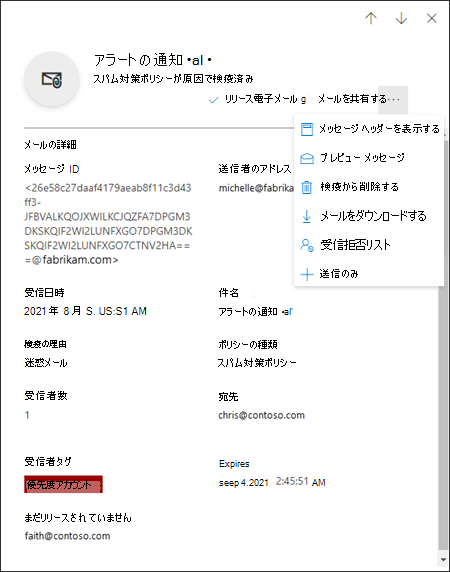
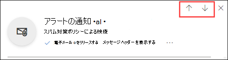
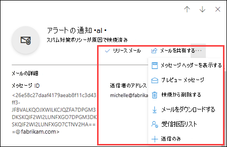
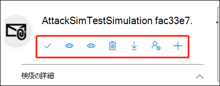
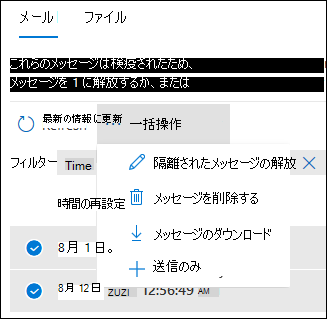
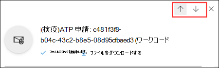
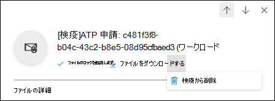
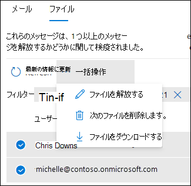

# EOP の管理者として検疫済みメッセージとファイルを管理する

[!INCLUDE [Microsoft 365 Defender rebranding](../includes/microsoft-defender-for-office.md)]

**適用対象**
- [Exchange Online Protection](exchange-online-protection-overview.md)
- [Microsoft Defender for Office 365 プラン 1 およびプラン 2](defender-for-office-365.md)
- [Microsoft 365 Defender](../defender/microsoft-365-defender.md)

Exchange Online のメールボックスを使用している Microsoft 365 組織または Exchange Online のメールボックスを使用していないスタンドアロンの Exchange Online Protection (EOP) 組織では、危険な可能性があるメッセージまたは不要なメッセージは検疫済みメッセージとして保留されます。 詳細については [、「EOP の検疫済み電子メール メッセージ」を参照してください](quarantine-email-messages.md)。

管理者は、すべてのユーザーの検疫済みメッセージのすべての種類を表示、解放、および削除できます。 マルウェア、高信頼フィッシング、またはメール フロー ルール (トランスポート ルールとも呼ばれる) の結果として検疫されたメッセージを管理できるのは、管理者だけです。 管理者は、誤検知を Microsoft に報告できます。

microsoft Defender for Office 365 の組織の管理者は、SharePoint、OneDrive、および Microsoft Teams の セーフ 添付ファイルによって検疫されたファイルを[管理することもできます](mdo-for-spo-odb-and-teams.md)。

検疫済みメッセージは、Microsoft 365 Defender ポータルまたは PowerShell (Exchange Online PowerShell for Microsoft 365 のメールボックスを持つ Exchange Online 組織、Exchange Online メールボックスのない組織のスタンドアロン EOP PowerShell) で表示および管理します。

## はじめに把握しておくべき情報

- Microsoft 365 Defender ポータルを開くには、<https://security.microsoft.com> にアクセスします。 [検疫] ページ **を直接開** くには、 を使用します <https://security.microsoft.com/quarantine> 。

- Exchange Online PowerShell へ接続するには、「[Exchange Online PowerShell に接続する](/powershell/exchange/connect-to-exchange-online-powershell)」を参照してください。 スタンドアロンの EOP PowerShell に接続するには、「[Exchange Online Protection PowerShell への接続](/powershell/exchange/connect-to-exchange-online-protection-powershell)」を参照してください。

- この記事の手順を実行する際には、あらかじめ **Exchange Online** でアクセス許可を割り当てる必要があります。
  - すべてのユーザーの検疫済みメッセージに対してアクションを実行するには、組織の管理、セキュリティ管理者、または検疫管理者の役割グループのメンバー **である** \* 必要があります。
  - すべてのユーザーの検疫済みメッセージへの読み取り専用アクセスには、グローバル リーダーまたはセキュリティリーダーの役割グループの **メンバーである** 必要があります。

  詳細については、「[Exchange Online のアクセス許可](/exchange/permissions-exo/permissions-exo)」を参照してください。

  **注**:

  - Microsoft 365 管理センターで、対応する Azure Active Directory の役割にユーザーを追加すると、ユーザーには、必要なアクセス許可 _および_ Microsoft 365 のその他の機能に必要なアクセス許可が付与されます。 詳細については、「[管理者の役割について](../../admin/add-users/about-admin-roles.md)」を参照してください。
  - [Exchange Online](/Exchange/permissions-exo/permissions-exo#role-groups)の **閲覧専用の組織管理** の役割グループが この機能への読み取り専用アクセス権も付与します。
  - \*また、検疫管理者 **役割** グループのメンバーは [、Exchange Online](/Exchange/permissions-exo/permissions-exo#role-groups)で検疫手順を実行するために、Exchange Online Exchange Online の衛生管理役割グループのメンバーである必要があります。

- 検疫済みメッセージは、自動的に削除される前に既定の期間保持されます。
  - スパム対策ポリシー (スパム、フィッシング、バルク メール) によって検疫されたメッセージの 30 日間。 これは既定値と最大値です。 この値を (低く) 構成するには、「スパム対策ポリシーを構成 [する」を参照してください](configure-your-spam-filter-policies.md)。
  - マルウェアを含むメッセージの場合は 15 日間。
  - Defender セーフ の添付ファイル、SharePoint、OneDrive、Microsoft Teamsによって検疫Office 365。

  検疫からメッセージの有効期限が切れると、メッセージを回復できません。

## 検疫済みMicrosoft 365 Defenderを管理するには、このポータルを使用します。

### 検疫済みメールの表示

1. Microsoft 365 Defender ポータルで、**[メールと共同作業]** \> **[レビュー]** \> **[検疫]** に移動します。
2. [検疫 **] ページ** で、[電子メール] **タブが** 選択されているのを確認します。

3. 使用できる列見出しをクリックすると、結果を並べ替えることができます。 [列 **のカスタマイズ]**  をクリックして、表示される列を変更します。 既定値にはアスタリスク (\*) が付いています。

   - **受信した時間**\*
   - **[件名]**\*
   - **[送信者]**\*
   - **[検疫の理由]**\*
   - **リリースの状態**\*
   - **[ポリシーの種類]**\*
   - **[有効期限]**\*
   - **[受信者]**
   - **[メッセージ ID]**
   - **[ポリシー名]**
   - **メッセージ サイズ**   添付ファイルを含むキロバイト (KB) 単位のメッセージのサイズ。
   - **メールの方向**
   - **受信者タグ**

   完了したら、[適用] を **クリックします**。

4. 結果をフィルター処理するには、**[フィルター]** をクリックします。 次のフィルターは、表示される **[フィルター]** フライアウトで使用できます。
   - **[メッセージ ID]**: メッセージのグローバル一意識別子。

     たとえば、メッセージ [トレースを](message-trace-scc.md) 使用して、組織内のユーザーに送信されたメッセージを探し、メッセージが配信される代わりに検疫されたと判断しました。 メッセージ ID の完全な値 (角かっこ ( ) を含む場合があります) を必ず含める \<\> 必要があります。 例: `<79239079-d95a-483a-aacf-e954f592a0f6@XYZPR00BM0200.contoso.com>`。

   - **[送信者のアドレス]**
   - **受信者のアドレス**
   - **Subject**
   - **受信時刻**: 開始時刻 **と終了時刻** ( **日付)** を入力します。
   - **有効期限 :** 検疫から期限切れになるメッセージをフィルター処理します。
     - **[今日]**
     - **[今後 2 日間]**
     - **[今後 7 日間]**
     - **[カスタム]**: **[開始日]** と **[終了日]** を入力します。
   - **受信者タグ**
   - **[検疫の理由]**:
     - **トランスポート ルール** (メール フロー ルール)
     - **[バルク]**
     - **[スパム]**
     - **マルウェア**
     - **フィッシング**: スパム フィルターの評決は、フィッシングまたはフィッシング対策保護がメッセージ [(ス](set-up-anti-phishing-policies.md#spoof-settings)プーフィング設定または [偽装保護](set-up-anti-phishing-policis) を検疫しました。
     - **高確度のフィッシング**
   - **受信者**: **[すべてのユーザー] または** **[自分のみ] です**。 エンド ユーザーは、送信された検疫済みメッセージのみを管理できます。
   - **リリースの状態**: 次の値の 1 つ。
     - **ニーズレビュー**
     - **承認済み**
     - **拒否**
     - **要求されたリリース**
     - **リリース済み**
   - **ポリシーの種類**: 次のポリシーの種類ごとに、メッセージをフィルター処理します。
     - **マルウェア対策ポリシー**
     - **セーフ添付ファイルポリシー**
     - **フィッシング詐欺対策ポリシー**
     - **スパム対策ポリシー**
     - **トランスポート ルール** (メール フロー ルール)

   完了したら、[適用] を **クリックします**。 フィルターをクリアするには、[フィルターのクリア]  **] をクリックします**。

5. [検索 **] ボックス** と対応する値を使用して、特定のメッセージを検索します。 ワイルドカードはサポートされていません。 次の値に基づいて検索できます。
   - メッセージ ID
   - 送信者の電子メール アドレス
   - 受信者の電子メール アドレス
   - 副題 メッセージの件名全体を使用します。 この検索では大文字と小文字は区別されません。
   - ポリシー名。 ポリシー名全体を使用します。 この検索では大文字と小文字は区別されません。

   検索条件を入力した後、Enter キーを押して結果をフィルター処理します。

特定の検疫済みメッセージを見つけたら、そのメッセージを選択して詳細を表示し、処理を実行します (メッセージの表示、解放、ダウンロード、または削除など)。

#### 検疫済みメッセージの詳細を表示する

リストから検疫済みメッセージを選択すると、表示される詳細フライアウトで次の情報を使用できます。

- **[メッセージ ID]**: メッセージのグローバル一意識別子。 メッセージ ヘッダーの **[Message-ID** ヘッダー] フィールドで使用できます。
- **[送信者のアドレス]**
- **[受信日時]**: メッセージを受信した日時。
- **[件名]**
- **検疫の理由**: メッセージがスパム、バルク、フィッシング、メールフロー ルール **(トランスポート** ルール) と一致したと識別された場合、またはマルウェアが含まれていると識別された場合に表示 **されます**。
- **ポリシーの種類**
- **ポリシー名**
- **受信者数**
- **[受信者]**: メッセージに複数の受信者が含まれている場合は、**[メッセージのプレビュー]** か **[メッセージ ヘッダーを表示]** をクリックして受信者の完全な一覧を表示する必要があります。
- **受信者タグ**: 詳細については [、「Microsoft Defender の User tags for Office 365」 を参照してください](user-tags.md)。
- **[有効期限]**: 検疫からメッセージが自動的に完全に削除される日時。
- **[解放済み]**: メッセージが解放されたすべてのメール アドレス (ある場合)。
- **[未解放]**: メッセージがまだ解放されていないすべてのメール アドレス (ある場合)。

メッセージに対してアクションを実行するには、次のセクションを参照してください。

> [!NOTE]
> 詳細フライアウトに残りますが、表示されている検疫済みメッセージを変更するには、フライアウトの上部にある上下の矢印を使用します。
>
> 

### 検疫済みメールを処理する

リストから検疫済みメッセージを選択すると、詳細フライアウトで次のアクションを使用できます。

- ![[電子メールのリリース] アイコン [電子メールのリリース] が表示されるフライアウト ウィンドウで、 ](../../media/m365-cc-sc-check-mark-icon.png)  \* 次のオプションを構成します。
  - **組織の許可リストに送信者を追加** する: 送信者からのメッセージが検疫されるのを防ぐには、このオプションを選択します。
  - 次のいずれかのオプションを選択します。
    - **すべての受信者にリリースする**
    - **特定の受信者へのリリース**: 表示される [受信者] ボックス **で受信者を** 選択します。
  - **このメッセージのコピーを** 他の受信者に送信する: このオプションを選択し、表示される [受信者] ボックスに受信者の電子メール **アドレスを入力** します。

    > [!NOTE]
    > メッセージのコピーを他の受信者に送信するには、メッセージを元の受信者の少なくとも 1 つを解放する必要があります ([すべての受信者にリリース] または [特定の受信者にリリースする] を選択 **します)。**

  - **メッセージを Microsoft** に送信して検出を改善する (誤検知) : このオプションは既定で選択され、誤って検疫されたメッセージが誤検知として Microsoft に報告されます。 メッセージがスパム、バルク、フィッシング、またはマルウェアを含むとして検疫された場合、メッセージは Microsoft スパム分析チームにも報告されます。 分析の結果に応じて、サービス全体のスパム フィルター ルールを調整して、メッセージの通過を許可する場合があります。

  - **次のようなメッセージを許可** する : このオプションは既定でオフになっています (  )。 同様の URL、添付ファイル、その他のプロパティを含むメッセージが検疫されるのを一時的に防ぐには、オン (トグル オン  ) にします。 このオプションを有効にすると、次のオプションを使用できます。
    - **[削除後**]: このようなメッセージを許可する期間を選択します。 1 **日から** **30 日を選択します**。 既定値は 30 です。
    - **省略可能な** メモ: 許可の便利な説明を入力します。

  完了したら、[メッセージのリリース] **をクリックします**。

  メッセージのリリースに関する注意事項:

  - 同じ受信者に対してメッセージを 2 回以上リリースできない。
  - メッセージを受信していない受信者だけが、潜在的な受信者の一覧に表示されます。

-  **メッセージ ヘッダーの表示**: このリンクを選択すると、メッセージ ヘッダー テキストが表示されます。 メッセージ **ヘッダーのフライ** アウトが表示され、次のリンクが表示されます。
- **メッセージ ヘッダーのコピー**: このリンクをクリックして、メッセージ ヘッダー (すべてのヘッダー フィールド) をクリップボードにコピーします。
- **Microsoft Message Header Analyzer**: ヘッダー フィールドと値を詳細に分析するには、このリンクをクリックしてメッセージ ヘッダー アナライザーに移動します。 [分析するメッセージ ヘッダーの挿入] セクション (Ctrl + V または右クリックして [貼り付け] を選択) にメッセージ ヘッダーを貼り付け、[ヘッダーの分析] を **クリックします**。

[その他のアクション] アイコン [その他のアクション] をクリック  **アクションを使用できます**。

-  **プレビュー メッセージ**: 表示されるフライアウトで、次のいずれかのタブを選択します。
  - **ソース**: すべてのリンクが無効になっているメッセージ本文の HTML バージョンを表示します。
  - **プレーン テキスト**: メッセージ本文をプレーン テキストで表示します。

- ![[検疫から削除] アイコン [検疫から削除] : 表示される警告で [はい] をクリックすると、メッセージは元の受信者に送信されることなくすぐに ](../../media/m365-cc-sc-delete-icon.png) 削除されます。 

- ![[電子メール のダウンロード] アイコン [電子メールのダウンロード] が表示されたら、[このメッセージをダウンロードするリスクを理解する] を選択し、[ダウンロード] をクリックして、メッセージのローカル コピーを ](../../media/m365-cc-sc-download-icon.png) .eml形式で保存します **。** 

- ![[送信者のブロック] アイコン [送信者のブロック] : メールボックスの [受信拒否] リストに ](../../media/m365-cc-sc-block-sender-icon.png) 送信者を **追加** します。 詳細については、「[メール送信者をブロックする](https://support.microsoft.com/office/b29fd867-cac9-40d8-aed1-659e06a706e4)」を参照してください。

- ![[送信のみ] ](../../media/m365-cc-sc-create-icon.png) **アイコン [送信のみ**] : 分析のためにメッセージを Microsoft に報告します。 表示されるフライアウトで、次のオプションを選択します。
  - **送信の種類を選択します**。メール (既定 **)、URL、** または **[ファイル] を選択します**。 
  - **ネットワーク メッセージ ID を追加するか、電子メール ファイルをアップロードする**: 次のいずれかのオプションを選択します。
    - **電子メール ネットワーク メッセージ ID を追加** します (既定では、ボックス内の対応する値を使用します)
    - **アップロードファイル (.msg または eml)** を選択する: [ファイルの参照] をクリックして、送信する .msg または .eml メッセージ ファイルを検索して選択します。
  - **問題が発生した受信者を** 選択します:メッセージの元の受信者を 1 つ以上選択して、適用されたポリシーを分析します。
  - **Microsoft に提出する理由を選択する**: 次のいずれかのオプションを選択します。
    - **ブロックされていない (誤検知) (既定):** 次のオプションを使用できます。
      - **次のようなメッセージを許可** する : このオプションは既定でオフになっています (  )。 同様の URL、添付ファイル、その他のプロパティを含むメッセージが検疫されるのを一時的に防ぐには、オン (トグル オン  ) にします。 このオプションを有効にすると、次のオプションを使用できます。
        - **[削除後**]: このようなメッセージを許可する期間を選択します。 1 **日から** **30 日を選択します**。 既定値は 30 です。
        - **省略可能な** メモ: 許可の便利な説明を入力します。
    - **ブロックされている必要があります (false 負の値)。**

  完了したら、**[送信]** をクリックします。

\* このオプションは、既にリリースされているメッセージでは使用できません ([ **リリース済み** ] 状態の値は [リリース済み] **です**)。

メッセージを解放または削除しない場合は、既定の検疫保持期間の有効期限が切れた後 ([有効期限] 列に示すように) メッセージが **削除** されます。

> [!NOTE]
> モバイル デバイスでは、アクション アイコンで説明テキストを使用できません。
>
> 
>
> アイコンの順序と対応する説明を次の表にまとめると、次のようになります。
>
> |アイコン|説明|
> |---:|---|
> |![[電子メールのリリース] アイコン](../../media/m365-cc-sc-check-mark-icon.png)|**電子メールのリリース**|
> ||**メッセージ ヘッダーの表示**|
> ||**プレビュー メッセージ**|
> ||**検疫から削除する**|
> |![[電子メールのダウンロード] アイコン](../../media/m365-cc-sc-download-icon.png)|**メールのダウンロード**|
> |![[送信者のブロック] アイコン](../../media/m365-cc-sc-block-sender-icon.png)|**送信者をブロックする**|
> |![[送信のみ] アイコン](../../media/m365-cc-sc-create-icon.png)|**送信のみ**|

#### 複数の検疫済みメール メッセージを処理する

最初の列の左側にある空白領域をクリックして、リスト内の複数の検疫済みメッセージ (最大 100) を選択すると、[一括操作] ドロップダウン リストが表示され、次のアクションを実行できます。

-  **] アイコン [メッセージの** リリース] : すべての受信者にメッセージを解放します。 表示されるフライアウトで、1 つのメッセージをリリースする場合と同じ次のオプションを選択できます。
  - **組織の許可リストに送信者を追加する**
  - **このメッセージのコピーを他の受信者に送信する**
  - **検出を改善するためにメッセージを Microsoft に送信する (誤検知)**
  - **次のようなメッセージを許可する**:
    - **削除後**: **1 日** から **30 日**
    - **省略可能なメモ**

  完了したら、[メッセージのリリース] **をクリックします**。

  > [!NOTE]
  > 次のシナリオを検討してください:john@gmail.com メッセージをメッセージに送信 faith@contoso.com と john@subsidiary.contoso.com。 Gmail は、このメッセージを 2 つのコピーに分割し、どちらも Microsoft でフィッシング詐欺として検疫にルーティングされます。 管理者は、これらのメッセージの両方をリリースして、admin@contoso.com。 管理メールボックスに到達した最初のリリース済みメッセージが配信されます。 2 番目にリリースされたメッセージは重複配信として識別され、スキップされます。 メッセージ ID と受信時間が同じ場合、メッセージは重複として識別されます。

- ![[検疫から削除] アイコン [メッセージの削除] : 表示される警告で [はい] をクリックすると、メッセージは元の受信者に送信されることなく、すぐに検疫 ](../../media/m365-cc-sc-delete-icon.png) から削除されます。 
- ![[電子メールのダウンロード] アイコン ](../../media/m365-cc-sc-download-icon.png) **[メッセージのダウンロード]**
- ![[送信のみ] アイコン ](../../media/m365-cc-sc-create-icon.png) **[送信のみ]**

## Defender の検疫済Microsoft 365 Defenderを管理するには、このポータルを使用Office 365

> [!NOTE]
> このセクションの検疫済みファイルの手順は、プラン 1 またはプラン 2 Office 365 Microsoft Defender でのみ使用できます。

defender for Office 365 を使用している組織では、管理者は セーフ 添付ファイルによって SharePoint Online、OneDrive for Business、および Microsoft Teams で検疫されたファイルを管理できます。 これらのファイルの保護を有効にするには、「添付ファイルを有効にする[セーフ」をSharePoint、OneDrive、](turn-on-mdo-for-spo-odb-and-teams.md)およびMicrosoft Teams。

### 検疫済みファイルの表示

1. Microsoft 365 Defender ポータルで、**[メールと共同作業]** \> **[レビュー]** \> **[検疫]** に移動します。
2. [検疫 **] ページで**、[ファイル]**タブ****([メール]** が既定のタブ) を選択します。

3. 使用できる列見出しをクリックすると、結果を並べ替えることができます。 [列 **のカスタマイズ]** をクリックして、表示される列を変更します。 既定の列には、アスタリスク ( ) が付いています \* 。
   - [**User**\*]
   - **場所**\*
   - **添付ファイルのファイル名**\*
   - **ファイル URL**\*
   - **ファイル サイズ**
   - **リリースの状態**\*
   - **[有効期限]**\*
   - **によって検出される**
   - **時間による変更**

   完了したら、[適用] または [キャンセル **] を****クリックします**。

4. 結果をフィルター処理するには、**[フィルター]** をクリックします。 次のフィルターは、表示される **[フィルター]** フライアウトで使用できます。
   - **受信時刻**: **開始時刻** と **終了時刻** (日付)。
   - **有効期限**:**開始時刻と****終了時刻**(日付)。
   - **検疫の理由**: 使用可能な値は Malware **のみです**。
   - **ポリシーの種類**

   完了したら、[適用] または [キャンセル **] を****クリックします**。

特定の検疫済みファイルを見つけたら、ファイルを選択して詳細を表示し、そのファイルに対してアクションを実行します (ファイルの表示、リリース、ダウンロード、削除など)。

#### 検疫済みファイルの詳細を表示する

一覧から検疫済みファイルを選択すると、開いた詳細フライアウトで次の情報が表示されます。

- **ファイル名**
- **ファイル URL**: ファイルの場所を定義する URL (たとえば、[オンライン] SharePointします)。
- **悪意のあるコンテンツが検出された** ファイルが検疫された日付/時刻。
- **有効期限**: ファイルが検疫から削除される日付。
- **によって検出される**
- **[解放済み?]**
- **マルウェア名**
- **ドキュメント ID**: ドキュメントの一意の識別子。
- **ファイル サイズ**: キロバイト (KB) で指定します。
- **組織** 組織の一意の ID。
- **最終更新日時**
- **[変更者**] : ファイルを最後に変更したユーザー。
- **Secure Hash Algorithm 256-bit (SHA-256)** の値 : このハッシュ値を使用して、他の評価ストアまたは環境内の他の場所にあるファイルを識別できます。

ファイルに対してアクションを実行するには、次のセクションを参照してください。

> [!NOTE]
> 詳細フライアウトに残りますが、表示する検疫済みファイルを変更するには、フライアウトの上部にある上下の矢印を使用します。
>
> 

### 検疫済みファイルに対してアクションを実行する

リストから検疫済みファイルを選択すると、詳細フライアウトで次のアクションを使用できます。

- ![[ファイルのリリース] アイコン [リリース ファイル] : 表示されるフライアウト ウィンドウで、分析のために Microsoft にファイルを報告するをオンまたはオフにし、[リリース] ](../../media/m365-cc-sc-check-mark-icon.png)  \* をクリック **します**。 
- ![ダウンロード ファイル アイコン ダウンロード ファイル : 表示されるフライアウトで、[このファイルのダウンロードによるリスクを理解する] を選択し、[ダウンロード] をクリックしてファイルのローカル コピーを ](../../media/m365-cc-sc-download-icon.png) 保存します。  
- ![[検疫から削除] アイコン [検疫から削除] : 表示される警告で [はい] をクリックすると、ファイル ](../../media/m365-cc-sc-delete-icon.png) はすぐに削除されます。 
- ![[送信者のブロック] アイコン [送信者のブロック] : メールボックスの [受信拒否] リストに ](../../media/m365-cc-sc-block-sender-icon.png) 送信者を **追加** します。 詳細については、「[メール送信者をブロックする](https://support.microsoft.com/office/b29fd867-cac9-40d8-aed1-659e06a706e4)」を参照してください。

\* このオプションは、既にリリースされているファイルでは使用できません ([ **リリース済み** ] 状態の値は [リリース済み] **です**)。

ファイルを解放または削除しない場合は、既定の検疫保持期間が経過した後 ([ **有効期限** ] 列に示すように) 削除されます。

#### 複数の検疫済みファイルに対してアクションを実行する

[件名] 列の左側にある空白領域をクリックして、リスト内の複数の検疫済みファイル (最大 100) を選択すると、[一括操作] ドロップダウン リストが表示され、次の操作を実行できます。 

- ![[ファイルのリリース] アイコン [リリース ファイル] : 表示されるフライアウト ウィンドウで、分析のために Microsoft にファイルを報告するをオンまたはオフにし、[リリース] ](../../media/m365-cc-sc-check-mark-icon.png) をクリック **します**。 
- ![[検疫から削除] アイコン [検疫から削除] : 表示される警告で [はい] をクリックすると、ファイル ](../../media/m365-cc-sc-delete-icon.png) はすぐに削除されます。 
- ![ダウンロード ファイル アイコン ダウンロード ファイル : 表示されるフライアウトで、[このファイルのダウンロードによるリスクを理解する] を選択し、[ダウンロード] をクリックしてファイルのローカル コピーを ](../../media/m365-cc-sc-download-icon.png) 保存します。  

## PowerShell Exchange Onlineスタンドアロン EOP PowerShell を使用して、検疫済みメッセージとファイルを表示および管理する

検疫内のメッセージとファイルを表示および管理するために使用するコマンドレットについては、次の一覧で説明します。

- [Delete-QuarantineMessage](/powershell/module/exchange/delete-quarantinemessage)
- [Export-QuarantineMessage](/powershell/module/exchange/export-quarantinemessage)
- [Get-QuarantineMessage](/powershell/module/exchange/get-quarantinemessage)
- [Preview-QuarantineMessage](/powershell/module/exchange/preview-quarantinemessage): このコマンドレットはメッセージ専用であり、セーフ 添付ファイルから SharePoint、OneDrive、および Microsoft Teams のファイルを検疫Microsoft Teams。
- [Release-QuarantineMessage](/powershell/module/exchange/release-quarantinemessage)

## 詳細情報

[検疫済みメッセージに関するよく寄せられる質問](quarantine-faq.yml)
