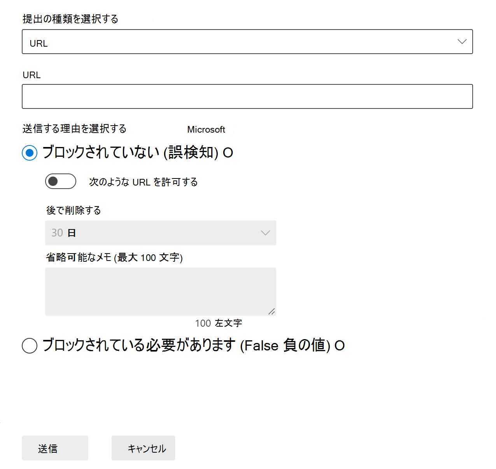
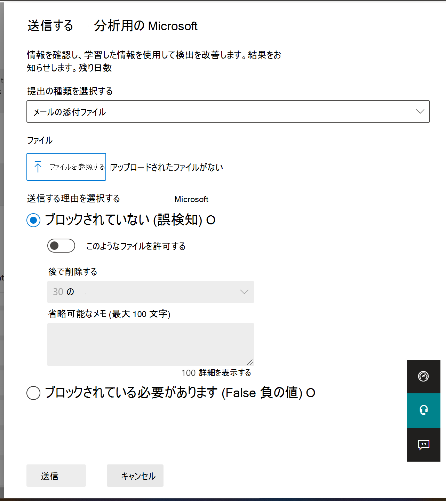

# <a name="add-allows-in-the-tenant-allowblock-list"></a>テナントの許可/禁止リストの許可リストを追加する

[!INCLUDE [Microsoft 365 Defender rebranding](../includes/microsoft-defender-for-office.md)]

**適用対象**
- [Exchange Online Protection](exchange-online-protection-overview.md)
- [Microsoft Defender for Office 365 プラン 1 およびプラン 2](defender-for-office-365.md)
- [Microsoft 365 Defender](../defender/microsoft-365-defender.md)

管理者は、テナント許可/ブロック リストに許可を直接追加できません。 代わりに、管理者提出プロセスを使用して、ブロックされたメッセージを送信して、対応する URL、ファイル、または送信者がテナント許可/ブロック リストに追加されるようにします。 ファイル、URL、または送信者のブロックが発生していない場合、許可は作成されません。 メッセージが誤ってブロックされた誤検知であると判断されたほとんどの場合、許可はシステムに自然に許可する時間を与えるために必要な限り保持されます。

> [!IMPORTANT]
> Microsoft が許可を管理しているため、送信者、URL、またはファイルが許可されていないか、不適切と見なされる許可は削除されます。 これは、環境を保護し、許可の構成ミスを防ぐためです。 意見が一致しない場合は、メッセージがまだ不適切と見なされる理由を判断するのに役立つサポート ケースが必要になる場合があります。

## <a name="add-sender-allows-using-the-submissions-portal"></a>送信者の追加では、申請ポータルを使用できます

Microsoft 365 Defenderの **[送信]** ページで送信者 (またはドメイン) を許可します。

1. Microsoft 365 Defender ポータルの <https://security.microsoft.com>[**Actions & submissions**\>] に移動 **します**。 または、[ **申請]** ページに直接移動するには、 <https://security.microsoft.com/reportsubmission>.

2. [ **送信]** ページで、[ **電子メール** ] タブが選択されていることを確認し、[分析用に Microsoft に送信] アイコンをクリックします  **分析のために Microsoft に送信します**。

3. ネットワーク メッセージ ID を追加するか、電子メール ファイルをアップロードして、 **Microsoft に送信してレビュー** ポップアップを使用してメッセージを送信します。

4. [ **Microsoft に送信する理由を選択** する] セクションで、[ **ブロックされていない必要があります (誤検知)]** を選択します。

5. **[このオプションのようなメッセージを許可する**] をオンにします。

6. [ **削除後に削除]** ドロップダウン リストから、許可オプションを動作させる期間を指定します。

7. 完了したら、[ **送信]** ボタンをクリックします。

> 

## <a name="add-url-allows-using-the-submissions-portal"></a>URL の追加では、申請ポータルを使用できます

Microsoft 365 Defenderの [**申請]** ページで URL を許可します。

1. Microsoft 365 Defender ポータルの <https://security.microsoft.com>[**Actions & submissions**\>] に移動 **します**。 または、[ **申請]** ページに直接移動するには、 <https://security.microsoft.com/reportsubmission>.

2. [ **申請] ページで** [ **URL** ] タブを選択し、[分析用に Microsoft に送信] アイコンをクリック  **分析のために Microsoft に送信します**。

3. **[確認用に Microsoft に送信する]** ポップアップを使用して、URL を追加してメッセージを送信します。

4. [ **Microsoft に送信する理由を選択** する] セクションで、[ **ブロックされていない必要があります (誤検知)]** を選択します。

5. **[次のような URL を許可する] オプションを** オンにします。

6. [ **削除後に削除]** ドロップダウン リストから、許可オプションを動作させる期間を指定します。

7. 完了したら、[ **送信]** ボタンをクリックします。

> [!div class="mx-imgBorder"]
> 

## <a name="add-file-allows-using-the-submissions-portal"></a>ファイルの追加では、申請ポータルを使用できます

Microsoft 365 Defenderの **[提出]** ページでファイルを許可します。

1. Microsoft 365 Defender ポータルの <https://security.microsoft.com>[**Actions & submissions**\>] に移動 **します**。 または、[ **申請]** ページに直接移動するには、 <https://security.microsoft.com/reportsubmission>.

2. [ **送信] ページで** 、[ **電子メールの添付ファイル** ] タブを選択し、[分析のために Microsoft に送信] アイコンをクリック  **分析のために Microsoft に送信します**。

3. **[レビュー用に Microsoft に送信]** ポップアップを使用して、ファイルまたはファイルを追加してメッセージを送信します。

4. [ **Microsoft に送信する理由を選択** する] セクションで、[ **ブロックされていない必要があります (誤検知)]** を選択します。

5. **[次のようなファイルを許可する]** オプションをオンにします。

6. [ **削除後に削除]** ドロップダウン リストから、許可オプションを動作させる期間を指定します。

7. 完了したら、[ **送信]** ボタンをクリックします。

> [!div class="mx-imgBorder"]
> 

## <a name="create-spoofed-sender-allow-entries-using-microsoft-365-defender"></a>Microsoft 365 Defenderを使用してスプーフィングされた送信者許可エントリを作成する

> [!NOTE]
>
> - ドメイン ペアで定義されているスプーフィングされたユーザー _と_ 送信インフラストラクチャの _組み合わせ_ のみが、スプーフィングを許可またはブロックされます。
> - ドメイン ペアの許可エントリまたはブロック エントリを構成すると、そのドメイン ペアからのメッセージはスプーフィング インテリジェンス分析情報に表示されなくなります。
> - スプーフィングされた送信者のエントリが期限切れになることはありません。
> - スプーフィングでは、許可とブロックの両方がサポートされます。 URL では許可のみがサポートされます。

1. Microsoft 365 Defender ポータルの [ルール **] セクション** の <https://security.microsoft.com>**[電子メール & コラボレーション** \> **ポリシー&ルール** \> **脅威ポリシー** \> **テナント許可/ブロック リスト**] に移動します。 または、 **テナント許可/ブロック リスト** ページに直接移動するには、 <https://security.microsoft.com/tenantAllowBlockList>.

2. [ **テナントの許可/ブロック一覧** ] ページで、[ **スプーフィング** ] タブを選択し、[追加] アイコンをクリックします  **[追加]** 。

3. 表示される **[新しいドメイン ペアの追加]** ポップアップで、次の設定を構成します。
   - **ワイルドカードを使用して新しいドメイン ペアを追加する**:1 行あたり 1 つのドメイン ペアを入力し、最大 20 個まで入力します。 スプーフィングされた送信者エントリの構文の詳細については、「 [テナント許可/ブロックリストの管理](tenant-allow-block-list.md)」を参照してください。
   - **スプーフィングの種類**: 次のいずれかの値を選択します。
     - **内部**: スプーフィングされた送信者は、組織に属するドメイン ( [承認済みドメイン](/exchange/mail-flow-best-practices/manage-accepted-domains/manage-accepted-domains)) にあります。
     - **外部**: スプーフィングされた送信者は外部ドメインにあります。
   - **アクション**: **[許可]** または [ブロック] を選択 **します**。

4. 完了したら、**[追加]** をクリックします。

## <a name="add-spoofed-sender-allow-entries-using-powershell"></a>PowerShell を使用してスプーフィングされた送信者許可エントリを追加する

[PowerShell](/exchange/connect-to-exchange-online-powershell) のテナント許可/ブロック リストにスプーフィングされた送信者エントリExchange Online追加するには、次の構文を使用します。

```powershell
New-TenantAllowBlockListSpoofItems -SpoofedUser <Domain | EmailAddress | *> -SendingInfrastructure <Domain | IPAddress/24> -SpoofType <External | Internal> -Action <Allow | Block>
```

構文とパラメーターの詳細については、「 [New-TenantAllowBlockListSpoofItems](/powershell/module/exchange/new-tenantallowblocklistspoofitems)」を参照してください。

## <a name="related-articles"></a>関連記事

- [管理者による報告](admin-submission.md)
- [誤検知と偽陰性を報告する](report-false-positives-and-false-negatives.md)
