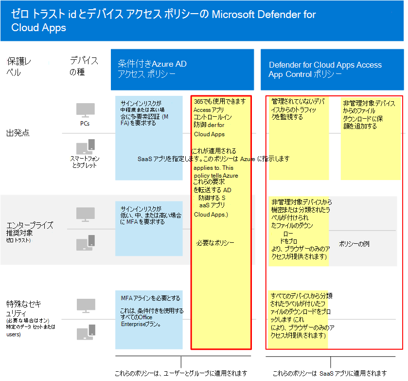
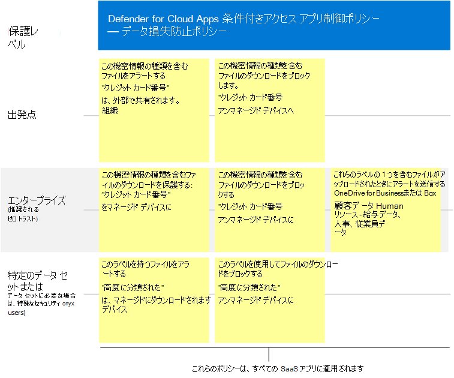

# SaaS Microsoft Cloud App Security推奨されるポリシー
Microsoft Cloud App Security Azure AD 条件付きアクセス ポリシーを基にして、ダウンロード、アップロード、コピー、貼り付け、印刷のブロックなど、SaaS アプリによる詳細なアクションをリアルタイムで監視および制御できます。 この機能は、企業リソースが管理されていないデバイスやゲスト ユーザーからアクセスされる場合など、固有のリスクを伴うセッションにセキュリティを追加します。

Microsoft Cloud App Security Microsoft Information Protection とネイティブに統合し、機密情報の種類と機密ラベルに基づいて機密データを検索し、適切なアクションを実行するためのリアルタイムコンテンツ検査を提供します。

このガイダンスには、次のシナリオに関する推奨事項が含まれています。

- SaaS アプリを IT 管理に取り込む
- 特定の SaaS アプリの保護を調整する
- データ保護規制に準拠するためにデータ損失防止 (DLP) を構成する

## SaaS アプリを IT 管理に取り込む

SaaS アプリをMicrosoft Cloud App Securityする最初の手順は、これらのアプリを検出し、それらを Azure AD テナントにADです。 検出に関するヘルプが必要な場合は、「 [ネットワーク内の SaaS アプリを検出して管理する」を参照してください](/cloud-app-security/tutorial-shadow-it)。 アプリを検出した後、これらのアプリを [Azure ADテナントに追加します](/azure/active-directory/manage-apps/add-application-portal)。

これらを管理するには、次の手順を実行します。

1. まず、Azure ADで、新しい条件付きアクセス ポリシーを作成し、"条件付きアクセス アプリ制御を使用する" に構成します。 これにより、要求がサーバーにリダイレクトCloud App Security。 1 つのポリシーを作成し、すべての SaaS アプリをこのポリシーに追加できます。
1. 次に、[セッション ポリシー Cloud App Security作成します。 適用するコントロールごとに 1 つのポリシーを作成します。

SaaS アプリへのアクセス許可は、通常、アプリへのアクセスに関するビジネス上の必要性に基づいて行います。 これらのアクセス許可は、非常に動的な場合があります。 ポリシー Cloud App Securityを使用すると、ベースライン保護、機密性の高い保護、または高度に規制された保護に関連付けられた Azure AD グループにユーザーが割り当てられているかどうかに関係なく、アプリ データを保護できます。

SaaS アプリのコレクション全体のデータを保護するために、次の図は、必要な Azure AD 条件付きアクセス ポリシーと、Cloud App Security で作成できる推奨ポリシーを示しています。 この例では、管理しているすべての SaaS アプリCloud App Securityポリシーが適用されます。 これらは、デバイスが管理されるかどうか、およびファイルに既に適用されている感度ラベルに基づいて適切なコントロールを適用するように設計されています。

次の表に、Azure サーバーで作成する必要がある新しい条件付きアクセス AD。

|保護レベル|ポリシー|詳細|
|---|---|---|
|すべての保護レベル|[サーバーで条件付きアクセス アプリ制御を使用Cloud App Security](/cloud-app-security/proxy-deployment-aad#configure-integration-with-azure-ad)|これにより、IdP (Azure AD) を構成して、Cloud App Security。|
||||

次の表に、すべての SaaS アプリを保護するために作成できる上記のポリシー例を示します。 ビジネス、セキュリティ、コンプライアンスの目的を評価し、環境に対して最も適切な保護を提供するポリシーを作成してください。

|保護レベル|ポリシー|
|---|---|
|基準|管理されていないデバイスからのトラフィックを監視する 
 管理されていないデバイスからのファイルダウンロードに保護を追加する|
|機密|機密または非管理対象デバイスから分類されたラベルが付いたファイルのダウンロードをブロックする (これにより、ブラウザーへのアクセスのみ可能)|
|厳しく規制|すべてのデバイスから分類されたラベルが付いたファイルのダウンロードをブロックする (これにより、ブラウザーへのアクセスのみ可能)|
|||

条件付きアクセス アプリ制御の設定に関するエンドツーエンドの手順については、「Deploy Conditional Access App Control for featured apps」 [を参照してください](/cloud-app-security/proxy-deployment-aad)。 この記事では、Azure アプリで必要な条件付きアクセス ポリシーを作成し、SaaS ADテストするプロセスについて説明します。

詳細については、「条件付きアクセス[アプリ制御を使用してアプリMicrosoft Cloud App Security保護する」を参照してください](/cloud-app-security/proxy-intro-aad)。

## 特定の SaaS アプリの保護を調整する

環境内の特定の SaaS アプリに追加の監視とコントロールを適用する場合があります。 Cloud App Securityを実行できます。 たとえば、Box のようなアプリが環境で多用されている場合は、追加のコントロールを適用する方が理にかなっています。 または、法務部門または財務部門が機密ビジネス データに特定の SaaS アプリを使用している場合は、これらのアプリに対する追加の保護をターゲットにできます。

たとえば、次の種類の組み込みの異常検出ポリシー テンプレートを使用して Box 環境を保護できます。

- 匿名 IP アドレスからのアクティビティ
- ほとんどアクセスがない国からのアクティビティ
- 疑わしい IP アドレスからのアクティビティ
- 不可能な移動
- 終了したユーザーが実行するアクティビティ (IdP として AAD が必要)
- マルウェアの検出
- 複数回のログイン試行の失敗
- ランサムウェアのアクティビティ
- 危険な Oauth アプリ
- 通常と異なるファイル共有アクティビティ

例を次に示します。 追加のポリシー テンプレートは、定期的に追加されます。 特定のアプリに追加の保護を適用する方法の例については、「接続されているアプリの保護 [」を参照してください](/cloud-app-security/protect-connected-apps)。

[Box Cloud App Security保護](/cloud-app-security/protect-box)に役立つ方法は、Box や他のアプリで機密データを使用してビジネス データを保護するのに役立つコントロールの種類を示しています。

## データ保護規制に準拠するためにデータ損失防止 (DLP) を構成する

Cloud App Security規制に対する保護を構成するための貴重なツールになる場合があります。 この場合、規制が適用される特定のデータを検索する特定のポリシーを作成し、適切なアクションを実行するために各ポリシーを構成します。

次の図と表に、一般データ保護規則 (GDPR) に準拠するように構成できるポリシーのいくつかの例を示します。 これらの例では、ポリシーは特定のデータを検索します。 データの感度に基づいて、各ポリシーは適切なアクションを実行するように構成されます。

|保護レベル|ポリシーの例|
|---|---|
|基準|この機密情報の種類を含むファイル ("クレジット カード番号") が組織外で共有されている場合の警告 
 >この機密情報の種類 ("クレジット カード番号") を含むファイルの管理されていないデバイスへのダウンロードをブロックする|
|機密|この機密情報の種類 ("クレジット カード番号") を含むファイルのダウンロードを管理対象デバイスに保護する 
 管理されていないデバイスへのこの機密情報の種類 ("クレジット カード番号") を含むファイルのダウンロードをブロックする 
 これらのラベルがオンのファイルが OneDrive for Business または Box にアップロードされると警告する (顧客データ、人事: 給与データ、人事、従業員データ)|
|厳しく規制|このラベルを持つファイル ("高度に分類された") が管理対象デバイスにダウンロードされる場合の警告 
 管理されていないデバイスへのこのラベル ("高度に分類された") を持つファイルのダウンロードをブロックする|
|||

## 次の手順

ドキュメントの使用の詳細については、「Cloud App Security」[をMicrosoft Cloud App Securityしてください](//cloud-app-security/)。
