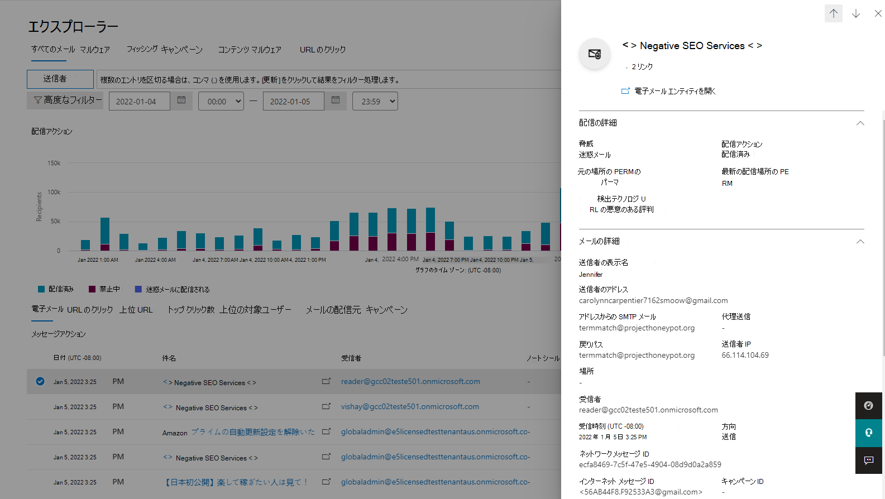

# メール エンティティ ページ

[!INCLUDE [MDO Trial banner](../includes/mdo-trial-banner.md)]

**適用対象:**
- [Microsoft Defender for Office 365 プラン 1 およびプラン 2](defender-for-office-365.md)
- [Microsoft 365 Defender](../defender/microsoft-365-defender.md)

**この記事の内容:**
- [電子メール エンティティ ページにアクセスする](#reach-the-email-entity-page)
- [電子メール エンティティ ページを読む](#read-the-email-entity-page)
- [電子メール エンティティのページ タブを使用する](#use-email-entity-page-tabs)
- [[電子メール エンティティ] ページの新規作成](#new-to-the-email-entity-page)

Microsoft Defender for Office 365 E5 および Defender for Office P1 と P2 の管理者は、**電子メール エンティティ ページ** を使用してメールを 360 度表示します。 この移動先の電子メール ページは、 [脅威エクスプローラーの [電子メールの詳細] ポップアップ](threat-explorer-views.md)で配信される情報を強化するために作成されました。

## 電子メール エンティティ ページにアクセスする

電子メール エンティティ ページは、電子 **メール & コラボレーション** \> **エクスプローラー** のMicrosoft 365 Defender ポータルで<https://security.microsoft.com>利用できます。 または、 **エクスプローラー** ページに直接移動するには、 <https://security.microsoft.com/threatexplorer>.

**エクスプローラーで**、調査しているメールの件名を選択します。 電子メールのポップアップの上部にゴールド バーが表示されます。 この新しいページへの招待には、「エンリッチメントされたデータを含む新しい電子メール エンティティ ページを試してみてください。...」と読み上げられます。 選択すると、新しいページが表示されます。

:::image type="content" source="../../media/email-entities-1-navigation-to-ee.png" alt-text="*エンリッチメントされたデータを含む新しい電子メール エンティティ ページを試す* という単語を含むゴールド バナー。新しいエクスペリエンスに移動します" lightbox="../../media/email-entities-1-navigation-to-ee.png":::

:::image type="content" source="../../media/email-entities-2-eep.png" alt-text="表示される見出しに焦点を当てた電子メール エンティティ ページのグラフィック" lightbox="../../media/email-entities-2-eep.png":::

> [!NOTE]
> このページを表示および使用するために必要なアクセス許可は、 **エクスプローラー** を表示する場合と同じです。 管理者は、グローバル管理者またはグローバル リーダー、またはセキュリティ管理者またはセキュリティ リーダーのメンバーである必要があります。 詳細については、「[Microsoft 365 Defender ポータルのアクセス許可](permissions-microsoft-365-security-center.md)」を参照してください。

## 電子メール エンティティ ページを読む

構造は、読みやすく、一目でナビゲートできるように設計されています。 ページの上部にあるさまざまなタブを使用すると、より詳細に調査できます。 レイアウトのしくみを次に示します。

1. 最も必要なフィールドは、フライアウトの左側にあります。これらの詳細は "スティッキー" です。つまり、ポップアップの残りの部分で移動するタブに関係なく、それらは左側に固定されます。

    :::image type="content" source="../../media/email-entities-3-left-panel.png" alt-text="左側が強調表示された電子メール エンティティ ページのグラフィック" lightbox="../../media/email-entities-3-left-panel.png":::

2. 右上隅には、電子メールで実行できるアクションがあります。 **エクスプローラー** で実行できるすべてのアクションは、電子メール エンティティ ページからも使用できます。

    :::image type="content" source="../../media/email-entities-5-preview.png" alt-text="右側が強調表示された電子メール エンティティ ページのグラフィック" lightbox="../../media/email-entities-5-preview.png":::

3. ページの残りの部分を並べ替えることで、より深い分析を行うことができます。 電子メール検出の詳細、電子メール認証の状態、ヘッダーを確認します。 この領域はケースバイケースで確認する必要がありますが、これらのタブの情報は任意の電子メールで使用できます。

    :::image type="content" source="../../media/email-entities-4-middle-panel.png" alt-text="電子メール ヘッダーと認証の状態を含むページのメイン パネル" lightbox="../../media/email-entities-4-middle-panel.png":::

### 電子メール エンティティのページ タブを使用する

エンティティ ページの上部にあるタブを使用すると、電子メールを効率的に調査できます。

1. **タイムライン**: メールのタイムライン ビュー ( **エクスプローラー** のタイムラインごと) には、メールで発生した配信後のイベントへの元の配信が表示されます。 配信後のアクションがないメールの場合は、タイムライン ビューに元の配信行が表示されます。 0 時間の自動消去 (ZAP)、Remediate、URL クリック、et cetera などのソース (システム、管理者、ユーザーなど) のようなイベントが、発生した順序でここに表示されます。
2. **分析**: 分析では、管理者がメールを詳細に分析するのに役立つフィールドが表示されます。 管理者が検出、送信者/受信者、電子メール認証の詳細の詳細を理解する必要がある場合は、[分析] タブを使用する必要があります。添付ファイルと URL のリンクは、このページの [関連エンティティ] の下にあります。 添付ファイルと特定された脅威の両方に番号が付けられ、クリックすると[添付ファイル] ページと [URL] ページに直接アクセスできます。 このタブには、電子メール ヘッダーを表示するための [ *ヘッダーの表示]* オプションもあります。 管理者は、わかりやすくするために、メール ヘッダーの詳細をメイン パネルの情報と並べて比較できます。
3. **添付ファイル**: メール内で見つかった添付ファイルと、添付ファイルに関するその他の詳細を調べます。 現在、添付ファイルの数は 10 に制限されています。 悪意のある添付ファイルの起爆の詳細もここに示されています。
4. **URL**: このタブには、メール内で見つかった URL と、URL に関するその他の詳細が一覧表示されます。 URL の数は現在 10 に制限されていますが、 *悪意のある URL を最初* に表示するために、これらの 10 が優先されます。 優先順位を付けると、時間と推測作業が節約されます。 悪意があり、爆発していることが検出された URL もここに表示されます。
5. **同様のメール**: このタブには、 *ネットワーク メッセージ ID と* 、このメールに固有の受信者の組み合わせに似たすべてのメールが一覧表示されます。 類似性は *、メッセージの本文* のみに基づいています。 メールを "類似" として分類するための決定には *、添付ファイル* の考慮事項は含まれません。

## [電子メール エンティティ] ページの新規作成

この電子メール エンティティ ページに付属する新機能があります。 一覧を次に示します。

### クラウド メールボックスの電子メール プレビュー

管理者は、メールがまだクラウドに存在する ***場合*** 、クラウド メールボックスでメールをプレビューできます。 論理的な削除 (管理者、ユーザーによる)、または ZAP (検疫) の場合、メールはクラウドの場所に表示されなくなります。 その場合、管理者は特定のメールをプレビューできません。 削除された電子メール、または配信に失敗した電子メールは、メールボックスに送信されませんでした。 その結果、管理者もこれらのメールをプレビューできません。

> [!WARNING]
> 電子メールをプレビューするには、Preview という特別なロールが必要 **です**。 このロールは、Microsoft 365 Defender ポータルの[電子メール & コラボレーション ロールの説明に従って、Microsoft 365 Defender ポータルで](permissions-microsoft-365-security-center.md#email--collaboration-roles-in-the-microsoft-365-defender-portal)追加できます。 そこで新しい **電子メール &コラボレーション** 役割グループを作成し、その新しい役割グループに **プレビュー** ロールを追加するか、組織内の管理者が **エクスプローラー** で作業できるようにする役割グループに **プレビュー** ロールを追加することが必要な場合があります。

### デトネーションの詳細

これらの詳細は、電子メールの添付ファイルと URL に固有です。 ユーザーはエクスプローラーに移動し、検出 *テクノロジ* フィルター セットをファイルの爆発または URL デトネーションに適用することで、これらの詳細を確認できます。 ファイルデトネーション用にフィルター処理された電子メールには、デトネーションの詳細を含む悪意のあるファイルが含まれており、URL 用にフィルター処理されたファイルには、悪意のある URL とそのデトネーションの詳細が含まれます。

ユーザーには、電子メールに含まれる既知の悪意のある添付ファイルまたは URL に関するエンリッチド デトネーションの詳細が表示されます。これは、特定のテナントに対してデトネーションされました。 これには、添付ファイルまたは URL が悪意のあるものと見なされ、起爆された理由を顧客が理解するのに役立つ、デトネーション チェーン、デトネーションの概要、スクリーンショット、および監視された動作の詳細が含まれます。

1. *デトネーション チェーン*。 1 つのファイルまたは URL の起爆によって、複数のデトネーションがトリガーされる場合があります。 デトネーション チェーンは、判定の原因となった元の悪意のあるファイルや URL、およびデトネーションの影響を受けるその他のすべてのファイルまたは URL など、起爆のパスを追跡します。 これらの URL または添付ファイルは、電子メールに直接表示されない場合がありますが、その分析を含めることは、ファイルまたは URL が悪意のあると見なされた理由を判断するために重要です。  

    > [!NOTE]
    > これは、最上位のアイテムにリンクされているエンティティのいずれも問題が見つからなかった場合や、爆発した場合に表示される場合があります。

1. *デトネーションの概要* は、 *分析時間*、デトネーションが発生した時刻、OS とアプリケーション、デトネーションが発生したオペレーティング システムとアプリケーション、ファイル サイズ、判定理由などのデトネーションの基本的な概要を示します。
1. *スクリーンショットは、* 爆発中にキャプチャされたスクリーンショットを示しています。 起爆中に複数のスクリーンショットが表示される場合があります。 スクリーンショットはキャプチャされません。
    - .zipや.rarなどのコンテナーの種類ファイル。
    - ファイルを直接ダウンロードするリンクに URL が開いた場合。 ただし、ダウンロードしたファイルは、デトネーション チェーンに表示されます。
1. *動作の詳細* は、デトネーション中に発生した正確なイベントや、起爆中に検出された URL、IP、ドメイン、ファイルを含む監視可能なイベントなどの動作の詳細を示すエクスポートです (問題がある場合も無害な場合もあります)。 次の動作の詳細がない可能性があることに注意してください。
    - 他のファイルを保持している.zipや.rarなどのコンテナー ファイル。

:::image type="content" source="../../media/email-entities-6-detonation-page.png" alt-text="チェーン、概要、起爆の詳細、および見出しの下のスクリーンショットを示す起爆の概要 *Deep Analysis*" lightbox="../../media/email-entities-6-detonation-page.png":::

### その他のイノベーション

*タグ*: これらは、ユーザーに適用されるタグです。 ユーザーが受信者の場合、管理者には *受信者* タグが表示されます。 同様に、ユーザーが送信者の場合は *送信者* タグです。 これは、電子メール エンティティ ページの左側に表示されます ( *スティッキー* と説明されている部分では、ページに固定されます)。

*最新の配信場所*: 最新の配信場所は、ZAP などのシステム アクションまたは削除済みアイテムへの移動などの管理者アクションが完了した後に電子メールが届いた場所です。 最新の配信場所は、メッセージの *現在* の場所を管理者に通知することを目的としていません。 たとえば、ユーザーがメッセージを削除したり、アーカイブに移動したりしても、配信場所は更新されません。 ただし、システム アクションが実行され、場所が更新された場合 (ZAP の結果、電子メールが検疫に移動する場合など) は、最新の配信場所を検疫に更新します。

*電子メールの詳細*: *[分析* ] タブで使用できる電子メールの詳細を理解するために必要な詳細。

- *Exchangeトランスポート ルール (メール フロー ルールまたは ETR とも呼ばれます)*: これらのルールは、トランスポート層のメッセージに適用され、フィッシングやスパムの判定よりも優先されます。 メール フロー ルールはExchange管理センターで<https://admin.exchange.microsoft.com/#/transportrules>作成および変更されますが、メール フロールールがメッセージに適用されている場合は、ルール名と GUID がここに表示されます。 追跡の目的で役立つ情報。

- *プライマリオーバーライド: ソース*: プライマリオーバーライドとソースは、電子メールの配信に影響を与えたテナントまたはユーザー設定を参照し、(脅威と検出テクノロジに従って) システムによって指定された配信場所をオーバーライドします。 たとえば、テナントが構成されたトランスポート ルールが原因でメールがブロックされたり、セーフ Senders のエンドユーザー設定が原因で許可された電子メールである可能性があります。 

- *すべてのオーバーライド*: すべてのオーバーライドは、電子メールに適用されたオーバーライド (テナントまたはユーザー設定) の一覧を参照します。これは、電子メールの配信に影響を与えた場合と影響を受けなかった可能性があります。 たとえば、テナント構成トランスポートルールとテナント構成ポリシー設定 (テナント許可ブロックリストなど) が電子メールに適用されている場合、両方がこのフィールドに一覧表示されます。 プライマリ オーバーライド フィールドを確認して、電子メールの配信に影響を与えた設定を決定できます。 

- *一括苦情レベル (BCL)*: メッセージの一括苦情レベル (BCL)。 BCL が高いほど、一括メール メッセージが苦情を生成する可能性が高いことを示します (電子メールがスパムである可能性が高い場合は自然な結果)。

- *スパム信頼レベル (SCL)*: メッセージのスパム信頼レベル (SCL)。 値が高いほど、メッセージがスパムである可能性が高くなります。

- *クライアントの種類*: REST のように電子メールが送信されたクライアントの種類を示します。

- *転送*: autoforwaridng のシナリオでは、転送ユーザーと、ETR や SMTP 転送などの転送の種類を示します。 

- *配布リスト*: 受信者がリストのメンバーとして電子メールを受信した場合、配布リストを表示します。 入れ子になった配布リストが関係している場合は、最上位の配布リストが表示されます。  

- *宛先、Cc*: 電子メールの [宛先] フィールドと [Cc] フィールドに一覧表示されているアドレスを示します。 これらのフィールドの情報は、5,000 文字に制限されています。 

- *ドメイン名*: 送信者のドメイン名です。

- *ドメイン所有者*: 送信側ドメインの所有者を指定します。

- *ドメインの場所*: 送信するドメインの場所を指定します。

- *ドメイン作成日*: 送信ドメインの作成日を指定します。 新しく作成されたドメインは、他のシグナルが何らかの疑わしい動作を示している場合に注意が必要です。

*電子メール認証*: Microsoft 365で使用される電子メール認証方法には、SPF、DKIM、DMARC が含まれます。

- 送信者ポリシー フレームワーク (**SPF**): メッセージの SPF チェックの結果について説明します。 指定できる値は次のとおりです。
  - パス (IP アドレス): SPF によって、渡されたメッセージがチェックされ、送信者の IP アドレスが含まれます。 送信者のドメインに代わってメールを送信または中継する許可がクライアントに与えられています。
  - 失敗 (IP アドレス): メッセージの SPF チェックが失敗し、送信者の IP アドレスが含まれます。 hard fail と呼ばれることもあります。
  - Softfail (理由): SPF レコードは、ホストを送信が許可されていないが移行中として指定しました。
  - 中立: SPF レコードは、IP アドレスが送信を承認されているかどうかをアサートしないことを明示的に示します。
  - なし: ドメインに SPF レコードがないか、SPF レコードが結果に評価されません。
  - Temperror: 一時的なエラーが発生しました。 たとえば、DNS エラーです。 同じチェックが後で成功する場合があります。
  - Permerror: 永続的なエラーが発生しました。 たとえば、ドメインに不正な形式の SPF レコードがある場合などです。

- DomainKeys によって識別されたメール (**DKIM**):
  - 合格: 渡されたメッセージの DKIM チェックを示します。
  - 失敗 (理由): 失敗したメッセージの DKIM チェックとその理由を示します。 たとえば、メッセージが署名されていない場合、署名を認証できない場合などです。
  - なし: メッセージが署名されなかったことを示します。 これは、ドメインに DKIM レコードがあるかどうかや、DKIM レコードが結果を評価しない (このメッセージが署名されていない点のみ) ことを示しますが、これらを示さない場合もあります。

- ドメイン ベースのメッセージ認証、レポート、および準拠 (**DMARC**):
  - 合格: 渡されたメッセージの DMARC チェックを示します。
  - 失敗: メッセージの DMARC チェックが失敗したことを示します。
  - Bestguesspass: ドメインの DMARC TXT レコードが存在しないが、存在する場合は、メッセージの DMARC チェックが渡されたことを示します。
  - なし: DNS 内の送信側ドメインに DMARC TXT レコードが存在しないことを示します。

*複合認証*: これは、SPF、DKIM、DMARC などの電子メール認証を組み合わせて、メッセージが確実かどうかを判断するためにMicrosoft 365によって使用される値です。 評価の基礎として、メールの *From:* ドメインが使用されます。

### [電子メールの概要] パネル

電子メールの概要パネルは、完全な電子メール エンティティ ページの概要ビューです。 これには、電子メールに関する標準化された詳細 (検出など) と、コンテキスト固有の情報 (検疫や提出メタデータなど) が含まれています。 電子メールの概要パネルは、従来のリアルタイム検出、脅威エクスプローラー、申請、およびレポートポップアップに置き換えられます。

> [!div class="mx-imgBorder"]
> 

> [!NOTE]
> すべてのコンポーネントを表示するには、[ **電子メール エンティティを開く** ] リンクをクリックして、完全な電子メール エンティティ ページを開きます。  

電子メールの概要パネルは、次のセクションに分かれています。  

- *配信の詳細*: 脅威と対応する信頼レベル、検出テクノロジ、および元の配信場所と最新の配信場所に関する情報が含まれています。

- *電子メールの詳細*: 送信者名、送信者のアドレス、受信時刻、認証の詳細、その他のいくつかの詳細などの電子メール プロパティに関する情報が含まれています。

- *URL*: 既定では、3 つの URL とそれに対応する脅威が表示されます。 [ **すべての URL を表示]** をクリックすると、すべての URL を展開して表示し、エクスポートできます。  

- *添付ファイル*: 既定では、3 つの添付ファイルが表示されます。 [ **すべての添付ファイルを表示]** をクリックして展開し、すべての添付ファイルを表示できます。 

上記のセクションに加えて、概要パネルと統合されているいくつかのエクスペリエンスに固有のセクションも表示されます。 

- 提出： 

    - *提出の詳細*: 次のような特定の提出に関する情報が含まれています。
        - 送信日
        - Subject
        - 提出の種類
        - 送信の理由
        - 申請 ID
        - 提出者

    - *結果の詳細*: 送信されたメッセージが確認されます。 提出の結果と、推奨される次の手順を確認できます。

- 検疫：  

    - *検疫の詳細*: 検疫固有の詳細が含まれています。 詳細については、「 [検疫済みメッセージの管理](manage-quarantined-messages-and-files.md#view-quarantined-message-details)」を参照してください。

        - [有効期限]: 検疫からメッセージが自動的に完全に削除される日時。
        - [解放済み]: メッセージが解放されたすべてのメール アドレス (ある場合)。
        - [未解放]: メッセージがまだ解放されていないすべてのメール アドレス (ある場合)。

    - *検疫アクション*: さまざまな検疫アクションの詳細については、「 [検疫済みメッセージの管理](manage-quarantined-messages-and-files.md#take-action-on-quarantined-email)」を参照してください。
