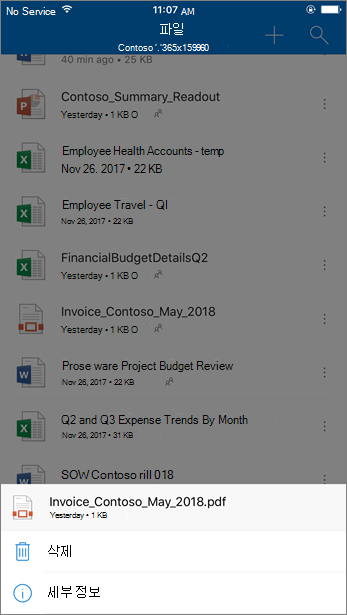

# SPO、OneDrive、Teams 用の安全な添付ファイル機能Safe Attachments for SharePoint, OneDrive, and Microsoft Teams

[!INCLUDE [Microsoft 365 Defender rebranding](../includes/microsoft-defender-for-office.md)]

**適用対象****Applies to**
- [Microsoft Defender for Office 365 プラン 1 およびプラン 2Microsoft Defender for Office 365 plan 1 and plan 2](defender-for-office-365.md)
- [Microsoft 365 DefenderMicrosoft 365 Defender](../defender/microsoft-365-defender.md)

セーフ[microsoft Defender](whats-new-in-defender-for-office-365.md) for Office 365 の SharePoint、OneDrive、および Microsoft Teams の添付ファイルは、Microsoft 365 の一般的なウイルス検出エンジンによってアップロード時に既にスキャンされているファイルに対する追加の保護層を[提供](virus-detection-in-spo.md)します。Safe Attachments for SharePoint, OneDrive, and Microsoft Teams in [Microsoft Defender for Office 365](whats-new-in-defender-for-office-365.md) provides an additional layer of protection for files that have already been scanned at upload time by the [common virus detection engine in Microsoft 365](virus-detection-in-spo.md). セーフSharePoint、OneDrive、Microsoft Teamsの添付ファイルは、チーム サイトやドキュメント ライブラリで悪意のあるファイルとして識別される既存のファイルを検出およびブロックするのに役立ちます。Safe Attachments for SharePoint, OneDrive, and Microsoft Teams helps detect and block existing files that are identified as malicious in team sites and document libraries.

セーフ既定ではSharePoint、OneDrive、Microsoft Teamsの添付ファイルは有効になっていません。Safe Attachments for SharePoint, OneDrive, and Microsoft Teams is not enabled by default. 有効にする方法については、「添付ファイルを[有効にするセーフ」をSharePoint、OneDrive、およびMicrosoft Teams。](turn-on-mdo-for-spo-odb-and-teams.md)To turn it on, see [Turn on Safe Attachments for SharePoint, OneDrive, and Microsoft Teams](turn-on-mdo-for-spo-odb-and-teams.md).

## セーフ、SharePoint、およびOneDriveの添付ファイルのMicrosoft Teams方法How Safe Attachments for SharePoint, OneDrive, and Microsoft Teams works

SharePoint セーフ、OneDrive、Microsoft Teams の添付ファイルを有効にし、ファイルを悪意のあるファイルとして識別すると、ファイルストアとの直接統合を使用してファイルがロックされます。When Safe Attachments for SharePoint, OneDrive, and Microsoft Teams is enabled and identifies a file as malicious, the file is locked using direct integration with the file stores. 次の画像は、ライブラリで検出された悪意のあるファイルの例を示しています。The following image shows an example of a malicious file detected in a library.

ブロックされたファイルは、ドキュメント ライブラリと Web、モバイル、またはデスクトップ アプリケーションに引き続き表示されますが、ユーザーはファイルを開く、コピー、移動、または共有できません。Although the blocked file is still listed in the document library and in web, mobile, or desktop applications, people can't open, copy, move, or share the file. ただし、ブロックされたファイルは削除できます。But they can delete the blocked file.

モバイル デバイスでブロックされたファイルの外観の例を次に示します。Here's an example of what a blocked file looks like on a mobile device:

既定では、ユーザーはブロックされたファイルをダウンロードできます。By default, people can download a blocked file. ブロックされたファイルをモバイル デバイスでダウンロードする方法を次に示します。Here's what downloading a blocked file looks like on a mobile device:

SharePointオンライン管理者は、悪意のあるファイルをダウンロードするユーザーを防ぐ可能性があります。SharePoint Online admins can prevent people from downloading malicious files. 手順については、「ユーザーが悪意のある[ファイルをダウンロードSharePointオンライン PowerShell を使用する」を参照してください](turn-on-mdo-for-spo-odb-and-teams.md#step-2-recommended-use-sharepoint-online-powershell-to-prevent-users-from-downloading-malicious-files)。For instructions, see [Use SharePoint Online PowerShell to prevent users from downloading malicious files](turn-on-mdo-for-spo-odb-and-teams.md#step-2-recommended-use-sharepoint-online-powershell-to-prevent-users-from-downloading-malicious-files).

ファイルが悪意のあるファイルとして検出された場合のユーザー エクスペリエンスの詳細については[、「SharePoint Online、OneDrive、](https://support.microsoft.com/office/01e902ad-a903-4e0f-b093-1e1ac0c37ad2)または Microsoft Teams で悪意のあるファイルが見つかった場合の操作」を参照してください。To learn more about the user experience when a file has been detected as malicious, see [What to do when a malicious file is found in SharePoint Online, OneDrive, or Microsoft Teams](https://support.microsoft.com/office/01e902ad-a903-4e0f-b093-1e1ac0c37ad2).

## [添付ファイル] で検出された悪意のあるファイルセーフ、SharePoint、OneDrive、Microsoft TeamsView information about malicious files detected by Safe Attachments for SharePoint, OneDrive, and Microsoft Teams

Office 365 の Microsoft Defender によって悪意のあるファイルとして識別されたファイルは[、Office 365](view-reports-for-mdo.md)およびエクスプローラー (およびリアルタイム検出) の Microsoft Defender のレポートに[表示されます](threat-explorer.md)。Files that are identified as malicious by Microsoft Defender for Office 365 will show up in [reports for Microsoft Defender for Office 365](view-reports-for-mdo.md) and in [Explorer (and real-time detections)](threat-explorer.md).

2018 年 5 月現在、ファイルが Microsoft Defender によって悪意のあるファイルとして特定された場合、Office 365検疫でも使用できます。As of May 2018, when a file is identified as malicious by Microsoft Defender for Office 365, the file is also available in quarantine. 詳細については、「Use [the Security & コンプライアンス センター」を参照してください](manage-quarantined-messages-and-files.md#microsoft-defender-for-office-365-only-use-the-security--compliance-center-to-manage-quarantined-files)。For more information, see [Use the Security & Compliance Center to manage quarantined files](manage-quarantined-messages-and-files.md#microsoft-defender-for-office-365-only-use-the-security--compliance-center-to-manage-quarantined-files).

## これらの点に気を付けるKeep these points in mind

- Defender for Office 365は、オンライン、オンライン、OneDrive for Business、またはSharePointのすべてのファイルをMicrosoft Teams。Defender for Office 365 will not scan every single file in SharePoint Online, OneDrive for Business, or Microsoft Teams. この動作は仕様です。This is by design. ファイルは非同期的にスキャンされます。Files are scanned asynchronously. このプロセスでは、共有およびゲスト アクティビティ イベントとスマート ヒューリスティックと脅威シグナルを使用して、悪意のあるファイルを識別します。The process uses sharing and guest activity events along with smart heuristics and threat signals to identify malicious files.

- モダン エクスペリエンスを使用SharePointサイトが構成されていることを[確認します](/sharepoint/guide-to-sharepoint-modern-experience)。Make sure your SharePoint sites are configured to use the [Modern experience](/sharepoint/guide-to-sharepoint-modern-experience). モダン Office 365クラシック ビューを使用するかどうかは、セキュリティ保護用の Defender が適用されます。ただし、ファイルがブロックされている視覚的なインジケーターは、モダン エクスペリエンスでのみ使用できます。Defender for Office 365 protection applies whether the Modern experience or the Classic view is used; however, visual indicators that a file is blocked are available only in the Modern experience.

- セーフSharePoint、OneDrive、および Microsoft Teams の添付ファイルは、Exchange Online Protection (EOP) のスパム対策とマルウェア対策保護、および microsoft Defender for Office 365 の セーフ リンクと セーフ 添付ファイルを含む、組織の全体的な脅威保護戦略の一部です。Safe Attachments for SharePoint, OneDrive, and Microsoft Teams is part of your organization's overall threat protection strategy, which includes anti-spam and anti-malware protection in Exchange Online Protection (EOP), as well as Safe Links and Safe Attachments in Microsoft Defender for Office 365. 詳細については、「脅威から[保護する」を参照Office 365。](protect-against-threats.md)To learn more, see [Protect against threats in Office 365](protect-against-threats.md).