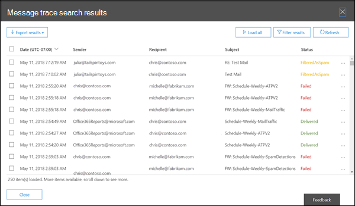

# セキュリティ/コンプライアンス センター のメッセージ追跡

[!INCLUDE [Microsoft 365 Defender rebranding](../includes/microsoft-defender-for-office.md)]

**適用対象**
- [Exchange Online Protection](exchange-online-protection-overview.md)
- [Microsoft Defender for Office 365 プラン 1 およびプラン 2](defender-for-office-365.md)
- [Microsoft 365 Defender](../defender/microsoft-365-defender.md)

セキュリティ コンプライアンス センターのメッセージ トレース&、組織を通過する電子メール メッセージにExchange Onlineします。 メッセージがサービスによって受信、拒否、延期、または配信されたかどうかを判断できます。 メッセージが最終的な状態になる前に、メッセージに行われた処理も表示します。

メッセージ トレースの情報を使用して、メッセージに何が起こったかについてのユーザーの質問に効率的に回答し、メール フローの問題をトラブルシューティングし、ポリシーの変更を検証できます。

## 始める前に把握しておくべき情報

- メッセージ トレースを使用するには、組織の管理、コンプライアンス管理、またはヘルプ **デスクの役割グループ** のメンバー Exchange Online必要があります。  詳細については、「[Exchange Online のアクセス許可](/exchange/permissions-exo/permissions-exo)」を参照してください。

  **注**: 管理センターの対応する Azure Active Directory ロールのメンバーシップMicrosoft 365、ユーザーは、ユーザーに対して、Microsoft 365 の他の機能に対して必要なアクセス許可とアクセス許可を付与します。 詳細については、「[管理者の役割について](../../admin/add-users/about-admin-roles.md)」を参照してください。

- メッセージ トレースの結果に表示されるメッセージの最大数は、選択したレポートの種類によって異なります (詳細については、「レポートの種類の選択 [」セクションを](#choose-report-type) 参照してください)。 [PowerShell またはスタンドアロン EOP PowerShell Exchange Online Get-HistoricalSearch](/powershell/module/exchange/get-historicalsearch)コマンドレットは、結果のすべてのメッセージを返します。

## メッセージのトレースを開く

で[セキュリティ &コンプライアンス センター] を開 <https://protection.office.com/> き、[メール フロー メッセージ **の追跡**] \> **に移動します**。

[メッセージ追跡] ページに **直接移動するには、** を開きます <https://protection.office.com/messagetrace> 。

## [メッセージの追跡] ページ

ここから、[トレースの開始] ボタンをクリックして、新しい既定 **のトレースを開始** できます。 これにより、最後の 2 日間のすべての送信者と受信者のすべてのメッセージが検索されます。 または、使用可能なクエリ カテゴリから格納されているクエリのいずれかを使用して、それらを現在の形式で実行するか、独自のクエリの開始点として使用できます。

- **既定のクエリ**: ユーザーが提供する組み込Microsoft 365。
- **カスタム クエリ**: 将来使用するために組織の管理者によって保存されたクエリ。
- **自動保存されたクエリ**: 最近実行された最後の 10 個のクエリ。 このリストを使用すると、オフにした場所を簡単に選択できます。

また、このページには、提出した要求の [ダウンロード可能なレポート] セクションと、ダウンロード可能なレポートがある場合のレポート自体もあります。

## 新しいメッセージ トレースのオプション

### 送信者と受信者によるフィルター

既定値は [ **すべての送信者]** と **[すべての** 受信者] ですが、次のフィールドを使用して結果をフィルター処理できます。

- **これらのユーザー :** このフィールドをクリックして、組織から 1 つ以上の送信者を選択します。 名前を入力し始め、リスト内のアイテムは、検索ページの動作と同様に、入力した項目によってフィルター処理されます。
- **これらのユーザーに**: このフィールドをクリックして、組織内の 1 つ以上の受信者を選択します。

> [!NOTE]
>
> - 外部の送信者と受信者の電子メール アドレスを入力することもできます。 ワイルドカードは (たとえば) サポートされますが、同じフィールドで同時に複数のワイルドカード エントリ `*@contoso.com` を使用することはできません。
> - 複数の送信者または受信者リストをセミコロン () で区切って貼り付けできます `;` 。 spaces ( `\s` ) 、キャリッジ リターン ( `\r` )、または次の行 ( `\n` )。

### 時間範囲

既定値は **2 日ですが**、最大 90 日間の日付/時刻範囲を指定できます。 日付/時刻範囲を使用する場合は、次の問題を考慮してください。

- 既定では、タイム ラインを使用して **スライダー** ビューで時間範囲を選択します。 表示される日または時刻の設定のみを選択できます。 差し込み値を選択すると、開始/終了のバブルが最も近い表示設定にスナップされます。

  

  ただし、カスタム ビューに切り替えて、開始日と終了日の値(時刻を含む) を指定し、日付/時刻範囲のタイム ゾーンを選択することもできます。  タイム ゾーンの **設定は、** クエリ入力とクエリ結果の両方に適用されます。

  

  10 日以下の場合、結果はサマリー レポートとして **即座に利用** できます。 10 日をわずかに超える時間範囲を指定すると、ダウンロード可能な CSV ファイル **(拡張** 概要レポートまたは拡張レポート) としてのみ使用できるので、結果は遅延します。

  さまざまなレポートの種類の詳細については、この記事の「 [レポートの種類](#choose-report-type) の選択」セクションを参照してください。

  > [!NOTE]
  > 拡張概要レポートと拡張レポートは、アーカイブされたメッセージ トレース データを使用して準備され、レポートをダウンロードできるまで数時間かかる場合があります。 同時にレポート要求を送信した他の管理者の数によっては、キューに入っている要求の処理が開始される前に遅延が発生する場合もあります。

- スライダー ビューにクエリ **を保存** すると、相対時間範囲 (たとえば、今日から 3 日) が保存されます。 カスタム ビューにクエリを保存すると、絶対日付/時刻範囲が保存されます (たとえば、2018-05-06 13:00 ~ 2018-05-08 18:00 など)。

### その他の検索オプション

#### 配信状態

既定値 [すべて]を選択のままにするか、次のいずれかの値を選択して結果をフィルター処理できます。

- **配信**: メッセージが目的の宛先に正常に配信されました。
- **Pending**: メッセージの配信が試行または再試行されています。
- **展開:** 配布グループの受信者が、グループの個々のメンバーに配信する前に展開されました。
- **失敗:** メッセージが配信されません。
- **検疫済** み : メッセージが検疫されました (スパム、バルク メール、フィッシングなど)。 詳細については [、「EOP の検疫済み電子メール メッセージ」を参照してください](quarantine-email-messages.md)。
- **スパムとしてフィルター処理**: メッセージはスパムとして識別され、拒否またはブロックされました (検疫されません)。
- **状態の取得:** このメッセージは、ユーザーが最近受信Microsoft 365、他の状態データはまだ使用できません。 数分で確認してください。

> [!NOTE]
> [保留中 **]、[****検疫済み**]、および [スパムとしてフィルター] の値は、10 日未満の検索でのみ使用できます。  また、実際の配信状態と報告された配信状態の間に 5 ~ 10 分の遅延が発生する場合があります。

#### メッセージ ID

これは、メッセージ ヘッダーの [メッセージ **ID:** ヘッダー] フィールドにあるインターネット メッセージ ID (クライアント ID とも呼ばれる) です。 ユーザーは、特定のメッセージを調査するためにこの値を指定できます。

この値は、メッセージの有効期間全体にわたって不変です。 ユーザーまたはグループでMicrosoft 365メッセージExchange値は、角かっこ () を含む形式 `<GUID@ServerFQDN>` です \< \> 。 たとえば、「 `<d9683b4c-127b-413a-ae2e-fa7dfb32c69d@DM3NAM06BG401.Eop-nam06.prod.protection.outlook.com>` 」のように入力します。 他のメッセージング システムでは、異なる構文または値を使用する場合があります。 この値は一意であるはずですが、すべての電子メール システムが厳密にこの要件に従っているという意味ではありません。 **[Message-ID: header]** フィールドが存在しない場合、または外部ソースからの受信メッセージに対して空白の場合は、任意の値が割り当てられます。

メッセージ ID を **使用して結果** をフィルター処理する場合は、必ず、任意の角かっこを含む完全な文字列を含める必要があります。

#### Direction

既定値を [すべて選択] のままにするか、[受信] **(組織内** の受信者に送信されるメッセージ) または [送信] **(組織内** のユーザーから送信されたメッセージ) を選択して結果をフィルター処理できます。

#### 元のクライアント IP アドレス

クライアント IP アドレスで結果を報告して、大量のスパムやマルウェアを送信しているハッキングされたコンピューターを調査できます。 メッセージは複数の送信者から送信されたと思える場合でも、同じコンピューターがすべてのメッセージを生成している可能性があります。

> [!NOTE]
> クライアント IP アドレス情報は 10 日間しか使用できませんが、拡張概要レポートまたは拡張レポート(ダウンロード可能な CSV ファイル) でのみ使用できます。

### レポートの種類を選択する

使用可能なレポートの種類は次のとおりです。

- **概要 :** 時間範囲が 10 日未満で、追加のフィルター オプションが必要ない場合に使用できます。 検索結果は、[検索] をクリックした直後に **使用できます**。 レポートは、最大 20000 の結果を返します。
- **拡張概要** または拡張 **:** これらのレポートは、ダウンロード可能な CSV ファイルとしてのみ使用できます。時間範囲に関係なく、1 つ以上のフィルターオプションが必要です。これらのユーザー 、これらのユーザー、またはメッセージ **ID。** 送信者または受信者にワイルドカードを使用できます (たとえば \* 、@contoso.com)。 拡張サマリー レポートは、最大 5,0000 件の結果を返します。 拡張レポートは、最大 1000 件の結果を返します。

> [!NOTE]
>
> - 拡張概要レポートと拡張レポートは、アーカイブされたメッセージ トレース データを使用して準備され、レポートをダウンロードできるまで数時間かかる場合があります。 同時にレポート要求を送信した他の管理者の数によっては、キューに入っている要求の処理が開始される前に遅延が発生する場合もあります。
> - 任意の日付/時刻範囲に対して拡張概要レポートまたは拡張レポートを選択することもできますが、通常、アーカイブされたデータの最後の 4 時間は、これら 2 種類のレポートではまだ使用できません。
> - ダウンロード可能なレポートの最大サイズは 500 MB です。 ダウンロード可能なレポートが 500 MB を超える場合は、レポートを開くExcelまたはメモ帳。

[次へ] をクリックすると、選択したフィルター オプション、レポートの一意の (編集可能な) タイトル、およびメッセージ トレースが完了すると通知を受け取る電子メール アドレス (編集可能で、組織の受け入れ可能なドメインの 1 つにある必要があります) が一覧表示される概要ページが表示されます。 [レポート **の準備] を** クリックして、メッセージ トレースを送信します。 メインの **[メッセージ 追跡]** ページで、[ダウンロード可能なレポート] セクションでレポートの状態 **を確認** できます。

さまざまなレポートの種類で返される情報の詳細については、次のセクションを参照してください。

## メッセージ トレースの結果

レポートの種類によって、さまざまなレベルの情報が返されます。 さまざまなレポートで使用できる情報については、次のセクションで説明します。

### 概要レポートの出力

メッセージ トレースを実行すると、結果が一覧表示され、降順の日付/時刻 (最新の最初) で並べ替えられます。

概要レポートには、次の情報が含まれます。

- **日付**: 構成済みの UTC タイム ゾーンを使用して、サービスによってメッセージが受信された日時。
- **Sender**: 送信者の電子メール アドレス (*エイリアス* @ *ドメイン*)。
- **受信者**: 受信者または受信者の電子メール アドレス。 複数の受信者に送信されるメッセージの場合、受信者ごとに 1 行があります。 受信者が配布グループ、動的配布グループ、またはメールが有効なセキュリティ グループの場合、グループは最初の受信者であり、グループの各メンバーは別の行に入っています。
- **件名**: メッセージの Subject: フィールドの最初の 256 **文字。**
- **Status**: これらの値については、「配信の状態 [」セクションで説明](#delivery-status) します。

既定では、最初の 250 件の結果が読み込まれ、すぐに利用できます。 下にスクロールすると、結果の次のバッチが読み込まれると、少し一時停止します。 スクロールする代わりに、[すべて読み込む] をクリックして、最大 10,000 までの結果を読み込みできます。

列ヘッダーをクリックすると、その列の値を昇順または降順に並べ替えることができます。

[結果の **フィルター] をクリック** すると、1 つ以上の列で結果をフィルター処理できます。

1 つ以上の行を選択した後で、[結果のエクスポート]をクリックし、[すべての結果のエクスポート] 、[読み込まれた結果のエクスポート]、または [選択した行のエクスポート] を選択して、結果を **エクスポートできます**。

#### このメッセージの関連レコードを検索する

関連するメッセージ レコードは、同じメッセージ ID を共有するレコードです。 2 人の間で送信される 1 つのメッセージでも、複数のレコードを生成できます。 メッセージが配布グループの展開、転送、メール フロー ルール (トランスポート ルールとも呼ばれる) などの影響を受ける場合、レコードの数が増えます。

行のチェック ボックスをオンにすると、表示される [関連する検索] ボタンをクリックするか、[その他のオプション] [このメッセージの関連レコードの検索] を選択して、メッセージの関連レコードを  \> **検索できます**。

メッセージ ID の詳細については、この記事の前の「メッセージ ID」セクションを参照してください。

#### メッセージ トレースの詳細

概要レポートの出力では、次のいずれかの方法を使用して、メッセージの詳細を表示できます。

- 行を選択します (チェック ボックスを除く行の任意の場所をクリックします)。
- 行のチェック ボックスをオンにして、[その他のオプション] [ **メッセージの**  \> **を表示する] をクリックします**。

   

メッセージ トレースの詳細には、概要レポートに表示されない次の追加情報が含まれます。

- **メッセージ イベント**: このセクションには、サービスがメッセージに対して実行するアクションを分類するのに役立つ分類が含まれます。 **発生する可能性があるより興味深い** イベントのいくつかは次のとおりです。
  - **受信**: サービスによってメッセージが受信された。
  - **送信**: メッセージはサービスによって送信されました。
  - **Fail**: メッセージの配信に失敗しました。
  - **配信**: メッセージがメールボックスに配信されました。
  - **展開**: 展開された配布グループにメッセージが送信されました。
  - **転送**: コンテンツ変換、メッセージ受信者の制限、またはエージェントのために、受信者が分岐メッセージに移動されました。
  - **Defer**: メッセージの配信が延期され、後で再試みされる可能性があります。
  - **解決済** み: メッセージは Active Directory の検索に基づいて新しい受信者アドレスにリダイレクトされました。 このイベントが発生した場合、メッセージ トレースの別の行に、メッセージの最終配信状態と併せて、元の受信者のアドレスが表示されます。

  > [!NOTE]
  >
  > - 正常に配信された不当なメッセージは、メッセージ トレースに複数の **イベント** エントリを生成します。
  > - このリストは、網羅的なことを意図した場合ではありません。 その他のイベントの詳細については、「 [メッセージ追跡ログのイベントの種類」を参照してください](/Exchange/mail-flow/transport-logs/message-tracking#event-types-in-the-message-tracking-log)。 このリンクは、(オンプレミスExchange Server) トピックExchange注意してください。

- **詳細:** このセクションには、次の詳細が含まれます。
  - **メッセージ ID**: この値については、この記事の前の [「メッセージ ID」](#message-id) セクションで説明します。 たとえば、「 `<d9683b4c-127b-413a-ae2e-fa7dfb32c69d@DM3NAM06BG401.Eop-nam06.prod.protection.outlook.com>` 」のように入力します。
  - **メッセージ サイズ**   添付ファイルを含むキロバイト (KB) 単位のメッセージのサイズ。
  - **[IP** から] : メッセージを送信したコンピューターの IP アドレス。 Exchange Online から送信された送信メッセージの場合、この値は空白です。
  - **[IP** へ] : サービスがメッセージの配信を試みた IP アドレスまたはアドレス。 メッセージに複数の受信者がある場合は、これらの受信者が表示されます。 Exchange Online に送信された受信メッセージの場合、この値は空白です。

### 拡張サマリー レポート

使用可能 (完了) 拡張サマリー レポートは、メッセージの先頭のトレースにある [ダウンロード可能なレポート] セクションで使用できます。 レポートでは、次の情報を使用できます。

- **origin_timestamp**: 構成済みの UTC タイム ゾーンを使用して、サービスによってメッセージが最初に受信された * 日時。
- **sender_address**: 送信者の電子メール アドレス (エイリアス @ *ドメイン*)。
- **Recipient_status**: 受信者へのメッセージの配信の状態。 メッセージが複数の受信者に送信された場合は、すべての受信者とそれぞれの対応する状態が形式で表示されます \<*email address*\> ## \<*status*\> 。 以下に例を示します。
  - **##Receive Send** は、メッセージがサービスによって受信され、目的の宛先に送信されたという意味です。
  - **##Receive、Fail** は、メッセージがサービスによって受信されたが、目的の宛先への配信が失敗したという意味です。
  - **##Receive、 Deliver** は、メッセージがサービスによって受信され、受信者のメールボックスに配信されたという意味です。
- **message_subject**: メッセージの件名フィールドの最初の 256 **文字** 。
- **total_bytes**: 添付ファイルを含む、メッセージのサイズ (バイト単位)。
- **message_id**: この値については、この記事の前の「 [メッセージ ID」](#message-id) セクションで説明します。 たとえば、「 `<d9683b4c-127b-413a-ae2e-fa7dfb32c69d@DM3NAM06BG401.Eop-nam06.prod.protection.outlook.com>` 」のように入力します。
- **network_message_id**: 分岐または配布グループの展開によって作成される可能性があるメッセージのすべてのコピーに対して保持される一意のメッセージ ID 値。 値の例は、 です `1341ac7b13fb42ab4d4408cf7f55890f` 。
- **original_client_ip**: 送信者のクライアントの IP アドレス。
- **方向性**: メッセージが受信 (1) を組織に送信されたかどうか、または送信 (2) が組織から送信されたかどうかを示します。
- **connector_id**: 送信元コネクタまたは宛先コネクタの名前。 コネクタの詳細については、「Exchange Online でコネクタを使用してメール フローを構成する」[を参照Office 365。](/Exchange/mail-flow-best-practices/use-connectors-to-configure-mail-flow/use-connectors-to-configure-mail-flow)
- **delivery_priority**: メッセージが高、低、または標準の優先度 * で **送信されたかどうか**。  

* これらのプロパティは、拡張サマリー レポートでのみ使用できます。

### 拡張レポート

使用可能 (完了) 拡張レポートは、メッセージトレースの先頭にある [ダウンロード可能なレポート] セクションで使用できます。 拡張サマリー レポートの情報の事実上すべては、拡張レポートで使用できます (ただし、origin_timestampおよびdelivery_priority)。   次の追加情報は、拡張レポートでのみ使用できます。

- **client_ip**: メッセージを送信した電子メール サーバーまたはメッセージング クライアントの IP アドレス。
- **client_hostname**: メッセージを送信した電子メール サーバーまたはメッセージング クライアントのホスト名または FQDN。
- **server_ip**: 送信元サーバーまたは宛先サーバーの IP アドレス。
- **server_hostname**: 宛先サーバーのホスト名または FQDN。
- **source_context**: ソース フィールドに関連付けられた追加 **の** 情報。 以下に例を示します。
  - `Protocol Filter Agent`
  - `3489061114359050000`
- **source**: Exchange Onlineを担当するコンポーネントを指定します。 以下に例を示します。
  - `AGENT`
  - `MAILBOXRULE`
  - `SMTP`
- **event_id**: これらは、「このメッセージ **の関連** レコードを検索する」セクションで説明されている Message イベント [値に対応](#find-related-records-for-this-message) します。
- **internal_message_id**: 現在メッセージを処理しているサーバー Exchange Online割り当てられているメッセージ識別子。
- **recipient_address**: メッセージの受信者の電子メール アドレス。 複数の電子メール アドレスがある場合は、セミコロン (;) で区切られます。
- **recipient_count**: メッセージ内の受信者の総数。
- **related_recipient_address**: メッセージに関連付けられている他の受信者の電子メール アドレスを表示するイベントと一緒 `EXPAND` `REDIRECT` `RESOLVE` に使用します。
- **reference**: このフィールドには、特定の種類のイベントに関する追加情報が含まれる。 以下に例を示します。
  - **DSN**: このイベントの後に DSN が生成される場合、関連付けられた配信状態通知 (DSN、配信不可レポート、NDR、バウンス メッセージとも呼ばれる) の **message_id** 値であるレポート リンクが含まれる。 これが DSN メッセージの場合、このフィールドには、DSN **が** message_id元のメッセージの値を格納します。
  - **EXPAND**: 関連するメッセージ **related_recipient_address** 値を格納します。
  - **RECEIVE**: メッセージが他 **のmessage_id** によって生成された場合 (受信トレイ ルールなど)、関連するメッセージの値が含まれる場合があります。
  - **SEND**: DSN **メッセージの** internal_message_id値を格納します。
  - **TRANSFER**: フォークされている **internal_message_id** の値 (コンテンツ変換、メッセージ受信者の制限、エージェントなど) を格納します。
  - **MAILBOXRULE**: 受信 **internal_message_id** 送信メッセージを生成する原因となる受信メッセージの値を格納します。 他の種類のイベントでは、通常、このフィールドは空白です。
- **return_path**: メッセージを送信した **MAIL FROM** コマンドで指定された戻りメール アドレス。 このフィールドは空ではありませんが、null 送信者アドレスの値をとして表す場合があります `<>` 。
- **message_info**: メッセージに関する追加情報。 以下に例を示します。
  - UTC でのメッセージの配信日時とイベント `DELIVER` `SEND` 。 配信日時は、メッセージが最初に組織に入力されたExchange Onlineです。 UTC の日付時刻は、ISO 8601 の日付時刻形式で表されます。ここで、 = 年、= 月、= 日は、時刻コンポーネントの先頭を示し `yyyy-mm-ddThh:mm:ss.fffZ` `yyyy` `mm` `dd` `T` `hh` 、= 時間 `mm` 、= `ss` `fff` `Z` `Zulu` 分、= 秒、秒の分数を表し、UTC を表すもう 1 つの方法です。
  - 認証エラー。 たとえば、認証エラーが発生した場合に使用された認証の値と `11a` 種類が表示される場合があります。
- **tenant_id**: 組織 (たとえば) のExchange Online GUID 値 `39238e87-b5ab-4ef6-a559-af54c6b07b42` 。
- **original_server_ip**: 元のサーバーの IP アドレス。
- **custom_data**: 特定のイベントの種類に関連するデータが含まれる。 詳細については、次のセクションを参照してください。

#### custom_data値

イベント **custom_data** フィールドは、メッセージ処理の詳細をログに記録するために、さまざまなExchange Online `AGENTINFO` エージェントによって使用されます。 より興味深いエージェントのいくつかについては、次のセクションで説明します。

#### スパム フィルター エージェント

最初 **custom_data** 値は `S:SFA` 、スパム フィルター エージェントからの値です。 主な詳細については、次の表で説明します。

 

****

|値|説明|
|---|---|
|`SFV=NSPM`|メッセージがスパムではないとしてマークされ、意図された受信者に送信されました。|
|`SFV=SPM`|メッセージはスパム対策フィルター (コンテンツ フィルターとも呼ばれる) によってスパムとしてマークされました。|
|`SFV=BLK`|ブロックする差出人から発信されたメッセージであるため、フィルター処理が省略され、メッセージはブロックされました。|
|`SFV=SKS`|メッセージは、スパム対策フィルターによって処理される前にスパムとしてマークされました。 これには、メッセージを自動的にスパムメールとしてマークし、他のすべてのフィルター処理を省略するトランスポート ルールに一致するメッセージが含まれます。|
|`SCL=<number>`|さまざまな SCL の値とその意味の詳細については、「[Spam Confidence Level](spam-confidence-levels.md)」を参照してください。|
|`PCL=<number>`|メッセージの Phishing Confidence Level (PCL) 値。これらの値は、「[Spam Confidence Level](spam-confidence-levels.md)」に記載されている SCL 値と同様に解釈できます。  |
|`DI=SB`|メッセージの送信者はブロックされました。|
|`DI=SQ`|メッセージは検疫されました。|
|`DI=SD`|メッセージは削除されました。|
|`DI=SJ`|メッセージは受信者の迷惑メール フォルダーに送信されました。|
|`DI=SN`|メッセージは通常の送信用の配信プールを通じて送信されました。|
|`DI=SO`|メッセージがより危険度の高い配信プールを経由してルーティングされました。 詳細については、「[送信メッセージにおける危険度の高い配信プール](high-risk-delivery-pool-for-outbound-messages.md)」を参照してください。|
|`SFS=[a]|SFS=[b]`|これはスパム ルールが一致したことを示します。|
|`IPV=CAL`|このメッセージの IP アドレスは接続フィルターの IP 許可一覧に指定されているため、スパム フィルターの通過を許可されました。|
|`H=<EHLOstring>`|接続メール サーバーの HELO または EHLO 文字列。|
|`PTR=<ReverseDNS>`|送信元の IP アドレスの PTR レコード (逆引き DNS アドレスともいう) です。|
|

次のような **custom_data** フィルター処理されたメッセージの値を指定する例を示します。

`S:SFA=SUM|SFV=SPM|IPV=CAL|SRV=BULK|SFS=470454002|SFS=349001|SCL=9|SCORE=-1|LIST=0|DI=SN|RD=ftmail.inc.com|H=ftmail.inc.com|CIP=98.129.140.74|SFP=1501|ASF=1|CTRY=US|CLTCTRY=|LANG=en|LAT=287|LAT=260|LAT=18;`

#### マルウェア フィルター エージェント

最初 **custom_data** 値は `S:AMA` マルウェア フィルター エージェントからの値です。 主な詳細については、次の表で説明します。

 

****

|値|説明|
|---|---|
|`AMA=SUM|v=1|` または `AMA=EV|v=1`|このメッセージは、マルウェアが含まれていると判断されました。 `SUM` マルウェアが任意の数のエンジンによって検出された可能性を示します。 `EV` マルウェアが特定のエンジンによって検出されたかどうかを示します。 エンジンでマルウェアが検出された場合は、後続のアクションをトリガーします。|
|`Action=r`|メッセージは置き換えられました。|
|`Action=p`|メッセージはバイパスされました。|
|`Action=d`|メッセージは延期されました。|
|`Action=s`|メッセージは削除されました。|
|`Action=st`|メッセージはバイパスされました。|
|`Action=sy`|メッセージはバイパスされました。|
|`Action=ni`|メッセージは拒否されました。|
|`Action=ne`|メッセージは拒否されました。|
|`Action=b`|メッセージはブロックされました。|
|`Name=<malware>`|検出されたマルウェアの名前。|
|`File=<filename>`|マルウェアを含むファイルの名前。|
|

マルウェアを **custom_data** するメッセージの値の例を次に示します。

`S:AMA=SUM|v=1|action=b|error=|atch=1;S:AMA=EV|engine=M|v=1|sig=1.155.974.0|name=DOS/Test_File|file=filename;S:AMA=EV|engine=A|v=1|sig=201707282038|name=Test_File|file=filename`

#### トランスポート ルール エージェント

最初 **custom_data** の値は、メール フロー ルール (トランスポート ルールとも呼ばれる) のトランスポート ルール `S:TRA` エージェントからの値です。 主な詳細については、次の表で説明します。

 

****

|値|説明|
|---|---|
|`ETR|ruleId=<guid>`|一致したルールの ID。|
|`St=<datetime>`|ルールの一致が発生した UTC の日付と時刻。|
|`Action=<ActionDefinition>`|適用されたアクション。 使用可能なアクションの一覧については、「メール フロー ルールのアクション」を参照[Exchange Online。](/exchange/security-and-compliance/mail-flow-rules/mail-flow-rule-actions)|
|`Mode=<Mode>`|ルールのモード。 有効な値は次のとおりです。<ul><li>**[適用**]: ルールのすべてのアクションが適用されます。</li><li>**ポリシーを使用ヒントテスト:** ポリシー ヒントアクションは送信されますが、他の強制アクションは実行されません。</li><li>**ポリシーなしのテスト** ヒント : アクションはログ ファイルに一覧表示されますが、送信者には通知されません。強制アクションは実行されません。</li></ul>|
|

メール フロー **ルールcustom_data** 一致するメッセージの値の例は次のようになります。

`S:TRA=ETR|ruleId=19a25eb2-3e43-4896-ad9e-47b6c359779d|st=7/17/2017 12:31:25 AM|action=ApplyHtmlDisclaimer|sev=1|mode=Enforce`
