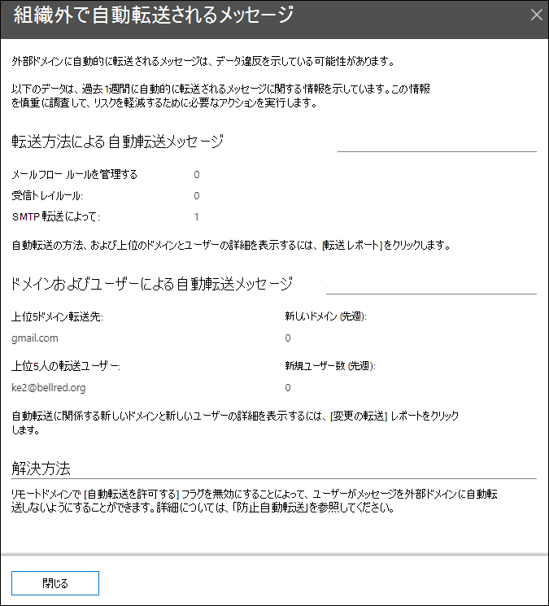

# セキュリティ センターの自動転送されたメッセージ&分析情報Auto-forwarded messages insight in the Security & Compliance Center

セキュリティ**コンプライアンス センターのメール フロー**ダッシュボードの自動[Mail flow dashboard](mail-flow-insights-v2.md)転送メッセージ インサイト &に、組織から自動的に外部ドメイン内の受信者に転送されるメッセージに関する情報が表示されます。The **Auto-forwarded messages** insight in the [Mail flow dashboard](mail-flow-insights-v2.md) in the Security & Compliance Center displays information about messages that are automatically forwarded from your organization to recipients in external domains.

## 自動転送メッセージの詳細Auto-forwarded messages details

ウィジェットのメッセージ数をクリックすると、自動転送されたメッセージに関する詳細情報を示すポップアップ ウィンドウが表示されます。When you click the number of messages in the widget, a flyout pane appears that shows more information about the auto-forwarded messages:

- **転送方法による自動転送メッセージ**:**Auto-forwarded messages by forwarding methods**:

  - **メール フロー ルール別****By mail flow rules**
  - **受信トレイのルールを使用する****By Inbox rules**
  - **SMTP 転送によるフィルター****By SMTP forwarding**
  - 詳細については、 [転送レポート](view-mail-flow-reports.md#forwarding-report) へのリンク。A link to the [Forwarding report](view-mail-flow-reports.md#forwarding-report) for more details.

- **ドメインおよびユーザー別に自動転送されたメッセージ**:**Auto-forwarded messages by domains and users**:

  - **上位 5 つのドメインに転送****Top 5 domains forwarded to**
  - **新しいドメイン (過去 1 週間)****New domains (last week)**
  - **転送ユーザー数 5 名****Top 5 forwarding users**
  - **新規ユーザー (過去 1 週間)****New users (last week)**
  - 詳細については、 [転送変更レポート](mfi-new-users-forwarding-email.md#forwarding-modifications-report) へのリンクを参照してください。A link to the [Forwarding modifications report](mfi-new-users-forwarding-email.md#forwarding-modifications-report) for more details.

## 分析情報Insights

レポート データに基づいて、次の 2 つのインサイトが生成されます。Two insights are generated based on the report data:

- [新しいユーザーのメール転送New users forwarding email](mfi-new-users-forwarding-email.md)
- [メール転送される新しいドメインNew domains being forwarded email](mfi-new-domains-being-forwarded-email.md)

## 関連項目See also

メール フロー ダッシュボードの他の分析情報については、セキュリティ コンプライアンス センターの [メール フローの詳細&を参照してください](mail-flow-insights-v2.md)。For information about other insights in the Mail flow dashboard, see [Mail flow insights in the Security & Compliance Center](mail-flow-insights-v2.md).
