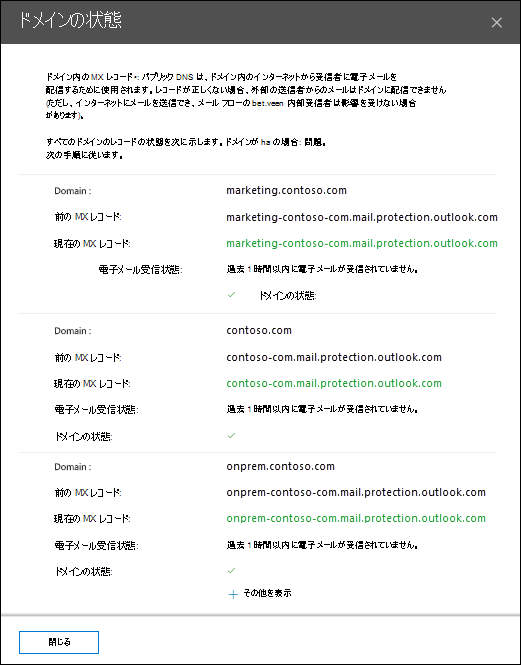

# セキュリティ コンプライアンス センターのトップ ドメイン メール フロー&分析

[!INCLUDE [Microsoft 365 Defender rebranding](../includes/microsoft-defender-for-office.md)]

**適用対象**
- [Exchange Online Protection](exchange-online-protection-overview.md)
- [Microsoft Defender for Office 365 プラン 1 およびプラン 2](defender-for-office-365.md)
- [Microsoft 365 Defender](../defender/microsoft-365-defender.md)

セキュリティ **センターの [メール フロー]** ダッシュボードの [トップ ドメイン メール フローの状態] &[は](https://protection.office.com)、組織の現在のメール フローの状態を示します。

この分析情報は、メール フローの問題が発生しているドメインを特定してトラブルシューティング ***するのに*** 役立ちます。 たとえば、ドメインの有効期限が切れているか、ドメインの MX レコードが正しくないため、ドメインは外部メールを受信できません。

ウィジェットの [**詳細の表示]** をクリックすると、各ドメインの状態の詳細を示すドメイン状態のフライアウトが表示されます。

- **ドメイン**
- **以前の MX レコード**
- **現在の MX レコード**
- **電子メールの受信状態**
- **ドメインの** 状態 : 緑色のチェック マークは、現在の MX レコード (ウィジェットをクリックした時点) が、記録されている値と一致し、ドメインが過去 2 時間の間にメールを受信した状態を示します。

  赤い X は、MX レコードが変更され、ドメインが過去 6 時間の間にメールを受信しきっていない状態を示します。 これは、ドメインの有効期限が切れているか、MX レコードが正しく更新されていないことを示している可能性があります。 ドメイン レジストラーまたは DNS ホスティング サービスに確認して、ドメインの有効期限が切れているか、ドメインの MX レコードが正しくないか確認します。

[詳細を表示 **] をクリック** すると、他のドメインの同じ情報を表示できます。

## 関連項目

メール フロー ダッシュボードの他の分析情報の詳細については、「Security & コンプライアンス センター」 [を参照してください](mail-flow-insights-v2.md)。
