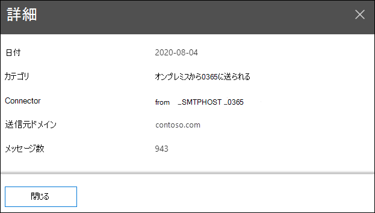

# セキュリティ コンプライアンス センターのメール フロー &マップ

[!INCLUDE [Microsoft 365 Defender rebranding](../includes/microsoft-defender-for-office.md)]

**適用対象**
- [Exchange Online Protection](exchange-online-protection-overview.md)
- [Microsoft Defender for Office 365 プラン 1 およびプラン 2](defender-for-office-365.md)
- [Microsoft 365 Defender](../defender/microsoft-365-defender.md)

セキュリティ **コンプライアンス センターの**[メール フロー  ] ダッシュボード&メール フロー マップは、組織を通じてメールがどのように流れるかについての洞察を提供します。  この情報を使用して、パターンの学習、異常の特定、発生した問題の修正を行います。

既定では、ウィジェットには、サンキー図と呼ばれるグラフに、前の日のメール フロー *パターンが表示* されます。 左矢印左矢印と右矢印右矢印を使用して、   異なる日の情報を表示できます。 各異なる色は、異なる受信コネクタまたは送信コネクタ (またはコネクタを使用しない) 上のメール フローを表します。 特定の色にカーソルを合わせると、その種類のコネクタのメッセージ数が表示されます。

## メール フロー マップのレポート ビュー

メール フロー マップ **ウィジェットをクリックすると** 、メール フロー マップ **レポートにアクセス** できます。

レポート ビューでは、次のグラフを使用できます。

- **[データの表示: 概要**] : これは基本的にウィジェットの大きなビューです。 特定の色にカーソルを合わせると、その種類のコネクタのメッセージ数が表示されます。

  

- **データの表示: 詳細**: このビューには、コネクタと宛先ドメインに関する詳細が表示されます。 上位の送信者と受信者のドメインが一覧表示され、残りは [その他] に **設定されます**。 特定の色とセクションにカーソルを合わせると、メッセージの数が表示されます。

  

レポート ビューで **[フィルター]** をクリックすると、[開始日] と [終了日] で日付 **範囲****を指定できます**。

特定の日付範囲のレポートを 1 人または複数の受信者に電子メールで送信するには、[ダウンロードの要求] **をクリックします**。

関連する分析情報は、利用可能な場合はメール フロー マップの下に表示されます (たとえば、可能なメール ループの分析情報 [を修正する](mfi-mail-loop-insight.md))。

## メール フロー マップの詳細テーブル ビュー

レポート ビューで **[詳細テーブルの表示** ] をクリックすると、次の情報が表示されます。

- **Date**
- **カテゴリ**
- **コネクタ/サードパーティ のサービス プロバイダー**
- **送信者/受信者ドメイン**
- **メッセージ数**

詳細テーブル ビューで **[フィルター** ] をクリックすると、[開始日] と [終了日] で日付 **範囲****を指定できます**。

行を選択すると、同様の詳細がフライアウトに表示されます。

特定の日付範囲のレポートを 1 人または複数の受信者に電子メールで送信するには、[ダウンロードの要求] **をクリックします**。

レポート ビューに戻る場合は、[レポートの表示] **をクリックします**。

## 関連項目

メール フロー ダッシュボードの他の分析情報の詳細については、「Security & コンプライアンス センター」 [を参照してください](mail-flow-insights-v2.md)。
