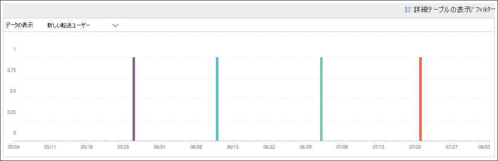

# セキュリティ コンプライアンス センターの新しいユーザーがメールの&情報を転送する

外部ドメインへの電子メール メッセージの転送が一時的に開始されたときは、不審な操作になります。

電子 **メールの分析情報が転送** されている新しいドメインは、組織内の新しく作成されたユーザーが外部のドメインにメッセージを転送しているときに通知します。 この状態は、新しいユーザーの作成に管理者アカウントが使用されたことを示す可能性があります。 アカウントが侵害されている可能性がある場合は、「侵害 [されたメール アカウントへの対応」を参照してください](https://docs.microsoft.com/microsoft-365/security/office-365-security/responding-to-a-compromised-email-account)。

この分析情報は、問題が検出されたときのみ表示され、[転送レポート] [ページに表示](view-mail-flow-reports.md#forwarding-report) されます。

ウィジェットをクリックすると、ポップアップが表示され、転送されたメッセージに関する詳細が表示されます。ここには、後の説明に従って [転送変更レポートへの](#forwarding-modifications-report) リンクを含めて確認できます。

![[新しいユーザーがメールの分析情報を転送する] をクリックした後に表示される詳細ポップアップ](../../media/mfi-new-users-forwarding-email-details.png)

この詳細ページは、**トップ**インサイト &推奨事項領域 (レポート ダッシュボードまたはレポート**View all**) で [すべてのインサイトを表示] をクリックした後で、そのインサイト**を** \> **選択すると**表示されます <https://protection.office.com/insightdashboard> 。

**[Insight] リンクに関連付けられているレポートをクリック**すると、次のセクションで説明するように転送**変更**レポートに移動できます。

## 転送変更レポート

転送 **変更レポートには、** 組織内の送信者から自動的に転送されるメッセージの詳細が表示されます。

- メッセージを外部ドメインに転送する、新しく作成されたアカウント。
- 組織内の他の送信者によって一度も転送されたのがない外部ドメインにメッセージを転送しているアカウント。

このような転送されたメッセージは、セキュリティやコンプライアンスリスクが発生する可能性があるため、アカウントが侵害された可能性があります。

レポートには、最大 90 日間のデータが含まれます。 既定では、過去 7 日間のデータが表示されます。

このレポートは、メール フロー ダッシュボード [またはレポート ダッシュボード](mail-flow-insights-v2.md) では直接 [使用できません](view-mail-flow-reports.md)。 新しいユーザーの電子メール イン **サイトのインサイト リンクに** 関連付けられた [インサイト] **リンク** をクリックする以外に、次のレポートを参照してください。

- 新しい **ドメインが転送されている電子** メールの分析情報の詳細の [転送通知レポート リンクをクリックします](mfi-new-domains-being-forwarded-email.md)。
- . <https://protection.office.com/reportv2?id=MailFlowNewForwarding>

### 転送変更レポートのレポート ビュー

レポート ビューでは、次のグラフを使用できます。

- **表示データ: 新しい転送ユーザー**:

  

- **データの表示: 新しい転送ドメイン**:

  

レポート ビューで **[フィルター** ] をクリックすると、開始日と終了日で**日付範囲****を指定できます**。

### 転送変更レポートの詳細テーブル ビュー

[詳細の **表示] テーブルを**クリックした場合に表示される情報は、表示しているグラフによって異なるためです。

- **表示データ: 新しい転送ユーザー**:

  - **Name:** 送信者の電子メール アドレス。
  - **転送の種類**
  - **受信者のアドレス**
  - **詳細**
  - **Count**
  - **1 つ目の転送日**

- **データの表示: 新しい転送ドメイン**:

  - **Name**:送信者の電子メール ドメイン。
  - **転送の種類**
  - **受信者のアドレス**
  - **詳細**
  - **Count**
  - **1 つ目の転送日**

詳細テーブル ビュー**の [** フィルター] をクリックすると、開始日と終了日で**日付範囲****を指定できます**。

テーブルから行を選択すると、[ **詳細]** ポップアップが表示され、次の情報が表示されます。

- **Name:** 送信者のメール アドレス ([データの表示 **] ビュー:新** しい転送ユーザー ビューからのもの) または送信者のメール ドメイン ([新しい転送ドメイン] ビューの [データの表示] ビュー) **のいずれか** です。
- **転送の種類**
- **Recipient**
- **詳細**
- **Count**
- **開始日**
- **推奨**: ここで、Microsoft 365 管理センターのユーザーは、リンクをクリックしてユーザーを管理できます。

![[転送変更] レポートの [新しい転送ユーザー] ビューの詳細テーブルの詳細なポップアップ](../../media/mfi-forwarding-modifications-report-new-forwarding-users-view-details-table-details.png)

レポート ビューに戻るには、[レポートの表示] **をクリックします**。

## 関連トピック

メール フロー ダッシュボードの他の分析情報については、セキュリティ コンプライアンス センターの [メール フローの詳細&を参照してください](mail-flow-insights-v2.md)。
