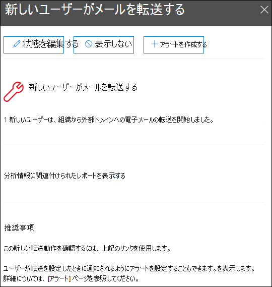
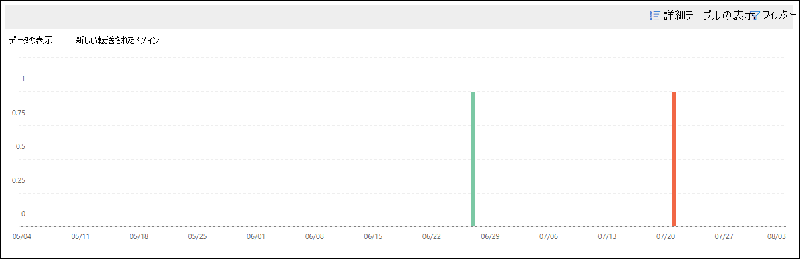

# セキュリティ コンプライアンス センターで電子メールの分析情報を&する新しいユーザー

[!INCLUDE [Microsoft 365 Defender rebranding](../includes/microsoft-defender-for-office.md)]

**適用対象**
- [Exchange Online Protection](exchange-online-protection-overview.md)
- [Microsoft Defender for Office 365 プラン 1 およびプラン 2](defender-for-office-365.md)
- [Microsoft 365 Defender](../defender/microsoft-365-defender.md)

組織の新しいユーザー アカウントが突然外部ドメインへの電子メール メッセージの転送を開始すると、疑わしい場合があります。

セキュリティ **&** コンプライアンス センターで転送される新しいドメインは、組織内 [の](https://protection.office.com) 新しく作成されたユーザーが外部ドメインにメッセージを転送するときに通知します。 この条件は、侵害された管理者アカウントが新しいユーザーの作成に使用された可能性があります。 アカウントが侵害された疑いがある場合は、「侵害されたメール アカウントに応答 [する」を参照してください](responding-to-a-compromised-email-account.md)。

この分析情報は、問題が検出された場合にのみ表示され、[転送レポート] ページ [に表示](view-mail-flow-reports.md#forwarding-report) されます。

ウィジェットをクリックすると、この記事で後述する転送変更レポートへのリンクなど、転送されたメッセージの詳細を確認できるフライアウトが表示されます。

[レポート ダッシュボード] または [ おすすめ] 領域の[トップ インサイト] 領域で [すべて表示] をクリックした後で&を選択すると、**この詳細** ページに \> **アクセス** することもできます <https://protection.office.com/insightdashboard> 。

[分析情報に関連付 **けられているレポートを表示する**] リンクをクリックすると、次のセクションで説明されている [転送の変更] レポートに移動できます。

## 変更レポートの転送

[ **転送の変更] レポート** には、組織内の送信者から自動的に転送されるメッセージに関する詳細が表示されます。

- メッセージを外部ドメインに転送する新しく作成されたアカウント。
- 組織内の他の送信者が転送したことがない外部ドメインにメッセージを転送するアカウント。

これらの種類の転送されたメッセージは、セキュリティまたはコンプライアンスのリスクを引き起し、侵害されたアカウントを示す可能性があります。

レポートには、最大 90 日間のデータが含まれる。 既定では、レポートには過去 7 日間のデータが表示されます。

このレポートは、メール フロー ダッシュボードまたは [レポート](mail-flow-insights-v2.md) ダッシュボードでは [直接使用できません](view-mail-flow-reports.md)。 [新しいユーザーがメールの分析情報を転送する]の [インサイトに関連付けられているレポートを表示する] リンクをクリックする以外に、次の方法でレポートにアクセスできます。

- [転送中の **新しい** ドメイン] の詳細にある [転送通知レポート] リンク [をクリック](mfi-new-domains-being-forwarded-email.md)します。
- を開く <https://protection.office.com/reportv2?id=MailFlowNewForwarding> 。

### 転送変更レポートのレポート ビュー

レポート ビューでは、次のグラフを使用できます。

- **データを表示する: 新しい転送ユーザー**:

  ![新しい転送ユーザーが [転送の変更] レポートに表示されます。](../../media/forwarding-modifications-report-new-forwarding-users.png)

- **データを表示する: 新しい転送ドメイン**:

  

レポート ビューで **[フィルター]** をクリックすると、[開始日] と [終了日] で日付 **範囲****を指定できます**。

### 転送変更レポートの詳細テーブル ビュー

[詳細テーブル **の表示]** をクリックすると、表示される情報は、表示されているグラフによって異なります。

- **データを表示する: 新しい転送ユーザー**:

  - **名前**: 送信者の電子メール アドレス。
  - **転送の種類**
  - **受信者の住所**
  - **詳細**
  - **Count**
  - **最初の転送日**

- **データを表示する: 新しい転送ドメイン**:

  - **名前**: 送信者の電子メール ドメイン。
  - **転送の種類**
  - **受信者の住所**
  - **詳細**
  - **Count**
  - **最初の転送日**

詳細テーブル ビューで **[フィルター** ] をクリックすると、[開始日] と [終了日] で日付 **範囲****を指定できます**。

テーブルから行を選択すると、[ **詳細** ] フライアウトが表示され、次の情報が表示されます。

- **名前**: これは、送信者の電子メール アドレス ([データの表示 **:** 新しい転送ユーザー ビュー] から) または送信者のメール ドメイン ([データの表示 **:** 新しい転送ドメイン] ビューから) のいずれかです。
- **転送の種類**
- **Recipient**
- **詳細**
- **Count**
- **開始日**
- **推奨事項**: ここから、リンクをクリックして、ユーザーを管理Microsoft 365 管理センター。

![転送変更レポートの [新しい転送ユーザー] ビューの詳細テーブルからの詳細フライアウト。](../../media/mfi-forwarding-modifications-report-new-forwarding-users-view-details-table-details.png)

レポート ビューに戻る場合は、[レポートの表示] **をクリックします**。

## 関連トピック

メール フロー ダッシュボードの他の分析情報の詳細については、「Security & コンプライアンス センター」 [を参照してください](mail-flow-insights-v2.md)。
