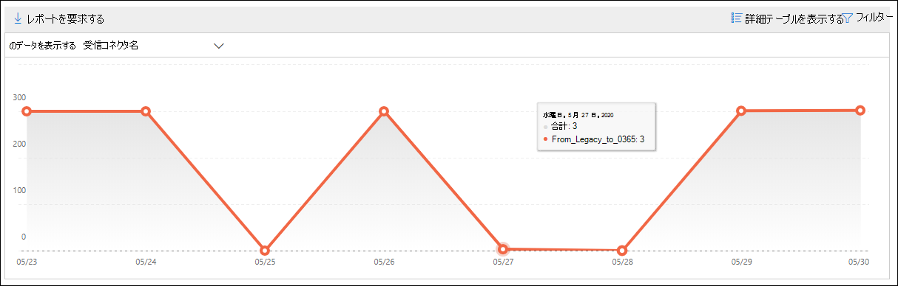

# セキュリティ コンプライアンス センターの非&レポートNon-accepted domain report in the Security & Compliance Center

[!INCLUDE [Microsoft 365 Defender rebranding](../includes/microsoft-defender-for-office.md)]

**適用対象****Applies to**
- [Exchange Online ProtectionExchange Online Protection](exchange-online-protection-overview.md)
- [Microsoft Defender for Office 365 プラン 1 およびプラン 2Microsoft Defender for Office 365 plan 1 and plan 2](defender-for-office-365.md)
- [Microsoft 365 DefenderMicrosoft 365 Defender](../defender/microsoft-365-defender.md)

セキュリティ [&](https://protection.office.com)コンプライアンス センターのメールフロー ダッシュボードの [承認されていないドメイン] レポートには、送信者のドメインが Microsoft 365 組織で承認されたドメインとして構成されていないオンプレミスの電子メール組織からのメッセージに関する情報が表示されます。The **Non-accepted domain** report in the [Mail flow dashboard](mail-flow-insights-v2.md) in the [Security & Compliance Center](https://protection.office.com) displays information about messages from your on-premises email organization where the sender's domain isn't configured as an accepted domain in your Microsoft 365 organization.

Microsoft 365の意図が悪意のあるものであることを証明するデータがある場合は、これらのメッセージを調整する可能性があります。Microsoft 365 might throttle these messages if we have data to prove that the intent of these messages is malicious. したがって、何が起こっているのかを理解し、問題を解決することが重要です。Therefore, it's important for you to understand what's happening and to fix the issue.

## 非承諾ドメイン レポートのレポート ビューReport view for the Non-accepted domain report

[非承諾ドメイン] ウィジェットのグラフ **を** クリックすると、非承諾ドメイン **レポートにアクセス** できます。Clicking the chart on the **Non-accepted domain** widget will take you to the **Non-accepted domain** report.

既定では、影響を受けるすべてのコネクタのアクティビティが表示されます。By default, the activity for all affected connectors is shown. [データの表示 **] をクリックすると**、ドロップダウンから特定のコネクタを選択できます。If you click **Show data for**, you can select a specific connector from the dropdown.

グラフ内のデータ ポイント (日) にカーソルを合わせると、コネクタのメッセージの総数が表示されます。If you hover over a data point (day) in the chart, you'll see the total number of messages for the connector.

## 非承諾ドメイン レポートの詳細テーブル ビューDetails table view for the Non-accepted domain report

レポート ビューで **[詳細テーブルの表示** ] をクリックすると、次の情報が表示されます。If you click **View details table** in a report view, the following information is shown:

- **Date****Date**
- **受信コネクタ名****Inbound connector name**
- **送信元ドメイン****Sender domain**
- **メッセージ数****Message count**
- **サンプル メッセージ**: 影響を受けるメッセージのサンプルのメッセージの ID です。**Sample messages**: The message IDs of a sample of affected messages.

詳細テーブル ビューで **[フィルター** ] をクリックすると、[開始日] と [終了日] で日付 **範囲\*\*\*\*を指定できます**。If you click **Filters** in a details table view, you can specify a date range with **Start date** and **End date**.

特定の日付範囲のレポートを 1 人または複数の受信者に電子メールで送信するには、[ダウンロードの要求] **をクリックします**。To email the report for a specific date range to one or more recipients, click **Request download**.

テーブル内の行を選択すると、次の情報を含むフライアウトが表示されます。When you select a row in the table, a flyout appears with the following information:

- **Date****Date**
- **受信コネクタ名****Inbound connector name**
- **送信元ドメイン****Sender domain**
- **メッセージ数****Message count**
- **サンプル メッセージ**: [サンプル メッセージの **表示] を** クリックすると、影響を受けるメッセージのサンプルのメッセージ トレース結果を確認できます。**Sample messages**: You can click **View sample messages** to see the [message trace](message-trace-scc.md) results for a sample of the affected messages.

![[承認されていないドメイン] レポートの [詳細] テーブル ビューで行を選択した後の詳細の飛び出し](../../media/mfi-non-accepted-domain-report-details-flyout.png)

レポート ビューに戻る場合は、[レポートの表示] **をクリックします**。To go back to the reports view, click **View report**.

## 関連項目Related topics

メール フロー ダッシュボードの他の分析情報の詳細については、「Security & コンプライアンス センター」 [を参照してください](mail-flow-insights-v2.md)。For information about other insights in the Mail flow dashboard, see [Mail flow insights in the Security & Compliance Center](mail-flow-insights-v2.md).
