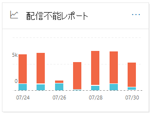
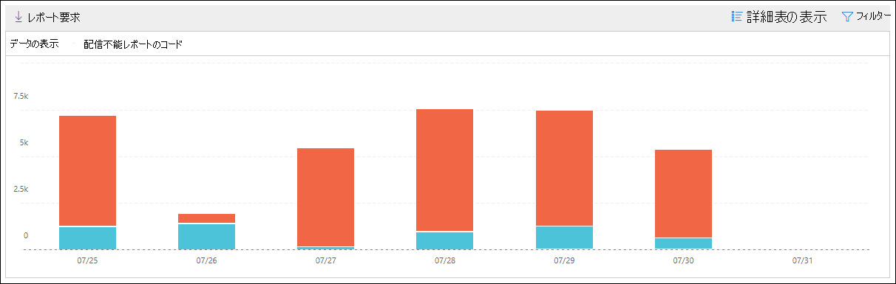

# セキュリティ コンプライアンス センターの配信&レポート

[!INCLUDE [Microsoft 365 Defender rebranding](../includes/microsoft-defender-for-office.md)]

**適用対象**
- [Exchange Online Protection](exchange-online-protection-overview.md)
- [Microsoft Defender for Office 365 プラン 1 およびプラン 2](defender-for-office-365.md)
- [Microsoft 365 Defender](../defender/microsoft-365-defender.md)

セキュリティ [&](https://protection.office.com)コンプライアンス センターのメール フロー ダッシュボードの配信不可レポートには、組織内のユーザーの配信不可レポート (NDRs またはバウンス メッセージとも呼ばれる) で最も発生したエラー コードが表示されます。 このレポートには、メール配信の問題をトラブルシューティングするための、NDRs の詳細が表示されます。

## 配信不可レポートのレポート ビュー

[配信不可レポート **] ウィジェットをクリック** すると、[配信不可] **レポートにアクセスします**。

既定では、すべてのエラー コードのアクティビティが表示されます。 [データの表示 **] をクリックすると**、ドロップダウンから特定のエラー コードを選択できます。

グラフ内の特定の日に特定の色 (エラー コード) にカーソルを合わせると、エラーのメッセージの総数が表示されます。

## 配信不可レポートの詳細テーブル ビュー

レポート ビューで **[詳細テーブルの表示** ] をクリックすると、次の情報が表示されます。

- **Date**
- **配信不可レポート コード**
- **Count**
- **サンプル メッセージ**: 影響を受けるメッセージのサンプルのメッセージの ID です。

詳細テーブル ビューで **[フィルター** ] をクリックすると、[開始日] と [終了日] で日付 **範囲****を指定できます**。

特定の日付範囲のレポートを 1 人または複数の受信者に電子メールで送信するには、[ダウンロードの要求] **をクリックします**。

テーブル内の行を選択すると、次の情報を含むフライアウトが表示されます。

- **Date**
- **配信不可レポート コード**: リンクをクリックすると、特定のエラー コードの原因と解決策の詳細を確認できます。
- **Count**
- **サンプル メッセージ**: [サンプル メッセージの **表示] を** クリックすると、影響を受けるメッセージのサンプルのメッセージ トレース結果を確認できます。

![[配信不可] レポートの [詳細] テーブル ビューで行を選択した後の詳細の飛び出し](../../media/mfi-non-delivery-report-details-flyout.png)

## 関連項目

メール フロー ダッシュボードの他の分析情報の詳細については、「Security & コンプライアンス センター」 [を参照してください](mail-flow-insights-v2.md)。
