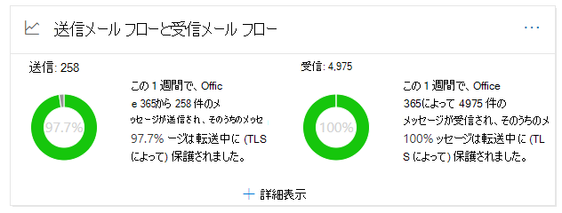

# セキュリティ & コンプライアンスセンターにおける送信および受信メールフローの洞察Outbound and inbound mail flow insight in the Security & Compliance Center

[!INCLUDE [Microsoft 365 Defender rebranding](../includes/microsoft-defender-for-office.md)]

[セキュリティ & コンプライアンスセンター](https://protection.office.com)の[メールフローダッシュボード](mail-flow-insights-v2.md)に記載されている**送信および受信メールフロー**の洞察は、[コネクタレポート](view-mail-flow-reports.md#connector-report)と以前の**TLS 概要レポート**の情報を1つの場所にまとめたものです。The **Outbound and inbound mail flow** insight in the [Mail flow dashboard](mail-flow-insights-v2.md) in the [Security & Compliance Center](https://protection.office.com) combines the information from the [Connector report](view-mail-flow-reports.md#connector-report) and the former **TLS overview report** in one place.

ウィジェットには、組織との間でメッセージが配信されるときに接続に使用される TLS 暗号化が表示されます。The widget displays the TLS encryption that's used for the connection when messages are delivered to and from your organization. 他の電子メールサービスで確立された接続は、両方の側で TLS が提供されるときに TLS によって暗号化されます。The connections that are established with other email services are encrypted by TLS when TLS is offered by both sides. このウィジェットは、メールフローの最終週のスナップショットを提供します。The widget offers a snapshot of the last week of mail flow.

ウィジェットの情報は、Microsoft 365 のコネクタと TLS メッセージ保護に関連しています。The information in the widget is related to connectors and TLS message protection in Microsoft 365. 詳細については、以下のトピックを参照してください。For more information, see these topics:

- [コネクタを使用してメール フローを構成するConfigure mail flow using connectors](https://docs.microsoft.com/exchange/mail-flow-best-practices/use-connectors-to-configure-mail-flow/use-connectors-to-configure-mail-flow)
- [Exchange Online が TLS を使用して電子メール接続をセキュリティで保護する方法How Exchange Online uses TLS to secure email connections](https://docs.microsoft.com/microsoft-365/compliance/exchange-online-uses-tls-to-secure-email-connections)
- [Microsoft 365 での暗号化に関するテクニカルリファレンスの詳細Technical reference details about encryption in Microsoft 365](https://docs.microsoft.com/microsoft-365/compliance/technical-reference-details-about-encryption)

## 送信で保護されたメッセージ (TLS)Message protected in transit (by TLS)

ウィジェットの [ **詳細の表示** ] をクリックすると、[ **送信中 (TLS) で保護さ** れたメッセージ] ポップアップには、組織に出入りするメッセージの TLS 保護が表示されます。When you click **View Details** on the widget, the **Message protected in transit (by TLS)** flyout shows you the TLS protection for messages entering and leaving your organization.

![送信および受信電子メールウィジェットの [詳細の表示] をクリックした後に表示される、転送中 (TLS) のポップアップで保護されたメッセージ](../../media/mfi-outbound-and-inbound-mail-flow-report-details.png)

現時点では、TLS 1.2 は、Microsoft 365 で提供されている最も安全な TLS のバージョンです。Currently, TLS 1.2 is the most secure version of TLS that's offered by Microsoft 365. 多くの場合、コンプライアンス監査に使用されている TLS 暗号化を知っておく必要があります。Often, you'll need to know the TLS encryption that's being used for compliance audits. ほとんどの場合、送信元および送信先の電子メールサーバー (それらを所有しておらず、Microsoft も対象としていません) との直接的な関係はありません。そのため、これらのサーバーで使用される TLS 暗号化を改善するためのオプションは多くありません。You probably don't have a direct relationship with most of the source and destination email servers (you don't own them, and neither does Microsoft), so you don't have many options to improve the TLS encryption that's used by those servers.

ただし、 [コネクタ](https://docs.microsoft.com/exchange/mail-flow-best-practices/use-connectors-to-configure-mail-flow/use-connectors-to-configure-mail-flow) を使用して、電子メールサーバーと Microsoft 365 との間で送信されるメッセージに最適な TLS 保護を確保することができます。But, you can use [connectors](https://docs.microsoft.com/exchange/mail-flow-best-practices/use-connectors-to-configure-mail-flow/use-connectors-to-configure-mail-flow) to ensure the best available TLS protection for messages that are sent between your email servers and Microsoft 365. Microsoft 365 と、パートナーに属する独自の電子メールサーバーまたはサーバー間のメールフローは、通常のメッセージよりも重要で重要なものなので、追加のセキュリティと警戒をこれらのメッセージに適用する必要があります。Mail flow between Microsoft 365 and your own email servers or servers that belong to your partners is often more important and sensitive than regular messages, so you'll want to apply extra security and vigilance to those messages.

独自の電子メールサーバーをアップグレードまたは修正して、使用されている TLS 暗号化を改善したり、パートナーに接続して同じ操作を実行したりすることができます。You can upgrade or fix your own email servers to improve the TLS encryption that's being used, or reach out to your partners to do the same. **コネクタレポート**には、Microsoft 365 コネクタを使用するメッセージのメールフローボリュームと TLS 暗号化の両方が表示されます。The **Connector Report** displays both mail flow volume and TLS encryption for messages that use your Microsoft 365 connectors.

[ **コネクタレポート** ] リンクをクリックすると、 [コネクタレポート](view-mail-flow-reports.md#connector-report)に移動できます。You can click the **Connector report** link to go to the [Connector report](view-mail-flow-reports.md#connector-report). 関連付けられている条件が検出された場合、次の洞察が **コネクタレポート** ページに表示されることがあります。The following insights might be available on the **Connector report** page if the associated condition has been detected:

- **受信パートナーコネクタが重要な TLS 1.0 メールフローを参照している****Inbound Partner connector seeing significant TLS1.0 mail flow**
- **受信 OnPremises connector で、TLS 1.0 メールフローが重要****Inbound OnPremises connector seeing significant TLS1.0 mail flow**

TLS 1.0 接続の場合、実際には、Microsoft 365 で TLS 1.0 サポートが廃止された場合の問題を回避するために、電子メールサーバーまたはパートナーのサーバーをアップグレードまたは修正する必要があります。For TLS 1.0 connections, you really need to get your email server or your partner's server upgraded or fixed to avoid any issues when TLS 1.0 support is eventually deprecated in Microsoft 365.

## 関連項目See also

メールフローダッシュボードの他の洞察の詳細については、「 [セキュリティ & コンプライアンスセンター」の「mail flow insights](mail-flow-insights-v2.md)」を参照してください。For information about other insights in the Mail flow dashboard, see [Mail flow insights in the Security & Compliance Center](mail-flow-insights-v2.md).
