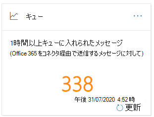
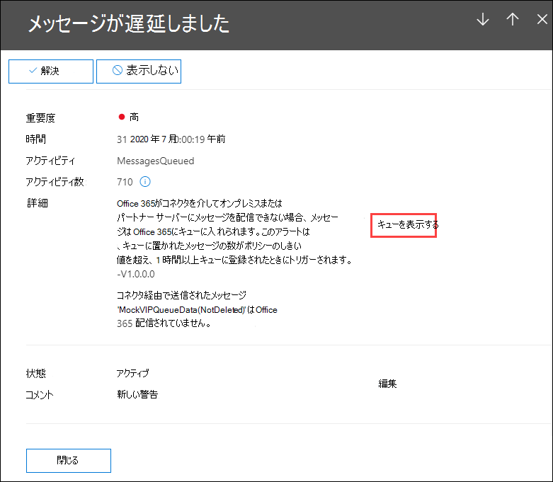

# コンプライアンス センターのセキュリティ &キューの分析情報

[!INCLUDE [Microsoft 365 Defender rebranding](../includes/microsoft-defender-for-office.md)]

**適用対象**
- [Exchange Online Protection](exchange-online-protection-overview.md)
- [Microsoft Defender for Office 365 プラン 1 およびプラン 2](defender-for-office-365.md)
- [Microsoft 365 Defender](../defender/microsoft-365-defender.md)

コネクタを使用して組織からオンプレミスまたはパートナーの電子メール サーバーにメッセージを送信できない場合、メッセージはキューにMicrosoft 365。 この条件の原因となる一般的な例は次のとおりです。

- コネクタが正しく構成されていません。
- オンプレミス環境でネットワークまたはファイアウォールの変更が行いました。

Microsoft 365は引き続き 24 時間配信を再試行します。 24 時間が経過すると、メッセージは有効期限が切れ、配信不可レポート (NDRs またはバウンス メッセージとも呼ばれる) の送信者に返されます。

キューに入った電子メール ボリュームが定義済みのしきい値 (既定値は 200 メッセージ) を超えた場合、情報は次の場所で使用できます。

- セキュリティ **コンプライアンス センター** の [[メール](mail-flow-insights-v2.md) フロー] ダッシュボードの [ [キュー&分析情報](https://protection.office.com)です。 詳細については、この記事の [「メール フロー ダッシュボード」セクションの「Queues insight」](#queues-insight-in-the-mail-flow-dashboard) を参照してください。

- [最近のアラート]**には**、[セキュリティ] コンプライアンス センター ([アラート ダッシュボード] または ) の [[&]](https://protection.office.com)ダッシュボードにアラート \> **が表示** されます <https://protection.office.com/alertsdashboard> 。

  ![セキュリティ センターコンプライアンス センターの [アラート] ダッシュボード&最近の通知。](../../media/mfi-queued-messages-alert.png)

- 管理者は、[メッセージ] という名前の既定のアラート ポリシーの構成に基づいて電子メール通知 **を受信します**。 このアラートの通知設定を構成するには、次のセクションを参照してください。

  アラート ポリシーの詳細については、「Security & コンプライアンス センター」 [を参照してください](../../compliance/alert-policies.md)。

## キュー通知のカスタマイズ

1. セキュリティ コンプライアンス [センターで&アラート](https://protection.office.com)ポリシーに移動するか \> **、** 開きます <https://protection.office.com/alertpolicies> 。

2. [アラート **ポリシー] ページで** 、[メッセージが遅延している] という名前のポリシー **を見つけて選択します**。

3. [メッセージ **が遅延された] フライ** アウトが開いたら、通知をオンまたはオフにし、通知設定を構成できます。

   

   - **状態**: アラートをオンまたはオフに切り替えます。

   - **メール受信者と日****次通知の制限**: [**編集**] をクリックして、次の設定を構成します。

4. 通知設定を構成するには、[編集] を **クリックします**。 表示される **[ポリシーの編集]** フライアウトで、次の設定を構成します。

   - **電子メール通知の送信**: 既定値はオンです。
   - **メール受信者**: 既定値は **TenantAdmins です**。
   - **1 日の通知の** 制限 : 既定値は [制限 **なし] です**。
   - **しきい** 値 : 既定値は 200 です。

   ![[メッセージ] の通知設定は、遅延アラート ポリシーの詳細に関するセキュリティ &コンプライアンス センターです。](../../media/mfi-queued-messages-alert-policy-notification-settings.png)

5. 完了したら、[保存して閉じる]を **クリックします**。

## メール フロー ダッシュボードのキューの分析情報

キューに入っているメッセージ ボリュームがしきい値を超えてアラートを生成した場合でも、メール フロー ダッシュボードの **Queues** インサイトを使用して、1 時間以上キューに入っているメッセージを確認し、キューに入っているメッセージの数が大きすぎる前にアクションを実行できます。

ウィジェット上のメッセージ数をクリックすると **、キューに** 入ったメッセージ のフライアウトが次の情報で表示されます。

- **キューに入ったメッセージの数**
- **コネクタ名**: コネクタ名をクリックして、管理センター (EAC) のコネクタExchange管理します。
- **キューの開始時刻**
- **最も古いメッセージの有効期限が切れています**
- **宛先サーバー**
- **最後の IP アドレス**
- **最後のエラー**
- **修正方法**: 一般的な問題とソリューションを利用できます。 [今すぐ **修正する]** リンクが利用可能な場合は、それをクリックして問題を解決します。 それ以外の場合は、エラーと考えられる解決策の詳細については、利用可能なリンクをクリックしてください。

![メール フロー ダッシュボードの [キュー] インサイトをクリックした後の詳細。](../../media/mfi-queues-details.png)

[メッセージの遅延通知] の詳細で [キューの表示] をクリックすると、同じ **フライアウトが表示** されます。

## 関連項目

メール フロー ダッシュボードの他の分析情報の詳細については、「Security & コンプライアンス センター」 [を参照してください](mail-flow-insights-v2.md)。
