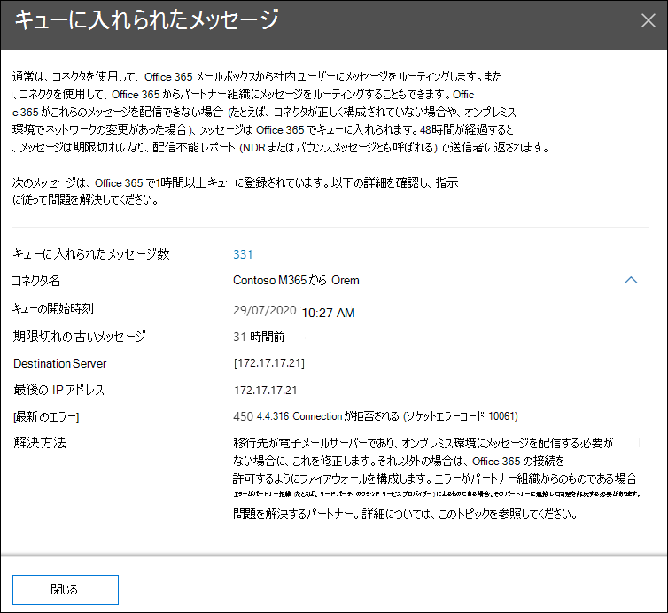

# セキュリティ & コンプライアンスセンターでのキューの把握

コネクタを使用して組織からオンプレミスまたはパートナーの電子メールサーバーにメッセージを送信できない場合、メッセージは Microsoft 365 でキューに入れられます。 このような状態になる一般的な例を次に示します。

- コネクタが正しく構成されていません。
- オンプレミス環境でネットワークまたはファイアウォールの変更が行われています。

Microsoft 365 は、24時間、引き続き配信を再試行します。 24時間後、メッセージは期限切れになり、配信不能レポート (Ndr またはバウンスメッセージとも呼ばれる) で送信者に返されます。

キューに入っている電子メールのボリュームが事前に定義されたしきい値 (既定値は200メッセージ) を超えている場合、情報は次の場所で利用できます。

- [セキュリティ & コンプライアンスセンター](https://protection.office.com)の[メールフローダッシュボード](mail-flow-insights-v2.md)で洞察を得る**キュー** 。 詳細については、このトピックの「 [メールフローダッシュボード](#queues-insight-in-the-mail-flow-dashboard) 」セクションの「キューの洞察」を参照してください。
  
- [[セキュリティ & コンプライアンスセンター](https://protection.office.com) (**alerts** dashboard または) のアラート**ダッシュボードに通知**が表示され \> **Dashboard** <https://protection.office.com/alertsdashboard> ます。

  

- 管理者は、 **メッセージが遅延**した既定の警告ポリシーの構成に基づいて電子メール通知を受信します。 この通知の通知設定を構成するには、次のセクションを参照してください。

  アラートポリシーの詳細については、「 [セキュリティ & コンプライアンスセンターのアラートポリシー](../../compliance/alert-policies.md)」を参照してください。

## キューの通知をカスタマイズする

1. [ [セキュリティ & コンプライアンスセンター](https://protection.office.com)] で、[ **alerts** \> **Alert policies** ] または [open] に移動し <https://protection.office.com/alertpolicies> ます。

2. [ **通知ポリシー** ] ページで、[ **メッセージが遅延して**います] という名前のポリシーを見つけて選択します。

3. メッセージが開く遅延ポップアップが表示 **されて** いる場合は、アラートをオンまたはオフにして通知設定を構成できます。

   

   - **状態**: アラートをオンまたはオフに切り替えることができます。

   - **電子メール受信者** および **毎日の通知制限**: [ **編集** ] をクリックして、次の設定を構成します。

4. 通知設定を構成するには、[ **編集**] をクリックします。 表示される [ **ポリシーの編集** ] ポップアップで、次の設定を構成します。

   - **電子メール通知の送信**: 既定値は on です。
   - **電子メール受信者**: 既定値は **tenantadmins**です。
   - **毎日の通知制限**: 既定値は **無制限**です。
   - **しきい**値: 既定値は200です。

   

5. 完了したら、[ **保存** して **閉じる**] をクリックします。

## メールフローダッシュボードでのキューの把握

キュー内のメッセージボリュームがしきい値を超えていない場合でも、[メールフローダッシュボード](mail-flow-insights-v2.md)の [**キュー** ] 洞察を使用して、キューに入れられたメッセージ数が多すぎることを確認してから、キューに入れられたメッセージ数が大きくなる前に処理を実行することができます。

ウィジェットのメッセージ数をクリックすると、キューに **置か** れたメッセージが次の情報と共に表示されます。

- **キューに入れられたメッセージ数**
- **コネクタ名**: コネクタ名をクリックして、Exchange 管理センター (EAC) でコネクタを管理します。
- **キューの開始時刻**
- **期限切れの古いメッセージ**
- **移行先サーバー**
- **最後の IP アドレス**
- **最後のエラー**
- **修正方法**: 一般的な問題と解決策を入手できます。 [ **今すぐ修正** する] リンクが利用可能な場合は、それをクリックして問題を解決します。 エラーおよび可能な解決方法の詳細については、使用可能なリンクをクリックしてください。

メッセージの詳細で [ **キューの表示** ] をクリックした後に、同じポップアップが表示されるアラート **が遅延して** います。

## 関連項目

メールフローダッシュボードの他の洞察の詳細については、「 [セキュリティ & コンプライアンスセンター」の「mail flow insights](mail-flow-insights-v2.md)」を参照してください。
