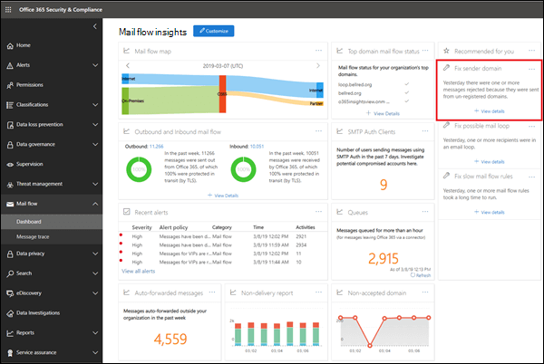
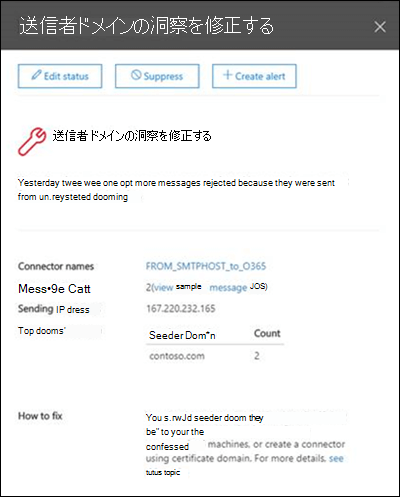

# 送信者ドメインの洞察を修正する

Office 365 では、内部のオンプレミスの電子メール環境から Office 365 に送信されるメッセージで、特定のセキュリティ条件を満たす必要があります。

- 送信元の IP アドレスまたは証明書を使用して、オンプレミスの電子メールサーバーからの SMTP 接続を認証するために、Office 365 で受信コネクタを作成しました。

- Office 365 を介して外部の world に電子メールを中継するようにオンプレミスの電子メールサーバーが構成されている。

- 構成では、次のいずれかのステートメントが true になります。

  - 送信者の電子メールドメインは、Office 365 組織に登録されています。 詳細については、「Office のドメインを追加する365」を参照してください。

  - オンプレミスの電子メールサーバーが、証明書を使用して Office 365 に電子メールを送信するように構成されており、証明書が office 365 に登録したドメイン名と完全に一致していて、それを含む Office 365 に証明書ベースのコネクタが作成されている。領域. 

条件を満たしていないメッセージは、組織には含まれず、拒否される可能性があります。

「**送信者ドメインを修正**する」には、オンプレミスの環境からの、条件に一致しないメールが表示されます。これにより、オンプレミスの電子メール環境にある潜在的に侵害されたコンピューターやユーザーアカウントを特定し、修復のアクションを実行するのに役立てることができます。

[詳細の**表示**] をクリックすると、次の図に示すように、詳細を含む別のウィジェットに移動します。

Office 365 にメッセージを配信するために使用された受信コネクタが表示されます。 [**サンプルメッセージ id の表示**] をクリックして、オンプレミスの電子メール環境から送信されたメッセージの詳細を確認することもできます。 これらのメッセージは Office 365 によって拒否されたため、メッセージ追跡を使用することはできませんが、サンプルのメッセージ id を使用してオンプレミスの電子メール環境内のメッセージを追跡できます。

## 関連項目

メールフローダッシュボードのその他のメールフローインサイトの詳細については、「[セキュリティ & コンプライアンスセンター」の「mail flow insights](mail-flow-insights-v2.md)」を参照してください。
