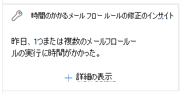

# セキュリティ & コンプライアンスセンターでの低速メールフロールールの洞察を修正するFix slow mail flow rules insight in the Security & Compliance Center

[!INCLUDE [Microsoft 365 Defender rebranding](../includes/microsoft-defender-for-office.md)]

非効率的なメールフロールール (トランスポートルールとも呼ばれます) は、組織のメールフロー遅延につながる可能性があります。Inefficient mail flow rules (also known as transport rules) can lead to mail flow delays for your organization. この洞察は、組織のメールフローに影響を与えるメールフロールールを報告します。This insight reports mail flow rules that have an impact on your organization's mail flow. これらの種類のルールの例を次に示します。Examples of these types of rules include:

- **が** 大規模なグループの場合、を使用する条件。Conditions that use **Is member of** for large groups.
- 複合正規表現 (regex) パターンマッチングを使用する条件。Conditions that use complex regular expression (regex) pattern matching.
- 添付ファイルのコンテンツチェックを使用する条件。Conditions that use content checking in attachments.

「セキュリティの **低速メール** フロールール」では、 [セキュリティ & コンプライアンスセンター](https://protection.office.com)のメール [フローダッシュボード](mail-flow-insights-v2.md)の **推奨事項につい** て理解しています。メールフロールールの完了に時間がかかりすぎた場合に通知します。The **Fix slow mail flow rules** insight in the **Recommended for you** area of the [Mail flow dashboard](mail-flow-insights-v2.md) in the [Security & Compliance Center](https://protection.office.com) notifies you when a mail flow rule is taking too long to complete.

この洞察は、条件が検出された後にのみ表示されます (メールループがない場合は、洞察は見られません)。This insight appears only after the condition is detected (if you don't have any mail loops, you won't see the insight).

メールフローの遅延を減らすために、この通知を使用して、メールフロールールを識別し、微調整することができます。You can use this notification to help you to identify and fine-tune mail flow rules to help reduce mail flow delays.

ウィジェットの [ **詳細の表示** ] をクリックすると、詳細情報を含むフライアウトが表示されます。When you click **View details** on the widget, a flyout appears with more information:

- **ルール** : 概要にマウスカーソルを移動すると、ルールのすべての条件、例外、およびアクションが表示されます。**Rule** : You can hover over the summary to see all of the conditions, exceptions, and actions of the rule. 概要をクリックして、Exchange 管理センター (EAC) でルールを編集できます。You can click on the summary to edit the rule in the Exchange admin center (EAC).
- 評価された **メッセージの数** : [ **サンプルメッセージの表示** ] をクリックすると、ルールの影響を受けたメッセージのサンプルのメッセージの [追跡](message-trace-scc.md)結果が表示されます。**Number of messages evaluated** : You can click **View sample messages** to see the [message trace](message-trace-scc.md) results for a sample of the messages that were affected by the rule.
- **各メッセージにかかった平均時間****Average time spent on each message**
- **メッセージにかかった平均** 時間: 時間データの下半分から上半分を区切る中央値。**Median time spent on a message** : The middle value that separates the upper half from the lower half of time data.

![[Fix the details mail flow rules] の [詳細の表示] をクリックした後に表示される詳細ポップアップ](../../media/mfi-fix-slow-mail-flow-rules-details.png)

メール フロー ルールにおける条件と例外の詳細については、「[Mail flow rule conditions and exceptions (predicates) in Exchange Online](https://docs.microsoft.com/Exchange/security-and-compliance/mail-flow-rules/conditions-and-exceptions)」を参照してください。For more information about conditions and exceptions in mail flow rules, see [Mail flow rule conditions and exceptions (predicates) in Exchange Online](https://docs.microsoft.com/Exchange/security-and-compliance/mail-flow-rules/conditions-and-exceptions).

## 関連項目See also

メールフローダッシュボードの他の洞察の詳細については、「 [セキュリティ & コンプライアンスセンター」の「mail flow insights](mail-flow-insights-v2.md)」を参照してください。For information about other insights in the Mail flow dashboard, see [Mail flow insights in the Security & Compliance Center](mail-flow-insights-v2.md).
