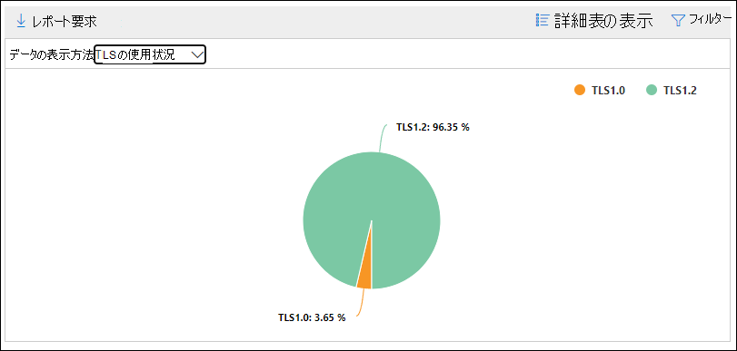
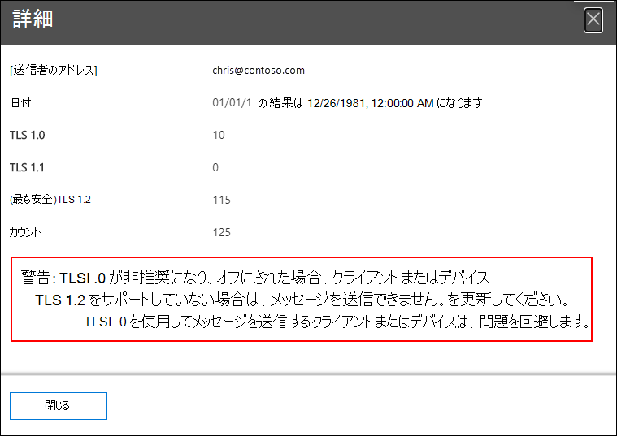

# SMTP Auth クライアントの分析情報とレポート (セキュリティ & コンプライアンス センター)

[!INCLUDE [Microsoft 365 Defender rebranding](../includes/microsoft-defender-for-office.md)]

**適用対象**
- [Exchange Online Protection](exchange-online-protection-overview.md)
- [Microsoft Defender for Office 365 プラン 1 およびプラン 2](defender-for-office-365.md)
- [Microsoft 365 Defender](../defender/microsoft-365-defender.md)

メール フロー ダッシュボードの SMTP  **Auth** クライアントの分析情報と、セキュリティ [&](https://protection.office.com)コンプライアンス センターの関連付けられた [SMTP 認証](#smtp-auth-clients-report)クライアント レポートでは、組織内のユーザーまたはシステム アカウントによる SMTP AUTH クライアント申請プロトコルの使用が強調表示されます。 このレガシ プロトコル (エンドポイント smtp.office365.com を使用) は基本認証のみを提供し、侵害されたアカウントが電子メールを送信するために使用される影響を受けやすいです。 分析情報とレポートを使用すると、SMTP AUTH メール送信の異常なアクティビティを確認できます。 また、SMTP AUTH を使用するクライアントまたはデバイスの TLS 使用状況データも表示されます。

ウィジェットは、過去 7 日間に SMTP Auth プロトコルを使用したユーザーまたはサービス アカウントの数を示します。

ウィジェット上のメッセージ数をクリックすると **、SMTP Auth クライアント** のフライアウトが表示されます。 このフライアウトは、先週の TLS 使用状況とボリュームの集計ビューを提供します。

[SMTP **Auth クライアント** ] レポート リンクをクリックすると、次のセクションの説明に従って SMTP Auth クライアント レポートに移動できます。

## SMTP Auth クライアントのレポート

### SMTP Auth クライアント レポートのレポート ビュー

既定では、レポートには過去 7 日間のデータが表示されますが、過去 90 日間はデータを使用できます。

[概要] セクションには、次のグラフが含まれます。

- データ **の表示方法: 送信** ボリューム : 既定では、すべてのドメインから送信された SMTP Auth クライアント メッセージの数がグラフに表示されます ([データの表示 **:** すべての送信者ドメインが既定で選択されています)。 [データの表示] をクリックし、ドロップダウン リストから送信者ドメインを選択すると、結果を特定の送信者ドメインにフィルター処理できます。 特定のデータ ポイント (日) をホバーすると、メッセージの数が表示されます。

  ![コンプライアンス センターの [セキュリティ] ページの [SMTP Auth クライアント] レポート&送信します。](../../media/mfi-smtp-auth-clients-report-sending-volume-view.png)

- **[データの表示方法: TLS 使用法**]: 選択した期間中のすべての SMTP Auth クライアント メッセージに対する TLS 使用率の割合がグラフに表示されます。 このグラフを使用すると、以前のバージョンの TLS を使用しているユーザーとシステム アカウントを特定してアクションを実行できます。

  

レポート ビューで **[フィルター]** をクリックすると、[開始日] と [終了日] で日付 **範囲****を指定できます**。

[ **レポートの要求]** をクリックして、より詳細なバージョンのレポートを電子メール メッセージで受信します。 レポートを受信する日付範囲と受信者を指定できます。

### SMTP Auth クライアント レポートの詳細テーブル ビュー

[詳細テーブル **の表示]** をクリックすると、表示される情報は、表示されているグラフによって異なります。

- **データの表示方法: ボリュームの送信**: 次の情報を表に示します。

  - **[送信者のアドレス]**
  - **メッセージ数**

  行を選択すると、同じ詳細がフライアウトに表示されます。

- **データの表示方法: TLS 使用法**: 次の情報を表に示します。

  - **[送信者のアドレス]**
  - **TLS1.0%**\*
  - **TLS1.1%**\*
  - **TLS1.2%**\*
  - **メッセージ数**

  \* この列には、送信者からのメッセージの割合と数の両方が表示されます。

詳細テーブル ビューで **[フィルター** ] をクリックすると、[開始日] と [終了日] で日付 **範囲****を指定できます**。

行を選択すると、同様の詳細がフライアウトに表示されます。

[ **レポートの要求]** をクリックして、より詳細なバージョンのレポートを電子メール メッセージで受信します。 レポートを受信する日付範囲と受信者を指定できます。

レポート ビューに戻る場合は、[レポートの表示] **をクリックします**。

## 関連項目

メール フロー ダッシュボードの他の分析情報の詳細については、「Security & コンプライアンス センター」 [を参照してください](mail-flow-insights-v2.md)。
