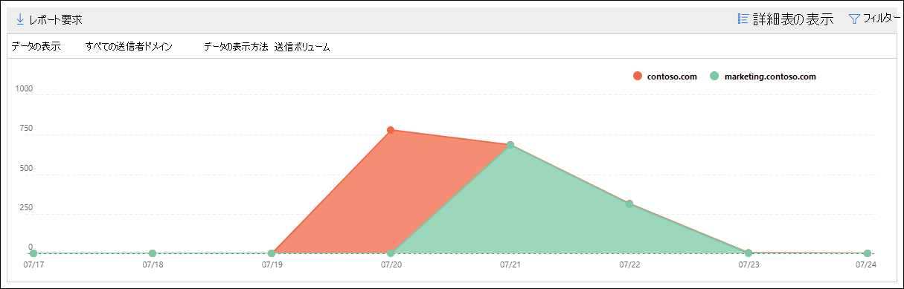

# セキュリティ/コンプライアンス センターでの SMTP 認証&レポート

[!INCLUDE [Microsoft 365 Defender rebranding](../includes/microsoft-defender-for-office.md)]

メール フロー ダッシュボード内の SMTP 認証クライアントの分析情報と、セキュリティ [&](https://protection.office.com)コンプライアンス センターの関連付けられた [SMTP 認証](#smtp-auth-clients-report)クライアント レポートでは、組織内のユーザーまたはシステム アカウントによる **SMTP** AUTH クライアント送信プロトコルの使用が強調表示されます。 この従来のプロトコル (エンドポイント smtp.office365.com を使用) は基本認証のみを提供し、侵害されたアカウントが電子メールを送信するために使用される可能性があります。 分析情報とレポートを使用すると、SMTP AUTH 電子メール送信の異常なアクティビティを確認できます。 また、SMTP AUTH を使用するクライアントまたはデバイスの TLS 使用状況データも示します。

ウィジェットは、過去 7 日間に SMTP 認証プロトコルを使用したユーザーまたはサービス アカウントの数を示します。

ウィジェット上のメッセージ数をクリックすると **、SMTP 認証クライアント** のフライアウトが表示されます。 このフライアウトは、先週の TLS の使用状況とボリュームの集計ビューを提供します。

次のセクションで説明 **するように、SMTP 認証クライアント** レポートのリンクをクリックして SMTP 認証クライアント レポートに移動できます。

## SMTP Auth クライアントのレポート

### SMTP 認証クライアント レポートのレポート ビュー

既定では、レポートには過去 7 日間のデータが表示されますが、過去 90 日間のデータを使用できます。

概要セクションには、次のグラフが含まれています。

- データ **の表示方法:** 送信ボリューム : 既定では、すべてのドメインから送信された SMTP 認証クライアント メッセージの数がグラフに表示されます **([** データの表示: すべての送信者ドメイン] が既定で選択されています)。 [データの表示] をクリックし、ドロップダウン リストから送信者ドメインを選択すると、結果を特定の送信者ドメインにフィルター処理できます。 特定のデータ ポイント (日) をポイントすると、メッセージの数が表示されます。

  

- **[データの表示方法]: [TLS** の使用状況]: 選択した期間中のすべての SMTP 認証クライアント メッセージに対する TLS 使用状況の割合がグラフに表示されます。 このグラフを使用すると、古いバージョンの TLS をまだ使用しているユーザーとシステム アカウントを特定し、アクションを実行できます。

  

レポート ビューで **[フィルター** ] をクリックすると、開始日と終了日で **日付範囲****を指定できます**。

[ **レポートの要求]** をクリックして、より詳細なバージョンのレポートを電子メール メッセージで受信します。 レポートを受信する日付範囲と受信者を指定できます。

### SMTP 認証クライアント レポートの詳細テーブル ビュー

[詳細テーブル **の表示]** をクリックすると、表示される情報は、表示されているグラフによって異なります。

- **データの表示:ボリュームの送信**: 次の情報を表に示します。

  - **[送信者のアドレス]**
  - **メッセージ数**

  行を選択すると、同じ詳細がフライアウトに表示されます。

- **データの表示方法: TLS 使用法**: 次の情報を表に示します。

  - **[送信者のアドレス]**
  - **TLS1.0%**\*
  - **TLS1.1%**\*
  - **TLS1.2%**\*
  - **メッセージ数**

  \* この列には、送信者からのメッセージの割合と数の両方が表示されます。

詳細テーブル ビューで **[フィルター** ] をクリックすると、開始日と終了日で日付 **範囲** を **指定できます**。

行を選択すると、同様の詳細がフライアウトに表示されます。

[ **レポートの要求]** をクリックして、より詳細なバージョンのレポートを電子メール メッセージで受信します。 レポートを受信する日付範囲と受信者を指定できます。

レポート ビューに戻る場合は、[レポートの表示] **をクリックします**。

## 関連項目

メール フロー ダッシュボードの他の分析情報については、セキュリティ/コンプライアンス センターの「メール [フロー&参照してください](mail-flow-insights-v2.md)。
