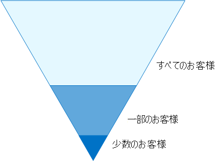
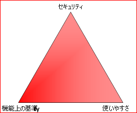
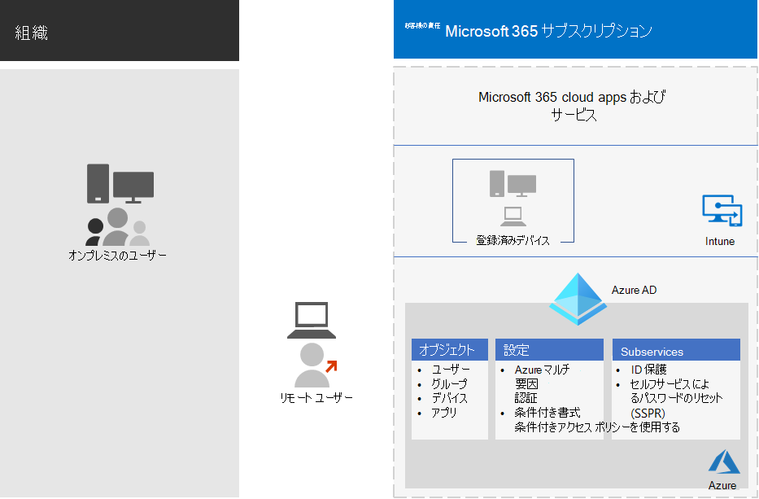
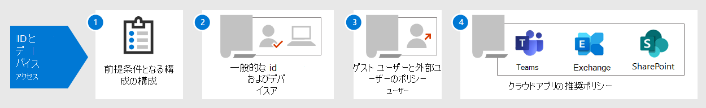

# ID とデバイスのアクセス構成

**適用対象**
- [Exchange Online Protection](exchange-online-protection-overview.md)
- [Microsoft Defender for Office 365 プラン 1 およびプラン 2](defender-for-office-365.md)

組織の最新のセキュリティ境界は、さまざまなデバイスを使用して任意の場所からクラウドベースのアプリにアクセスするユーザーを含むネットワークを超えて拡張されています。 セキュリティ インフラストラクチャは、特定のアクセス要求を付与する必要があるかどうかを決定する必要があります。また、どのような条件で行う必要があります。

この決定は、サインインのユーザー アカウント、使用するデバイス、ユーザーがアクセスに使用しているアプリ、アクセス要求の場所、および要求のリスクの評価に基づく必要があります。 この機能により、承認されたユーザーとデバイスのみが重要なリソースにアクセスできるようになります。

この一連の記事では、一連の ID およびデバイス アクセスの前提条件構成と、Azure AD AD アプリケーション プロキシで公開されているエンタープライズ クラウド アプリとサービス、その他の SaaS サービス、およびオンプレミス アプリケーションの Microsoft 365 へのアクセスをセキュリティで保護するための Azure Active Directory (Azure AD) 条件付きアクセス、Microsoft Intune、その他のポリシーについて説明します。

ID とデバイス アクセスの設定とポリシーは、高度に規制されたデータまたは分類されたデータを持つ環境のベースライン保護、機密性の高い保護、保護の 3 つの層で推奨されます。 これらの層とそれに対応する構成は、データ、ID、およびデバイス全体で一貫したレベルの保護を提供します。

これらの機能とその推奨事項:

- サポートされているのは、Microsoft 365 E3とMicrosoft 365 E5。
- [Microsoft](/azure/active-directory/fundamentals/identity-secure-score)Secure [Score](../defender/microsoft-secure-score.md)と Azure AD の ID スコアに合わせて調整され、組織のこれらのスコアが増加します。
- この 5 つの手順を [実装して ID インフラストラクチャをセキュリティ保護するのに役立ちます](/azure/security/azure-ad-secure-steps)。

組織に固有の環境要件や複雑さがある場合は、これらの推奨事項を開始点として使用します。 ただし、ほとんどの組織では、所定の手順に従ってこれらの推奨事項を実装できます。

エンタープライズ向け ID とデバイス アクセス構成の概要については、このMicrosoft 365ご覧ください。

 

> [!VIDEO https://www.microsoft.com/videoplayer/embed/RWxEDQ]

> [!NOTE]
> Microsoft は、Enterprise Mobility + Security (EMS) ライセンスOffice 365販売しています。 EMS E3 および EMS E5 の機能は、Microsoft 365 E3およびMicrosoft 365 E5。 詳細 [については、「EMS プラン](https://www.microsoft.com/microsoft-365/enterprise-mobility-security/compare-plans-and-pricing) 」を参照してください。

## 対象ユーザー

これらの推奨事項は、Azure AD (IDENTITY)、Microsoft Intune (デバイス管理)、および Microsoft Information Protection (データ保護) を含む Microsoft 365 クラウドの生産性とセキュリティ サービスに精通しているエンタープライズ アーキテクトおよび IT 担当者を対象としています。

### お客様の環境

推奨されるポリシーは、Microsoft クラウド内で完全に運用されているエンタープライズ組織と、Azure AD テナントと同期されたオンプレミスの Active Directory ドメイン サービス (AD DS) フォレストであるハイブリッド ID インフラストラクチャを持つお客様に適用されます。

提供されている推奨事項の多くは、E5 セキュリティ アドオン、EMS E5、または Azure AD Premium P2 ライセンスを使用して Microsoft 365 E5、Microsoft 365 E3 でのみ利用可能なサービスに依存しています。

これらのライセンスを持ってない組織では、少なくともセキュリティの既定値 (すべてのライセンス プランに含まれる) を実装Microsoft 365します。

### 注意点

組織は、これらの推奨構成から異なるポリシーを適用する必要がある特定の推奨事項を含む、規制や他のコンプライアンス要件の対象となる場合があります。 これらの構成では、従来使用されていない使用状況コントロールをお勧めします。 これらのコントロールは、セキュリティと生産性のバランスを表すと考えられますので、お勧めします。

さまざまな組織保護要件を考慮するために最善を実行しましたが、可能なすべての要件や組織の固有の側面を考慮することはできません。

## 3 層の保護

ほとんどの組織は、セキュリティとデータ保護に関して固有の要件を用意しています。 そのような要件は業種によって、また、組織内の職務によって変わります。 たとえば、法務部門と管理者は、他の部署では必要ない電子メール通信に関するセキュリティと情報保護の制御を追加する必要があります。

また、あらゆる業種が独自の特別な規制を用意しています。 すべての可能なセキュリティ オプションの一覧や、業界セグメントまたはジョブ機能ごとの推奨事項を提供するのではなく、ニーズの細分化に基づいて適用できる 3 つの異なるセキュリティ層と保護層に対して推奨事項が提供されています。

- **ベースライン保護**: データを保護するための最小標準と、データにアクセスする ID とデバイスを確立することをお勧めします。 これらの基準推奨に従って、多くの組織のニーズを満たす強力な既定の保護を提供できます。
- **機密性の** 高い保護: 一部の顧客は、より高いレベルで保護する必要があるデータのサブセットを持つか、すべてのデータを高いレベルで保護する必要があります。 環境内のすべてのデータ セットまたは特定のデータ セットに対して保護を強化Microsoft 365できます。 機密データにアクセスする ID とデバイスはそれに相応しいレベルのセキュリティで保護することを推奨します。
- **高度な規制**: 一部の組織では、高度に分類されたデータ、営業秘密を構成するデータ、または規制されたデータが少ない場合があります。 Microsoft は、ID とデバイスの保護を追加するなど、組織がそのような要件を満たすための機能を提供しています。

このガイダンスでは、これらの保護層ごとに ID とデバイスの保護を実装する方法を示します。 このガイダンスは、組織の開始点として使用し、組織の特定の要件を満たすためにポリシーを調整します。

データ、ID、デバイス全体で一貫したレベルの保護を使用することが重要です。 たとえば、このガイダンスを実装する場合は、データを同等のレベルで保護してください。

この **アーキテクチャ モデルの ID とデバイスMicrosoft 365** は、どの機能が同等か示します。

   [PDF として表示する](../../downloads/MSFT_cloud_architecture_identity&device_protection.pdf) \|[PDF としてダウンロードする](https://github.com/MicrosoftDocs/microsoft-365-docs/raw/public/microsoft-365/downloads/MSFT_cloud_architecture_identity&device_protection.pdf) \|[アプリとしてダウンロードVisio](https://github.com/MicrosoftDocs/microsoft-365-docs/raw/public/microsoft-365/downloads/MSFT_cloud_architecture_identity&device_protection.vsdx)  

さらに、「データプライバシー規制に関する情報保護を展開する」ソリューションを[参照](../../solutions/information-protection-deploy.md)して、データ に格納されている情報を保護Microsoft 365。

## セキュリティと生産性の折り合い

セキュリティ戦略を実装するには、セキュリティと生産性の間のトレードオフが必要です。 各決定がセキュリティ、機能、使いやすさのバランスにどのように影響するかを評価すると便利です。

提供される推奨事項は、次の原則に基づいて行います。

- ユーザーを知り、セキュリティと機能の要件に柔軟に対応します。
- セキュリティ ポリシーを時間内に適用し、意味のあるものにしてください。

## ID とデバイス アクセス保護のサービスと概念

Microsoft 365企業向けソリューションは、大規模な組織が全員が創造的で安全に協力するように設計されています。

このセクションでは、ID およびデバイス アクセスMicrosoft 365重要なサービスと機能の概要を説明します。

### Azure AD

Azure ADは、ID 管理機能の完全なスイートを提供します。 これらの機能を使用してアクセスをセキュリティで保護することをお勧めします。

|機能|説明|ライセンス|
|---|---|---|
|[多要素認証 (MFA)](/azure/active-directory/authentication/concept-mfa-howitworks)|MFA では、ユーザーパスワードとアプリまたは電話からの通知など、2 つの形式Microsoft Authenticatorを提供する必要があります。 MFA は、盗まれた資格情報を使用して環境にアクセスするリスクを大幅に軽減します。 Microsoft 365 MFA ベースのサインインAD Azure AD多要素認証サービスを使用します。|Microsoft 365 E3 または E5|
|[条件付きアクセス](/azure/active-directory/conditional-access/overview)|Azure ADは、ユーザー サインインの条件を評価し、条件付きアクセス ポリシーを使用して許可されたアクセスを決定します。 たとえば、このガイダンスでは、機密データへのアクセスにデバイスコンプライアンスを要求する条件付きアクセス ポリシーを作成する方法について説明します。 これにより、自分のデバイスと盗まれた資格情報を持つハッカーが機密データにアクセスするリスクが大幅に軽減されます。 また、デバイスは正常性とセキュリティに関する特定の要件を満たす必要があるため、デバイス上の機密データも保護します。|Microsoft 365 E3 または E5|
|[Azure AD グループ](/azure/active-directory/fundamentals/active-directory-manage-groups)|条件付きアクセス ポリシー、Intune を使用したデバイス管理、組織内のファイルやサイトに対するアクセス許可でさえ、ユーザー アカウントまたは Azure AD グループへの割り当てに依存します。 実装する保護のレベルAD Azure グループを作成することをお勧めします。 たとえば、エグゼクティブ スタッフは、ハッカーの価値の高いターゲットである可能性が高くなります。 したがって、これらの従業員のユーザー アカウントを Azure AD グループに追加し、このグループを条件付きアクセス ポリシーおよびアクセスに対してより高いレベルの保護を適用する他のポリシーに割り当てるのが理にかなっています。|Microsoft 365 E3 または E5|
|[デバイスの登録](/azure/active-directory/devices/overview)|デバイスを Azure AD登録して、デバイスの ID を作成します。 この ID は、ユーザーがサインインするときにデバイスを認証し、ドメインに参加している PC または準拠した PC を必要とする条件付きアクセス ポリシーを適用するために使用されます。 このガイダンスでは、デバイスの登録を使用して、ドメインに参加しているコンピューターとコンピューター Windowsします。 デバイスの登録は、Intune を使用してデバイスを管理するための前提条件です。|Microsoft 365 E3 または E5|
|[Azure AD Identity Protection](/azure/active-directory/identity-protection/overview)|組織の ID に影響を与える潜在的な脆弱性を検出し、自動修復ポリシーを低、中、高のサインイン リスクとユーザー リスクに構成できます。 このガイダンスは、多要素認証に条件付きアクセス ポリシーを適用するために、このリスク評価に依存します。 このガイダンスには、アカウントのリスクの高いアクティビティが検出された場合に、ユーザーがパスワードを変更する必要がある条件付きアクセス ポリシーも含まれています。|Microsoft 365 E5、Microsoft 365 E3 E5 セキュリティ アドオン、EMS E5、またはライセンスを使用Azure AD Premium P2する|
|[セルフサービス パスワードのリセット (SSPR)](/azure/active-directory/authentication/concept-sspr-howitworks)|管理者が制御できる複数の認証方法の検証を提供することで、ユーザーがヘルプ デスクの介入なしに安全にパスワードをリセットできます。|Microsoft 365 E3 または E5|
|[Azure ADパスワード保護](/azure/active-directory/authentication/concept-password-ban-bad)|既知の脆弱なパスワードとそのバリアント、および組織に固有の追加の弱い用語を検出してブロックします。 既定のグローバル禁止パスワード リストは、Azure AD テナントのすべてのユーザーに自動的に適用されます。 カスタムの禁止パスワード リストに追加のエントリを定義できます。 ユーザーがパスワードを変更またはリセットすると、これらの禁止パスワード リストがチェックされ、強力なパスワードの使用が強制されます。|Microsoft 365 E3 または E5|
|

Intune と Azure の各オブジェクト、設定、およびサブサービスを含む、id とデバイス ADコンポーネントを次に示します。

### Microsoft Intune

[Intune](/intune/introduction-intune) は、Microsoft のクラウドベースのモバイル デバイス管理サービスです。 このガイダンスでは、Intune を使用Windows PC のデバイス管理を推奨し、デバイス コンプライアンス ポリシーの構成を推奨します。 Intune は、デバイスが準拠するかどうかを決定し、条件付きアクセス ポリシーを適用するときにADする Azure データを Azure サーバーに送信します。

#### Intune アプリ保護

[Intune アプリ保護ポリシー](/intune/app-protection-policy) を使用すると、デバイスを管理に登録する場合と登録せずに、モバイル アプリ内の組織のデータを保護できます。 Intune は情報を保護し、従業員が生産性を維持し、データ損失を防ぐのに役立ちます。 アプリ レベルのポリシーを実装することで、会社のリソースへのアクセスを制限し、IT 部門の管理下にデータを保持できます。

このガイダンスでは、承認済みアプリの使用を強制し、ビジネス データでこれらのアプリを使用する方法を決定するために推奨されるポリシーを作成する方法を示します。

### Microsoft 365

このガイダンスでは、Microsoft Teams、Exchange Online、SharePoint Online、OneDrive for Business などの Microsoft 365 クラウド サービスへのアクセスを保護するための一連のポリシーを実装する方法を示します。 これらのポリシーの実装に加えて、次のリソースを使用してテナントの保護レベルを上げすることをお勧めします。

- [セキュリティ強化のためにテナントを構成する](tenant-wide-setup-for-increased-security.md)

  テナントのベースライン セキュリティに適用される推奨事項。

- [セキュリティロードマップ: 最初の 30 日間、90 日、およびそれ以降の最優先事項](security-roadmap.md)

  ログ記録、データ ガバナンス、管理者アクセス、脅威保護を含む推奨事項。

### Windows 10 および Microsoft 365 Apps for enterprise

Windows 10のMicrosoft 365 Apps for enterpriseは、PC に推奨されるクライアント環境です。 Azure はWindows 10、オンプレミスと Azure の両方で可能な限りスムーズなエクスペリエンスを提供するように設計AD。 Windows 10 Intune を通じて管理できる高度なセキュリティ機能も含まれています。 Microsoft 365 Apps for enterpriseアプリケーションの最新バージョンOffice含まれます。 これらは、より安全で条件付きアクセスの要件である最新の認証を使用します。 これらのアプリには、強化されたコンプライアンスとセキュリティ ツールも含まれています。

## これらの機能を 3 つの保護層に適用する

次の表に、これらの機能を 3 つの保護層で使用する場合の推奨事項を示します。

|保護メカニズム|基準|機密|厳しく規制|
|---|---|---|---|
|**MFA の強制**|中程度以上のサインイン リスクで|低以上のサインイン リスクで|すべての新しいセッションで|
|**パスワードの変更を適用する**|リスクの高いユーザーの場合|リスクの高いユーザーの場合|リスクの高いユーザーの場合|
|**Intune アプリケーション保護の適用**|はい|はい|はい|
|**組織が所有するデバイスに Intune 登録を適用する**|準拠またはドメインに参加している PC が必要ですが、持ち込み専用デバイス (BYOD) の電話とタブレットを許可する|準拠しているデバイスまたはドメインに参加しているデバイスを要求する|準拠しているデバイスまたはドメインに参加しているデバイスを要求する|
|

## デバイスの所有権

上記の表は、多くの組織が組織が所有するデバイスの組み合わせ、および個人または BYOD をサポートして、従業員全体のモバイル生産性を実現する傾向を示しています。 Intune アプリ保護ポリシーにより、組織が所有するデバイスと BYOD の両方で、Outlook モバイル アプリや他の Office モバイル アプリからメールが保護されます。

組織が所有するデバイスを Intune で管理するか、ドメインに参加して追加の保護と制御を適用することをお勧めします。 データの感度に応じて、組織は特定のユーザー集団または特定のアプリに対して BYOD を許可しない場合があります。

## 展開とアプリ

Azure 統合アプリの ID およびデバイス アクセス構成を構成および展開する前に、ADする必要があります。

- 保護する組織で使用するアプリを決定します。
- アプリのこの一覧を分析して、適切なレベルの保護を提供するポリシーのセットを決定します。

  アプリの管理が面倒になるため、アプリごとに個別のポリシー セットを作成する必要はありません。 Microsoft では、同じユーザーに対して同じ保護要件を持つアプリをグループ化する必要があります。

  たとえば、ベースライン保護のためにすべてのユーザーに対してすべての Microsoft 365 アプリを含む 1 つのポリシーセットと、人事部門や財務部門で使用されるアプリなど、すべての機密性の高いアプリのポリシーの 2 番目のセットを使用して、それらのグループに適用できます。

セキュリティ保護するアプリのポリシーセットを決定したら、ポリシーを段階的にユーザーにロールアウトし、途中で問題に対処します。

たとえば、すべてのアプリで使用するポリシーを構成し、Microsoft 365の追加Exchange Onlineを使用Exchange。 これらのポリシーをユーザーにロールアウトし、問題を解決します。 次に、追加Teamsを追加してユーザーに展開します。 次に、追加SharePointを追加します。 これらの基準ポリシーを自信を持って構成して、すべてのアプリを含めるまで、残りのアプリMicrosoft 365続ける。

同様に、機密性の高いアプリの場合は、ポリシーのセットを作成し、一度に 1 つのアプリを追加し、機密アプリ ポリシー セットに含まれるまで問題を解決します。

一部の意図しない構成が発生する可能性があるから、すべてのアプリに適用されるポリシー セットを作成しなけことをお勧めします。 たとえば、すべてのアプリをブロックするポリシーによって管理者が Azure ポータルからロックアウトされ、Microsoft Graph などの重要なエンドポイントに対して除外を構成することはできません。

## ID とデバイス アクセスを構成する手順

1. 前提条件の ID 機能とその設定を構成します。
2. 共通 ID を構成し、条件付きアクセス ポリシーにアクセスします。
3. ゲストおよび外部ユーザーの条件付きアクセス ポリシーを構成します。
4. Microsoft Teams、Exchange Online、Exchange Online ポリシーなど、Microsoft 365 クラウド アプリの条件付きアクセス ポリシー SharePoint構成Microsoft Cloud App Securityします。

ID とデバイス アクセスを構成した後は [、Azure AD](/azure/active-directory/fundamentals/active-directory-deployment-checklist-p2) 機能の展開ガイドを参照して、考慮すべき追加機能の段階的なチェックリストと、アクセスの保護、監視、および監査を行う [Azure AD Identity Governance](/azure/active-directory/governance/) を参照してください。

## 次の手順

[ID およびデバイス アクセス ポリシーを実装するための前提条件作業](identity-access-prerequisites.md)