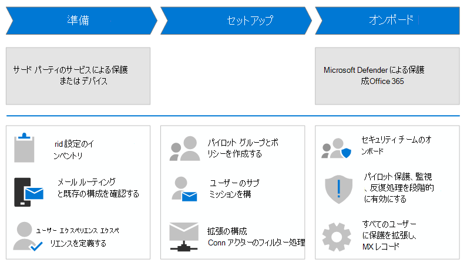

# サード パーティ製の保護サービスまたはデバイスから Microsoft Defender に移行して、Office 365

**適用対象**
- [Microsoft Defender for Office 365 プラン 1 およびプラン 2](defender-for-office-365.md)

Microsoft 365 の前に存在する既存のサード パーティ製の保護サービスまたはデバイスがある場合は、このガイドを使用して、microsoft Defender for Office 365 に保護を移行して、統合管理エクスペリエンス、コストの削減 (既に支払っている製品を使用する)、および統合セキュリティ保護を備えた成熟した製品のメリットを得ることができます。 詳細については、「[Microsoft Defender for Office」を参照してください](https://www.microsoft.com/security/business/threat-protection/office-365-defender)。

このガイドでは、移行に関する具体的でアクション可能な手順を説明し、次の事実を前提とします。

- 既にメールボックスMicrosoft 365持っていますが、現在、メール保護のためにサードパーティのサービスまたはデバイスを使用しています。 インターネットからのメールは、Microsoft 365 組織に配信する前に保護サービスを通じて流れ、Microsoft 365 保護は可能な限り低い (完全にはオフではありません。たとえば、マルウェア保護は常に適用されます)。

  

- Defender による保護に関する調査と検討の段階を超Office 365。 Defender for Office 365組織に適切かどうかを判断する必要がある場合は、評価モードを[検討することをお勧めします](office-365-evaluation.md)。

- 既に Defender をライセンス用に購入Office 365しています。

- 既存のサード パーティ製保護サービスを廃止する必要があります。つまり、最終的には電子メール ドメインの MX レコードを Microsoft 365。 完了すると、インターネットからのメールは Microsoft 365 に直接流れ込み、Exchange Online Protection (EOP) と Defender for Office 365 によって排他的に保護されます。

  

Office 365 の Defender に有利な既存の保護サービスを排除する方法は、軽く取るべきではない大きな一歩です。また、変更を急ぐ必要もありません。 この移行ガイドのガイダンスは、ユーザーの中断を最小限に抑えて、保護を順番に移行するのに役立ちます。

次の図に、非常に高レベルの移行手順を示します。 実際の手順は、この記事の後半の移行プロセス [という名前の](#the-migration-process) セクションに記載されています。

## このガイドの手順を使用する理由

IT 業界では、一般的に驚きは悪いです。 MX レコードをフリップするだけで、事前Microsoft 365思慮深いテストを行わずに、多くの驚きが生まれます。 例:

- ユーザーまたは前任者は、既存の保護サービスをカスタマイズして、最適なメール配信 (つまり、ブロックする必要があるコンテンツをブロックし、許可する必要があるもの) をカスタマイズするために多くの時間と労力を費やしている可能性があります。 現在の保護サービス内のすべてのカスタマイズが Defender で必要になるという保証はほとんどOffice 365。 また、Defender for Office 365 では、現在の保護サービスで発生しなかった、または必要とされていない新しい問題 (許可またはブロック) が導入される可能性があります。
- ヘルプ デスクとセキュリティ担当者は、Defender で何を行う必要Office 365。 たとえば、ユーザーがメッセージが見つからないと不平を言った場合、ヘルプ デスクはメッセージの場所や探し方を知っていますか? 既存の保護サービスのツールについてよく知っている可能性がありますが、Defender for Office 365 のツールについてはどうOffice 365。

これに対し、この移行ガイドの手順に従う場合は、移行に関して次のような具体的な利点があります。

- ユーザーの中断を最小限に抑える。
- 管理への移行のOffice 365成功を報告する場合に使用できる、Defender の目標データ。
- ヘルプ デスクとセキュリティ担当者の早期の関与と指示。

Defender for Office 365 が組織にどのような影響を与えるのか理解する必要が高くなると、ユーザー、ヘルプ デスク担当者、セキュリティ担当者、および管理の移行が向上します。

この移行ガイドでは、段階的に "ダイヤルを回す" 計画を立て、Office 365 の Defender がユーザーと電子メールに与える影響を監視およびテストし、発生した問題に迅速に対応できます。

## 移行プロセス

サード パーティ製の保護サービスから Defender for Office 365への移行プロセスは、次の表に示す 3 つのフェーズに分かれています。

|段階|説明|
|---|---|
|[移行の準備](migrate-to-defender-for-office-365-prepare.md)|<ol><li>[既存の保護サービスで設定をインベントリする](migrate-to-defender-for-office-365-prepare.md#inventory-the-settings-at-your-existing-protection-service)</li><li>[既存の保護構成を確認Microsoft 365](migrate-to-defender-for-office-365-prepare.md#check-your-existing-protection-configuration-in-microsoft-365)</li><li>[メール ルーティングの構成を確認する](migrate-to-defender-for-office-365-prepare.md#check-your-mail-routing-configuration)</li><li>[メッセージを変更する機能をユーザーにMicrosoft 365](migrate-to-defender-for-office-365-prepare.md#move-features-that-modify-messages-into-microsoft-365)</li><li>[スパムと一括ユーザー エクスペリエンスの定義](migrate-to-defender-for-office-365-prepare.md#define-spam-and-bulk-user-experiences)</li><li>[優先度アカウントの特定と指定](migrate-to-defender-for-office-365-prepare.md#identify-and-designate-priority-accounts)</li></ol>|
|[Defender for Office 365](migrate-to-defender-for-office-365-setup.md)|<ol><li>[パイロット ユーザーの配布グループを作成する](migrate-to-defender-for-office-365-setup.md#step-1-create-distribution-groups-for-pilot-users)</li><li>[ユーザー メッセージレポート用にユーザー申請を構成する](migrate-to-defender-for-office-365-setup.md#step-2-configure-user-submission-for-user-message-reporting)</li><li>[SCL=-1 メール フロー ルールの維持または作成](migrate-to-defender-for-office-365-setup.md#step-3-maintain-or-create-the-scl-1-mail-flow-rule)</li><li>[コネクタの拡張フィルターを構成する](migrate-to-defender-for-office-365-setup.md#step-4-configure-enhanced-filtering-for-connectors)</li><li>[パイロット保護ポリシーの作成](migrate-to-defender-for-office-365-setup.md#step-5-create-pilot-protection-policies)</li></ol>|
|[Defender にオンボードしてOffice 365](migrate-to-defender-for-office-365-onboard.md)|<ol><li>[セキュリティ ポリシーのオンボーディングをTeams](migrate-to-defender-for-office-365-onboard.md#step-1-begin-onboarding-security-teams)</li><li>[(省略可能)パイロット ユーザーが既存の保護サービスによるフィルター処理を除外する](migrate-to-defender-for-office-365-onboard.md#step-2-optional-exempt-pilot-users-from-filtering-by-your-existing-protection-service)</li><li>[スプーフィング インテリジェンスの調整](migrate-to-defender-for-office-365-onboard.md#step-3-tune-spoof-intelligence)</li><li>[偽装保護とメールボックス インテリジェンスの調整](migrate-to-defender-for-office-365-onboard.md#step-4-tune-impersonation-protection-and-mailbox-intelligence)</li><li>[ユーザー申請のデータを使用して測定と調整を行う](migrate-to-defender-for-office-365-onboard.md#step-5-use-data-from-user-submissions-to-measure-and-adjust)</li><li>[(省略可能)パイロットにユーザーを追加して反復処理する](migrate-to-defender-for-office-365-onboard.md#step-6-optional-add-more-users-to-your-pilot-and-iterate)</li><li>[すべてのMicrosoft 365保護を拡張し、SCL=-1 メール フロー ルールをオフにする](migrate-to-defender-for-office-365-onboard.md#step-7-extend-microsoft-365-protection-to-all-users-and-turn-off-the-scl-1-mail-flow-rule)</li><li>[MX レコードを切り替える](migrate-to-defender-for-office-365-onboard.md#step-8-switch-your-mx-records)</li></ol>|

## 次のステップ

- [フェーズ [1: 準備] に進みます](migrate-to-defender-for-office-365-prepare.md)。
