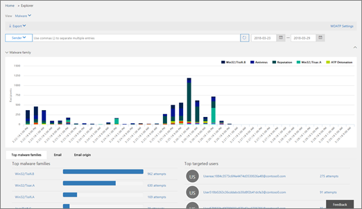

# 脅威の調査および対応Threat investigation and response

[!INCLUDE [Microsoft 365 Defender rebranding](../includes/microsoft-defender-for-office.md)]

[Microsoft Defender For Office 365 の](office-365-atp.md)脅威の調査と応答の機能セキュリティアナリストと管理者は、次のようにして、組織の microsoft 365 をビジネスユーザーに保護します。Threat investigation and response capabilities in [Microsoft Defender for Office 365](office-365-atp.md) help security analysts and administrators protect their organization's Microsoft 365 for business users by:

- Cyberattacks を容易に識別、監視、理解できるようにするMaking it easy to identify, monitor, and understand cyberattacks
- Exchange Online、SharePoint Online、OneDrive for Business、および Microsoft Teams での脅威への迅速な対応Helping to quickly address threats in Exchange Online, SharePoint Online, OneDrive for Business and Microsoft Teams
- 組織に対する cyberattacks を防止するためにセキュリティ操作を支援するための洞察と知識の提供Providing insights and knowledge to help security operations prevent cyberattacks against their organization
- メールベースの重要な脅威に対して [Office 365 で自動化された調査と応答](automated-investigation-response-office.md) を使用するEmploying [automated investigation and response in Office 365](automated-investigation-response-office.md) for critical email-based threats

脅威の調査と応答の機能によって、セキュリティ & コンプライアンスセンターで利用可能な脅威と関連する応答アクションが洞察されます。Threat investigation and response capabilities provide insights into threats and related response actions that are available in the Security & Compliance Center. これらの洞察は、組織のセキュリティチームが電子メールまたはファイルベースの攻撃からユーザーを保護するのに役立ちます。These insights can help your organization's security team protect users from email- or file-based attacks. 機能は、ユーザーアクティビティ、認証、電子メール、危険にさらされた Pc、セキュリティインシデントなど、複数のソースからのデータを監視し、データを収集するのに役立ちます。The capabilities help monitor signals and gather data from multiple sources, such as user activity, authentication, email, compromised PCs, and security incidents. ビジネス意思決定者およびセキュリティ運用チームは、この情報を使用して組織との脅威を理解し、知的財産権を保護することができます。Business decision makers and your security operations team can use this information to understand and respond to threats against your organization and protect your intellectual property.

## 脅威の調査と応答のツールについて理解するGet acquainted with threat investigation and response tools

脅威の調査と応答の機能は、セキュリティ & コンプライアンスセンターで、次のような一連のツールと応答のワークフローとして提供されます。Threat investigation and response capabilities surface in the Security & Compliance Center, as a set of tools and response workflows, including the following:

- [脅威ダッシュボードThreat dashboard](#threat-dashboard)
- [ExplorerExplorer](#threat-explorer)
- [インシデントIncidents](#incidents)
- [攻撃シミュレータAttack Simulator](#attack-simulator)
- [自動調査および対応Automated investigation and response](automated-investigation-response-office.md)

### 脅威ダッシュボードThreat dashboard

脅威ダッシュボード ( [セキュリティダッシュボード](security-dashboard.md)とも呼ばれます) を使用して、どのような脅威が解決されたかをすばやく確認し、Microsoft 365 サービスがビジネスをどのようにセキュリティ保護しているかをビジネス意思決定者に報告することができます。Use the Threat dashboard (this is also referred to as the [Security dashboard](security-dashboard.md)) to quickly see what threats have been addressed, and as a visual way to report to business decision makers how Microsoft 365 services are securing your business.

このダッシュボードを表示して使用するには、セキュリティ & コンプライアンスセンターで、[**脅威管理**] ダッシュボードに移動し \> **Dashboard** ます。To view and use this dashboard, in the Security & Compliance Center, go to **Threat management** \> **Dashboard**.

### 脅威エクスプローラーThreat Explorer

脅威 [エクスプローラー (およびリアルタイム検出)](threat-explorer.md) を使用して脅威を分析し、時間の経過と共に攻撃の量を確認し、脅威ファミリ、攻撃インフラストラクチャなどによるデータの分析を行います。Use [Threat Explorer (and real-time detections)](threat-explorer.md) to analyze threats, see the volume of attacks over time, and analyze data by threat families, attacker infrastructure, and more. 脅威エクスプローラー (エクスプローラーとも呼ばれます) は、セキュリティアナリストの調査ワークフローの出発点です。Threat Explorer (also referred to as Explorer) is the starting place for any security analyst's investigation workflow.

このレポートを表示して使用するには、セキュリティ & コンプライアンスセンターで、[**脅威管理** エクスプローラー] に移動し \> **Explorer** ます。To view and use this report, in the Security & Compliance Center, go to **Threat management** \> **Explorer**.

### インシデントIncidents

インシデントリスト (調査とも呼ばれます) を使用して、フライトセキュリティインシデントの一覧を表示します。Use the Incidents list (this is also called Investigations) to see a list of in flight security incidents. インシデントは、不審な電子メールメッセージなどの脅威を追跡し、さらに調査と修復を行うために使用されます。Incidents are used to track threats such as suspicious email messages, and to conduct further investigation and remediation.

組織の現在のインシデントの一覧を表示するには、セキュリティ & コンプライアンスセンターで、[ **脅威管理** の \> **レビュー** \> **インシデント**] に移動します。To view the list of current incidents for your organization, in the Security & Compliance Center, go to **Threat management** \> **Review** \> **Incidents**.

![[セキュリティ & コンプライアンスセンター] で、[脅威管理のレビュー] を選択します。 \>](../../media/e0f46454-fa38-40f0-a120-b595614d1d22.png)

### 攻撃シミュレータAttack Simulator

アタックシミュレータを使用して、組織内で現実的な cyberattacks を設定して実行し、実際の cyberattack がビジネスに影響を与える前に、脆弱性のある人物を特定します。Use Attack Simulator to set up and run realistic cyberattacks in your organization, and identify vulnerable people before a real cyberattack affects your business. 詳細については、「 [Office 365 のアタックシミュレータ](attack-simulator.md)」を参照してください。To learn more, see [Attack Simulator in Office 365](attack-simulator.md).

### 自動調査および対応Automated investigation and response

自動化された調査と応答 (AIR) 機能を使用して、コンテンツ、デバイス、およびユーザーを組織内の脅威から危険に関連付ける時間と労力を節約します。Use automated investigation and response (AIR) capabilities to save time and effort correlating content, devices, and people at risk from threats in your organization. AIR プロセスは、特定の警告がトリガーされたとき、またはセキュリティ操作チームによって開始されたときに開始できます。AIR processes can begin whenever certain alerts are triggered, or when started by your security operations team. 詳細については、「 [Office 365 の自動調査と応答](automated-investigation-response-office.md)」を参照してください。To learn more, see [automated investigation and response in Office 365](automated-investigation-response-office.md).

## 脅威インテリジェンスウィジェットThreat intelligence widgets

セキュリティアナリストは、Microsoft Defender for Office 365 プラン2のサービスの一部として、既知の脅威の詳細を確認できます。As part of the Microsoft Defender for Office 365 Plan 2 offering, security analysts can review details about a known threat. これは、ユーザーを安全に保つために実行できる追加の予防策/手順があるかどうかを判断するのに役立ちます。This is useful to determine whether there are additional preventative measures/steps that can be taken to keep users safe.

## これらの機能はどのように入手できますか?How do we get these capabilities?

Microsoft 365 の脅威の調査と応答の機能は、Enterprise E5 または特定のサブスクリプションのアドオンとして組み込まれている Office 365 プラン2の Microsoft Defender に含まれています。Microsoft 365 threat investigation and response capabilities are included in Microsoft Defender for Office 365 Plan 2, which is included in Enterprise E5 or as an add-on to certain subscriptions. 詳細については、「 [Defender For Office 365 プラン1およびプラン 2](office-365-atp.md#microsoft-defender-for-office-365-plan-1-and-plan-2)」を参照してください。To learn more, see [Defender for Office 365 Plan 1 and Plan 2](office-365-atp.md#microsoft-defender-for-office-365-plan-1-and-plan-2).

## 必要な役割と権限Required roles and permissions

Microsoft Defender for Office 365 は、役割ベースのアクセス制御を使用します。Microsoft Defender for Office 365 uses role-based access control. アクセス許可は、Azure Active Directory、Microsoft 365 管理センター、またはセキュリティ & コンプライアンスセンターの特定の役割によって割り当てられます。Permissions are assigned through certain roles in Azure Active Directory, the Microsoft 365 admin center, or the Security & Compliance Center.

> [!TIP]
> セキュリティ管理者などの一部の役割は、セキュリティ & コンプライアンスセンターで割り当てることができますが、代わりに Microsoft 365 管理センターまたは Azure Active Directory のどちらかを使用することを検討してください。Although some roles, such as Security Administrator, can be assigned in the Security & Compliance Center, consider using either the Microsoft 365 admin center or Azure Active Directory instead. 役割、役割グループ、およびアクセス許可の詳細については、以下のリソースを参照してください。For information about roles, role groups, and permissions, see the following resources:
>
> - [セキュリティ/コンプライアンス センターのアクセス許可Permissions in the Security & Compliance Center](permissions-in-the-security-and-compliance-center.md)
>
> - [Azure Active Directory での管理者役割のアクセス許可Administrator role permissions in Azure Active Directory](https://docs.microsoft.com/azure/active-directory/users-groups-roles/directory-assign-admin-roles)

****

|アクティビティActivity|ロールと権限Roles and permissions|
|---|---|
|脅威ダッシュボード (または新しい [セキュリティダッシュボード](security-dashboard.md)) を使用するUse the Threat dashboard (or the new [Security dashboard](security-dashboard.md))   最近の脅威または現在の脅威に関する情報を表示するView information about recent or current threats|以下のいずれか:One of the following:  - **グローバル管理者**- **Global Administrator**    - **セキュリティ管理者**- **Security Administrator**  - **セキュリティリーダ**- **Security Reader**    これらの役割は、Azure Active Directory ( [https://portal.azure.com](https://portal.azure.com) ) または Microsoft 365 admin center () のいずれかで割り当てることができ [https://admin.microsoft.com](https://admin.microsoft.com) ます。These roles can be assigned in either Azure Active Directory ([https://portal.azure.com](https://portal.azure.com)) or the Microsoft 365 admin center ([https://admin.microsoft.com](https://admin.microsoft.com)).|
|脅威 [エクスプローラー (およびリアルタイム検出)](threat-explorer.md) を使用して脅威を分析するUse [Threat Explorer (and real-time detections)](threat-explorer.md) to analyze threats|以下のいずれか:One of the following:  - **グローバル管理者**- **Global Administrator**    - **セキュリティ管理者**- **Security Administrator**  - **セキュリティリーダ**- **Security Reader**    これらの役割は、Azure Active Directory ( [https://portal.azure.com](https://portal.azure.com) ) または Microsoft 365 admin center () のいずれかで割り当てることができ [https://admin.microsoft.com](https://admin.microsoft.com) ます。These roles can be assigned in either Azure Active Directory ([https://portal.azure.com](https://portal.azure.com)) or the Microsoft 365 admin center ([https://admin.microsoft.com](https://admin.microsoft.com)).|
|インシデント (調査とも呼ばれる) を表示するView Incidents (also referred to as Investigations)   インシデントに電子メールメッセージを追加するAdd email messages to an incident|以下のいずれか:One of the following:  - **グローバル管理者**- **Global Administrator**    - **セキュリティ管理者**- **Security Administrator**  - **セキュリティリーダ**- **Security Reader**    これらの役割は、Azure Active Directory ( [https://portal.azure.com](https://portal.azure.com) ) または Microsoft 365 admin center () のいずれかで割り当てることができ [https://admin.microsoft.com](https://admin.microsoft.com) ます。These roles can be assigned in either Azure Active Directory ([https://portal.azure.com](https://portal.azure.com)) or the Microsoft 365 admin center ([https://admin.microsoft.com](https://admin.microsoft.com)).|
|インシデントで電子メールアクションをトリガーするTrigger email actions in an incident     疑わしい電子メールメッセージの検索と削除Find and delete suspicious email messages|以下のいずれか:One of the following:  - **グローバル管理者**- **Global Administrator**    - **セキュリティ管理者** 、 **および検索と削除** の役割- **Security Administrator** plus the **Search and Purge** role  **グローバル管理** 者および **セキュリティ管理者** の役割は、Azure Active Directory ( [https://portal.azure.com](https://portal.azure.com) ) または Microsoft 365 admin center () のいずれかに割り当てることができ [https://admin.microsoft.com](https://admin.microsoft.com) ます。The **Global Administrator** and **Security Administrator** roles can be assigned in either Azure Active Directory ([https://portal.azure.com](https://portal.azure.com)) or the Microsoft 365 admin center ([https://admin.microsoft.com](https://admin.microsoft.com)).   **検索および削除** の役割は、セキュリティ & コンプライアンスセンター () で割り当てる必要があり [https://protection.office.com](https://protection.office.com) ます。The **Search and Purge** role must be assigned in the Security & Compliance Center ([https://protection.office.com](https://protection.office.com)).|
|エンドポイントの Microsoft Defender と Office 365 プラン2の統合Integrate Microsoft Defender for Office 365 Plan 2 with Microsoft Defender for Endpoint     Microsoft Defender for Office 365 プラン2を SIEM サーバーと統合するIntegrate Microsoft Defender for Office 365 Plan 2 with a SIEM server|**グローバル管理者** または Azure Active Directory () または Microsoft 365 admin center () のいずれかに割り当てられている **セキュリティ管理者** の役割 [https://portal.azure.com](https://portal.azure.com) [https://admin.microsoft.com](https://admin.microsoft.com) 。Either the **Global Administrator** or the **Security Administrator** role assigned in either Azure Active Directory ([https://portal.azure.com](https://portal.azure.com)) or the Microsoft 365 admin center ([https://admin.microsoft.com](https://admin.microsoft.com)). --- **plus** ------ **plus** --- 追加のアプリケーション ( [Microsoft Defender セキュリティセンター](https://docs.microsoft.com/windows/security/threat-protection/microsoft-defender-atp/user-roles) 、SIEM サーバーなど) で割り当てられている適切な役割An appropriate role assigned in additional applications (such as [Microsoft Defender Security Center](https://docs.microsoft.com/windows/security/threat-protection/microsoft-defender-atp/user-roles) or your SIEM server)|
|

## 次の手順Next steps

- [脅威のトラッカーについて-新知識と注目Learn about Threat Trackers - New and Noteworthy](threat-trackers.md)

- [配信された悪意のある電子メールを検索して調査する (Office 365 の脅威の調査と応答)Find and investigate malicious email that was delivered (Office 365 Threat Investigation and Response)](investigate-malicious-email-that-was-delivered.md)

- [エンドポイントの Microsoft Defender で Office 365 の脅威の調査と応答を統合するIntegrate Office 365 Threat Investigation and Response with Microsoft Defender for Endpoint](integrate-office-365-ti-with-wdatp.md)

- [アタックシミュレータについてLearn about Attack Simulator](attack-simulator.md)
